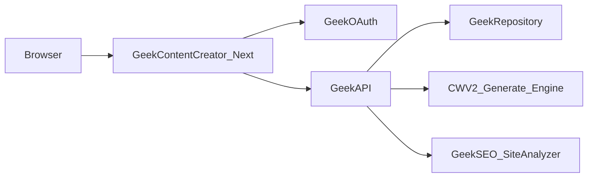
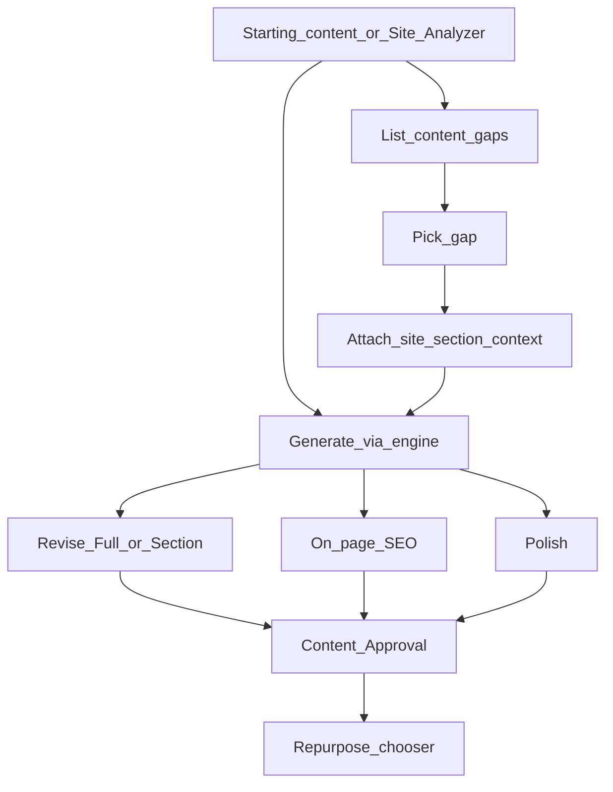

# Geek Content Creator — Architecture

Product plan: [`CONTENT_CREATOR_PLAN.md`](./CONTENT_CREATOR_PLAN.md).

This document describes **what already exists** in the Geek platform and **what Content Creator should call / reuse**. It is the backend map for implementers working in this repo.

**Preferred term:** **site section context** (related pages, headings, excerpts, section path around a gap). Not “neighborhood.”

---

## 1. This application

| Item | Value |
|------|--------|
| Repo | `/Users/jeffmartin/development/GeekContentCreator` |
| UI | Next.js 16 App Router (`src/`), TypeScript, Tailwind |
| Role | Product surface: create, Site Analyzer, generate, revise, on-page SEO, polish, content approval, repurpose, image prompts |
| Persistence of drafts | Owned by Content Creator’s domain (new GeekAPI surfaces), **not** by stuffing Content Writer v2 `Project` rows as the product model |

Content Creator is a **new app**. It is **not** a feature inside Geek Content Workflow and **not** a thin form over Content Writer v2’s old project UI.

---

## 2. Platform stack (use this)



| Layer | System | Path / notes | Use for |
|-------|--------|--------------|---------|
| Auth | **GeekOAuth** | Sibling Geek auth service (same pattern as Geek Content Workflow) | Sign-in, session, bearer for GeekAPI |
| HTTP API | **GeekAPI** | `/Users/jeffmartin/development/GeekBackend/GeekAPI` | Facades Content Creator will call; hosts generate services |
| Data | **GeekRepository** | GeekBackend repository layer behind GeekAPI | Persist creates, versions, approvals, packs |
| Writing engine | **Content Writer v2 generate stack** | Orchestrator, prompt builders, length rules, image-prompt builders | Long-form / social / tools / image-prompt **generation** |
| Site understanding | **Geek-SEO / site analyzer** | `/Users/jeffmartin/development/Geek-SEO` | Site model, gaps, **site section context** for Generate |
| Reference UX only | **Geek Content Workflow** | `/Users/jeffmartin/development/GeekContentWorkflow` | Revise / SEO / polish / pack patterns — not the product shell |

### Deploy / hosting (not in question)

Same family as sibling Geek apps: **Vercel** for the Next app (same pattern as Geek Content Workflow); **GeekAPI** (and GeekRepository, GeekOAuth, Geek-SEO) already hosted as platform services. Content Creator does **not** invent a new auth or API island.

**CORS already exists** on GeekAPI (`CORS_ORIGINS`). At first deploy / local wire-up, **add Content Creator’s origins** to that existing allowlist (e.g. production Content Creator URL and `http://localhost:3003`) — same mechanism sibling apps use. Do not build a separate CORS layer in Next.

Other first-deploy config (not architecture choice): production URLs, Vercel project name for this Next app. Pattern = Geek Content Workflow.

---

## 3. Environment / config contract

Secrets and LLM keys stay on **GeekAPI** (or platform secret store) — **not** in the Next.js client bundle.

### Content Creator (Next) — typical env

| Variable | Purpose |
|----------|---------|
| `GEEK_OAUTH_URL` / issuer / client id / secret (names mirror Geek Content Workflow) | Login + callback |
| `GEEK_API_URL` | Browser/server calls to GeekAPI |
| `GEEK_API_*` public client identifiers if required | Machine or app key if GCW-style |
| `NEXTAUTH_*` or cookie settings if used | Session (follow GCW pattern when wiring) |

### GeekAPI (already / extend)

| Concern | Where |
|---------|--------|
| OpenAI / Claude API keys | GeekAPI environment |
| `REPO_URL` / repository API key | GeekAPI → GeekRepository |
| SEO / Site Analyzer upstream URLs | GeekAPI or Geek-SEO service config |

Exact variable names: copy from Geek Content Workflow’s `.env.example` / Vercel env when wiring auth, then add Content Creator–specific ones only if needed.

**CORS:** configured on **GeekAPI** (`CORS_ORIGINS`), not in this Next app. Extend that list with Content Creator origins when wiring.

---

## 4. Document model

Generated and revised bodies use the shared structured **ContentDocument** JSON (lede + sections with headings/paragraphs) — same family as Content Writer v2 / Geek Content Workflow asset versions.

- **Generate** writes a ContentDocument (or pack JSON for social/ads).  
- **Revise** (Full or Section) reads ContentDocument → writes a **new version**.  
- **On-page SEO** analyzes ContentDocument + target keyword.  
- Do not invent a parallel HTML-only store for the primary draft.

Canonical shape lives in Content Writer v2 / GeekAPI shared types; Content Creator should import or mirror that contract, not fork it casually.

---

## 5. Tenancy

| Concept | Meaning |
|---------|---------|
| **User** | GeekOAuth identity |
| **Client** (or account) | Brand / customer the content is for |
| **Site** | URL / property under analysis (Site Analyzer) |
| **Create** | One writing effort: starting content choice, optional site analysis + **site section context**, artifacts, versions |
| **Artifact / version** | One output (blog, email, tool page, image prompt, …) with version history |

Every create binds to a **client**. Site Analyzer attaches a **site** (and analysis id). Generate with Site Analyzer must carry **site section context** for that site + gap — not an unbound home keyword.

Workspaces (if reused from Geek Content Workflow patterns) group clients; confirm when wiring — do not block v1 on a novel tenancy invent.

---

## 6. LLM providers

| Provider | Role |
|----------|------|
| **OpenAI** | Default generate/revise/pack (Geek Content Workflow / Content Writer v2 already support) |
| **Claude** (Anthropic) | Alternate provider where engine already supports it |

- Selection: per generate/revise request (UI select), default OpenAI unless product default changes.  
- Keys: **GeekAPI only**.  
- Budgets: see `CONTENT_CREATOR_PLAN.md` § LLM call budget (pack = 1 call, tools ≈ 2 each, revise = 1, image prompt paths = 1, etc.).

---

## 7. Long-running jobs

Generate (especially pillar / tools × N), revise, and packs can exceed normal HTTP comfort.

| Approach | When |
|----------|------|
| **Sync HTTP** | Short paths (single image prompt, small pack, light revise) if they finish reliably under gateway timeouts |
| **Async job + poll/status** | Pillar, multi-tool, large revise — start job on GeekAPI, Next polls status / websocket later if needed |

UI must show **running / failed / ready** and not double-submit. Prefer GeekAPI background work (same idea as Content Writer v2 long generates), not blocking the Node server on multi-minute LLM chains.

---

## 8. What to call (and what not to)

### Do

- Authenticate with **GeekOAuth**; call **GeekAPI** with the session token.
- Add **Content Creator–owned** GeekAPI routes for creates, versions, revise, SEO, polish, approve, repurpose, image prompts, Site Analyzer gaps + **site section context**.
- Run writing through the **shared Content Writer v2 generate engine in-process inside GeekAPI**, or **copied** modules under `GeekAPI/Services/ContentCreator/` (do **not** edit the Content Writer v2 repo). Structured inputs:
  - topic / starting content type
  - **Content Brief** (`BriefJson` on create) — required for generate; fail closed if missing
  - **Research** (`ResearchJson` — SERP index + ≤3 quoteable destination-page extracts)
  - optional freeform notes
  - **`SiteSectionContext`** when create started from Site Analyzer — **required** if site analysis is attached (`ValidateSiteSectionGate`: non-empty `relatedPages`)
  - tool names + brief when generating AI Tools
- Reuse Geek-SEO site analysis gap signals behind a **new** Site Analyzer UI.
- **Correctness over expediency.** Copied CWV2 code becomes canonical Content Creator code when CWV2 retires — no upstream sync ceremony.

### Do not

| Avoid | Why |
|-------|-----|
| Content Writer v2 project screens as product UI | Job only, not UI |
| Main design = fill `/api/projects` fields then `generate/pillar` | Rejected form-filler |
| Edit Content Writer v2 repo for product features | Copy into Content Creator / GeekAPI Content Creator |
| Trick `content-brief.html` / keyword-source uploads as the brief | Persist `BriefJson` on the create |
| Google SERP results-page heading scrape as research | SERP = index; follow destination URLs |
| Partial research success when one URL fails | Fail closed; operator retries |
| Client-only brief on generate (bypass DB) | Generate reads persisted create JSON |
| Content Writer v3 / v4 | Out of plan |
| Ship inside Geek Content Workflow | Separate product |
| Day-one pixel render via image-generator | Prompt text first |
| Formal Research dossier required for v1 | Later phase (deep follow-URLs research is day one) |
| Site Analyzer Generate with **keyword only** and no site section context | Content Writer v2 failure mode |

API namespace: Content Creator’s own (`/api/geek-content-creator/...`), not host-as-GCW.

**Brief / research / generate (implemented locally):**

| Endpoint | Role |
|----------|------|
| `PATCH /creates/{id}/brief-research` | Persist `BriefJson` and/or `ResearchJson` |
| `POST /creates/{id}/research/follow` | Fetch ≤3 URLs; fail closed; write `ResearchJson` on full success |
| `POST /creates/{id}/generate` | Validate brief from DB; inject BRIEF + research; Site Analyzer gate unchanged |
| Workflow `/app/create` | New Content Creator create (form formerly "Start create"); SA handoff requires non-empty `relatedPages` |
| Create workspace `/app/creates/{id}` | Brief + generate + draft / revise / SEO / polish / approve |
| `POST /versions/{id}/repurpose` | Mix after content approval on the create artifact |
| Site Analyzer → `/app/create` | Not CWV2 project form-filler; section stored then persisted on create |
| Image prompt | Workflow `type=imagePrompt` (topic + notes on create); not a parallel non-create API |

Ops: GeekRepository startup runs `Database.MigrateAsync` for Content Creator (prod applied `AddGccCreateBriefResearchJson` with GeekAPI `59aa0ea`).

---

## 9. Existing systems (detail)

### GeekAPI + GeekRepository

- Platform API + persistence.  
- Content Writer v2 `/api/projects/*` = **legacy product contract**, not Content Creator’s public model.  
- Prefer in-process engine from GeekAPI for Content Creator documents.

Open at wire-up only: extract shared writing package vs existing in-process services first — **same engine contract**.

### Content Writer v2 (engine only)

| Reuse | Ignore |
|-------|--------|
| Orchestrator, prompts, validation, image-prompt JSON, tool body+metadata (~2 calls/tool) | Old UI; keyword-from-home with zero site section context |

### Geek-SEO Site Analyzer capability

Gaps + existing page titles/headings/excerpts → Generate **site section context**. Product name stays Content Creator.

**Engine (Geek-SEO):** `RunThroughCoverageAsync` runs the site-model spine. **Implemented:** step 1 = `SitemapGenerator` (unlimited same-origin BFS crawl + public sitemap merge; always regenerates; persists `site_analysis_profile_discovered_urls` with `SourceType` `sitemap`|`generated`; auto-updates XML artifact, rebuilt on demand rather than stored as a blob; Download wired through GeekAPI → GeekContentCreator). Crawl is unlimited and must fetch the **full** inventory or throw. Completeness is **delegated** to each step (throw → pipeline failed). Empty XML strings or soft-empty inventories are never treated as success — code enforces this (unit-tested, 191/191 in Geek-SEO).

**Not yet done:** end-to-end verification against a live domain (requires a real OAuth session — see `scripts/smoke-site-analyzer.mjs`). Everything else is complete: committed, pushed, and deployed live — Geek-SEO `281ec37` and GeekAPI/GeekRepository `7ef3c61` on Railway (the correct, intended host for these backend services), GeekContentCreator `efc2f23` on Vercel (the intended UI host — see README's "Resolved incident" note re: a mistaken parallel Railway UI deployment, now decommissioned). No UNIQUE-constraint migration was needed — `(SiteAnalysisProfileId, Url, SourceType)` already existed. Planning/handoff docs for this item were removed post-merge; see commit history for detail.

**Fixed:** content-gap detection previously fabricated gaps — a pillar with <3 real crawled child pages was padded with 5 hardcoded generic subtopic templates instead of real findings. Replaced with real heading-based gap detection, then further replaced (2026-08-06) with a real per-page h1–h6 + paragraph tree and content-backed candidacy. This shipped alongside a broader elimination of silent fallback/soft-success patterns across Geek-SEO and GeekAPI (provider auto-switching, swallowed exceptions, artifact-blob substitution) — see [inventory](./docs/FALLBACK_INVENTORY.md) and `CONTENT_CREATOR_PLAN.md` §14 for the remaining deferred items. Not yet live-verified against a real domain.

### Geek Content Workflow (reference)

Revise textarea → new version; on-page SEO heuristics; polish; one-call repurpose pack JSON.

### image-generator

Later: render prompt text to pixels.

---

## 10. Site section context (contract)

```text
SiteSectionContext:
  siteAnalysisId: id
  gapTopic: string
  gapSectionPath: string | null    # topical path / department / section on the site
  relatedPages: [                  # required non-empty when siteAnalysisId set
    { url, title, headings[], excerpt }
  ]
  topicalNeighbors: string[]

GenerateRequest (Site Analyzer path):
  ...standard fields...
  siteSection: SiteSectionContext | null
```

- If `siteAnalysisId` present → **reject Generate** when `relatedPages` is empty.  
- Prompt builders **must** include related pages + section path, not only `gapTopic`.  
- UI shows context attached (e.g. “using N related pages from this site section”).

---

## 11. Domain flow



---

## 12. Sibling repo map

| Repo | Role |
|------|------|
| `GeekContentCreator` | This app |
| `GeekBackend` / `GeekAPI` | Backend to extend and call |
| `content-writer-v2` | Generate engine source |
| `Geek-SEO` | Site Analyzer capability |
| `GeekContentWorkflow` | Pattern reference only |
| `image-generator` | Later pixel render |

---

## 13. First wiring checklist

1. GeekOAuth + env from §3 (mirror Geek Content Workflow).  
2. GeekAPI client in `src/lib/`.  
3. Content Creator creates + versions on GeekAPI.  
4. Generate with optional **`SiteSectionContext`** (required when Site Analyzer attached).  
5. Site Analyzer endpoints (gaps + related pages).  
6. Revise / on-page SEO / polish / approve / repurpose.  
7. Async job status for long generates (§7).  
8. Deploy Next on **Vercel** beside siblings; point at existing GeekAPI (§2). **Add this app’s origins to GeekAPI `CORS_ORIGINS`** (CORS already exists — extend the list only).

Until wired, scaffold is UI-only (`npm run dev`).
