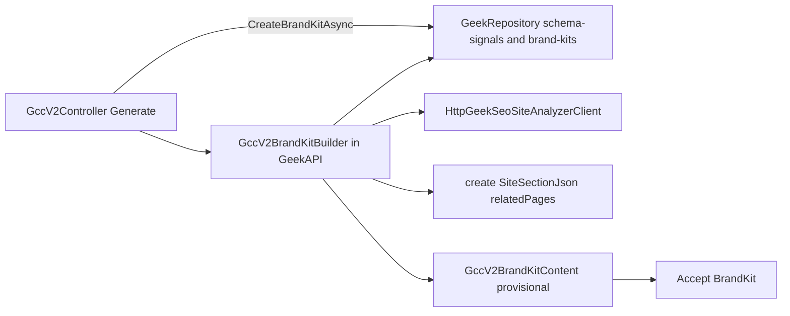

# Research-shaped BrandKit from Geek-SEO crawl

**Status:** implemented — GeekAPI redeployed `fbc54c5c` (health ok)  
**Related:** [content-creator-v2.md](./content-creator-v2.md), [competitor-site-crawl.md](./competitor-site-crawl.md), [brandkit.md](./brandkit.md)

## Problem

`GccV2BrandKitBuilder` (GeekBackend) reads **SA2** `sa2.site_profiles` (wrong store + missing `PrimaryFocus`). That is the same failure mode as before: copying another app’s reader instead of fulfilling “URL → extracted site facts → write.”

Create already attaches a **Geek-SEO** `site_analysis_profiles` id + `relatedPages`. BrandKit must derive from **that crawl**.

## Hard constraint — existing GeekAPI + GeekRepository only

- **All backend process** for BrandKit lives in **existing GeekAPI** (builder + Generate wiring) and reads/persists through **existing GeekRepository** routes (schema-signals, v2 brand-kits, creates).
- **No new backend** service, repo, worker host, or database. No SA2 / Site Analyzer 2 connection for BrandKit. No new microservice.
- Geek-SEO stays **read-only via GeekAPI’s existing** `HttpGeekSeoSiteAnalyzerClient` (page-contexts, trees, profile). **Do not edit Geek-SEO.** Do not add a parallel SEO backend.
- Frontend (content-creator-v2 / phi) stays BFF → GeekAPI only.

## Research / Writesonic weight (source of truth)

- **Writesonic:** domain-bound project + **site structure → internal links** (and outline-before-write).
- **Frase / Copy.ai / Jasper:** crawl/URL fills Brand Hub / Infobase / voice samples — operator reviews, does not invent blanks.
- **v2 table:** kit from schema signals, homepage/about trees, page body excerpts, CTAs, `relatedPages` — not `PrimaryFocus` alone.

## Writesonic-Clone role (off the rails — do not follow)

Repo: `/Users/jeffmartin/development/Writesonic-Clone`

**What research requires (Writesonic):** project **Domain URL** → crawl/site structure → **internal links** + brand materials → outline → write.

**What the clone shipped:** marketing homepage chrome + a demo **brief → outline → article** writer. Website/brand fields are **form strings**, not a domain-bound crawl, not site structure, not link candidates. Same failure mode as SA2 BrandKit: looks like the product surface, **does not fulfill grounding**.

**Plan rule:** treat the clone as **non-authoritative**. Do not copy its prompts, brief shape, or “optional brand” path into Content Creator v2. v2 BrandKit stays on GeekAPI + GeekRepository + Geek-SEO crawl reads. Outline-before-write is already in v2; that is the only Writesonic UX overlap we keep.

**Out of this plan:** fixing or extending the Writesonic-Clone.

## Approach (concrete)



### 1. Rewrite BrandKitBuilder inside existing GeekAPI

File: `/Users/jeffmartin/development/GeekBackend/GeekAPI/Services/ContentCreatorV2/BrandKit/GccV2BrandKitBuilder.cs`

- **Remove** `SiteAnalyzer2SiteProfileReader` dependency for BrandKit.
- Inject only **existing** GeekAPI deps: `HttpGeekSeoSiteAnalyzerClient`, named `GeekRepository` `HttpClient` / factory, logger.
- New signature (Generate already has auth + create):

```csharp
BuildAsync(Guid profileId, string bearerToken, Guid ownerUserId,
  string? siteUrl, SiteSectionContextDto? section, CancellationToken ct)
```

- **Fail closed** if crawl reads fail or kit has no `CompanyName`/`Website`. No empty-kit continue. No Geek At Your Spot identity.

### 2. Crawl reads via existing GeekAPI + GeekRepository only

| Source | Existing path | Maps to kit |
|--------|---------------|-------------|
| Schema signals | GeekAPI → named `GeekRepository` client → `GET repo/seo/site-analysis-profiles/{id}/schema-signals?userId=` (`GeekRepository/.../SiteAnalysisProfilesController`) | `companyName`, `companyDescription`, `knowsAbout`, `areaServed`, `sameAs`, services → `features` |
| Page contexts | Existing `GetPageContextsAsync` on `HttpGeekSeoSiteAnalyzerClient` | Homepage/about fallbacks; **voiceSamples** from markdown |
| Page-section trees | Existing `GetPageSectionTreesAsync` on same client | Positioning + **ctaPhrases** from link anchors |
| Website | create `SiteUrl` / profile domain via existing SEO client | `website` |
| relatedPages | create `SiteSectionJson` (already GeekRepository-backed) | Writesonic-style link grounding (WRITE already injects) |
| Persist kit | Existing `HttpGccV2Repository.CreateBrandKitAsync` → GeekRepository brand-kits | provisional → Accept |

Own-site `knowsAbout` / `areaServed` / `sameAs` are **not** on public site-analyzer DTOs; they **are** on GeekRepository `schema-signals` — that is the intended GeekAPI→GeekRepository path. Page contexts/trees already wrap real markdown + trees. Optional soft fallback: thin `GetProfileAsync` wrapper on the existing SEO client (route already exists; no Geek-SEO edit).

### 3. Extraction rules (deterministic first)

Implement mapping **in GeekAPI v2** (do not edit Geek-SEO):

- Prefer schema signal values; else homepage title/H1/markdown.
- Voice samples: prose excerpts from page-context markdown (target ≥1k chars total when copy exists); keep Canvas-compatible `string[]` (URL in excerpt prefix or `Notes` if needed).
- **Skip LLM voiceGuidance in this pass** — short deterministic provisional notes; operator Accept remains the gate.
- `Audiences` / soft “for …” extracts: best-effort on homepage/about; else `[]` + note in `Notes`.
- Thin sites: provisional kit with empty optional arrays + notes; still require website/company identity.

### 4. Wire Generate

`GccV2Controller.Generate`: pass bearer, `_user.UserId`, `create.SiteUrl`, parsed `section` into `BuildAsync`. Persist kit as today via GeekRepository.

### 5. Deploy + verify

- Redeploy **GeekAPI** (Railway). Frontend/phi unchanged unless BrandKit canvas needs richer sample display (defer unless broken).
- Smoke: create on phi → generate for a crawled domain → BrandKitReady shows real company/website/samples from that site → Accept → outline → write.
- Confirm no SA2 / `PrimaryFocus` 42703.

## Todos

1. ~~Remove SA2 `SiteAnalyzer2SiteProfileReader` from `GccV2BrandKitBuilder`~~
2. ~~In GeekAPI only: read schema-signals via GeekRepository + page-contexts/trees via existing SEO client + relatedPages~~
3. ~~Map research table fields in GeekAPI builder; fail closed on empty identity~~
4. ~~Pass bearer, userId, siteUrl, section from `GccV2Controller.Generate` into `BuildAsync`~~
5. ~~Redeploy existing GeekAPI; E2E BrandKit on phi for a real crawl profile~~
6. ~~Enrich BrandKitReady + canvas with description / sample previews for Accept review~~

**Operator smoke (phi):** Sign in → `/creates/new` → crawled URL → brief → generate → Brand kit panel shows company, website, description, sample excerpts from that site → Accept → outline → write.

## Explicit non-goals

- **No new backend** (service, worker host, DB, or repo product).
- Do not edit Geek-SEO.
- Do not use SA2 / `SITE_ANALYZER2_DATABASE_URL` for BrandKit.
- Do not reintroduce Content Gap as a create gate.
- Do not copy Writesonic-Clone (off-rails demo: typed website string, no crawl) into GeekAPI or v2 BrandKit.
- Do not commit unless asked.
