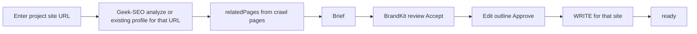

# Build plan — site URL first, then section, BrandKit, gates

**Values over expediency:** Correct site grounding and hard stops beat shipping a fast path that skips who we’re writing for. No silent fallbacks. No “optional site.” No empty kit continue. No fake gates.

**Veto history:** BrandKit-only / profile-dropdown-only plans were incomplete.

**Detailed competitor crawl research:** [`competitor-site-crawl.md`](./competitor-site-crawl.md) — Frase / Jasper / Copy.ai / **Writesonic** (your current favorite) plus Byword, Koala, Writer, Anyword, Rytr, Marketing Mary, Zapier, DeepSeek, Grammarly, Perplexity, Mistral: what they extract and how they use it.

## Competitor research — project site URL is the keystone

Researched product surfaces (same set as [`content-creator-v2.md`](./content-creator-v2.md) + wave 2). Pattern among real writer products:

| Product | Site URL / domain role |
|---------|-------------------------|
| **Writesonic** (design weight) | Project **Domain URL**; audit + **internal links** from site structure |
| **Frase** | **Add Site** domain; crawl fills Brand Hub |
| **Koala AI** | Brand DNA **website URL** → profile + Knowledge Base; Growth Agent crawls sitemap |
| **Byword** | `domain_id` on every article; domain scan for gaps; voice from samples |
| **Writer** | Knowledge Graph **web connector** (page / sub_pages) |
| **Jasper** | Brand Voice from **page URLs** (crawl text) |
| **Anyword** | Scan **webpage URL** → tone + persona |
| **Copy.ai** | Infobase **Company website** field (+ structured facts) |
| **Marketing Mary** | HubSpot/WP site + guidelines; Screaming Frog optional; internal links |
| Weak / different job | Rytr (samples only); Grammarly (tone feedback); Zapier (orchestrate); Perplexity/DeepSeek/Mistral (search/models) |

**Implication for v2 (your read: they would have to crawl):** Operators must give **the project site URL**, we **run/resolve Geek-SEO crawl**, surface extracts, and only then write. Soft paths rejected. **Bias implementation toward Writesonic:** domain-bound create + `relatedPages` links in WRITE. Detail: [`competitor-site-crawl.md`](./competitor-site-crawl.md).

Our engine for that URL is **Geek-SEO Site Analyzer** (do not edit Geek-SEO). Content Creator must **own the UX**: enter URL → analysis/profile → marketing site section (`relatedPages`) → BrandKit review → write.

Design already said this ([`content-creator-v2.md`](./content-creator-v2.md)): crawl fills competitor kit fields; Generate requires crawl; site section context with non-empty `relatedPages`. v2 shipped optional skip instead — that was expediency. Fix it.

---

## Product flow (required)

**Update (operator):** Content Gap picker removed from create UX. Flow is **URL → crawl pages as relatedPages → brief → BrandKit**. Gap list is not the product gate; site pages from the URL crawl are.

Hard gates: no URL/property → stop. No relatedPages → stop. No accepted BrandKit → stop. No silent Geek At Your Spot writer identity.

---

## Phase A — Site URL + Site Analyzer + site section

### A0. URL-first entry
- Create / Site Analyzer start: **required site URL** (or domain), not an optional GUID.
- Resolve to Site Analyzer profile for that URL (recent/by-domain APIs); if none, **start analyze** for that URL (proxy existing GeekAPI analyze — do not edit Geek-SEO).
- Show the human-readable site (domain/URL) everywhere on Canvas (`Writing for: https://…`).

### A1. Persist site section on v2 create
- `SiteSectionJson` on `GccV2Create` + migration.
- Shape = v1 `SiteSectionContext` (profile id, gapTopic, gapSectionPath, relatedPages, topicalNeighbors).
- Gate: site attached ⇒ `relatedPages.length > 0`.

### A2. BFF to existing site-analyzer reads
- New `src/app/api/site-analyzer/...` proxies to GeekAPI (v1 routes called, not edited): profiles, analyze, gaps, section-context, trees.

### A3. `/site-analyzer` UI in this app
- Patterns from GeekContentCreator site-analyzer (rewrite here; do not edit that repo).
- URL → profile/run → gap → section with related pages → Start create.

### A4. Kill optional profile-only create
- Cold `/creates/new` either redirects to Site Analyzer or embeds the same URL→section flow.
- Generate rejects missing profile or empty relatedPages.

### A5. Ground WRITE
- Inject relatedPages + BrandKit into context.
- Remove `FirstNonEmpty(..., PublisherName)` writer fallback.

---

## Phase B — BrandKit Accept
- Build from crawl for that site URL’s profile; fail if empty.
- `awaiting_brandkit_approval` → Accept/Reject; WRITE needs accepted kit.
- Kit fields = competitor table in design plan (name, website, description, voice samples from site pages, etc.).

## Phase C — Outline edit + regenerate
- PUT outline; regenerate; Canvas editors; keep approve-outline.

## Phase D — Remove Groq editorial VALIDATE; copy-all
- Skip `GccV2ReviewAdapter`; keep overlap/guardrail; Copy all when sections exist.

## Phase E — No WRITE stubs
- LLM fail → fail job.

## Phase 0 — Ops
- `NEXT_PUBLIC_APP_URL` = phi; test on phi.

---

## Reuse
Copy patterns / call APIs. Do not edit GeekContentCreator, Geek-SEO, or v1 ContentCreator code.

## Done when
1. Cannot write without a **project site URL** resolved to analysis + non-empty relatedPages + accepted BrandKit  
2. Canvas shows which site the piece is for  
3. Draft uses that site’s services/pages  
4. Outline editable; no Groq editorial block; no stubs  

## Todos
- [ ] 0 — phi URL  
- [ ] A0–A5 — URL-first Site Analyzer + section + WRITE grounding  
- [ ] B — BrandKit accept  
- [ ] C — Outline edit/regenerate  
- [ ] D — No Groq editorial VALIDATE; copy-all  
- [ ] E — No WRITE stubs  
