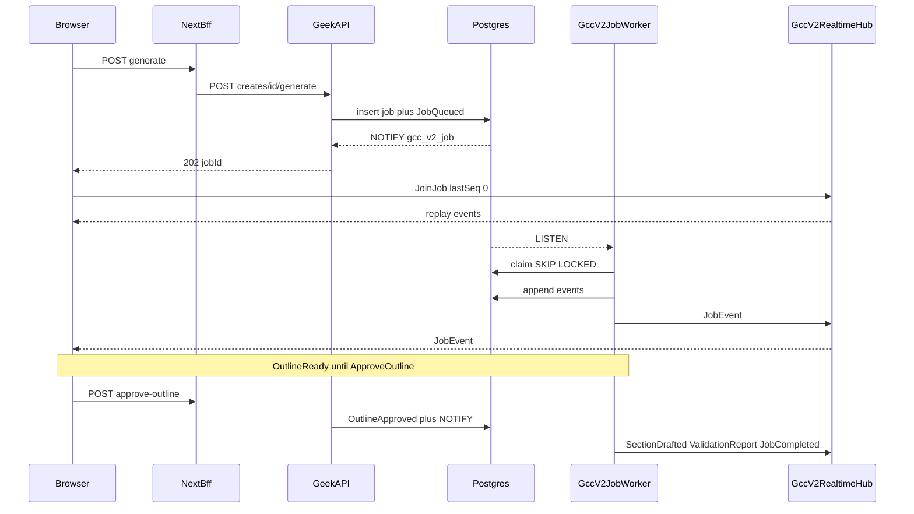

# Content Creator v2 — Implementation Plan

Platform map (what already exists): [`../architecture.md`](../architecture.md). That document describes **v1**. Its §7 “async job + poll” is **not** the v2 design.

This plan is for review. It does not authorize edits to the live Content Creator application.

---

## Context

Content Creator (GCC) v1 generates blog/pillar/tool/email/social/image-prompt content with single-shot (or weakly batched) LLM calls, grounded from a persisted **Content Brief** + uploaded research + a required site-analysis crawl. The **brief form stays in v2** — it is the steering the operator already knows how to fill (intent, stage, audience, angle, CTA, tone, E-E-A-T, length, writing notes, curated SERP/PAA). v2 freezes it; it does not replace it with blank Infobase fields.

What v1 does **not** do is show, as a hard gate, the quality failures you can already read in the draft.

### v1 quality failures you can see

These are product bugs, not “the brief was wrong.” The brief can be complete and the page still fails.

1. **Same problem and same solution, restated under every H2.** Each section opens on practitioner pain (cost, delay, error, risk) then pitches the consultancy fix, in different words. Shared prompts **require** this: `ContentPromptBuilder` “PROBLEM-FIRST OPENING (required)” on **every** section (`BuildArticleSectionPrompt` / `BuildArticleSectionBatchPrompt`), plus `BrandTones` “acknowledge specific pain points before pitching.” A “Do NOT repeat the same point… across sections” line is in the same prompt and is not enforced after generation. GCC long-form (`GenerateStartingContentAsync`) dumps the **entire** brief + research + must-mention list into one `BuildStandaloneBlogBodyPrompt` call with a dummy outline (`Overview` / `Key considerations` / `Next steps`). Inline `GeneratePillarBodyAsync` / `GenerateBlogBodyAsync` are one-shot bodies with “each section 400–600 words” and the same must-mention bag. Result: five H2s, one argument.

2. **Must-mention as a bag, not a map.** Hierarchy child headings are injected as one “MUST MENTION” block for the whole piece (`BuildMustMentionSubtopicsBlock`). Every section is pressured to cover every child, so the same subtopics recycle.

3. **Undifferentiated research.** `BuildBriefAndResearchBlock` concatenates full `BriefJson` + all quoteables + SERP into `sourceContext` for the run. Nothing assigns which research item a section may cite → hallucination and the same quotes in multiple sections.

4. **No validation loop on GCC.** `EditorialReviewService` / `ReviewLoopService` exist for the old pipeline and are **not** wired into GCC generate. On-page SEO/polish in the UI are post-hoc reports (`draft-quality.ts` / analyzers), not a ship gate. Guardrails are eight hardcoded regexes.

5. **Infra, not the draft:** `GccJobStore` is unread in-memory; generate is synchronous (Vercel timeout). Ads prompt exists unused. Prior v2 drafts polled jobs — v2 must not.

**Goal of v2:** keep the v1 brief; require the existing crawl (do not make the operator guess voice/site facts); plan a **distinct job per section** so problem/solution cannot be the whole article; write section-by-section with allocated research; **VALIDATE must surface named overlap** (“H2 4 restates H2 1’s problem/solution”) and repair only that section — in new files/routes/tables/repo so **v1 is never modified**.

---

## Isolation — do not impact the existing application

v2 is a **parallel product**. Copy patterns; do not edit the originals. Do not share v1 cookies, hubs, notify channels, or tables.

### Forbidden (zero diffs)

| Surface | Path / notes |
|---|---|
| Live UI | Entire `/Users/jeffmartin/development/GeekContentCreator` (including `site-analysis-hub.ts`, gcc-api, auth cookies) |
| v1 API | `GeekAPI/Controllers/ContentCreator/*`, `Services/ContentCreator/*`, `HttpClients/HttpGccRepository.cs` |
| v1 persistence | `GeekRepository/Data/ContentCreatorDbContext.cs`, `Controllers/ContentCreator/*`, v1 migrations, `gcc_*` tables |
| Geek-SEO realtime | `SeoRealtimeHub`, `/hubs/seo-realtime`, site-analysis progress notifier |
| Shared engines | `EditorialReviewService`, `ReviewLoopService`, `ContentPromptBuilder`, `ResearchBriefBuilder`, `GcwSeoAnalyzer`, `GcwPolishAnalyzer` — **call only; no signature or behavior edits** |
| Wrong repo | Standalone `/Users/jeffmartin/development/GeekRepository` (not the GeekBackend one) |

**Path disambiguation:** two `GeekRepository` directories exist. The real one is `/Users/jeffmartin/development/GeekBackend/GeekRepository` (`ContentCreatorDbContext`, ContentWriter V2/V3/V4 contexts, `railway.geekrepository.toml`). All `GeekRepository/...` in this plan mean that one.

### New surfaces only

- **Frontend:** standard Next.js App Router **in this workspace** (prefer repo root beside `plan/` / `architecture.md`). Do not create sibling `GeekContentCreatorV2`, or folders named `web` / `frontend`. No API layer under `lib/`. **Auth = existing GeekOAuth as IdP** (this app is a client only — do not duplicate GeekOAuth); distinct client + cookies from v1 — [`executor.md`](./executor.md).
- **GeekAPI:** `Controllers/ContentCreatorV2`, `Services/ContentCreatorV2`, `HttpClients/HttpGccV2Repository.cs`, route prefix `api/geek-content-creator-v2`, hub **`/hubs/gcc-v2-realtime`**.
- **GeekRepository:** `ContentCreatorV2DbContext`, `Entities/ContentCreatorV2/*`, `Migrations/ContentCreatorV2/`, `Controllers/ContentCreatorV2/*`. Postgres notify channel **`gcc_v2_job`**.

### Only allowed edits in existing entrypoints

Review line-by-line at every phase. Must be **additive**:

1. `GeekAPI/Program.cs` — `AddContentCreatorV2()`; `AddSignalR()` if missing; `MapHub<GccV2RealtimeHub>("/hubs/gcc-v2-realtime")`; **append** the v2 origin to `CORS_ORIGINS` (do not replace the list or change v1 origins).
2. `GeekRepository/Program.cs` — register `ContentCreatorV2DbContext` and `MigrateAsync` **in addition to** existing Content Creator migrate.

If adding SignalR to the GeekAPI process is judged too risky for v1, host the v2 hub in a new adjacent service instead. Default is a unique hub path on GeekAPI so the v1 HTTP pipeline is unchanged. **Never** subscribe v1 GCC generate to the v2 hub or `gcc_v2_job` channel.

v1 Site Analyzer crawl progress continues to use Geek-SEO `/hubs/seo-realtime`. v2 generation progress never uses that hub.

---

## Competitive research (creation loop only)

Researched from current product surfaces (2026): Writesonic Article Writer, Frase features/GEO/briefs, Jasper IQ / Canvas / pipelines, Copy.ai Infobase / Brand Voice. Not pixel clones. Not their whole platforms.

GCC’s job stays: **v1 Content Brief (same catalogs/fields)** → **crawl-derived brand kit** (what competitors ask you to type) + site section context → research-grounded ContentDocument → revise / on-page SEO / polish / approve / repurpose.

**Do not** replace the brief with blank Infobase fields. **Do** fill the competitor kit from the existing Geek-SEO crawl (read-only) so a new business is not guessing. The brief **steers this piece**; the crawl kit **grounds the brand**. Kit is a **working snapshot** — editable, provisional, re-derived when the crawl refreshes — not a locked brand bible.

### Crawl fills the fields competitors ask for

Competitors’ Brand Voice / Infobase / Brand Hub forms ask for facts the live site already states. v2 runs a **BrandKitBuilder** over the attached `site_analysis_profiles` crawl (schema signals, homepage headings, page-section trees, related pages). Operator **reviews and corrects**; they do not invent from empty boxes. No second crawler; do not edit Geek-SEO.

| Competitor field (who asks) | Crawl source (already in Geek-SEO) | v2 kit field |
|---|---|---|
| Company / brand name (Copy.ai, Frase, Jasper) | JSON-LD `organization.brandName`; else homepage `<title>` / H1 | `companyName` |
| Website (Copy.ai) | Profile `Domain` | `website` |
| Company description / business overview (Copy.ai, Frase) | JSON-LD `organization.description`; else homepage hero / about-section paragraphs from page tree | `companyDescription` |
| Tagline (Frase) | Homepage H1 or first strong headline on `/` | `tagline` |
| Value prop / positioning one-liner & short statements (Copy.ai, Frase) | Homepage + `/about` (or equivalent) section paragraphs nearest H1/H2 “who we are / what we do” | `positioningOneLiner`, `positioningShort` (derived; operator edits) |
| Target audience (Copy.ai, Frase, Jasper) | Soft extract from homepage/about copy (“for …”, “teams who …”); often thin → leave draft + note | `audiences[]` (provisional) |
| Core features / services + use cases (Copy.ai) | Schema `service.name`, `offer_catalog.serviceType`; service/product page H2s + child headings | `features[]` `{ name, sourceUrl, childHeadings[] }` |
| Topics the brand “knows about” (Frase-ish / schema) | Schema `thing.knowsAbout` | `knowsAbout[]` |
| Area served (geo) | Schema `organization.areaServed` | `areaServed[]` |
| Social / sameAs | Schema `organization.sameAs` | `sameAs[]` |
| Brand voice **samples** (Jasper ≤8 URLs/paste, Frase ≤5k words, Writesonic URLs/text) | Body paragraphs from homepage + up to ~7 high-signal pages (about, services, top blog/pillar by tree depth) — real crawl text, not invented | `voiceSamples[]` `{ url, excerpt }` (≥1k chars when site has copy) |
| Voice **description** / tone (Jasper generated profile; Frase formality etc.) | One LLM pass over `voiceSamples` → editable `voiceGuidance` labeled **provisional** | `voiceGuidance`, `voiceStatus: provisional\|accepted` |
| Example phrases / CTA language (Frase) | Anchor text + repeated CTA labels from crawled links | `ctaPhrases[]` |
| Internal link targets (Writesonic) | `relatedPages` + hierarchy-match children | already site section context; also mirrored on kit for Canvas |
| Preferred / banned terms (Frase terminology) | **Not** reliably on the site — operator adds; crawl may only suggest repeated house nouns | `termsPreferred[]`, `termsBanned[]` (manual; optional crawl suggestions) |

**Explicitly not guessed from the crawl:** unpublished pricing, legal disclaimers, “who we want to sound like next quarter,” competitor lists Frase invents for AI-visibility. Those stay operator-only or out of scope.

**When it runs:** after a create is attached to a site analysis (same gate as Generate — crawl id required). Persist `GccV2BrandKit` (versioned JSON + `DerivedFromProfileId` + `DerivedAtUtc`). Re-run on crawl refresh or operator “Re-derive from site.” WRITE injects the accepted/provisional kit via context translation; brief tone/audience fields still win for **this piece** when set.

| Source | Best-in-class feature | v2 landing |
|---|---|---|
| Writesonic | Outline first; human edits; then write | PLAN emits `GccV2Outline`; job `awaiting_outline_approval`; WRITE starts only after `POST .../approve-outline` (event + notify) |
| Writesonic | Fact-check vs sources | VALIDATE: claims must map to allocated research item ids; uncited claims become repair notes |
| Writesonic | Internal links from the site | PLAN/WRITE inject `SiteSectionContext.relatedPages` as link candidates |
| Writesonic | GEO-ready structure | Outline slots: FAQ, comparison table when intent fits, self-contained citeable passages |
| Writesonic | Multi-expert review | `EditorialReviewService` adapter + SEO + **new** `GccV2GeoAnalyzer` + citation gate; **named fix list**, not a single score |
| Frase | Frozen brief | `GccV2Brief` frozen at generate-time so plan/write/validate share one snapshot |
| Frase | Dual SEO + GEO scores with named fixes | Wrap `GcwSeoAnalyzer` (already has `FixHint`) + `GccV2GeoAnalyzer`; scores travel as **job events** |
| Frase | Approve publish-class steps | Outline gate; outstanding-issues flag if still not `ShipReady`; never silently discard failure |
| Frase Brand Hub | Domain crawl → overview, tagline, audience, values, voice | **BrandKitBuilder** from existing Geek-SEO crawl (table above); review UI, not blank Brand Hub |
| Frase / existing GCC | Child headings of a keyword | PLAN calls existing **hierarchy-match** (read-only): keyword → matched heading → `childHeadings` + tool **child anchors** (`name`/`href`). Those children seed the outline and must-mention list. Invented SERP subtopics are not children |
| Jasper Brand Voice / IQ | Samples → voice description + excerpts; knowledge URLs | Samples = crawl excerpts; description = provisional LLM over those excerpts; knowledge = schema services + page facts — not empty uploads |
| Jasper Canvas | Document workspace + AI actions | Event-streamed Canvas; right-rail scores/fixes; rewrite / expand / re-tone as **short sync** GeekAPI calls |
| Jasper pipelines | Named stage agents | plan → write → validate → repair; each stage appends events; hub fans them out |
| Copy.ai Infobase | Company name, site, description, value prop, positioning, audiences, features | Same fields **pre-filled from crawl**; Infobase-shaped store is `GccV2BrandKit` + optional `GccV2KnowledgeItem` extras the site will never have |
| Copy.ai / Frase | Brand voice from samples | Crawl samples auto-selected; operator can swap pages / paste overrides |
| Frase atomization / Buffer | One canonical → channels | `IChannelTransform` reusing `GcwRepurposeCatalog` / `GcwRepurposePack` channel list |

**Out of this plan:** ChatGPT/Perplexity citation-tracking dashboards, GEO Action Center / site-wide AI visibility, Frase Answers / CMS publish, MCP servers, token-by-token LLM streaming, Jasper Grid, Copy.ai CRM/Tables/GTM event workflows, Redis, Hangfire, live migration of v1 creates, guessing brand voice with no crawl.

---

## 1. Repo / service topology

### Frontend — this workspace (standard Next.js)

Prefer **repo root** of `/Users/jeffmartin/development/content-creator-v2` as the Next app (keep `plan/` + `architecture.md`). Do not use sibling `GeekContentCreatorV2`, or directory names `web` / `frontend`.

**Conventions:** Standard App Router under `src/app`. Auth colocated at `src/app/auth/` + `src/app/api/auth/`. **No** top-level `server/` directory. **No** GeekAPI/BFF clients in `lib/`. GeekOAuth = existing IdP (client only). Distinct client/cookies from v1. Executor: [`executor.md`](./executor.md).

```
content-creator-v2/
  plan/
  architecture.md
  src/app/
    page.tsx                 # /  (signed-out landing or signed-in home — one app)
    auth/                    # cookies, pkce, config, tokens, session + callback/
    api/auth/...             # GeekOAuth client routes
    api/gcc-v2/[...path]     # BFF → api/geek-content-creator-v2
    creates/...              # later — /creates/[id], never /app/...
```

- **No `/app` URL.** Nested `src/app/app/` is forbidden. `src/app/` is only the Next App Router root.
- Hub URL when realtime exists: `NEXT_PUBLIC_GCC_V2_HUB_URL` → `/hubs/gcc-v2-realtime` (not SEO hub).
- Reuse GeekOAuth **as existing IdP** (client only); new files here; never edit GeekContentCreator.

### Backend — new namespace inside GeekAPI

Reuse providers, `LlmConcurrencyGate`, JSON-repair. Parallel namespace only:

```
GeekBackend/GeekAPI/
  Controllers/ContentCreatorV2/
    GccV2Controller.cs
    GccV2JobsController.cs
    Hubs/GccV2RealtimeHub.cs
    Auth/GccV2JwtHubQueryToken.cs          # copy of SEO pattern; new file
  Services/ContentCreatorV2/
    Pipeline/
      IGenerationPipeline.cs
      GenerationPipeline.cs
      ContentTypePipelineRegistry.cs
    Briefs/
      ResearchAllocationMapBuilder.cs
    BrandKit/
      GccV2BrandKitBuilder.cs             # maps crawl → competitor kit fields (read Geek-SEO only)
    Jobs/
      GccV2JobWorker.cs                    # LISTEN + Channel; no pending ticker
      GccV2JobEventWriter.cs
      GccV2ProgressNotifier.cs             # IHubContext push after event persist
    Transforms/
      IChannelTransform.cs
      LinkedInTransform.cs, TwitterTransform.cs, EmailDigestTransform.cs, ...
    Guardrail/
      GuardrailGateService.cs
    Review/
      GccV2ReviewAdapter.cs
    Geo/
      GccV2GeoAnalyzer.cs
    GccV2GenerateService.cs
  HttpClients/
    HttpGccV2Repository.cs
```

DI: `AddContentCreatorV2()` alongside existing GCC/Workflow registrations — never replacing them.

### Persistence — new EF Core DbContext

GCC already uses relational persistence (`ContentCreatorDbContext`), not the old blob `IPersistenceStore`. v2 follows the proven vN+1 pattern (`ContentWriterV2/V3/V4` DbContexts coexist):

```
GeekRepository/
  Data/
    ContentCreatorV2DbContext.cs
    Entities/ContentCreatorV2/
      GccV2Create.cs, GccV2Job.cs, GccV2JobEvent.cs, GccV2Brief.cs,
      GccV2Outline.cs, GccV2ResearchAllocation.cs, GccV2StageResult.cs,
      GccV2GuardrailRule.cs, GccV2BrandKit.cs, GccV2KnowledgeItem.cs
    Migrations/ContentCreatorV2/
  Controllers/ContentCreatorV2/
    ...Creates, Jobs, Events, Briefs, GuardrailRules, BrandKits
```

EF Core exists so events, claims, and resume are durable — **not** so a worker or UI can poll `pending` rows on a timer.

---

## 2. Data model

### 2.0 Creates

```csharp
public sealed record GccV2Create(
    Guid Id, string OwnerUserId, string Title, string ContentType,
    DateTimeOffset CreatedAtUtc, DateTimeOffset? UpdatedAtUtc);
```

`OwnerUserId` from the hub-token principal scopes every child query. A user only joins hubs / reads events for their own jobs.

### 2.1 Jobs + event log (async infra)

```csharp
public sealed record GccV2Job(
    Guid Id, string ContentType, Guid BriefId, string OwnerUserId,
    string Stage,       // "plan" | "write" | "validate" | "repair" | "done"
    string Status,      // "pending" | "running" | "awaiting_outline_approval"
                        // | "ready" | "failed" | "canceled"
    int AttemptCount, string? ResultJson, string? Error,
    string? ClaimedByInstanceId, DateTimeOffset? ClaimedAtUtc,
    DateTimeOffset? LeaseUntilUtc,
    int? TokensUsed,
    DateTimeOffset CreatedAtUtc, DateTimeOffset? UpdatedAtUtc, DateTimeOffset? CompletedAtUtc);

public sealed record GccV2JobEvent(
    Guid Id, Guid JobId, int Seq, string Type, string PayloadJson,
    DateTimeOffset CreatedAtUtc);

public sealed record GccV2StageResult(
    Guid Id, Guid JobId, string Stage, string? SectionKey,
    string OutputJson, int TokensUsed, DateTimeOffset CompletedAtUtc);
```

`GccV2JobEvent` is the **source of truth** for UI catch-up. The hub fans the log out; it does not keep a second truth.

Event types: `JobQueued`, `JobStageChanged`, `OutlineReady`, `OutlineApproved`, `SectionDrafted`, `ValidationReport`, `RepairProgress`, `JobCompleted`, `JobFailed`, `JobCanceled`.

- Intermediate results persist per stage/section (`GccV2StageResult`) so a pillar that dies at section 7 keeps 1–6; resume is from last completed result.
- Idempotency: before insert, reject a second non-terminal job for the same `(BriefId, ContentType)`.
- Cancellation: `POST jobs/{id}/cancel` appends `JobCanceled`, notifies; worker checks `CancellationToken` between stages and section writes.

### 2.2 Brief (Frase pattern)

```csharp
public sealed record GccV2Brief(
    Guid Id, Guid CreateId, int Version, string TargetKeyword, string ContentType,
    string RawBriefJson, DateTimeOffset FrozenAtUtc);
```

Freeze at generate-time so mid-run form edits cannot desync stages. Copy v1 `brief-catalog.ts` catalogs, fields, `migrateBrief()`, and `isContentBriefComplete()` into the **new** frontend **as-is** (plus `"ads"`). Do not redesign the brief into competitor-style free-text Infobase. The crawl **BrandKit** is a **separate** reviewable snapshot (Frase Brand Hub / Copy.ai Infobase / Jasper samples shape); it does not replace brief fields.

### 2.3 Outline + hierarchy children

```csharp
public sealed record GccV2Outline(
    Guid Id, Guid BriefId, int Version,
    string OutlineJson,          // H2/H3, depth, article shape, GEO slots
    string[] HierarchyChildHeadings,
    DateTimeOffset FrozenAtUtc);
```

PLAN loads hierarchy-match for the target keyword against the create’s site analysis profile (existing read API; v1 code unchanged). `childHeadings` and tool anchors become outline rows the operator can edit before WRITE.

### 2.4 Research allocation map

```csharp
public sealed record GccV2ResearchAllocation(
    Guid BriefId, string SectionKey,
    IReadOnlyList<string> ResearchItemIds,
    IReadOnlyList<string> MustMentionSubtopics);
```

Built in PLAN from `ResearchBriefBuilder.Build()` plus the same hierarchy-matching idea as `GccGenerateService.BuildMustMentionSubtopicsBlock` — **new** builder in the v2 namespace, not an edit to v1. WRITE injects only the allocated subset per section.

### 2.5 Brand kit + knowledge (crawl → competitor fields)

```csharp
public sealed record GccV2BrandKit(
    Guid Id, Guid? ClientId, Guid DerivedFromProfileId,
    int Version, string KitJson,           // mapped competitor fields (see table above)
    string VoiceStatus,                    // "provisional" | "accepted"
    DateTimeOffset DerivedAtUtc, DateTimeOffset? AcceptedAtUtc);

public sealed record GccV2KnowledgeItem(
    Guid Id, Guid? ClientId, string Title, string Body,
    string Source,                         // "crawl" | "operator"
    string? SourceUrl, DateTimeOffset CreatedAtUtc);
```

`KitJson` holds the structured competitor-shaped fields. Built by `GccV2BrandKitBuilder` from Geek-SEO reads only (schema signals, homepage headings, page trees, related pages) — **do not edit Geek-SEO**. Operator extras the site will never have go in `GccV2KnowledgeItem` with `Source=operator`. Do not couple to Content Writer v4 brand-voice tables.

### 2.6 Guardrail rules

```csharp
public sealed record GccV2GuardrailRule(
    Guid Id, string Pattern, string Action,  // "strip" | "replace" | "restructure"
    string? ReplaceWith, bool Enabled, string? Scope, DateTimeOffset CreatedAtUtc);
```

Replaces v1’s eight hardcoded rules **for v2 only**. `Restructure` is a flag-for-review this phase; LLM Pass-2 is deferred.

---

## 3. Generation pipeline

### 3.1 Content types

| Content type | v1 source | v2 depth |
|---|---|---|
| Blog | blog methods | full plan→outline gate→write→validate→repair |
| Pillar | metadata/lede/section/FAQ | full pipeline, section-by-section (allocation map + child headings payoff) |
| Tool page | tool body/metadata | full pipeline |
| Email | two prompts exist (`ContentPromptBuilder` ~1227 vs inline `GccGenerateService` ~1719) | full pipeline; Phase 5 picks one canonical (default: `ContentPromptBuilder`) |
| Social | `BuildSocialPrompt` | plan+write; lighter validate (guardrail + polish; skip 5-point rubric) |
| Image prompts | image prompt methods | write-only |
| Repurpose pack | bespoke generator | Transform layer, not its own writer |
| **Ads (new)** | `BuildAdvertisingPrompt` (unused) | full pipeline; ads-specific rubric (not “pain-first article”) |

**Spike in Phase 5, do not build until go/no-go:** `BuildToolResearchExtractionPrompt` (likely PLAN input), `BuildToolRoundupPrompt` (tool-page variant), `BuildSummaryVariantsPrompt` (likely Transform).

### 3.2 Plan → Write → Validate → Repair

```
IGenerationPipeline.RunAsync(GccV2Brief brief, contentType)
  1. PLAN     ResearchBriefBuilder.Build (call, do not copy)
              + ResearchAllocationMapBuilder
              + hierarchy-match children
              + GEO slotting
              + per-section job: one distinct problem, one advance, one must-mention subset
                (children are partitioned; they are not a bag repeated on every H2)
              → persist outline, event OutlineReady, Status=awaiting_outline_approval
              → worker parks until OutlineApproved notify
  2. WRITE    ContentPromptBuilder.Build*Prompt (call through BuildMinimalContext-style translation)
              one call per approved section; only that section’s research subset + its job
              + GccV2BrandKit (crawl-derived) + operator knowledge + relatedPages
              Do not edit ContentPromptBuilder (PROBLEM-FIRST remains in the shared prompt).
              v2 user-message / allocation / brand kit is the lever; VALIDATE is the gate.
              → SectionDrafted event per persisted section
  3. VALIDATE GccV2ReviewAdapter → EditorialReviewService.ReviewAsync (in-memory only)
              + GuardrailGateService + GcwSeoAnalyzer + GccV2GeoAnalyzer + citation check
              + **OverlapGate (new, v2-only):** paraphrase-level duplicate of problem/solution
                across H2s. Named check, e.g. “H2 ‘Measuring ROI’ restates H2 ‘Overview’
                (same pain: wasted effort; same fix: hire implementation). Rewrite H2 3 to
                cover only its assigned job.”
              → ValidationReport event; ShipReady=false blocks done
  4. REPAIR   Failed section only. Cap 2; outstanding-issues flag if still overlapping. Never silent discard.
```

Canvas right rail must **show** OverlapGate hits with the two headings and the shared claim — the operator should not have to re-read the whole draft to notice v1’s failure mode.

### 3.3 Channel transforms

```csharp
public interface IChannelTransform
{
    string Channel { get; }
    Task<TransformResult> ApplyAsync(CanonicalContent source, TransformOptions options, CancellationToken ct);
}
```

Read `GcwRepurposeCatalog.cs` / `GcwRepurposePack.cs` first; reuse their channel list.

### 3.4 Review adapter seam

`EditorialReviewService.ReviewAsync(GeneratedContent, ProjectGenerationContext, ...)` is typed for the old Project domain. `GccV2ReviewAdapter` builds **in-memory, non-persisted** `GeneratedContent` + minimal context, reads `ReviewOutcome`, persists into v2 tables. **Zero changes** to review services.

v1 already translates brief → context in `GccGenerateService.BuildMinimalContext` — the adapter copies that **method into a v2 file**, it does not edit v1.

---

## 4. Event-driven job architecture (not polling)

Three polling shapes are **forbidden** in v2:

| Forbidden | Replacement |
|---|---|
| Frontend `usePollJob` / `setInterval` on job URLs | SignalR push of `GccV2JobEvent` |
| `GET jobs/{id}` as the progress loop | On-demand snapshot (JoinJob replay, debug). UI never timers this URL |
| Worker `SELECT pending` ticker | Postgres `NOTIFY gcc_v2_job` + in-process `Channel<Guid>`; claim only when woken |

No Redis, Hangfire, or Service Bus.

### 4.1 Command path (short HTTP)

Next BFF: start, cancel, approve-outline, canvas rewrite/expand/re-tone. Never waits on generation.

- `POST api/geek-content-creator-v2/creates/{id}/generate` → persist job + `JobQueued` event, `NOTIFY`, then `202 { jobId }`.
- `POST .../jobs/{id}/approve-outline` → persist outline version + `OutlineApproved`, `NOTIFY`.
- `POST .../jobs/{id}/cancel` → `JobCanceled`, `NOTIFY`.
- Canvas: `POST .../creates/{id}/canvas/{rewrite|expand|re-tone}` — sync, returns a ContentDocument slice.
- `GET .../jobs/{id}` — operator/debug snapshot, **not** a client loop.
- `GET .../jobs/{id}/events?afterSeq=` — optional REST catch-up if the socket is down; still not a timer.

### 4.2 Worker wake

After commit of enqueue / outline-approve / cancel:

1. GeekRepository `NOTIFY gcc_v2_job, jobId`.
2. GeekAPI also writes `Channel<Guid>` so the local worker runs if LISTEN lags.
3. `GccV2JobWorker` listens. On payload: `FOR UPDATE SKIP LOCKED` claim; run next stage; append events; hub push.

Multi-instance: every instance may hear NOTIFY; only the claim winner runs. Duplicate wakes are no-ops if `running` with a live lease.

**Stale-lease recovery is not a pending poller.** On claim, set `LeaseUntilUtc` and schedule **one** delayed self-wake for that job. On GeekAPI **process start**, run **one** scan of `running` rows with expired leases. No `while (true) { FindPending(); Sleep(); }`.

Resume: re-claimable if `ClaimedAtUtc`/`LeaseUntilUtc` is stale; continue from last `GccV2StageResult` (and last written section), not from PLAN.

### 4.3 Progress path (SignalR)

- Hub: `GccV2RealtimeHub` at `/hubs/gcc-v2-realtime` on GeekAPI.
- JWT on query `access_token` for `/hubs` — **new** `GccV2JwtHubQueryToken` file (copy SEO pattern; do not edit Geek-SEO).
- `JoinJob(jobId, lastSeq)`: verify `OwnerUserId`; group `job:{jobId}`; **replay** events with `Seq > lastSeq`; then live `JobEvent`.
- Push job group **and** `Clients.User(ownerId)` (same dual-delivery idea as Geek-SEO’s progress notifier — new v2 class, not an edit).
- Client: copy SignalR builder into **v2** `job-hub.ts` (WebSockets + SSE transport fallback, reconnect). Reconnect = replay, not poll.

Section appearance on Canvas: `SectionDrafted` payloads include the section slice. Token-by-token LLM streaming is out of scope.



### 4.4 Cost / latency / Vercel

Pipeline is plan + N section writes + review + repairs (pillars can be 5–10× v1 tokens/time). Mitigations: existing `LlmConcurrencyGate`; repair cap default 2; `TokensUsed` on events and jobs; per-job wall-clock ceiling then outstanding-issues. Next proxy never waits on generation.

---

## 5. Guardrail upgrade (v2 namespace only)

Port `ContentGuardrail` Strip/Replace mechanics into `Services/ContentCreatorV2/Guardrail/` as an **injectable** service over `GccV2GuardrailRule` (v1 class stays static and untouched). Cache enabled rules with a short TTL.

`GuardrailGateService` wraps `GcwSeoAnalyzer` / `GcwPolishAnalyzer` as a **hard VALIDATE gate**. `PolishAnalyzer.ShipReady == false` blocks `done` unless repair succeeds or the operator explicitly overrides.

Deferred: LLM Pass-2 `Restructure`.

---

## 6. File disposition (v1 stays; v2 copies or calls)

| v1 file | Disposition |
|---|---|
| `GccGenerateService.cs` | **Do not edit.** v2 WRITE is a new service that calls `ContentPromptBuilder` |
| `ContentPromptBuilder.cs` | **Call, do not copy or edit** (including `BuildAdvertisingPrompt`) |
| `ResearchBriefBuilder.cs` | **Call, do not copy or edit** |
| `GcwSeoAnalyzer.cs`, `GcwPolishAnalyzer.cs` | **Call** from `GuardrailGateService` |
| `EditorialReviewService.cs`, `ReviewLoopService.cs` | **Call via adapter** |
| `ContentGuardrail.cs` | **Do not edit.** Port mechanics into a new v2 service |
| `GccJobsAndSeo.cs` / `GccJobStore` | **Do not edit.** Pattern only |
| `HttpGccRepository.cs` | **Do not edit.** New `HttpGccV2Repository` |
| `ContentCreatorDbContext` + v1 controllers | **Do not edit.** New V2 context/controllers |
| v1 `brief-catalog.ts` | **Copy into this app** + ads type (Phase 4) — not via an API `lib/` dump |
| v1 auth / GeekOAuth BFF | **Client of existing GeekOAuth**; colocated under `src/app/auth/` + `src/app/api/auth/` (no `server/` tree, no API clients in `lib/`); distinct client/cookies from v1 |
| v1 `cw/[...path]` proxy | New BFF under `app/api/...` → `api/geek-content-creator-v2` |
| `CreateDraftWorkspace.tsx` | **Do not edit v1.** New Canvas in v2 |
| `GccController.cs` | **Do not edit.** New `GccV2Controller` |
| `site-analysis-hub.ts` / SEO hub | **Do not edit.** New `job-hub.ts` + `GccV2RealtimeHub` |
| hierarchy-match endpoint | **Call from v2 PLAN.** Do not change the v1 endpoint |
| Geek-SEO schema signals / page trees / related pages | **Read only** from v2 BrandKitBuilder / PLAN. Do not edit Geek-SEO or add a second crawler |

No live migration of v1 creates. Read-only “view a v1 create in v2” is backlog (v1 **reads** only).

---

## 7. Phasing (riskiest work first)

1. **Standard Next + GeekOAuth client** — App Router at repo root. Auth under `src/app/auth/` (not `server/`, not `lib/` API clients). Existing GeekOAuth IdP only. See [`executor.md`](./executor.md) Phase 1.
2. **GeekAPI/Repository stubs** — additive namespaces + authenticated health + CORS append; no poll worker.
3. **Event infra** — creates/jobs/events, NOTIFY/LISTEN, Channel, SignalR replay, dummy stages, outline pause/resume, cancel, SKIP LOCKED, startup lease scan. **Forbidden:** job HTTP poller, worker pending ticker.
4. **Briefs + allocation + hierarchy children + BrandKit** — freeze brief; allocation map; outline from hierarchy-match; BrandKitBuilder from crawl; outline gate.
5. **Blog + pillar Canvas** — pipeline, OverlapGate, dual scores, citation repair.
6. **Remaining types** — tool, social, image, ads, email; Transform layer; spike evaluate prompts.
7. **Guardrail DB** — `GccV2GuardrailRule`; hard gate.
8. **Backlog** — LLM Pass-2; read-only v1 create view; CMS; AI-visibility.

---

## Verification

**Isolation (every phase):** `git diff` empty on `GeekContentCreator`, `Geek-SEO`, `GeekAPI/Controllers/ContentCreator`, `GeekAPI/Services/ContentCreator`, `GeekRepository` ContentCreator (non-V2). Only additive `Program.cs` diffs as listed. Standalone `/Users/jeffmartin/development/GeekRepository` untouched.

**Phase 2 (events):** `POST generate` returns `202`; UI with **no** job GET loop still receives stage events; `JoinJob(lastSeq)` after reconnect continues; restart GeekAPI mid-dummy-job; job **resumes from last stage** and reaches `done`; cancel stops between stages; approve-outline unparks WRITE via notify; grep v2 frontend: no `setInterval`/`setTimeout` against job URLs; grep v2 worker: no pending-job sleep loop. Next proxy start/cancel/approve stay inside Vercel limits.

**Phase 4:** research-thin blog triggers `Revise` and repairs **one** flagged section, not a full regenerate. Dual scores appear as events. Hierarchy child headings appear on the outline for a keyword that matches the crawled tree. A draft that restates the same problem/solution across two H2s must fail OverlapGate with a named pair of headings; repair must change only the flagged section. The v1 brief form is present and still gates generate. BrandKit for a crawled domain shows company name/description/services/voice samples **without** the operator typing Infobase blanks; thin sites still get a provisional kit with empty optional fields marked for edit.

**Phase 5:** each type reaches `done` with `ShipReady=true` or an explicit outstanding-issues flag.

---

## Implementation notes (when building later)

- Preferred term remains **site section context** ([architecture.md](../architecture.md)), not “neighborhood.”
- Generate with Site Analyzer still requires non-empty `relatedPages`.
- Secrets and LLM keys stay on GeekAPI, never in the Next client bundle.
