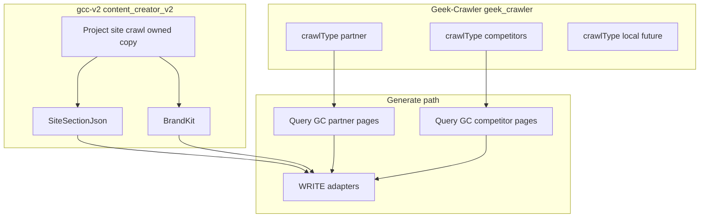

# Crawl architecture

**Correctness over expediency.** When this file conflicts with an older snippet in [`v2-master.md`](./v2-master.md) or [`../architecture.md`](../architecture.md), **this file wins** for crawl boundaries unless the owner overrides in chat.

Hard rules: [`rules.md`](./rules.md) §5, §10.

---

## Three crawl domains

Crawling is **not** one product. Three separate domains share similar engine patterns (mobile Playwright, polite BFS, link extraction) but differ in **who runs the crawl**, **where HTML is stored**, and **what consumes it**.

| Domain | Product / owner | Storage | Typical seeds | Consumed for |
|--------|-----------------|---------|---------------|--------------|
| **Partner / Tools** | Geek-Crawler | Mongo DB `geek_crawler` (`crawl_runs` / `crawl_pages`), `crawlType: "partner"` | Operator tool URLs, partner marketing sites | Tool page blockquotes, extraction, WRITE research excerpts |
| **Competitors** | Geek-Crawler | Same Mongo DB, `crawlType: "competitors"` | Rival URLs from brief `competitorUrls` | Differentiation notes in WRITE — research only, no rival CTAs |
| **Local / regional** (future) | Geek-Crawler | Same Mongo DB, `crawlType: "local"` | Local or South Florida business sites | Standalone Geek-Crawler product scope — **not** Content Creator project grounding |
| **Project site** | **gcc-v2 (owned)** | `content_creator_v2` project-site crawl tables (TBD name) | URL bound to the create / project | `relatedPages`, BrandKit, `siteHierarchy` |

**`partner` = Tools** — one crawl type, one query path. UI copy may say “partner tool URLs”; API and database use `crawlType: "partner"`.

---

## Project site (gcc-v2 owned)

The **project site** is the web property whose crawl grounds a create: real URLs, titles, headings, and excerpts for site section context, plus hierarchy for on-site tool discovery.

- **Today** this is usually the operator’s client property — but that is **not** a permanent rule. Tenancy may later bind other site types to a create; docs and code should say **project site**, not assume “client’s site.”
- **Not** a Geek-Crawler crawl type. Do not store project-site HTML in `geek_crawler`.
- **Copy, not reuse:** port crawl mechanics from Geek-Crawler / gcc-v2 reference code (`GeekCrawlerService` BFS, polite delay, mobile fetch, link extraction) into **`ContentCreatorV2/ProjectSite/*`** (or equivalent namespace). Same patterns, owned tables, owned API routes under `api/geek-content-creator-v2`.
- **Retire Site Analyzer as runtime dependency:** no `HttpGeekSeoSiteAnalyzerClient`, no phi `site-analyzer` analyze/poll path, no `siteAnalysisProfileId` as permanent gate — replace with **project-site run id** + `SiteSectionJson` on the create.

Outputs:

1. **`relatedPages`** → persisted `SiteSectionJson` on create (required for WRITE).
2. **BrandKit** → built from owned project-site crawl facts, not Geek-SEO profiles.
3. **`siteHierarchy`** → mobile heading/link tree on brief for tool preflight and on-site `/tools/…` hrefs.

---

## Geek-Crawler (external crawls)

Geek-Crawler’s **primary purpose** is crawling **external** sites: competitors, partner/tool destinations, and eventually local or regional properties.

| Item | Value |
|------|-------|
| Repo (UI) | `/Users/jeffmartin/development/Geek-Crawler` |
| Engine + data | GeekBackend `GeekAPI/Services/GeekCrawler/*`, `GeekRepository/Services/MongoGeekCrawlerService.cs` → Mongo DB `geek_crawler` (`MONGO_CRAWLER_URL`) |
| Start crawls | Geek-Crawler UI (or API) — **not** inline during gcc-v2 generate |
| Progress | SignalR `/hubs/geek-crawler-realtime` on GeekAPI |

Full product spec: [`geek-crawler.md`](./geek-crawler.md) and `/Users/jeffmartin/development/Geek-Crawler/plans/geek-crawler.md`.

**Corpus RAG:** `/Users/jeffmartin/development/Geek-Crawler-Rag` — full-run English index per `runId` for `partner` + `competitors`; gcc-v2 is a **consumer** only (see that repo’s plan). **Shipped:** generate prefers Geek-Crawler-Rag chunks (topic-aware `need`, filter `runId` / `host` / `crawlType`); seed-targeted Mongo HTML remains the fallback when the index is building or empty.

---

## gcc-v2 reads Geek-Crawler (partner + competitors only)

At **preflight**, **generate**, and **tool spawn**, gcc-v2 **queries** Geek-Crawler storage and **Geek-Crawler-Rag** — it does **not** re-crawl partner or competitor URLs inline.

1. Resolve seeds from brief (partner tool rows → `partner`; `competitorUrls` → `competitors`).
2. Find the latest run for seeds (`GetLatestRunAsync` / slot lookup) — **any status** is acceptable when seed HTML exists.
3. **Preferred:** retrieve chunks via Geek-Crawler-Rag (`POST /v1/query`) with a topic-aware `need` (create title, target keyword, brief fields) and filters `runId` / `host` / `crawlType`. **Fallback:** seed-targeted Mongo lookup (`ListPagesBySeedsAsync`) — never paginate an entire large run into memory.
4. Inject into shapes WRITE already uses (`GccQuoteablePage`, blockquote attribution).
5. **Notify and skip** when external research is unavailable — generate **continues**; return `partnerResearchWarnings[]` to phi (includes soft warnings when the RAG index is still `pending`/`running`). Do **not** block generate or ask the operator to change Geek-Crawler page limits from Content Creator.

**Operator flow:** finish Geek-Crawler `partner`/`competitors` runs → wait for RAG index **`complete`** (SignalR `GeekCrawlerRagIndexEvent` in Geek-Crawler UI) → generate in content-creator-v2.

### What `POST /v1/query` returns (2026-09-11)

- **`topK` now yields `topK` distinct texts.** Short heading sections produce a
  child chunk byte-identical to its parent, and identical vectors score
  identically, so the pair used to occupy adjacent result slots. Repeated text is
  now dropped before the `topK` cap and the candidate pool over-fetches to
  compensate. Previously a `topK: 8` could return 8 rows with only 5 distinct
  texts — ~37% of the requested context silently lost, rising to ~48% at
  `topK: 40`.
- **De-duplication is unconditional.** It no longer depends on `preferParent` /
  `preferChild`. Those flags now only select which text a hit returns;
  `preferParent: true` additionally collapses sibling children sharing one parent.
  Callers that omit both flags are no longer penalised.
- **Practical effect:** if a prompt was sized against the old behaviour, it will
  now receive more distinct evidence for the same `topK`. Re-check token budgets
  for injected context before assuming the old row count.

Index-side notes that affect when results appear: re-running a failed index job
resumes rather than restarting from zero, and embedding throughput is capped well
below the OpenAI account ceiling — so a large run is slower but no longer dies
part-way. See `Geek-Crawler-Rag/plans/embedding-cache-and-duplicate-results.md`.

Phi keeps operator URLs on the brief only — **no** Geek-Crawler BFF, crawl UI, or RAG indexer in content-creator-v2 `src/`.

### External research policy (product)

| Scenario | Behavior |
|----------|----------|
| Indexed run (`complete`) with RAG hits | Merge RAG chunks into brief |
| Index still `pending`/`running` | Soft warning; use seed HTML if available; generate continues |
| Completed run with extractable seed HTML (RAG miss / disabled) | Merge seed HTML research into brief |
| Failed / incomplete run **with** stored seed HTML | Use partial HTML; log; continue |
| Missing run or run with no extractable seed HTML | **Skip** that seed; append human-readable warning; **generate still runs** |
| On-site partner URLs (project-site host) | Resolve from **project-site crawl** pages, not Geek-Crawler |

**Out of scope for Content Creator:** tuning Geek-Crawler `maxPages`, operator page-limit changes, or inline polite HTTP fetch as a fallback for external partners.

### Implementation status (Sep 2026)

| Area | Shipped | Gap |
|------|---------|-----|
| `GccV2GeekCrawlerResearchResolver` + by-seeds reads | Yes (`ffc13ee`) | — |
| Partial/failed runs when seed HTML exists | Yes | — |
| Notify-and-skip at generate | **Yes** — `warnings.Add(warning)`; generate returns `202` + `partnerResearchWarnings[]` | — |
| Mongo partner + competitor read path | **Verified** — `MongoGeekCrawlerPartnerCompetitorReadTests` (EphemeralMongo; uses `MONGO_CRAWLER_URL` when set) | — |
| Local research read (`crawlType: local`) | Yes — on-site via project-site crawl; external via `localBusinessUrls[]` + Geek-Crawler | — |
| `partnerResearchWarnings` on generate response | Yes | — |
| Phi preflight `externalResearchNote` + amber banner | Yes (`dcaa377`) | — |
| Geek-Crawler-Rag indexer + query API | Yes (sibling repo + Hostinger) | Scale verify ~12k-page runs |
| GeekAPI WRITE consumer (`IGeekCrawlerRagClient`, topic-aware need, index soft-warn) | Yes | — |
| Phi amber banner (`sessionStorage`) | UI shipped (`dcaa377`) | Fires when generate returns warnings |

---

## Eliminate Content Creator crawl duplication

Geek-Crawler is the **single store** for partner/tool and competitor HTML. Remove duplicate persistence in `content_creator_v2`:

| Storage | Action |
|---------|--------|
| `gcc_v2_tool_source_crawl_runs` / `gcc_v2_tool_source_crawl_pages` | **Dropped** — do not revive |
| `gcc_v2_partner_research_records` | **Dropped** (migration) — do not revive |
| Brief JSON `partnerResearch` / `competitorResearch` as HTML blobs | **Stop writing** at crawl time; prefer run pointers or derive at generate from Geek-Crawler pages only |

**Keep** project-site artifacts: `gcc_v2_creates.SiteSectionJson`, BrandKit rows keyed to project-site run, brief `siteHierarchy` from owned crawl.

**Do not delete** shared writing engines or job tables.

---

**Implementation plan:** [`crawl-implementation.md`](./crawl-implementation.md) — phased build order (A: Geek-Crawler read, B: project-site crawl, C: phi cutover).

---

## Migration direction (code — shipped Sep 2026)



**Reference code to copy (read-only):** `GeekBackend/GeekAPI/Services/GeekCrawler/*`, `GccV2SiteHierarchyService`, `GccV2PageFetcher`, `GccV2SameOriginBfsCrawler` patterns cited in Geek-Crawler plan.

**Bridge + RAG:** `GccV2GeekCrawlerResearchResolver` + `HttpGeekCrawlerRagClient` (prefer RAG) with `HttpGeekCrawlerRepository` seed HTML fallback — not a second crawl engine in gcc-v2.

**Retrieval product:** `/Users/jeffmartin/development/Geek-Crawler-Rag` (Python + Qdrant); phi/GeekAPI call query API only.

---

## Verification

```bash
# Partner research table dropped (historical migrations may still mention the name)
rg 'GetFreshPartnerResearchAsync' /Users/jeffmartin/development/GeekBackend

# No Site Analyzer runtime on project-site path in phi
rg 'site-analyzer|pollUntilReady|POLL_MS' \
  /Users/jeffmartin/development/content-creator-v2/src

# No Geek-Crawler / RAG impl in phi
rg -i 'qdrant|GeekCrawler-Rag' /Users/jeffmartin/development/content-creator-v2/src
```
