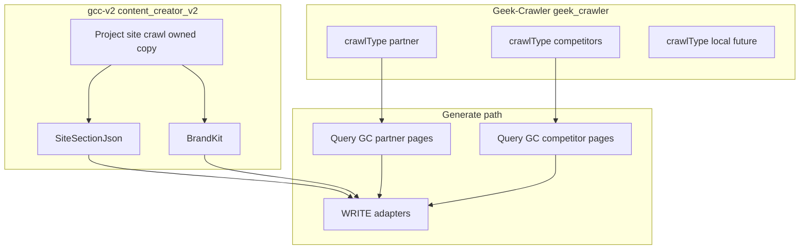

# Crawl architecture

**Correctness over expediency.** When this file conflicts with an older snippet in [`v2-master.md`](./v2-master.md) or [`../architecture.md`](../architecture.md), **this file wins** for crawl boundaries unless the owner overrides in chat.

Hard rules: [`rules.md`](./rules.md) §5, §10.

---

## Three crawl domains

Crawling is **not** one product. Three separate domains share similar engine patterns (mobile Playwright, polite BFS, link extraction) but differ in **who runs the crawl**, **where HTML is stored**, and **what consumes it**.

| Domain | Product / owner | Storage | Typical seeds | Consumed for |
|--------|-----------------|---------|---------------|--------------|
| **Partner / Tools** | Geek-Crawler | PostgreSQL schema `geek_crawler`, `crawlType: "partner"` | Operator tool URLs, partner marketing sites | Tool page blockquotes, extraction, WRITE research excerpts |
| **Competitors** | Geek-Crawler | `geek_crawler`, `crawlType: "competitors"` | Rival URLs from brief `competitorUrls` | Differentiation notes in WRITE — research only, no rival CTAs |
| **Local / regional** (future) | Geek-Crawler | `geek_crawler`, `crawlType: "local"` | Local or South Florida business sites | Standalone Geek-Crawler product scope — **not** Content Creator project grounding |
| **Project site** | **gcc-v2 (owned)** | `content_creator_v2` project-site crawl tables (TBD name) | URL bound to the create / project | `relatedPages`, BrandKit, `siteHierarchy` |

**`partner` = Tools** — one crawl type, one query path. UI copy may say “partner tool URLs”; API and database use `crawlType: "partner"`.

---

## Project site (gcc-v2 owned)

The **project site** is the web property whose crawl grounds a create: real URLs, titles, headings, and excerpts for site section context, plus hierarchy for on-site tool discovery.

- **Today** this is usually the operator’s client property — but that is **not** a permanent rule. Tenancy may later bind other site types to a create; docs and code should say **project site**, not assume “client’s site.”
- **Not** a Geek-Crawler crawl type. Do not store project-site HTML in `geek_crawler`.
- **Copy, not reuse:** port crawl mechanics from Geek-Crawler / gcc-v2 reference code (`GeekCrawlerService` BFS, polite delay, mobile fetch, link extraction) into **`ContentCreatorV2/ProjectSite/*`** (or equivalent namespace). Same patterns, owned tables, owned API routes under `api/geek-content-creator-v2`.
- **Retire Site Analyzer as runtime dependency:** no `HttpGeekSeoSiteAnalyzerClient`, no phi `site-analyzer` analyze/poll path, no `siteAnalysisProfileId` as permanent gate — replace with **project-site run id** + `SiteSectionJson` on the create.

Outputs:

1. **`relatedPages`** → persisted `SiteSectionJson` on create (required for WRITE).
2. **BrandKit** → built from owned project-site crawl facts, not Geek-SEO profiles.
3. **`siteHierarchy`** → mobile heading/link tree on brief for tool preflight and on-site `/tools/…` hrefs.

---

## Geek-Crawler (external crawls)

Geek-Crawler’s **primary purpose** is crawling **external** sites: competitors, partner/tool destinations, and eventually local or regional properties.

| Item | Value |
|------|-------|
| Repo (UI) | `/Users/jeffmartin/development/Geek-Crawler` |
| Engine + data | GeekBackend `GeekAPI/Services/GeekCrawler/*`, `GeekRepository/.../GeekCrawler/*`, schema `geek_crawler` |
| Start crawls | Geek-Crawler UI (or API) — **not** inline during gcc-v2 generate |
| Progress | SignalR `/hubs/geek-crawler-realtime` on GeekAPI |

Full product spec: [`geek-crawler.md`](./geek-crawler.md) and `/Users/jeffmartin/development/Geek-Crawler/plans/geek-crawler.md`.

---

## gcc-v2 reads Geek-Crawler (partner + competitors only)

At **preflight**, **generate**, and **tool spawn**, gcc-v2 **queries** Geek-Crawler — it does **not** re-crawl partner or competitor URLs inline.

1. Resolve seeds from brief (partner tool rows → `partner`; `competitorUrls` → `competitors`).
2. Find a completed run: `GET /api/geek-crawler/crawls/latest?crawlType=…&seeds=…` or list pages for a known `runId`.
3. Extract from `crawl_pages.Html` using owned extractors (`GccV2ArticleHtmlExtractor`, quote helpers) into shapes WRITE already uses (`GccQuoteablePage`, blockquote attribution).
4. **Fail closed** when a required external crawl is missing — surface error to operator (start crawl in Geek-Crawler, then retry).

Phi keeps operator URLs on the brief only — **no** Geek-Crawler BFF or crawl UI in content-creator-v2 `src/`.

---

## Eliminate Content Creator crawl duplication

Geek-Crawler is the **single store** for partner/tool and competitor HTML. Remove duplicate persistence in `content_creator_v2`:

| Storage | Action |
|---------|--------|
| `gcc_v2_tool_source_crawl_runs` / `gcc_v2_tool_source_crawl_pages` | **Dropped** — do not revive |
| `gcc_v2_partner_research_records` | **Delete** after generate reads Geek-Crawler |
| Brief JSON `partnerResearch` / `competitorResearch` as HTML blobs | **Stop writing** at crawl time; prefer run pointers or derive at generate from Geek-Crawler pages only |

**Keep** project-site artifacts: `gcc_v2_creates.SiteSectionJson`, BrandKit rows keyed to project-site run, brief `siteHierarchy` from owned crawl.

**Do not delete** shared writing engines or job tables.

---

**Implementation plan:** [`crawl-implementation.md`](./crawl-implementation.md) — phased build order (A: Geek-Crawler read, B: project-site crawl, C: phi cutover).

---

## Migration direction (code — not yet shipped)



**Reference code to copy (read-only):** `GeekBackend/GeekAPI/Services/GeekCrawler/*`, `GccV2SiteHierarchyService`, `GccV2PageFetcher`, `GccV2SameOriginBfsCrawler` patterns cited in Geek-Crawler plan.

**Bridge to add:** `HttpGeekCrawlerApiClient` (or thin resolver) in `ContentCreatorV2/*` for read-only partner/competitor page fetch — not a second crawl engine in gcc-v2 for those types.

---

## Verification

```bash
# No inline partner crawl tables (after migration)
rg 'gcc_v2_partner_research_records|tool_source_crawl' /Users/jeffmartin/development/GeekBackend

# No Site Analyzer runtime on project-site path (target)
rg 'HttpGeekSeoSiteAnalyzerClient|site-analyzer/analyze' \
  /Users/jeffmartin/development/content-creator-v2/src \
  /Users/jeffmartin/development/GeekBackend/GeekAPI/Services/ContentCreatorV2

# No Geek-Crawler UI in phi
rg -i 'geek-crawler|GeekCrawler' /Users/jeffmartin/development/content-creator-v2/src
```
