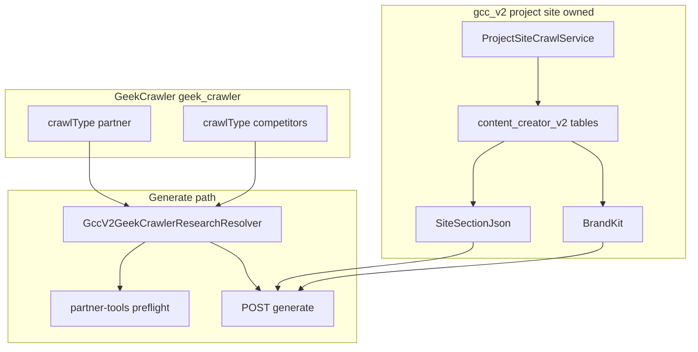

# Crawl architecture — implementation plan

**Correctness over expediency.**

| Doc | Role |
|-----|------|
| [`crawl-architecture.md`](./crawl-architecture.md) | **What** — three crawl domains, boundaries, terminology |
| [`geek-crawler.md`](./geek-crawler.md) | Geek-Crawler ↔ gcc-v2 read contract |
| [`rules.md`](./rules.md) | Hard rules §5, §10 |
| **This file** | **How** — build order, files, verification |

**Scope:** GeekBackend + phi (this repo). No Geek-SEO edits. No Geek-Crawler UI in phi.

**Terminology:** **Project site** = URL bound to a create for grounding (`relatedPages`, BrandKit, `siteHierarchy`). Often a client property today — **not** assumed forever. Do not hard-code “client’s site” in APIs or tenancy.

---

## Target architecture



---

## Build order

| Order | Phase | Delivers |
|-------|-------|----------|
| 1 | **A** — Geek-Crawler read bridge | Partner/tools + competitor excerpts at generate from `geek_crawler`; drop CC duplicate tables |
| 2 | **B** — Owned project-site crawl | Replace Site Analyzer for `relatedPages`, BrandKit, BFS `siteHierarchy` |
| 3 | **C** — Phi cutover | Remove `site-analyzer` BFF + `pollUntilReady`; SignalR for project-site crawl |

Site Analyzer BFF remains **interim** until B + C ship ([`architecture.md`](../architecture.md)).

---

## Phase A — Geek-Crawler read bridge (partner + competitors)

**Goal:** Populate WRITE research from `geek_crawler` without inline polite crawl or Content Creator HTML storage.

### A1. New service (GeekBackend)

Add `GeekAPI/Services/ContentCreatorV2/GeekCrawler/GccV2GeekCrawlerResearchResolver.cs`:

- Inject `HttpGeekCrawlerRepository` (in-process on GeekAPI — not a new public HTTP client).
- **Resolve run:** `GetLatestRunAsync(ownerUserId, crawlType, SerializeSeeds(NormalizeSeeds(urls)))` via `GeekApplication/Models/GeekCrawler/GeekCrawlerSeedNormalizer.cs`.
- **Gate:** `status == "complete"`; else fail closed (“start crawl in Geek-Crawler, then retry”).
- **Load pages:** paginate `ListPagesAsync(runId)`; filter by seed URLs.
- **Extract:** `GccV2ArticleHtmlExtractor.ExtractPartnerPage` → `GccQuoteablePage`.
- **Merge:** `GccV2PartnerUrlResearchService.MergePartnerResearchIntoBriefJson` / `MergeCompetitorResearchIntoBriefJson`.

Seed sources (existing static helpers on `GccV2PartnerUrlResearchService`):

- Partner (`crawlType: "partner"`): `CollectPartnerHrefs` + `CollectOperatorSeedUrls`
- Competitors: `CollectCompetitorHrefs`

Register in `GeekAPI/Services/ContentCreatorV2/ServiceRegistration.cs`.

### A2. Wire generate + preflight

In `GeekAPI/Controllers/ContentCreatorV2/GccV2Controller.cs`:

| Entry point | Change |
|-------------|--------|
| `PreflightPartnerTools` | After hierarchy merge, resolve partner run; merge `partnerResearch` onto brief (optional preview in response) |
| `Generate` | Before `CreateBriefAsync`, resolve partner + competitor runs; merge research onto `rawBriefJson` |

**Gap today:** `GccV2ToolPageSpawnService` reads empty `partnerResearch` — Phase A fixes tool spawn and `GccV2ToolResearchExtractor`.

### A3. Delete Content Creator duplicate storage

| Artifact | Action |
|----------|--------|
| `gcc_v2_partner_research_records` | Migration `DropPartnerResearchRecords` |
| `GccV2PartnerResearchRecordsController` | Remove |
| `HttpGccV2Repository` `GetFreshPartnerResearchAsync` / `CreatePartnerResearchRecordAsync` | Remove |
| `GccPartnerUrlResearchService` (v1) | Keep only if v1 still references; zero V2 call sites |
| Brief `partnerResearch` / `competitorResearch` blobs | Not source of truth — derive at generate from Geek-Crawler (may persist merged slice on brief for child jobs) |

`gcc_v2_tool_source_crawl_*` — already dropped; do not revive.

### A4. Tests

- Resolver unit tests: seed normalization, complete run, missing/incomplete run fail-closed, HTML → `GccQuoteablePage`.
- Location: `GeekBackend.Tests` (mock `HttpGeekCrawlerRepository`).

### Phase A — done when

- [ ] Generate with completed Geek-Crawler `partner` run → non-empty `partnerResearch` on brief; tool spawn extracts quotes.
- [ ] Generate with completed `competitors` run → competitor excerpts in WRITE context.
- [ ] `rg 'GetFreshPartnerResearchAsync|gcc_v2_partner_research'` on GeekBackend → empty after migration.

---

## Phase B — Owned project-site crawl

**Goal:** Replace Site Analyzer as source for `relatedPages`, BrandKit, and full `siteHierarchy` (BFS). Copy Geek-Crawler mechanics; store in `content_creator_v2`.

**Not** a Geek-Crawler `crawlType`. Do not store project-site HTML in `geek_crawler`.

### B1. Schema (`content_creator_v2`)

New tables (mirror `geek_crawler` shape):

- `gcc_v2_project_site_crawl_runs` — `Id`, `OwnerUserId`, `SiteUrl`, `Status`, `SeedUrlsJson`, `HostProgressJson`, timestamps
- `gcc_v2_project_site_crawl_pages` — `RunId`, `Url`, `FinalUrl`, `Html`, `StatusCode`, `RobotsAllowed`, `CrawledAtUtc`
- `gcc_v2_project_site_crawl_links` — optional; BFS resume

Add on `GccV2Create`: `ProjectSiteCrawlRunId` (nullable during migration).

Replace `SiteAnalysisProfileId` on jobs/brief gate with `ProjectSiteCrawlRunId` when cutover complete.

### B2. Engine — copy from Geek-Crawler

New namespace `GeekAPI/Services/ContentCreatorV2/ProjectSite/`:

| Copy from | New owned type |
|-----------|----------------|
| `GeekAPI/Services/GeekCrawler/GeekCrawlerService.cs` BFS loop | `GccV2ProjectSiteCrawlService` |
| `GccV2PageFetcher` | Reuse or fold into project-site fetcher |
| `GccV2HeadingTreeBuilder` | `siteHierarchy` from crawled pages |
| Geek-Crawler worker/wake/recovery | `GccV2ProjectSiteCrawlWorker` + channel wake |

Single seed = normalized project site URL from create.

### B3. Public API (GeekAPI)

Base: `api/geek-content-creator-v2/project-site/`

| Route | Purpose |
|-------|---------|
| `POST /crawl` | Start crawl `{ siteUrl }` |
| `GET /runs/{runId}` | Run snapshot |
| `GET /runs/{runId}/pages` | Pages for section context |
| `GET /runs/latest?siteUrl=` | Reuse prior complete run |

Progress: SignalR on `/hubs/gcc-v2-realtime` (or dedicated event type). **No phi timer polling** ([`rules.md`](./rules.md) §4).

### B4. Section context + BrandKit

| Current | Replace with |
|---------|--------------|
| `GccV2SiteSection.TryBuildSectionContext` from Site Analyzer pages | `relatedPages` from project-site crawl + gap topic |
| `GccV2BrandKitBuilder` + `HttpGeekSeoSiteAnalyzerClient` | BrandKit from owned crawl pages / heading trees |
| `GccV2Controller` `site-analyzer/*` routes | Deprecate; remove after phi cutover |
| `siteAnalysisProfileId` | `ProjectSiteCrawlRunId` |

Merge interim `GccV2SiteHierarchyService` (homepage-only) into project-site BFS; remove standalone `POST site-hierarchy` after phi uses project-site run.

### B5. Generate gate

`GccV2SiteSection.ValidateSiteSectionGate` and `GccV2WriteService` — require `ProjectSiteCrawlRunId` + non-empty `SiteSectionJson.relatedPages` (fail closed).

### Phase B — done when

- [ ] `POST project-site/crawl` → run reaches `complete` or `failed` with SignalR progress.
- [ ] Create with run id → non-empty `relatedPages` on create; BrandKit builds without Site Analyzer.
- [ ] `rg 'HttpGeekSeoSiteAnalyzerClient' GeekBackend/GeekAPI/Services/ContentCreatorV2` → empty.

---

## Phase C — Phi cutover

**Depends on Phase B API.**

### C1. Remove Site Analyzer BFF

Remove `src/app/api/site-analyzer/*` (five routes). Use `src/app/api/gcc-v2/[...path]/route.ts` for `project-site/*`.

### C2. Rewrite create flow

`src/app/creates/new/new-create-form.tsx`:

| Remove | Add |
|--------|-----|
| `pollUntilReady`, `POLL_MS` | SignalR crawl events (pattern: `src/app/auth/job-hub.ts`) |
| `fetchProfilesByDomain`, analyze POST | `POST project-site/crawl` via gcc-v2 BFF |
| `siteAnalysisProfileId` | `projectSiteCrawlRunId` |
| `GET site-analyzer/{id}` | `GET project-site/runs/{runId}/pages` |

Update `src/app/creates/site-section.ts`: rename field; `siteSectionFromCrawlPages(runId, …)`.

Stop sending `siteAnalysisProfileId` on preflight/generate; use run id or persisted `SiteSectionJson` on create.

### C3. Copy cleanup

`src/app/creates/new/site-hierarchy-panel.tsx` — remove Site Analyzer references.

Legacy pages (`src/app/legacy/*`) — display-only; no migration unless needed.

### Phase C — done when

- [ ] `rg 'pollUntilReady|POLL_MS|site-analyzer' src/` → empty (except legacy if kept).
- [ ] New create flow: project-site crawl → brief → preflight → generate without Site Analyzer.

---

## Verification (all phases)

```bash
# Phase A
rg 'GetFreshPartnerResearchAsync|gcc_v2_partner_research' /Users/jeffmartin/development/GeekBackend

# Phase B/C
rg 'site-analyzer/analyze|pollUntilReady|siteAnalysisProfileId' /Users/jeffmartin/development/content-creator-v2/src
rg 'HttpGeekSeoSiteAnalyzerClient' /Users/jeffmartin/development/GeekBackend/GeekAPI/Services/ContentCreatorV2

# Rules
rg 'setInterval|POLL_MS' /Users/jeffmartin/development/content-creator-v2/src

# No Geek-Crawler UI in phi
rg -i 'geek-crawler|GeekCrawler' /Users/jeffmartin/development/content-creator-v2/src
```

**Manual E2E:** project-site crawl → create with `relatedPages`; Geek-Crawler `partner` + `competitors` runs complete → generate → tool blockquotes + competitor differentiation in WRITE.

---

## Out of scope

- Geek-Crawler UI (operator starts external crawls in `/Users/jeffmartin/development/Geek-Crawler`)
- `crawlType: local` (South Florida / regional product scope)
- v1 `GccPartnerUrlResearchService` deletion unless v1 fully retired
- Geek-SEO repo edits

---

## Task checklist

- [ ] **A1** — `GccV2GeekCrawlerResearchResolver` + DI registration
- [ ] **A2** — Wire preflight + generate in `GccV2Controller`
- [ ] **A3** — Drop `gcc_v2_partner_research_records` + repo/API surface
- [ ] **A4** — Resolver unit tests
- [ ] **B1** — Project-site schema + migration
- [ ] **B2** — `ContentCreatorV2/ProjectSite/*` engine + worker
- [ ] **B3** — `project-site/*` GeekAPI routes + SignalR
- [ ] **B4** — `GccV2SiteSection` + `GccV2BrandKitBuilder` from owned crawl
- [ ] **B5** — Replace `siteAnalysisProfileId` gate; deprecate site-analyzer routes
- [ ] **C1** — Remove phi site-analyzer BFF
- [ ] **C2** — Rewrite `new-create-form` + `site-section.ts`
- [ ] **C3** — Copy cleanup
- [ ] **Verify** — rg checks + manual E2E
