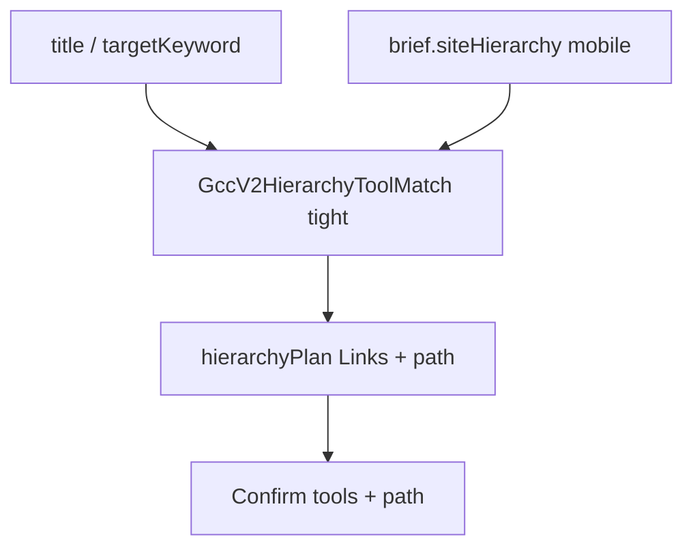

# Fix Confirm partner tools (CC v2 — no bad matcher anywhere)

**Path:** `/Users/jeffmartin/development/content-creator-v2/plan/fix-confirm-partner-tools.md`

## Problem

Confirm shows **Marketing** + social tools (Buffer, Hootsuite, …) for “Smart Chatbots for Marketing”. Wrong use case.

Cause: Content Creator v2 still calls the illogical shared picker:

- `BuildHierarchyMatchesFromTrees` — parent-contains (`…marketing` → Marketing)
- Most-tools-wins ranking
- `ExtractToolsFromTrees` / markdown `toolsInSlice` harvest

That must **not** be used anywhere in Content Creator v2 — not Confirm, not generate, not regenerate-outline, not as a fallback.

## Hard rule (v2)

| Forbidden in all ContentCreatorV2 / GccV2* code | Required |
|--------------------------------------------------|----------|
| `GccGenerateService.BuildHierarchyMatchesFromTrees` | Match on CC `siteHierarchy` |
| `GccGenerateService.ExtractToolsFromTrees` / assignment-markdown tool harvest for partner tools or outline children | Harvest `GccV2HeadingNode.Links` |
| Most-tools-wins / parent-contains ranking | Exact / near-exact heading; depth over richness |
| SA `GetPageSectionTreesAsync` as source of partner-tool or hierarchy-match picks | `brief.siteHierarchy` (mobile crawl) |

**Zero call sites** under ContentCreatorV2 / GccV2* after this work. Soft-fail empty tools if no hierarchy or no tight match — no fallback to the old picker.

BrandKit may keep loading SA trees for **company copy** (`GccV2BrandKitBuilder`) — that is not this picker. This plan does not migrate BrandKit off SA trees; it only guarantees BrandKit never calls the bad match/rank/harvest APIs.

## Cutover (v1 / shared `GccGenerateService`)

Shared methods may remain in `GccGenerateService` for v1 until a **separate cutover**:

- `BuildHierarchyMatchesFromTrees`
- `ExtractToolsFromTrees` / `ExtractToolsFromAssignmentMarkdown` / `ToolsInSlice`
- Related most-tools ranking used by `GccController` hierarchy-match

| Phase | Scope |
|-------|--------|
| **This plan (v2)** | Stop all Content Creator v2 callers. Do **not** delete or rewrite those shared methods yet so v1 keeps compiling and running. |
| **Follow-up cutover** | Migrate v1 hierarchy-match / partner-tool pick to the same tight structured-tree rules (or retire v1), then **remove** the illogical shared picker from `GccGenerateService` so it cannot be called from anywhere. |

“Methods still in the repo for v1” is **not** permission for v2 to call them.

## Known v2 call sites to eliminate

1. `GccV2Controller.TryMergeHierarchyPlanAsync` — Confirm + generate preflight
2. `GccV2Controller.RegenerateOutline` (~L1018) — same bad ranking for `childHeadings`

After this work: `rg BuildHierarchyMatchesFromTrees|ExtractToolsFromTrees` under ContentCreatorV2 / GccV2 must be empty.

## Target flow

## Implementation (this plan)

### 1. `GccV2HierarchyToolMatch` (new)

Under `GeekAPI/Services/ContentCreatorV2/Hierarchy/`:

- Input: `GccV2SiteHierarchy` + seeds (title, targetKeyword).
- Expand lightly: full phrase; one strip of ` for …` / dash. **Do not** peel to a lone vertical word (`Marketing`).
- Score: exact slug/heading (trim `:`) first; near-exact only when both sides have enough tokens (e.g. ≥2) so keyword-contains-parent cannot win.
- Pick: exact > near-exact > deeper path; link count only ties same tier.
- Tools: `Links` on matched node + child tool-list groups (≥2 name+href), structured only — no markdown.
- Output: `matchedHeading`, `path`, `kind`, `childHeadings`, `recommendedTools` `{name,href}`, `matchTopic`.

### 2. Rewire v2 controller

- `TryMergeHierarchyPlanAsync`: deserialize `siteHierarchy` (already on brief from early crawl); run matcher; write `hierarchyPlan`. Soft-fail empty if no hierarchy or no match.
- `RegenerateOutline`: same matcher on brief `siteHierarchy` for `childHeadings`. No SA tree ranking.

### 3. Confirm UI

Show matched **path** (e.g. `… › Marketing › … › Smart Chatbots…`) so wrong parents are obvious.

### 4. Tests

- Fixture: Marketing (social links) + nested Smart Chatbots (chatbot links). Keyword `Smart Chatbots for Marketing` → chatbot tools + chatbot heading — never Marketing social.
- Exact `Marketing` → social (control).
- Assert no forbidden API usage under ContentCreatorV2.

## Out of scope (this plan)

- Editing Geek-SEO
- Deleting shared `GccGenerateService` picker methods (see Cutover follow-up)
- Migrating BrandKit off SA page trees for copy
- Full-site BFS

## Success

Confirm for “Smart Chatbots for Marketing” lists chatbot tools and a path ending on the chatbot heading. No Content Creator v2 code path invokes the old match/rank/markdown harvest.
