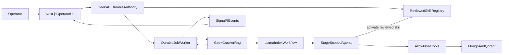

# LlamaIndex Agents with Governed Agent Skills

## Decisions and invariants

- “Llama” means **LlamaIndex**, not Meta Llama models. Keep the current `o1-pro`/`o3` model policy initially; model-provider changes are out of scope.
- **LlamaParse is prohibited.** Do not install, call, proxy, or depend on LlamaParse, LlamaCloud parsing, the LlamaParse MCP server, LlamaParse Agent Skills/plugins, or any hosted parsing API. LlamaIndex must operate only over the existing Geek-Crawler Markdown corpus in MongoDB and Qdrant.
- Implement agents in the existing Python `Geek-Crawler-Rag` service, where LlamaIndex and the citeable workflow already live. Do not add an AI runtime or secrets to the Next.js app.
- Keep GeekAPI’s job worker as the durable outer orchestrator and source of truth for tenancy, retries, approvals, immutable snapshots, events, and persistence.
- Agentize the full `researchPlanning → outline → section → finalSynthesis → validation → repair` pipeline, but retain deterministic stage order and explicit BrandKit/outline approval gates.
- Treat every downloaded Agent Skill as untrusted. Only administrators may import it; publication requires quarantine, deterministic scanning, human review, immutable version/hash pinning, and audit records.
- Initial production skills may contain `SKILL.md`, references, and inert assets. Bundled scripts are preserved for review but **never executed in the application runtime**. A future sandboxed-script capability requires a separate threat model and approval.
- Preserve the current quality rules: no silent model downgrade, no unsupported factual claims, no bypass of citation verification, and no skill authority over model selection, auth, evidence scope, approval gates, or tool permissions.

## Target architecture

The LlamaIndex layer is an inner, stage-bounded execution engine. It may choose among approved tools within a stage, but it cannot reorder the durable workflow, publish content, change models, approve its own output, or mutate jobs directly.

## Phase 1 — Freeze baseline contracts and quality measurements

- Add an architecture decision record documenting the three trust boundaries and the exact meaning of “agent,” “tool,” and “skill” across:
  - [`Geek-Crawler-Rag/src/geek_crawler_rag/generate.py`](/Users/jeffmartin/development/Geek-Crawler-Rag/src/geek_crawler_rag/generate.py)
  - [`GeekBackend/GeekAPI/Services/ContentCreatorV2/Jobs/GccV2JobWorker.cs`](/Users/jeffmartin/development/GeekBackend/GeekAPI/Services/ContentCreatorV2/Jobs/GccV2JobWorker.cs)
  - [`content-creator-v2/architecture.md`](/Users/jeffmartin/development/content-creator-v2/architecture.md)
- Capture golden outputs and metrics from the current bounded specialists before changing execution: citation precision/recall, evidence coverage, brief adherence, unsupported claims, validation pass rate, repair convergence, latency, token use, and editor preference.
- Version the next protocol before implementation: `rag-generate.v3`, `gcc-skill-envelope.v2`, `agent-trace.v1`, and `agent-tools.v1`. Keep v2 compatibility until all services negotiate v3 through `/v1/capabilities`.
- Define explicit limits: maximum agent turns, tool calls, retrieved pages, active skills, skill bytes, resource bytes, repair attempts, stage duration, and total token budget. Exhaustion must fail with a typed reason, never silently degrade.

## Phase 2 — Build the reviewed Agent Skills registry

### Persistence and domain model

Add immutable registry entities and migrations under [`GeekBackend/GeekRepository/Data/ContentCreatorV2DbContext.cs`](/Users/jeffmartin/development/GeekBackend/GeekRepository/Data/ContentCreatorV2DbContext.cs):

- `GccV2SkillPackage`: stable identity, display name, description, source repository, source path, publisher, and lifecycle state.
- `GccV2SkillVersion`: semantic version, immutable Git commit/ref, package SHA-256, manifest digest, license, compatibility, imported/reviewed/published timestamps, reviewer, review notes, and supersession link.
- `GccV2SkillFile`: normalized relative path, media type, byte count, digest, and quarantined content for `SKILL.md`, `references/`, `assets/`, and `scripts/`.
- `GccV2SkillApplicability`: supported stages/content types, order, conflicts, required tools, and activation mode.
- `GccV2SkillReviewFinding`: severity, scanner/rule, file/line, disposition, and reviewer rationale.
- `GccV2SkillAuditEvent`: actor, action, source IP/request ID, before/after state, and timestamp.

### Import and quarantine

- Add admin-only endpoints in a dedicated controller near [`GccV2Controller.cs`](/Users/jeffmartin/development/GeekBackend/GeekAPI/Controllers/ContentCreatorV2/GccV2Controller.cs): import from a GitHub repository URL plus immutable ref and skill path; inspect; approve/reject; publish; deprecate; and list audit history.
- Resolve directory listings such as AgenticSkills to their underlying source repository. Never execute installation commands from a marketplace page in production.
- Download into a temporary quarantine with network timeouts and byte/file limits. Reject path traversal, absolute paths, symlinks, nested archives, archive bombs, binary executables, oversized files, invalid UTF-8 where text is required, and mutable/unresolved refs.
- Validate `SKILL.md` against the open Agent Skills specification: required YAML frontmatter, canonical name, description, optional license/compatibility/metadata, and progressive-disclosure structure.
- Run deterministic static checks over every file for credential access, environment-variable harvesting, network exfiltration, shell/process execution, dynamic code loading, obfuscation, Unicode confusables, instruction override attempts, hidden files, and dependency-install commands.
- Reject skills whose instructions, compatibility metadata, scripts, references, or assets require LlamaParse, LlamaCloud parsing, `LLAMA_CLOUD_API_KEY`, `llama_parse`, `@llamaindex/cloud`, the LlamaParse MCP endpoint, or LlamaParse plugins. There is no exception path through reviewer approval.
- Require a human reviewer to compare the advertised purpose with all instructions/resources, classify requested tools, confirm license compatibility, map allowed stages/content types, and explicitly disposition every high-severity finding.
- Publication creates an immutable package manifest and digest. Editing a published version is prohibited; changes create a new version and repeat review.

### Migrate the current catalog

- Convert the hardcoded definitions in [`GccV2SkillCatalog.cs`](/Users/jeffmartin/development/GeekBackend/GeekAPI/Services/ContentCreatorV2/Generation/GccV2SkillCatalog.cs) into first-party Agent Skills packages while preserving IDs, behavior, versions, order, applicability, conflicts, and current hashes.
- Seed these packages through a migration or idempotent bootstrap so existing jobs remain valid.
- Keep old `gcc-skill-envelope.v1` snapshot validation for historical jobs; new jobs resolve only published v2 packages.

## Phase 3 — Introduce immutable skill snapshots and progressive disclosure

- Replace the hardcoded cross-service hash list in [`Geek-Crawler-Rag/src/geek_crawler_rag/models.py`](/Users/jeffmartin/development/Geek-Crawler-Rag/src/geek_crawler_rag/models.py) with `gcc-skill-envelope.v2` verification.
- At job creation, GeekAPI resolves eligible published skill versions and persists one immutable pre-PLAN snapshot through the existing stage-result mechanism in [`GccV2SkillSnapshotStore`](/Users/jeffmartin/development/GeekBackend/GeekAPI/Services/ContentCreatorV2/Generation/GccV2SkillCatalog.cs). Retries reuse that snapshot unless the operator explicitly starts a new job/version.
- Sign snapshots with a service credential or detached signature. Include catalog version, skill/version IDs, package and file digests, applicability, approved tool IDs, source provenance, resolved timestamp, and snapshot digest. Rotate keys without invalidating stored verification metadata.
- Implement Agent Skills progressive disclosure:
  1. The stage agent initially receives only each eligible skill’s `name`, `description`, version, and activation identifier.
  2. An `activate_skill` tool returns the reviewed `SKILL.md` body and a resource manifest for one skill from the immutable job snapshot.
  3. A `read_skill_resource` tool returns one allowlisted text/reference asset by exact normalized path and digest.
- Serve activation content through authenticated internal GeekAPI endpoints bound to job ID, attempt ID, stage, and snapshot digest. The RAG service must not accept arbitrary URLs or filesystem paths from the model.
- Deduplicate activations per stage, cap activated bytes, preserve activated skill context for that stage, and record every activation/resource read in provenance.
- Keep public selection automatic at first. Admins manage publication; operators can inspect the resolved skill set but cannot inject instructions or unreviewed versions.

## Phase 4 — Implement constrained LlamaIndex tools

Create typed tools in a new `Geek-Crawler-Rag/src/geek_crawler_rag/tools/` package:

- `search_corpus`: wraps existing hybrid/graph retrieval with server-owned run IDs, tenancy scope, filters, and `topK` caps.
- `load_evidence_page`: reads existing Geek-Crawler Markdown directly from an already-authorized Mongo page and returns bounded content plus stable evidence metadata; it performs no document parsing and has no LlamaParse fallback.
- `activate_skill` and `read_skill_resource`: use the immutable registry snapshot described above.
- `get_brief_context`: returns bounded fields from the canonical brief, not arbitrary database access.
- `get_outline_context` and `get_completed_section_summaries`: read only the stage inputs already supplied by GeekAPI.
- `submit_research_plan`, `submit_outline`, `submit_section`, `submit_validation`, and `submit_repair`: terminate with strict Pydantic outputs rather than free-form completion text.

For every tool:

- Use Pydantic schemas with `extra="forbid"`, explicit enums, normalized identifiers, output-size limits, deadlines, cancellation, and structured errors.
- Derive authorization and corpus scope from server context; never trust model-provided tenant, run, job, user, URL, or file-path authority.
- Classify tools as read-only or output-only. No tool may publish, approve, alter a model policy, change a skill snapshot, run shell code, access secrets, or make arbitrary network requests.
- Wrap untrusted corpus and skill text as data with clear boundaries; never let retrieved content register tools, skills, agents, or higher-priority instructions.
- Emit an append-only trace containing tool ID/version, sanitized arguments, result digest/counts, duration, error class, and budget consumption. Do not log secrets or full sensitive content.

## Phase 5 — Replace bounded specialists with stage-scoped LlamaIndex agents

Use LlamaIndex Python `FunctionAgent` instances inside a deterministic custom `Workflow`, rather than unconstrained free-form agent handoffs. This provides real tool-using agents while preserving the product’s required stage order.

- `ResearchAgent`: activates research-relevant skills, plans partner/competitor queries, uses `search_corpus`, requests full evidence pages, and emits a typed evidence manifest with gaps/conflicts.
- `OutlineAgent`: reads the canonical brief and approved evidence, activates applicable structure/content skills, allocates evidence IDs to sections, and returns the existing outline contract.
- `SectionWriterAgent`: writes exactly one approved section, may load only allocated/authorized evidence and relevant skills, incorporates prior-section summaries for anti-repetition, and returns content plus citations.
- `FinalSynthesisAgent`: improves document-wide coherence without introducing new factual claims or dropping citation lineage; it cannot retrieve outside the approved evidence set.
- `ValidationAgent`: reports typed evidence, brief, brand, SEO/GEO, repetition, CTA, and content-type issues. Its judgment is advisory to existing deterministic gates.
- `RepairAgent`: repairs only named validation failures using the cited evidence and bounded skill set, with a strict maximum iteration count.

Refactor [`specialists.py`](/Users/jeffmartin/development/Geek-Crawler-Rag/src/geek_crawler_rag/specialists.py) into agent factories, typed state, and output contracts. Refactor [`generate.py`](/Users/jeffmartin/development/Geek-Crawler-Rag/src/geek_crawler_rag/generate.py) so retrieval, skill activation, agent execution, deterministic citation verification, and final response assembly are separate workflow steps.

Critical controls:

- GeekAPI remains the only component that advances PLAN/WRITE/VALIDATE/REPAIR, pauses for approval, retries stages, or marks a job complete.
- Each RAG call runs one declared stage and one attempt. Agent context is serialized only for crash-safe continuation within that call; approval pauses remain GeekAPI job states.
- Use LlamaIndex structured output models for all terminal results. Reject malformed output rather than heuristically parsing it.
- Retain deterministic `verify_citations` after the agent finishes. Validation must fail unsupported factual output even if the agent claims success.
- Keep existing model-policy selection outside agent control. Tool results and skill instructions cannot request or override a model.
- Include stage/agent/tool/prompt/workflow versions in every response and advertise support through [`/v1/capabilities`](/Users/jeffmartin/development/Geek-Crawler-Rag/src/geek_crawler_rag/app.py).

## Phase 6 — Integrate GeekAPI durable orchestration and persistence

- Extend request/response DTOs in [`GeekBackend/GeekAPI/Services/Rag/RagGenerateModels.cs`](/Users/jeffmartin/development/GeekBackend/GeekAPI/Services/Rag/RagGenerateModels.cs), [`HttpGeekCrawlerRagClient.cs`](/Users/jeffmartin/development/GeekBackend/GeekAPI/Services/GeekCrawler/HttpGeekCrawlerRagClient.cs), and [`GccV2GenerationContracts.cs`](/Users/jeffmartin/development/GeekBackend/GeekAPI/Services/ContentCreatorV2/Generation/GccV2GenerationContracts.cs) with protocol version, signed skill snapshot reference, agent trace summary, activated skills/resources, tool calls, budgets, and typed stop reason.
- Update [`GccV2PlanService.cs`](/Users/jeffmartin/development/GeekBackend/GeekAPI/Services/ContentCreatorV2/Plan/GccV2PlanService.cs), [`GccV2WriteService.cs`](/Users/jeffmartin/development/GeekBackend/GeekAPI/Services/ContentCreatorV2/Write/GccV2WriteService.cs), and [`GccV2ValidateService.cs`](/Users/jeffmartin/development/GeekBackend/GeekAPI/Services/ContentCreatorV2/Validate/GccV2ValidateService.cs) to send stage-scoped v3 contracts and persist the returned agent/skill/tool provenance.
- Extend [`GccV2JobWorker.cs`](/Users/jeffmartin/development/GeekBackend/GeekAPI/Services/ContentCreatorV2/Jobs/GccV2JobWorker.cs) with typed handling for budget exhaustion, skill activation failure, incompatible protocol, invalid structured output, tool denial, evidence failure, and transient upstream failure.
- Add lease heartbeats/cancellation propagation around long agent calls. Retry only safe transient failures; keep attempt IDs and prior traces immutable.
- Persist compact trace summaries in stage results and store verbose traces separately with retention/redaction limits. Never place full hidden prompts, credentials, or unrestricted skill resources in browser-facing payloads.
- Emit additive SignalR events such as `AgentStageStarted`, `AgentToolCompleted`, `SkillActivated`, and `AgentStageCompleted`; preserve existing `OutlineReady`, `SectionDrafted`, `ValidationReport`, and terminal events so old clients remain compatible.

## Phase 7 — Add operator and admin UI surfaces

Keep all frontend calls behind the existing authenticated BFF [`src/app/api/gcc-v2/[...path]/route.ts`](/Users/jeffmartin/development/content-creator-v2/src/app/api/gcc-v2/%5B...path%5D/route.ts).

### Skills catalog and admin review

- Evolve [`src/app/skills/page.tsx`](/Users/jeffmartin/development/content-creator-v2/src/app/skills/page.tsx) to show source, immutable version, package digest, license, compatibility, reviewer, publication status, applicable stages/content types, requested tools, deprecation state, and first-party/community origin.
- Add an authorized `/skills/admin` workflow for source import, quarantine findings, file-by-file inspection, reviewer dispositions, approval/rejection, publish/deprecate, and audit history.
- Clearly label AgenticSkills as discovery metadata and show the underlying source repository/commit as the actual imported artifact.
- Do not offer end-user runtime installation or arbitrary URLs in create requests.

### Create and Canvas

- Keep automatic skill selection in [`new-create-form.tsx`](/Users/jeffmartin/development/content-creator-v2/src/app/creates/new/new-create-form.tsx), but show the resolved bundle/version before job submission and explain that the immutable snapshot is preserved for reproducibility.
- Extend [`rag-contract.ts`](/Users/jeffmartin/development/content-creator-v2/src/app/creates/rag-contract.ts) and [`canvas-types.ts`](/Users/jeffmartin/development/content-creator-v2/src/app/creates/canvas-types.ts) with agent execution, activated-skill, tool-summary, budget, and stop-reason types.
- Update [`canvas.tsx`](/Users/jeffmartin/development/content-creator-v2/src/app/creates/canvas.tsx) and [`workspace-section.tsx`](/Users/jeffmartin/development/content-creator-v2/src/app/creates/workspace-section.tsx) to display stage agent, activated skills, evidence/tool summary, execution status, budget exhaustion, and immutable attempt lineage without exposing hidden prompts.
- Preserve existing model retry, exact edit, citation, validation, publishing, and event-replay behavior.

## Phase 8 — Security, correctness, and evaluation tests

### Geek-Crawler-Rag

Extend [`tests/test_skill_execution.py`](/Users/jeffmartin/development/Geek-Crawler-Rag/tests/test_skill_execution.py) and add focused agent/tool tests for:

- progressive disclosure and deduplicated activation;
- signed snapshot verification, tampering, stale/deprecated versions, resource digest mismatch, and stage/content-type mismatch;
- tool authorization, argument injection, arbitrary URL/path denial, tenant/run substitution, turn/tool/token limits, cancellation, and timeout;
- malicious `SKILL.md`, corpus prompt injection, hidden instructions, script non-execution, and resource-size limits;
- dependency and runtime scans proving no LlamaParse/LlamaCloud package, API hostname, MCP configuration, environment variable, skill/plugin, or fallback path is present;
- strict structured outputs and deterministic citation verification after agent execution;
- retry/repair convergence and trace completeness using fake LLM/tool transports.

### GeekAPI and GeekRepository

- Add migration/repository tests for immutable versions, lifecycle transitions, audit history, unique constraints, and historical v1 snapshot reads.
- Add controller authorization tests proving non-admin users cannot import/review/publish/deprecate skills or read quarantined files.
- Extend `GccV2UnifiedRagTests`, `RagClientContractTests`, and integration stubs for v3 capability negotiation, immutable skill snapshots, typed agent failures, persisted traces, retries, and SignalR events.
- Verify a published skill cannot be edited, a job snapshot cannot change mid-run, and retries retain original provenance.

### Frontend

- Extend [`tests/e2e/fake-platform.mjs`](/Users/jeffmartin/development/content-creator-v2/tests/e2e/fake-platform.mjs) with v2 skills, agent traces, admin roles, lifecycle states, and new events.
- Extend [`tests/e2e/create-flow.spec.ts`](/Users/jeffmartin/development/content-creator-v2/tests/e2e/create-flow.spec.ts) for reviewed catalog details, immutable resolved skills, stage activation display, reconnect/replay deduplication, typed failures, and admin-access denial.
- Add admin E2E scenarios for safe import, blocked malicious archive, review, publish, deprecate, and audit visibility.

### Quality evaluation

- Run old bounded specialists and new agents against the same versioned corpus for every canonical content family.
- Promotion gates: no citation-precision regression; no increase in unsupported claims; equal-or-better brief/brand/structure scores; bounded repair loops; acceptable latency/cost; and human-editor preference above the agreed threshold.
- Record per-stage model, prompt, workflow, tool, skill, and corpus versions so every comparison is reproducible.

## Phase 9 — Deployment and rollout

- Ship database migrations and registry read paths first; seed current first-party skills and verify v1 jobs still render.
- Deploy RAG v3 capability support dark, with v2 as the active protocol.
- Run agent execution in shadow mode on representative jobs: persist evaluation traces but never replace operator-visible output.
- Enable per-stage feature flags in order: research, outline, section writing, validation, repair, final synthesis. Roll back any stage independently to the bounded v2 executor while retaining the same outer job contract.
- After quality/security gates pass, make v3 the default for all content types; retain v2 rollback until a full release window completes.
- Monitor agent/tool failure rate, budget exhaustion, citation rejection, validation failures, repair attempts, latency, token use, skill activations, and model-policy violations. Alert on signature failures, unapproved skill access, cross-scope tool requests, and repeated prompt-injection detections.
- Document operational procedures for key rotation, skill deprecation/revocation, compromised publisher response, trace retention, rollback, and re-running affected content with a new immutable skill snapshot.

## Completion criteria

- Every canonical content type completes the existing create-to-Canvas workflow through stage-scoped LlamaIndex agents.
- GeekAPI remains authoritative for durable state and human approvals; no agent can bypass stage order or mutate protected policy.
- Every production skill is specification-valid, scanned, human-reviewed, published, immutable, hash-pinned/signed, and auditable.
- Skills are progressively disclosed and activated only when applicable; no marketplace script executes in production.
- No deployed component contains or invokes LlamaParse, LlamaCloud parsing, LlamaParse MCP, or LlamaParse skills/plugins; all evidence comes from the existing Geek-Crawler Markdown and LlamaIndex/Qdrant retrieval path.
- All model calls, agent turns, tools, evidence, skills/resources, outputs, retries, and policy versions have reproducible provenance.
- Citation and validation gates remain deterministic, fail closed, and meet or exceed the pre-agent quality baseline.
- The frontend exposes useful status and provenance without receiving secrets, raw hidden prompts, quarantined files, or unrestricted runtime authority.
