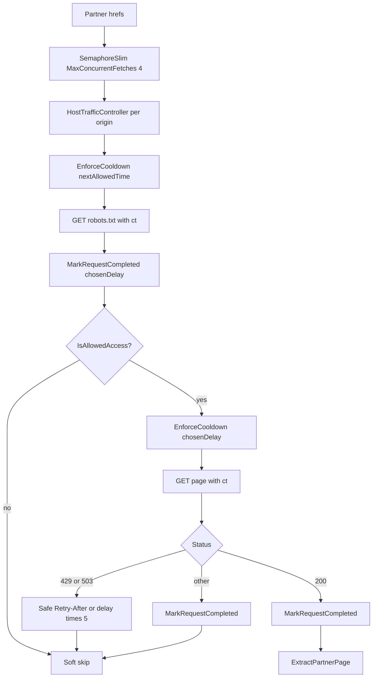

# Polite partner destination crawl

**Path:** `/Users/jeffmartin/development/content-creator-v2/plan/polite-partner-crawl.md`

## Problem

After Confirm, Content Creator v2 fetches partner tool destination URLs via plain `HttpClient` GETs (`GccPartnerUrlResearchService`). That path is bounded (URL cap, concurrency, timeout, honest-ish User-Agent) but is **not** a polite crawl:

- No `robots.txt` check
- No per-host delay / Crawl-delay
- Global concurrency can hit one host hard
- No deliberate 429 / 503 backoff

We need to **crawl** other sites politely, not “scrape.”

## Scope

| In | Out |
|----|-----|
| Partner tool destination fetches only (`GccPartnerUrlResearchService` → HTML extract for `partnerResearch`) | Operator `siteUrl` mobile hierarchy (Playwright) |
| How we **fetch** | Changing WRITE prompt / `partnerResearch` shape |
| Soft-skip blocked or failed URLs | Full multi-page crawl of partner domains (still one URL per confirmed tool) |
| | Site Analyzer |

## Locked decisions

| Question | Decision |
|----------|----------|
| Parse HTML or raw text? | **Parse HTML** — keep `GccArticleHtmlExtractor.ExtractPartnerPage`. |
| Multiple domains simultaneously? | **Yes** — up to **4 concurrent fetches** (`MaxConcurrentFetches`); **serial + delay within a host** via `HostTrafficController`. |
| JS-heavy sites? | **No Playwright** for partner destinations. |
| Default delay | **12s** per host; Crawl-delay → `max(12, Crawl-delay)`. |
| robots missing / unreadable | **Allow (fail-open)** + log under `[partner crawl]`. Fail-closed would drop legitimate research on robots 5xx. |
| Robots NuGet | **`TurnerSoftware.RobotsExclusionTools`**. |
| Turner entry API | **`TryGetEntryForUserAgent(userAgent, out var entry)`** (bool + out). Use `entry.CrawlDelay` when present. |
| Host / robots state lifetime | **Singleton `GccPoliteHostRegistry`** (controllers + robots cache). Typed `GccPoliteCrawler` stays transient via `AddHttpClient`; it **injects** the singleton registry so cooldowns survive across scoped Generate jobs. |
| Cooldown model | Track **`_nextAllowedTime`** (not “last completed + subtract”). See `HostTrafficController` below. |
| Test timing | Inject **`TimeProvider`**. Production spacer = 12s / Crawl-delay. Tests use **50ms** `HostDelayOverride` (not 0ms — must exercise the delay path) and prefer **`FakeTimeProvider`** for deterministic same-host assertions. |
| Retry-After | Delta or Date; **try/catch / safe parse** — malformed header → fall through to `chosenDelay * 5`. Never let header parse kill the job. |
| Cancellation | **`ct` flows through** robots GET, page GET, `WaitAsync`, and `Task.Delay` so a hung robots fetch cannot hold the host semaphore forever. |
| Bot identity | **`geekatyourspotbot/1.0 (+mailto:jeffm@geekatyourspot.com; +https://geekatyourspot.com)`** |
| Persistence | **PostgreSQL / EF Core** table in schema `content_creator_v2` via GeekRepository (not GeekAPI DbContext). |
| WRITE input | Still merge successful extracts onto brief as **`partnerResearch`** JSON (unchanged shape). DB is audit + cache. |
| Re-crawl cache | **Skip live crawl** when a **successful** row for the same `TargetUrl` exists within **24 hours**; reuse `PageJson` for the brief. |
| Failed/blocked rows | Still **persist** (audit). Do not use failed rows as cache hits. |
| Concurrency vs save | Keep **`MaxConcurrentFetches`**; **SaveChanges per URL** inside each fetch task (isolated commits). |

## Core components (implement from this shape)

### Singleton registry + typed crawler

Location: `GeekAPI/Services/ContentCreator/Polite/`

**`GccPoliteHostRegistry`** (singleton):

- `ConcurrentDictionary<string, HostTrafficController> Controllers` keyed by `url.GetLeftPart(UriPartial.Authority)`
- `ConcurrentDictionary<string, RobotsFile?> RobotsCache` (null value = fail-open allow)
- Shared across all crawler instances / Generate scopes in the process

**`IGccPoliteCrawler` / `GccPoliteCrawler`** (typed HttpClient → transient instance, singleton registry injected):

- Honest UA / Accept / Accept-Language on `HttpClient`
- `TimeProvider` for `_nextAllowedTime` math
- Optional test hook: `HostDelayOverride` (50ms in tests) replaces the 12s floor / effective spacer (backoff multipliers still apply to the effective delay)
- `RobotsFileParser` + `FromStringAsync` on body we fetched ourselves (robots traffic uses our client + host lock)

**`GetHtmlAsync(Uri url, CancellationToken ct)` flow (per host lock):**

1. Enter `HostTrafficController.ExecutePolitelyAsync(..., ct)` (SemaphoreSlim 1).
2. **Resolve / load robots (paced):**
   - If cache miss: `EnforceCooldownAsync` (using current default spacer until Crawl-delay known — first contact often no wait), then **`GetAsync(robotsUri, ct)`** with **`ct`**, then **`MarkRequestCompleted(chosenDelaySoFar)`** on **success or fail** (stamp even on failure so the next call cannot burst).
   - Fail-open: cache null, log, continue as allow.
3. If robots present and `!IsAllowedAccess(url, userAgent)` → log soft-skip, return null (**no page GET**).
4. Resolve **`chosenDelay`**: `max(12s, crawlDelay)` from  
   `robotsFile.TryGetEntryForUserAgent(userAgent, out var entry) && entry.CrawlDelay is { } cd`  
   (tests: `HostDelayOverride` substitutes for the effective spacer).
5. **`EnforceCooldownAsync(chosenDelay)`** then page **`GetAsync(url, ct)`**.  
   The spacer between robots completion and page GET uses this same **`chosenDelay`** so robots→page never bursts.
6. **429 / 503:** safe-parse `Retry-After` (Delta or Date in try/catch); else `chosenDelay * 5`; `ApplyExternalCooldown(backoff)`; soft-skip null. Do **not** also `MarkRequestCompleted` after ApplyExternalCooldown.
7. Other non-success / exception → soft-skip null; still stamp via `MarkRequestCompleted(chosenDelay)` so the host stays paced.
8. Success → stamp `MarkRequestCompleted(chosenDelay)`; return HTML for `ExtractPartnerPage` (respect `LimitedReadStream` / `MaxHtmlBytes`).

**Sample-code fixes to apply (do not copy blindly):**

| Sample issue | Fix |
|--------------|-----|
| `lastCompleted + duration` overshoots next wait | Use `_nextAllowedTime` model below |
| Robots GET then page with no stamp after robots | Stamp after robots **success or fail**; page waits `chosenDelay` from that stamp |
| `Console.WriteLine` | `ILogger<GccPoliteCrawler>` |
| Disallow test used origin `/` vs `Disallow: /blocked-path` | Target URI under disallowed path (e.g. `…/blocked-path`) |
| Unlimited HTML read | Keep `LimitedReadStream` / `MaxHtmlBytes` |
| Hung robots without `ct` | Pass `ct` into every robots/page GET and delay |

### `HostTrafficController` (`_nextAllowedTime`)

Do **not** store “last completed in the future.” That makes `elapsed` negative and **`requiredDelay - elapsed` overshoots** after 429 backoff.

```csharp
public sealed class HostTrafficController
{
    private readonly SemaphoreSlim _semaphore = new(1, 1);
    private DateTimeOffset _nextAllowedTime = DateTimeOffset.MinValue;

    public async Task<T> ExecutePolitelyAsync<T>(Func<Task<T>> action, CancellationToken ct)
    {
        await _semaphore.WaitAsync(ct).ConfigureAwait(false);
        try { return await action().ConfigureAwait(false); }
        finally { _semaphore.Release(); }
    }

    public async Task EnforceCooldownAsync(TimeProvider clock, CancellationToken ct)
    {
        var wait = _nextAllowedTime - clock.GetUtcNow();
        if (wait > TimeSpan.Zero)
            await Task.Delay(wait, clock, ct).ConfigureAwait(false);
    }

    /// <summary>After a finished robots/page attempt: next request allowed after chosenDelay.</summary>
    public void MarkRequestCompleted(TimeSpan chosenDelay, TimeProvider clock) =>
        _nextAllowedTime = clock.GetUtcNow() + chosenDelay;

    /// <summary>429/503: next request allowed after backoff (replaces Mark for that attempt).</summary>
    public void ApplyExternalCooldown(TimeSpan duration, TimeProvider clock) =>
        _nextAllowedTime = clock.GetUtcNow() + duration;
}
```

### Parallel orchestration (partner research)

`GccPartnerUrlResearchService.FetchAsync` launches one task per href, gated by **`SemaphoreSlim(MaxConcurrentFetches = 4)`**.

**Naming:** this is **max concurrent fetches**, not unique hosts. Four URLs to the same host can clear the global gate and then **queue** on that host’s `HostTrafficController` (still serial + delay). Per-host politeness is enforced by the controller, not the global semaphore.

### ServiceRegistration wire-up (locked)

```csharp
services.AddSingleton<GccPoliteHostRegistry>();
services.AddSingleton(TimeProvider.System);

services.AddHttpClient<IGccPoliteCrawler, GccPoliteCrawler>(client =>
{
    client.Timeout = TimeSpan.FromSeconds(GccPartnerResearchCaps.FetchTimeoutSeconds); // 15s > 12s delay — OK
    client.DefaultRequestHeaders.UserAgent.ParseAdd(
        "geekatyourspotbot/1.0 (+mailto:jeffm@geekatyourspot.com; +https://geekatyourspot.com)");
    client.DefaultRequestHeaders.Accept.ParseAdd(
        "text/html,application/xhtml+xml,application/xml;q=0.9,*/*;q=0.8");
    client.DefaultRequestHeaders.AcceptLanguage.ParseAdd("en-US,en;q=0.5");
})
.SetHandlerLifetime(TimeSpan.FromMinutes(5));
```

Inject `IGccPoliteCrawler` into `GccPartnerUrlResearchService`. Remove or stop using the old bare PartnerResearch `HttpClient` GET path.

### Caps (`GccPartnerResearchCaps`)

- `DefaultHostDelaySeconds = 12`
- `MaxPerHostConcurrency = 1`
- `MaxConcurrentFetches = 4` (formerly misleadingly named MaxParallelHosts)
- Keep `MaxUrls = 12`, HTML caps, 15s timeout
- Tests: 50ms `HostDelayOverride` via crawler/test ctor — not a production knob unless added later



## Persistence (GeekRepository)

**Not** inject EF into GeekAPI. Add:

### Entity `GccV2PartnerResearchRecord` → table `gcc_v2_partner_research_records`

| Column | Notes |
|--------|--------|
| `Id` | Guid |
| `CreateId` | Required lineage |
| `JobId` | Nullable (often null at generate-before-jobs) |
| `TargetUrl` | Absolute URL crawled |
| `HostDomain` | `uri.Host` |
| `CrawledAtUtc` | When row written |
| `IsSuccess` | True only when extract usable |
| `CrawlStatusLog` | e.g. `Success`, `BlockedByRobots`, `RateLimited`, `CacheHit`, `HttpError`, … |
| `ExtractedTitle` | From extract |
| `PageJson` | Serialized `GccQuoteablePage` on success (for 24h reuse + WRITE) |
| `FlattenedTextContent` | Title + headings + paragraphs joined (lean audit text; **no raw HTML blob**) |

Index: `(TargetUrl, CrawledAtUtc desc)` for fresh lookup.

### Repo routes

- `POST repo/content-creator-v2/partner-research-records` — insert one row
- `GET repo/content-creator-v2/partner-research-records/fresh?targetUrl=&withinHours=24` — latest **successful** row within window, or 404

### Pipeline

1. Check fresh success cache → if hit, use `PageJson`, optionally write a `CacheHit` audit row (or skip write)
2. Else `IGccPoliteCrawler` → extract → persist success/fail row (SaveChanges per URL)
3. Successful pages still merged into brief `partnerResearch`

Persist failures soft: repo errors must not fail Generate.

## Tests

Prefer a **custom `HttpMessageHandler` stub** (no Moq unless already depended).

Required cases (50ms `HostDelayOverride` + shared `GccPoliteHostRegistry` + **`FakeTimeProvider`** where delays are asserted):

1. **Robots Disallow** — `Disallow: /blocked-path`; request `https://partner-a.com/blocked-path` → blocked status; **zero** page GETs; exactly one robots GET.
2. **Same-host delay (deterministic)** — `FakeTimeProvider`; advance clock by override; second GET proceeds.
3. **429 Retry-After** — safe parse + malformed fallback.
4. **Robots fail-open** — robots 500 → allow; stamp applied.
5. **Host B ⟂ Host A cooldown**.
6. **24h cache** — successful prior row → no live page GET; brief still gets page from `PageJson`.

## Implementation todos

- [ ] Polite crawler + DI (`geekatyourspotbot` UA)
- [ ] `GccV2PartnerResearchRecord` + migration + repo controller + `HttpGccV2Repository`
- [ ] `FetchAsync(createId, …)`: cache → crawl → extract → persist; merge brief
- [ ] Tests: robots / delay / 429 / Host B / cache hit

## Non-goals

- Multi-page partner-site crawl
- Changing WRITE prompt shape (still `GccQuoteablePage` list on brief)
- Storing full raw HTML
- Playwright homepage hierarchy politeness (separate)
- Injecting `DbContext` into GeekAPI
