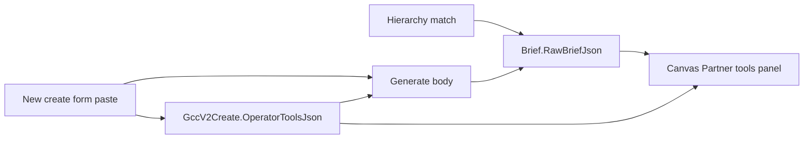

# Save and show Tool URLs

## Problem
- Paste box lives only on [`new-create-form.tsx`](../src/app/creates/new/new-create-form.tsx) and is sent in the Generate body as `brief.operatorTools`.
- Generate already stores crawl tools + paste + `partnerResearch` on the brief’s `RawBriefJson` (`GccV2Controller.Generate` in GeekBackend).
- `GccV2Create` has no tools field; Canvas loads `siteUrl` only — never the brief — so reopen looks like tools were never saved.

## Locked approach
1. **Save paste on the create** (durable before/after Generate).
2. **Keep Generate brief merge** (crawl `recommendedTools` + paste + page research).
3. **Show tools on Canvas** from the latest brief (and create paste as fallback if no brief yet).

## Backend
- Add `OperatorToolsJson` (`text`, nullable) on `GccV2Create` + EF migration; thread through DTO/command/repo create + GET.
- `POST /creates` accepts `operatorTools: [{ name?, url }]`, serializes onto the create.
- On Generate: union create-level tools into `brief.operatorTools` (dedupe by URL), then existing hierarchy + `partnerResearch` merge unchanged.
- Add `GET /creates/{id}/partner-tools` (or include on GET create): returns
  - `operatorTools` from create
  - from latest brief (if any): `recommendedTools`, `operatorTools`, `partnerResearch` URLs/titles
  - merged display list `{ name, url, source: "crawl"|"operator"|"research" }`

## Frontend
- Create form: send `operatorTools` on **create** as well as Generate ([`new-create-form.tsx`](../src/app/creates/new/new-create-form.tsx)).
- Canvas: fetch partner-tools on load; rail section **Partner tools** listing name + link (crawl + paste). Show researched pages as linked titles when present.
- Empty state: “No partner tools on this create yet” (crawl miss + no paste).

## Out of scope
- Editing tools after Generate / re-fetch research on save
- New generate required to change crawl allowlist (still resolved at Generate)

## Verify
- Create with paste → GET create/partner-tools shows paste before Generate.
- After Generate → panel shows crawl hrefs + paste + researched pages.
- Reopen create in Canvas → same list without re-entering URLs.
- Commit + push GeekBackend + content-creator-v2.

## Implementation todos
1. Add `OperatorToolsJson` on `GccV2Create` + migration + DTO/create plumbing
2. Accept `operatorTools` on create; merge into Generate brief; `GET creates/{id}/partner-tools`
3. Create form POST `operatorTools`; Canvas Partner tools panel from partner-tools API
4. Commit and push GeekBackend + content-creator-v2

## FAQ

### Are Tool URLs saved today?
Partially. After **Generate**, crawl tools (`hierarchyPlan.recommendedTools`), pasted tools (`operatorTools`), and fetched page extracts (`partnerResearch`) are stored on the brief’s `RawBriefJson`. They are **not** stored on the create before Generate, and Canvas never loads the brief, so reopen looks empty.

### Why doesn’t opening a create/brief show them?
Canvas only loads create `siteUrl` (and job events). It does not fetch `RawBriefJson`, so saved tools are invisible even when present on the brief.

### What’s the difference between create save and brief save?
| Where | When | What’s stored |
|-------|------|----------------|
| `GccV2Create.OperatorToolsJson` | Create (this plan) | Operator paste only — durable, reopen-safe |
| Brief `RawBriefJson` | Generate (already) | Paste + crawl `recommendedTools` + `partnerResearch` |

### Do I have to paste Tool URLs every time?
No, after this plan: paste once on create; they persist on the create and reappear on Canvas. Crawl tools still come from the site match at Generate (no re-paste needed for those either once Generate has run).

### When are crawl partner tools saved?
At **Generate**, when hierarchy match finds links under the keyword heading. They are not known at create-time. If the keyword doesn’t match, crawl tools stay empty; paste still saves.

### Is partner page research saved?
Yes, on Generate as `partnerResearch` on the brief (full page extracts). This plan **shows** those URLs/titles on Canvas; it does not re-fetch on open.

### Can I edit Tool URLs after Generate?
**Out of scope** for this plan. Display-only on Canvas. Changing paste or re-resolving crawl tools requires a later edit/PATCH feature or a new Generate.

### What if Generate ran without any tools?
Canvas shows the empty state. Paste can still exist on the create after this plan; crawl tools appear only after a Generate that successfully matches hierarchy links.

### Which repos change?
- **GeekBackend** — create column, create/generate merge, partner-tools GET
- **content-creator-v2** — create form POST, Canvas Partner tools panel
