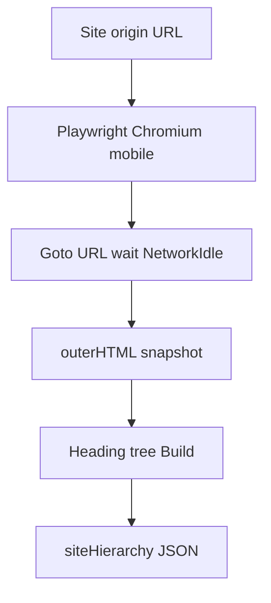

# Content Creator site hierarchy crawl (homepage now, full site later)

## Goal

Produce a **site hierarchy** = nested **heading tree** for the project site, owned entirely by Content Creator (GeekAPI + v2 UX). Cap crawl to the **homepage** today. Design so the same pipeline later crawls the rest of the site (inventory + BFS).

Do **not** call or edit Geek-SEO. Copy crawl + tree-build mechanics into Content Creator as needed. Do **not** port SA’s visibility / twin / parse-tuning layer (no pruning, de-duplication, `data-gsv` rules).

## Crawl scope: mobile only (like Google)

**One viewport only: mobile** (Playwright `Pixel 7` — same class of device Site Analyzer uses; aligned with Google mobile-first indexing).

Site Analyzer already crawls **mobile only**. Content Creator hierarchy crawl does the same. Do **not** add a desktop crawl, and do **not** treat “desktop twin missing from the mobile tree” as a crawl bug.

### Intentional mobile vs desktop differences (not bugs)

Responsive sites keep twin markup (`hidden lg:block` / `block lg:hidden`) with **intentional slight differences** between viewports — for example omitting hero images on mobile. Those differences are product design, not defects in crawl or hierarchy.

| Situation | Verdict |
|-----------|---------|
| Mobile tree omits or simplifies something the desktop twin shows (e.g. hero images, desktop-only Use Cases chrome) | **Expected** — intentional layout difference |
| Same logical section appears twice because both mobile and desktop twins were crawled/merged | **Avoid** — dual crawl causes duplicated content |
| Wrong, missing, or corrupted content **within the mobile render** (broken HTML extract, wrong page, empty tree when mobile DOM has headings, etc.) | **Bug** |

Do **not** crawl desktop in addition to mobile to “fix” intentional twins. Dual crawl produces duplicated headings and links.

Pipeline: **mobile render → HTML → nested heading tree → attach structured JSON.**

Do **not** flatten the hierarchy to markdown/HTML as storage or an intermediate form — that lossy dump cannot recreate the tree (nesting + which links belong to which heading).

## What “heading tree” means

| Field | Meaning |
|--------|--------|
| Level | 1–6 from `h1`–`h6` |
| HeadingText | Heading text |
| Paragraphs | Body under that heading (builder may attach `<p>` / list items as in SA) |
| Links | Anchors on that section (`text` + `href`) — read directly later |
| Children | Deeper headings |

Persist as `siteHierarchy` on the brief. This plan stops at producing and attaching it.

## How Site Analyzer is used here (copy mechanics only)

Reference for Playwright drive + heading outline → nested nodes. Match SA’s **mobile** crawl viewport. Do not copy annotate/prune. Do not invent a desktop hierarchy path.



Concrete pieces (copy into `GeekAPI/Services/ContentCreatorV2/Hierarchy/`):

| Source idea | CC piece |
|-------------|----------|
| Playwright browser holder | `GccV2PlaywrightBrowserHolder` |
| Crawl wait/timeouts + **mobile** context (Pixel 7) | `GccV2CrawlerIdentity` / `MobileContext` |
| Goto + quiescence + HTML snapshot + same-origin links for later BFS | `GccV2PageFetcher` (homepage-only queue first) |
| Heading outline → nested nodes with paragraphs + links | `GccV2HeadingTreeBuilder` |
| Orchestrate homepage → tree → brief | `GccV2SiteHierarchyService` |

## Architecture


### New types

```csharp
record GccV2HeadingLink(string Text, string Href, string Rel = "");
record GccV2HeadingNode(
  int Level,
  string HeadingText,
  IReadOnlyList<string> Paragraphs,
  IReadOnlyList<GccV2HeadingLink> Links,
  IReadOnlyList<GccV2HeadingNode> Children);

record GccV2SiteHierarchy(
  string HomepageUrl,
  string Viewport,           // "mobile"
  DateTimeOffset BuiltAtUtc,
  IReadOnlyList<GccV2PageHierarchy> Pages);

record GccV2PageHierarchy(
  string PageUrl,
  IReadOnlyList<GccV2HeadingNode> Roots);
```

### New services

1. **`GccV2PlaywrightBrowserHolder`** — process-lifetime Chromium; fail closed if browser missing (no HttpClient HTML fallback).

2. **`GccV2CrawlerIdentity`** — wait/timeouts; **`MobileContext()`** (Playwright Pixel 7 + CC bot token). No desktop context for hierarchy.

3. **`GccV2PageFetcher`**
   - `GotoAsync` + wait for render under mobile context
   - Return HTML + final URL + same-origin links (later full-site queue)
   - **Phase 1:** homepage only
   - **Phase 2 hooks (not run):** inventory + BFS

4. **`GccV2HeadingTreeBuilder`** — DOM → nested heading nodes with paragraphs and links. No prune / dedupe / visibility pass.

5. **`GccV2SiteHierarchyService`**
   - Normalize `siteUrl` → homepage
   - Fetch mobile
   - Build roots
   - Return `GccV2SiteHierarchy` with one page
   - Soft-fail: log + empty/null; do not invent hierarchy

### Wire-up

- Register in `GeekAPI/Services/ContentCreatorV2/ServiceRegistration.cs`; lazy or startup `EnsureBrowserAsync`.
- On create and/or partner-tools preflight / generate (when `SiteUrl` present): merge structured `siteHierarchy` onto brief. Prefer once per create unless force-refresh.
- Add `Microsoft.Playwright` to GeekAPI; Dockerfile chromium install like Geek-SEO.

### Frontend

No new operator flow beyond existing site URL on create.

## Phase 1 vs later

| Now | Later (same code path) |
|-----|-------------------------|
| Queue = homepage only | Homepage + sitemap/inventory + BFS |
| One `GccV2PageHierarchy` | Many pages under `Pages` |

Homepage-only is a **fetcher queue** flag (`MaxPages = 1`), not tree-builder logic.

## Tests

- Unit: builder on fixture HTML with nested h2–h6 + paragraphs + links → structured `Text`/`Href`.
- Unit: homepage URL normalization.
- Unit: brief merge round-trips `siteHierarchy` JSON with `viewport: "mobile"`.
- Integration (optional): public homepage **mobile** → non-empty roots when the mobile DOM has headings.

## Out of scope

- Desktop crawl or dual-viewport crawl (duplication; intentional twins are not bugs to “fix”)
- Flattening hierarchy to markdown for storage/retrieval
- Partner tool harvest / Confirm tools / operator excerpt URLs
- Editing Geek-SEO or calling its APIs
- Pruning, de-duplication, visibility twin filtering

## Success

Create with `siteUrl` for geekatyourspot.com → brief has structured `siteHierarchy` (JSON nodes with `links`) from a **mobile** homepage render only. Differences vs a desktop browser view that are intentional twin/layout choices are not treated as failures.

## Implementation todos

1. [x] Playwright browser holder + mobile crawler identity (Pixel 7)
2. [x] Page fetch (goto, wait, HTML, link extract); homepage-only queue
3. [x] Heading tree builder (structured nodes; no prune/dedupe)
4. [x] `GccV2SiteHierarchyService` + brief merge; DI + Dockerfile Playwright
5. [x] Unit tests + optional live mobile smoke (`RUN_HIERARCHY_LIVE=1`)
