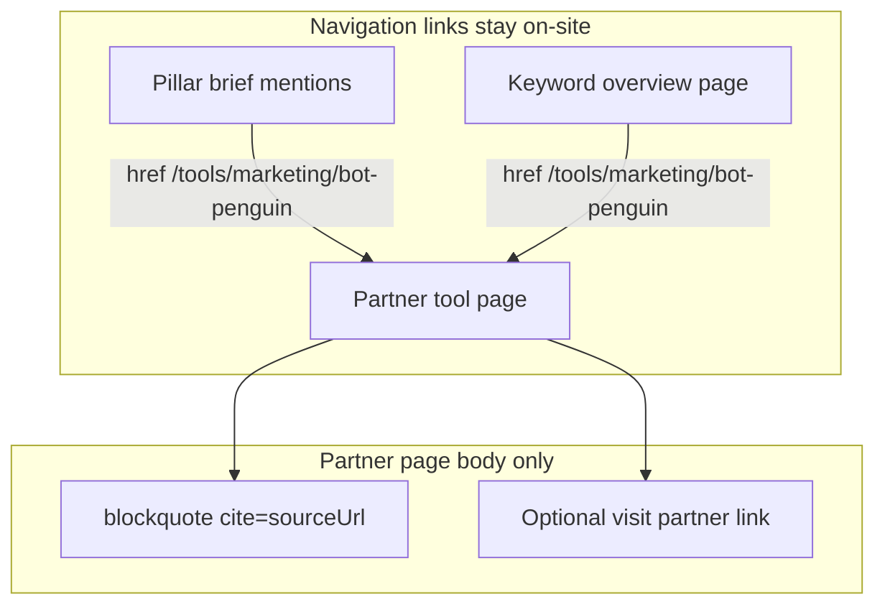

# Tool pages v2 — keyword overview + partner pages

**Path:** `/Users/jeffmartin/development/content-creator-v2/plan/tool-pages-v2.md`  
**Status:** Implemented (Aug 2026). Verify end-to-end on a live create before calling shipped.

**Related:** [`v2-master.md`](./v2-master.md) (§5.7), [`workflow-discrepancies.md`](./workflow-discrepancies.md), [`executor.md`](./executor.md)

**Backend surface:** `GeekBackend/GeekAPI/Services/ContentCreatorV2/ToolPages/*`  
**Frontend surface:** `content-creator-v2/src/app/creates/*`

---

## Agreed outputs

When **Tool page** is checked under Also draft:

| Artifact | Export path | Role |
|----------|-------------|------|
| **Keyword overview** (1 job) | `tools/{keyword-slug}.html` | Use-case page for the target keyword: Overview / Capabilities / Implementation / When to Use **plus** a tools index with **richer per-partner blurbs** and **on-site links** to individual tool pages |
| **Partner tool pages** (N jobs) | `tools/marketing/{tool-slug}.html` each | Full page per partner (BotPenguin, ManyChat, …) — **extract + rewrite** from operator-supplied URL (`partnerResearch`) |
| **Not produced** | — | v1 "Top AI Tools for {keyword}" hub |



---

## Linking and citation rules

| Page | Links to on-site `/tools/…` | External partner URL |
|------|----------------------------|----------------------|
| Pillar | Yes (brief inline) — unchanged | No |
| Keyword overview | Yes (tools index headings/blurbs) | No |
| Partner tool page | N/A (destination) | **Yes** — see blockquote citation below |

This **narrows** [`v2-master.md`](./v2-master.md) L350 ("Operator URLs … never in hrefs") to pillar/keyword navigation — partner page body is the exception.

---

## Partner page source citation — `<blockquote cite="…">`

Each **partner tool page** must attribute the supplied research URL using the HTML **`cite` attribute on `<blockquote>`**, not an inline `<cite>` element:

```html
<blockquote cite="https://botpenguin.com/…">
  <p>Short paraphrased excerpt or summary grounded in extracted research — not a raw crawl paste.</p>
</blockquote>
```

The **`cite` attribute** holds the operator-supplied `sourceUrl`; the **`<p>` inside** holds attributed prose (from `extractedResearch` or a short LLM blurb dedicated to the quote block).

**Why not prompt-only:** The workflow `Section` JSON model has no blockquote type; `SectionHtmlRenderer` only renders `p`, `ol`/`ul`, and run-level `<a>`. `LlmResponseJsonParser` rejects most inline HTML.

**Implementation (copy into v2, do not patch workflow renderer):**

1. **`GccV2ToolSectionRenderer.cs`** (new, copied from `SectionHtmlRenderer`) — v2-only **`SourceBlockquote`** that emits:
   ```html
   <blockquote cite="{sourceUrl}">
     <p>{attributedExcerpt}</p>
   </blockquote>
   <p><a href="{sourceUrl}">Visit {toolName}</a></p>   <!-- optional outbound CTA, separate from blockquote -->
   ```
2. **`GccV2PartnerToolWriteService`** — after the main body LLM sections, **deterministically append** a Sources area containing the blockquote built in code:
   - `cite` attribute = `toolPageTarget.sourceUrl` (HTML-encoded)
   - inner `<p>` text = 1–3 sentences from `extractedResearch.summary` / `whatItDoes`, or a tiny dedicated LLM call for quote-safe paraphrase
3. **`GccV2ToolPagePromptBuilder`** — main body LLM writes paraphrased sections only; **no HTML** in JSON runs. Blockquote attribution is pipeline-owned.
4. **Export** — partner tool HTML uses v2 renderer so `<blockquote cite="…">` survives in `tools/{tool-slug}.html`. Overview and pillar unchanged (no blockquote citation).

**Tests:** `GccV2PartnerToolWriteTests` asserts exported HTML contains `<blockquote cite="{sourceUrl}">` with non-empty inner `<p>`, and optional separate outbound `<a href="{sourceUrl}">`.

---

## Constraint: copy, do not reuse

Copy logic from workflow into new v2-owned files under `GeekBackend/GeekAPI/Services/ContentCreatorV2/ToolPages/`. **Do not** call `IToolPageGenerator`, `ToolPageGenerator`, or `IContentPromptBuilder` tool methods.

Replace stub in `GeekBackend/GeekAPI/Services/ContentCreatorV2/Write/GccV2WriteService.cs` L428–477.

---

## New backend files

| File | Purpose |
|------|---------|
| `GccV2ToolResearchExtractor.cs` | Join `recommendedTools` → operator URL → `partnerResearch`; LLM extract (copy `BuildToolResearchExtractionPrompt` L1450–1464) |
| `GccV2ToolPagePromptBuilder.cs` | Copied prompts: extraction, partner body, partner metadata, overview body, tools-index blurb |
| `GccV2PartnerToolWriteService.cs` | Copy `ToolPageGenerator.GenerateOneToolAsync` L327–394: body → metadata → JSON-LD |
| `GccV2ToolOverviewWriteService.cs` | Keyword use-case framing (not keyword-as-product) + tools index with on-site hrefs + richer blurbs |
| `GccV2ToolPageSpawnService.cs` | Copy spawn pattern from `GccV2ImagePromptSpawnService` |
| `GccV2ToolSectionRenderer.cs` | Copied from `SectionHtmlRenderer` + `<blockquote cite="…">` Sources rendering |
| `GccV2ToolMetadataDraft.cs`, `GccV2ToolPageSchemaBuilder.cs`, `GccV2ToolSlugHelper.cs` | Copied DTO, JSON-LD, slug helpers |

Register in `GeekBackend/GeekAPI/Services/ContentCreatorV2/ServiceRegistration.cs`.

---

## Job lifecycle

**Brief slice** on each tool job:

```json
{
  "toolPageTarget": {
    "kind": "overview" | "partner",
    "name": "BotPenguin",
    "slug": "bot-penguin",
    "onSiteHref": "/tools/marketing/bot-penguin",
    "sourceUrl": "https://…",
    "extractedResearch": { },
    "order": 1
  }
}
```

### Generate — `GccV2Controller.cs` L501–510

When `contentTypes` includes `"tool"`:

- Create **one** job: `contentType: "tool"`, `toolPageTarget.kind: "overview"`, slug = keyword.
- Do **not** create partner jobs here (spawn handles N).
- Remove old keyword-as-product single job behavior.

### Spawn — `GccV2JobWorker.cs` (after `TrySpawnImagePromptsAsync`)

On **pillar** `ready`, if `brief.contentTypes` includes `"tool"`:

1. Resolve partner slots from `recommendedTools` + operator URLs + `partnerResearch` (`CollectPartnerToolRows`).
2. Extract once per partner; attach `extractedResearch` to each job brief.
3. Spawn one job per partner: `kind: "partner"`, `InitialStage: "write"`, idempotent key `(createId, toolSlug)`.
4. **Wake overview job for WRITE** if it is still waiting (overview needs pillar excerpt + shared extraction for tools index).
5. Emit `ToolPageSpawnCompleted`.

### WRITE routing — `GccV2WriteService.cs`

- `kind: "partner"` → `GccV2PartnerToolWriteService`
- `kind: "overview"` → `GccV2ToolOverviewWriteService` (defer WRITE until pillar sibling `ready` + extraction available)
- Zero partners → keyword-only overview fallback (logged warning)

**Partner WRITE:** real tool name, extracted JSON, on-site slug; body LLM for Overview/Capabilities/Implementation/When to Use; **post-append `<blockquote cite="{sourceUrl}"><p>…</p></blockquote>`** plus optional separate **Visit {name}** `<a>`; metadata + `jsonLdSchema` with pillar canonical in `subjectOf`.

**Overview WRITE:** four use-case H2s + H2 "Tools for {keyword}" with H3 `<a href="{onSiteHref}">{name}</a>` and blurb richer than pillar (copy word budgets from workflow pillar platform prompt L878–922); inject pillar excerpt from sibling `ResultJson`; **no external hrefs** in index.

---

## Export / publish

`GccV2HtmlExportService.cs`:

- Partner: `tools/{tool-slug}.html`, canonical `{ToolBaseUrl}/marketing/{tool-slug}`.
- Overview: `tools/{keyword-slug}.html`.
- Fix JSON-LD bug L227–230 (`pillarArticleUrl` must be sibling pillar URL, not tool URL).
- Persist/read `slug`, summary variants, `jsonLdSchema` on `ResultJson`.

Mirror in `GccV2CmsPublishService.cs`.

---

## Frontend (content-creator-v2)

- `src/app/creates/create-draft-tabs.tsx` — partner tabs **"Tool · {name}"**; overview **"Tool page"**.
- `src/app/creates/create-job-hub-provider.tsx` — reload on `ToolPageSpawnCompleted`.
- `src/app/creates/new/new-create-form.tsx` — preflight copy: one full page per partner from supplied URLs, plus keyword overview linking to them.

---

## Tests

- `GeekBackend.Tests/GccV2ToolPageSpawnTests` — spawn count, idempotency, overview wake, skip when tool unchecked.
- `GeekBackend.Tests/GccV2PartnerToolWriteTests` — extract; `<blockquote cite="{sourceUrl}">`; optional outbound visit link; slug; JSON-LD pillar URL.
- `GeekBackend.Tests/GccV2ToolOverviewWriteTests` — on-site index hrefs, no external links, richer blurbs.

---

## Out of scope

- "Top AI Tools" hub page.
- Changing pillar WRITE rules (already on-site `/tools/…`).
- Calling workflow tool generators or prompt builder directly.

---

## Implementation checklist

- [x] Add `ToolPages/` scaffold: prompt builder, extractor, slug helper, metadata DTO, schema builder, section renderer
- [x] `GccV2ToolPageSpawnService` + worker hook after pillar ready
- [x] `GccV2PartnerToolWriteService` (extract, full page, blockquote cite, optional outbound link)
- [x] `GccV2ToolOverviewWriteService` (keyword page + on-site tools index)
- [x] `GccV2Controller` overview job at generate; `GccV2WriteService` routing; remove keyword-as-product stub
- [x] ResultJson + HtmlExport/CmsPublish fixes; draft tabs, hub reload, preflight copy
- [x] Spawn, partner write, overview write tests

---

## Reference snippets to copy (do not import)

| Source | GeekBackend path |
|--------|------------------|
| Partner full page | `GeekAPI/Services/Workflow/Services/ToolPageGenerator.cs` L327–394 |
| Research extraction prompt | `GeekAPI/Services/Workflow/Services/PromptBuilders/ContentPromptBuilder.cs` L1450–1464 |
| Partner body prompt | same file L1350–1417 |
| Tools index blurb | same file L878–922 |
| Spawn pattern | `GeekAPI/Services/ContentCreatorV2/Jobs/GccV2ImagePromptSpawnService.cs` |
| Stub to remove | `GeekAPI/Services/ContentCreatorV2/Write/GccV2WriteService.cs` L428–434 |
