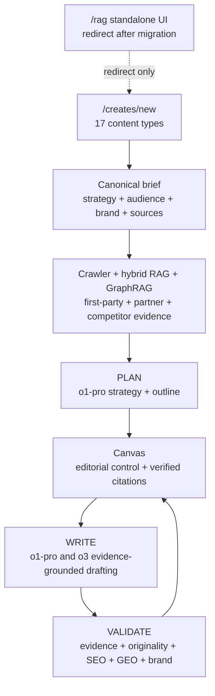

# Unify RAG Into the Canonical Create Pipeline

## Governing Principle

> Use every available signal and the strongest appropriate technology to create the highest-quality content possible, while preserving editorial control and verifiable evidence.

The goal is not merely to add RAG or consolidate two interfaces. The goal is to build the best content creator available: deeply researched, strategically aligned, evidence-grounded, original, useful, brand-correct, channel-appropriate, editable, measurable, and publishable.

Every architectural choice must be evaluated against content quality. Cost, latency, compatibility, and implementation convenience are constraints to manage—not reasons to silently reduce quality.

## A New Unified Product, Informed by History

This is a new unified content-creation implementation built with the knowledge and proven assets of the existing projects. Existing code is reference material and a source of reusable capabilities; it is not an architectural constraint.

The current RAG, crawler, brief, PLAN/WRITE pipeline, Canvas, validation, publishing, and test systems provide valuable history:

Already shipped:

- `Geek-Crawler-Rag`: multi-step citeable `POST /v1/generate`, page Markdown, verified `citations[]`, outline/section stages, GraphRAG, ad templates.
- `GeekBackend/GeekAPI/Services/Rag/RagGenerateService.cs`: intent routing, citeable generate proxy, GraphRAG/template flags.
- `GeekBackend/GeekAPI/Services/ContentCreatorV2/GeekCrawler/GccV2GeekCrawlerResearchResolver.cs`: partner/competitor RAG query excerpts merged into create briefs.
- `content-creator-v2/src/app/rag`: guided writer, citations UI, templates, entity seeds, 7 writing intents.
- `Geek-Crawler-v2/plans/citeable-rag-output.md`: phases 1-4 code-complete; ops backfill/reindex remains.

The new implementation should reuse these capabilities where they meet the governing principle, replace them where they do not, and remove accidental product boundaries after feature parity is proven.

## What Was Done Wrong

Phase C created a second content creation path:

- `/rag`: standalone workbench, 7 intents, no jobs, no Canvas, no 17 content types.
- `/creates/new`: real production pipeline, but only a `RagGenerateFallbackBanner` pointing operators elsewhere.
- `GccV2PlanService`: deterministic template/hierarchy outlines; never calls `RagGenerateService`.
- `GccV2WriteService`: `Provider.CompleteAsync` per section; never calls `RagGenerateService`.
- RAG today enters gcc-v2 only at Generate via `GccV2GeekCrawlerResearchResolver` (`QueryAsync` excerpts -> brief -> WRITE prompts), not citeable generate.
- `GccV2JobWorker` never invokes `/api/rag/generate`.
- `GccV2JobDto.ResultJson` has no citation model; Canvas shows post-job `sourceAttributionHtml` links, not quote-level RAG citations.
- There is no code path from `/rag` output into create/job/Canvas.

That is why there are two ways to create content and why `/rag` feels incomplete.

## Target Architecture

One creation path: `/creates/new` -> `GccV2JobWorker` -> Canvas.

The complete brief is the intelligence contract. RAG becomes the research and evidence engine inside a quality-first PLAN -> WRITE -> VALIDATE pipeline. Models are selected deliberately by stage. Canvas provides editorial control and provenance. RAG is not a separate UI or a soft optional side path.

## Non-Negotiable Principles

1. Content quality is the primary optimization target.
2. The existing brief remains canonical and is expanded rather than discarded.
3. RAG is the evidence engine. PLAN and WRITE use full-page evidence and verified citations, not isolated excerpts.
4. o3 and o1-pro are explicit parts of the writing architecture, not incidental environment values.
5. No silent downgrade or legacy-writer fallback. If a required model is unavailable, the job reports the problem and offers an explicit operator-controlled downgrade.
6. No feature loss. Guided outline editing, entity seeds, ad templates, battlecard, pitch slides, strategy theme, validation, exports, and citations move into one Create/Canvas product.
7. The 17 Creator content types remain canonical. RAG's 7 writing intents become internal retrieval/generation strategies, not a competing UI taxonomy.
8. Every generated factual claim must be traceable to source evidence or explicitly identified as analysis.
9. Human editorial control remains available at the brief, outline, section, validation, and publishing stages.

## The Canonical Brief Is the Quality Contract

The existing brief is one of the most valuable parts of the system. It must drive research, retrieval, planning, drafting, validation, repurposing, and publishing—not be reduced to `writingIntent + topic`.

Preserve and normalize:

- title, target keyword, canonical content type, primary and supporting drafts
- primary intent, audience/buying stage, tone of voice, and brand kit
- project URL, site hierarchy, internal-link opportunities, and crawl run IDs
- partner tools, competitor URLs, partner/competitor crawl runs, and target entities
- PAA questions, required topics, operator instructions, and exclusions
- channel/output requirements, conversion objective, CTA, and publishing destination

Add a versioned backend `GccV2GenerationBrief` assembled once from persisted brief data. PLAN, WRITE, REPAIR, VALIDATE, and remix operations consume this same typed contract so strategy is not lost between stages.

Before PLAN, produce an inspectable research/evidence manifest:

- resolved first-party, partner, competitor, and external sources
- source authority/freshness and crawl/index readiness
- candidate claims and exact quote-level evidence
- evidence gaps, conflicts, and topics requiring operator input
- internal-link and product-proof opportunities

Canvas must expose this manifest and its warnings. Missing required evidence is a visible quality gate, not a reason to generate unsupported prose.

## Explicit Model Strategy: o3 and o1-pro

Model choice is stage-specific and quality-driven. It must be controlled by a versioned model policy rather than scattered environment checks.

Initial policy:

- **o1-pro — deep editorial reasoning:** interpret the full brief, reconcile competing requirements, build the content strategy, create high-stakes long-form outlines, and perform final whole-document editorial synthesis.
- **o3 — agentic evidence work and drafting:** plan retrieval, analyze source sets, allocate evidence to sections, draft citation-grounded sections, repair weak sections, detect contradictions/repetition, and run structured quality reviews.
- **Standard multimodal/fast model — bounded transformations only:** formatting, metadata extraction, deterministic short variants, and image-prompt tasks where evaluation proves no quality regression. It must not silently replace o1-pro or o3 for reasoning-intensive stages.

The exact assignment must be proven through a content-quality evaluation suite using representative briefs and content types. The model policy can promote a newer model only after it meets or exceeds the incumbent on evidence fidelity, strategic alignment, usefulness, originality, brand adherence, structure, and editorial preference.

Implementation requirements:

- Introduce a stage-aware `ContentModelPolicy` shared by GeekBackend and Geek-Crawler-Rag configuration.
- Configure explicit model IDs for research planning, outline, section drafting, repair, validation, and final synthesis.
- Preserve `modelUsed`, model-policy version, prompt version, retrieval strategy, evidence IDs, token use, latency, and warnings on every stage result.
- Support reasoning-model request constraints such as `max_completion_tokens`, omitted temperature, long timeouts, and cancellable durable jobs.
- Never silently fall back from o1-pro/o3 to a cheaper or weaker model.
- Surface the selected model and provenance in Canvas job details.
- Allow an authorized operator to explicitly downgrade the model for a create, job, or failed stage when cost, latency, quota, or availability makes it necessary.
- Add offline bakeoffs and optional shadow runs so newer models can be compared without changing production output.
- Record cost and latency for operational visibility, but optimize routing for quality first.

### Operator-Controlled Model Downgrade UI

Add an advanced **Model policy** control to Create and a **Change model / Retry with another model** action to Canvas.

Create presets:

- **Best quality (recommended):** stage-aware o1-pro + o3 policy.
- **o3 only:** use o3 for all reasoning-intensive text stages.
- **Custom:** authorized operators choose an approved model per stage.

Canvas failure/retry flow:

1. Show the failed or delayed stage, requested model, reason, attempts, and current output status.
2. Offer only models approved for that stage by `ContentModelPolicy`.
3. Show the expected quality tradeoff, capability differences, estimated cost/latency class, and whether the stage will be regenerated.
4. Require explicit confirmation before changing the model.
5. Retry only the affected stage or section; never discard approved work without confirmation.

Persist the selection as an immutable model-policy override on the create/job:

- requested policy and model
- effective model
- operator user ID and timestamp
- reason (`availability`, `quota`, `latency`, `cost`, or operator note)
- replaced attempt ID and retry lineage
- model/prompt/retrieval versions and resulting quality scores

Downgrading must not weaken evidence rules, citation verification, validation gates, or editorial approval. The UI must clearly distinguish **model downgrade** from **quality-standard downgrade**; only the former is permitted.

## Confirmed Integration Points

1. PLAN: Replace deterministic `BuildSectionDefinitions` with RAG `generationStage=outline`; map `outline[].key/heading/brief` into existing `GccV2PlanOutlineSection`.
2. WRITE: Replace `DraftOutlineSectionAsync` LLM calls with RAG `generationStage=section`; parse Markdown into `Section` nodes and attach `RagCitationDto[]` per section.
3. DTOs: Extend WRITE stage `OutputJson` and job `ResultJson` with citations; citations do not exist in gcc-v2 today.
4. UI: Lift `guided-rag-writer.tsx` and `SectionCitations` into Canvas outline/section panels.
5. Mapper: Add `GccV2ContentTypeRagMapper`; no mapping exists today between `content-types.ts` and `RagWritingIntents`.

## Content Type to RAG Mapping

- `pillar`, `blog`, `guide`, `tech-article`, `case-study`, `whitepaper`, `listicle`: LongForm; guided outline + section fill.
- `comparison`, `alternatives`: Battlecard; dual partner/competitor retrieval.
- `ads`, `social`, `email`: ShortForm; ad-template few-shot when indexed.
- PDF (`linkedin-document` legacy identifier): slides; GraphRAG themes when enabled.
- `tool`, `service`, `local`: LongForm; preserve tool-page WRITE extras, but body sections come from RAG.
- `image-prompt`: Specialized visual-brief output derived from the same canonical brief, brand context, and source evidence; validate its fidelity separately from prose.

Brief fields that must feed RAG request assembly:

- `targetKeyword`
- `competitorUrls`
- `operatorTools`
- `primaryIntent`
- `buyingStage`
- `toneOfVoice`
- `paaQuestions`
- project-site crawl run IDs
- partner and competitor crawl run IDs

## Phase 1: Backend RAG Mapper and Request Assembly

Files:

- `GeekBackend/GeekAPI/Services/ContentCreatorV2/...`
- `GeekBackend/GeekAPI/Services/Rag/RagWritingIntents.cs`
- `GeekBackend/GeekAPI/Services/Rag/RagGenerateModels.cs`

Work:

- Add `GccV2ContentTypeRagMapper`.
- Resolve each gcc-v2 content type to a RAG intent/family.
- Add the versioned `GccV2GenerationBrief` and build it from every existing brief field, brand kit, hierarchy, operator input, and resolved crawl run ID.
- Build and persist the pre-PLAN research/evidence manifest.
- Add `ContentModelPolicy` with explicit o1-pro/o3 stage assignments and provenance.
- Add persisted create/job/stage model-policy overrides, authorization, audit fields, and retry lineage.
- Build RAG requests from the canonical generation brief instead of reducing the request to topic and intent.
- Treat RAG readiness as a job prerequisite, not a product fallback banner.

## Phase 2: Backend PLAN Uses RAG Outline

Files:

- `GeekBackend/GeekAPI/Services/ContentCreatorV2/Plan/GccV2PlanService.cs`
- `GeekBackend/GeekAPI/Services/ContentCreatorV2/Jobs/GccV2JobWorker.cs`

Work:

- Call RAG `generationStage=outline` during PLAN.
- Use o1-pro for full-brief strategy and high-value long-form outline reasoning; use the model policy and evaluation result for other content families.
- Map RAG outline sections to `GccV2PlanOutline`.
- Preserve existing outline approval and brand-kit gates.
- Preserve site hierarchy and must-mention logic where it improves the outline.
- Attach planned claims, evidence IDs, content purpose, reader outcome, and section-level success criteria to each outline section.
- Emit existing `OutlineReady` events with added RAG/citation metadata where useful.

## Phase 3: Backend WRITE Uses RAG Sections

Files:

- `GeekBackend/GeekAPI/Services/ContentCreatorV2/Write/GccV2WriteService.cs`
- `GeekBackend/GeekAPI/Services/Workflow/Domain/Entities/ContentDocument.cs`
- `GeekBackend/GeekAPI/Services/ContentCreatorV2/Validate/GccV2ValidateService.cs`

Work:

- For each approved outline section, call RAG `generationStage=section`.
- Use o3 for evidence allocation, citation-grounded drafting, contradiction checks, and section repair; use o1-pro for deep synthesis where the model policy requires it.
- Include full outline and completed section summaries to reduce repetition.
- Convert returned Markdown into existing `Section` / `ContentDocument` structures.
- Attach verified citations to each generated section.
- Rework section rewrite/repair to re-invoke RAG for the target section.
- Keep content-type-specific extras only where they are truly separate from body evidence, such as tool-page metadata or email subject lines.
- Run an o1-pro final editorial synthesis for designated high-value long-form content without weakening or inventing citations.

## Phase 4: Persist and Expose Citations

Files:

- `GeekBackend/GeekAPI/HttpClients/GccV2Dtos.cs`
- `GeekBackend/GeekRepository/Data/Entities/ContentCreatorV2/GccV2Job.cs`
- `GeekBackend/GeekRepository/Data/Entities/ContentCreatorV2/GccV2StageResult.cs`
- `GeekBackend/GeekAPI/Controllers/ContentCreatorV2/GccV2CanvasController.cs`

Work:

- Extend WRITE stage `OutputJson` with `citations[{ pageId, url, title, sectionTitle, quote, crawlType }]`.
- Extend final job `ResultJson` so Canvas can load citations without recomputing.
- Surface citations in Canvas API responses next to sections.
- Add VALIDATE gates for citation integrity, unsupported claims, source conflicts, originality/overlap, brief alignment, brand voice, SEO, GEO, readability, usefulness, CTA quality, and content-type requirements.
- Do not reimplement quote verification in GeekAPI; trust Rag verification and preserve its warnings.
- Persist model/prompt/retrieval versions so every output is reproducible and auditable.

## Phase 5: Frontend Creates and Canvas Become the Only Product Surface

Files:

- `content-creator-v2/src/app/creates/new/new-create-form.tsx`
- `content-creator-v2/src/app/creates/canvas.tsx`
- `content-creator-v2/src/app/creates/canvas-types.ts`
- `content-creator-v2/src/app/rag/guided-rag-writer.tsx`
- `content-creator-v2/src/app/rag/rag-writer-form.tsx`
- `content-creator-v2/src/app/rag/ad-templates.ts`

Work:

- Remove `RagGenerateFallbackBanner`.
- Add RAG status and prerequisites inside the create flow.
- Move entity seeds, template picker, research evidence, and model/status signals into Create/Canvas where relevant.
- Add the advanced Create model-policy selector and Canvas model downgrade/retry workflow.
- Reuse guided outline editing in the Canvas outline approval stage.
- Show verified citations per Canvas section.
- Show which model produced each stage/section, why it was selected, and any evidence or quality warnings.
- Support short-form variations, battlecard output, and slide/theme previews inside the relevant draft/job tabs.

## Phase 6: Retire Standalone RAG UI

Files:

- `content-creator-v2/src/app/rag/page.tsx`
- `content-creator-v2/src/app/rag/rag-writer-form.tsx`
- `content-creator-v2/src/app/page.tsx`
- `content-creator-v2/src/app/creates/page.tsx`
- `content-creator-v2/src/app/api/rag/[...path]/route.ts`

Work:

- Extract reusable RAG UI pieces into a Create/Canvas-owned module.
- Remove standalone RAG navigation links.
- Redirect `/rag` to `/creates/new`, preserving query params where practical.
- Keep `/api/rag/*` BFF routes if Canvas still needs status/templates/entities.
- Remove soft-disable copy that implies RAG is a separate optional product.

## Phase 7: Tests on the Canonical Path

Files:

- `content-creator-v2/tests/e2e/rag.spec.ts`
- `content-creator-v2/tests/e2e/create-flow.spec.ts`
- `GeekBackend/GeekBackend.IntegrationTests/RagClientContractTests.cs`
- `GeekBackend/GeekBackend.IntegrationTests/GeekCrawlerE2ETests.cs`

Work:

- Move RAG browser coverage from `/rag` to `/creates/new` -> job -> Canvas.
- Add backend integration coverage for PLAN calling RAG outline.
- Add backend integration coverage for WRITE calling RAG section generation and persisting citations.
- Test authorized model overrides, explicit confirmation, affected-stage-only retries, audit metadata, and rejection of unapproved models.
- Extend deterministic fake platform/RAG stubs with citeable outline and section responses.
- Keep staging smoke optional for deployed OAuth/RAG/model verification.

## Phase 8: Content-Quality Evaluation and Continuous Improvement

Build a representative, versioned evaluation corpus spanning all 17 content types, weak/strong evidence sets, partner and competitor scenarios, complex briefs, and brand voices.

Score:

- factual and citation accuracy
- evidence coverage and source quality
- brief/intent/audience alignment
- strategic depth and usefulness
- originality and cross-section non-repetition
- brand voice and editorial coherence
- SEO/GEO structure without keyword-driven quality loss
- human editor preference and amount of editing required

Run controlled comparisons for:

- o1-pro versus o3 by stage
- complete generation versus outline/section generation
- hybrid versus GraphRAG retrieval where applicable
- prompt and model-policy revisions

No model, prompt, or retrieval-policy change is promoted solely because it is newer, faster, or cheaper. It must preserve or improve the measured content-quality bar.

## Explicit Non-Goals

- Rebuilding Geek-Crawler-Rag generate.
- Replacing hybrid retrieval or GraphRAG.
- Adding another creation UI.
- Keeping `/rag` as a peer product surface.
- Keeping soft-disable/fallback-to-legacy as an operator-facing behavior.
- Removing any RAG capability from the product.
- Treating the existing brief as legacy data or reducing it to topic/intent.
- Selecting models primarily to minimize cost or latency.

## Success Criteria

- Operators create content only through `/creates/new` -> Canvas.
- All canonical content types are supported by the unified create/job flow.
- The complete canonical brief and evidence manifest drive every generation stage.
- PLAN and WRITE stages invoke RAG generate rather than the standalone `/rag` UI.
- o1-pro and o3 are assigned explicitly by a versioned, stage-aware model policy with no silent downgrade.
- Operators can explicitly downgrade an approved model from Create or Canvas; the choice and reason are audited and visible.
- Model downgrade never disables evidence, citation, validation, or editorial quality gates.
- Canvas shows persisted verified citations per section.
- Canvas exposes model, prompt, retrieval, and evidence provenance.
- Guided outline editing, templates, entity seeds, battlecard, slides, strategy themes, and short-form variations work inside Create/Canvas.
- Quality gates cover evidence fidelity, strategic alignment, originality, brand, SEO/GEO, usefulness, and content-type requirements.
- A representative evaluation suite proves model and pipeline changes improve or preserve content quality.
- `/rag` redirects and no longer appears as a separate creation option.
- E2E tests cover create -> PLAN approval -> WRITE -> citations on Canvas.
