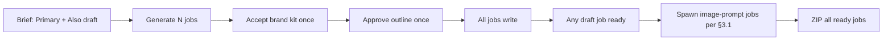

# Content Creator v2 — Master Plan

**Path:** `/Users/jeffmartin/development/content-creator-v2/plan/v2-master.md`  
**Replaces:** `content-creator-v2.md`, `remaining-work.md`, and session Cursor plans for multi-draft/export.

**Related:** [`executor.md`](./executor.md) (build rules), [`workflow-discrepancies.md`](./workflow-discrepancies.md) (v2 vs Content Writer audit — not shipping scope), [`architecture.md`](../architecture.md) (platform map + **copy / call / do not reuse**).

**Correctness over expediency.**

> **End state:** When this plan is complete (§5 multi-draft + §6 verification + §7 cutover), **Content Creator v1 will no longer be accessible** — GeekContentCreator Vercel deployment removed, `api/geek-content-creator/*` routes retired. phi (`content-creator-v2`) is the only product surface. Old v1 creates may remain **read-only** in phi `/legacy` if the owner keeps that path (§7.4); there is no live v1 app to edit or regenerate in.

---

## 1. Product goal

**Generation:** crawl-derived BrandKit + site section context → **PLAN → outline gate → WRITE per section → VALIDATE → REPAIR** → export. v1 is retired when §5–§7 are done (see end-state note above).

Operator flow:

1. Enter project site URL → Site Analyzer crawl → site section (`relatedPages`)
2. New brief (intent, PAA, partner/competitor URLs, Primary + **Also draft**)
3. Confirm partner tools → Generate
4. Accept brand kit **once** → Approve outline **once**
5. All jobs run; each draft type auto-spawns its image-prompt jobs when that job reaches `ready` (§3.1)
6. Export ZIP / Commit to `content-writer-output/`

---

## 2. Isolation (hard rules)

| Forbidden | Replacement |
|-----------|-------------|
| `GeekContentCreator`, v1 `GccController`, `HttpGccRepository` | `ContentCreatorV2/*`, `HttpGccV2Repository` |
| Geek-SEO edits / second crawler | Read-only crawl via Site Analyzer profile |
| Job HTTP polling / worker pending ticker | `NOTIFY gcc_v2_job` + SignalR `/hubs/gcc-v2-realtime` |
| Blank Infobase forms | Crawl-filled BrandKit; operator reviews |

**Allowed additive edits:** `GeekAPI/Program.cs` (`AddContentCreatorV2`, CORS append), `GeekRepository/Program.cs` (V2 DbContext migrate).

Full executor checklist: [`executor.md`](./executor.md). **Copy / call / do not reuse** and full v1 inventory: §7 + [`architecture.md` §8](../architecture.md).

---

## 3. Generation pipeline

```
PLAN  → outline + per-section job (problem | advance | must-mention subset)
      → awaiting_outline_approval (long-form) OR auto-write (short-form)
WRITE → one LLM call per section; BrandKit + allocated research only
VALIDATE → overlap gate + SEO/GEO + guardrails
REPAIR → failed sections only; cap 2 attempts
      → job status `ready`; body stored as ResultJson on the job
EXPORT → read-only: ResultJson → files in ZIP (no LLM) — see below
```

### WRITE vs Export

Two stages, one artifact:

| Stage | When | What happens | LLM? |
|-------|------|----------------|------|
| **WRITE** (plus PLAN / VALIDATE / REPAIR for long-form) | Job is running | Produces and fixes content; persists **`ResultJson`** on the job (`title`, `metaDescription`, `document`, `shipReady`, …) | Yes |
| **Export** | Operator Export / Commit; jobs already **`ready`** | `GccV2HtmlExportService` reads **`ResultJson`** from each job and writes ZIP files (`.html`, `.txt`) | No |

**WRITE** answers what the draft *is*. **Export** answers what files land in `content-writer-output/`. Export does not regenerate prose.

Handoff shape (typical long-form job after VALIDATE):

```json
{
  "title": "…",
  "metaDescription": "…",
  "document": { },
  "shipReady": true,
  "outstandingIssues": false,
  "repairAttempts": 0
}
```

Image-prompt jobs skip VALIDATE; worker sets `writeOnly: true` and goes straight to `ready`. Gaps in the export table below are usually “`ResultJson` is fine, exporter does not render it like Content Writer yet” — not missing WRITE.

### Content types

| Type | Pipeline | How operator gets it |
|------|----------|----------------------|
| Pillar / Blog | Full + outline gate | Primary draft |
| Tool page | Full + outline gate | Also draft checkbox |
| Email / Social / Ads | Short-form; auto-write after brand kit | Also draft checkbox |
| Image prompts | Write-only jobs (§3.1) | Auto-spawned when **any** draft job reaches `ready` — not Also draft, not Re-Purpose |
| Re-Purpose pack | Transform (`GcwRepurposeCatalog`) | Optional Canvas button on **any** ready generate job tab (`pillar`, `blog`, `tool`, `email`, `social`, `ads`); same channel mix for every source type; **not in ZIP** |

### Re-Purpose (channel pack)

**Operator:** optional Canvas button on the **active draft tab** when that job is `ready`.

**Source types (all behave the same):** `pillar`, `blog`, `tool`, `email`, `social`, `ads` — uses that tab's `jobId` and `ResultJson.document` as input. **Not** `image-prompt` jobs (sidecars only).

**Output:** one LLM call → channel variants via `GcwRepurposeCatalog` (LinkedIn, X, email snippet, blog pack, Meta ad, Google ad). Same counts and guidance regardless of whether the source tab is pillar, tool, or social.

**Explicit non-goals:**

- Image prompts — §3.1 spawned jobs only; never bundled in Re-Purpose.
- ZIP / Commit — variants display on Canvas only (ephemeral); export path is the generate jobs, not Re-Purpose output.

**API:** `POST creates/{createId}/transform` with `{ jobId, channels? }`. Requires `jobId` (active tab) and job `ready`. Rejects `image-prompt` and unknown types.

**Operator actions by content type** (Re-Purpose vs image prompts):

| Source `contentType` | Re-Purpose (channel pack) | Image prompts (§3.1 spawn) |
|----------------------|---------------------------|----------------------------|
| `pillar` | Yes — same 6 channels | 1 hero + 1 per H2 (excl. FAQ) |
| `blog` | Yes — same 6 channels | 1 hero + 1 per H2 (excl. FAQ) |
| `tool` | Yes — same 6 channels | 1 companion |
| `email` | Yes — same 6 channels | 1 companion |
| `social` | Yes — same 6 channels | 1 companion |
| `ads` | Yes — same 6 channels | 1 companion |
| `image-prompt` | **No** — sidecar only | N/A (is the prompt job) |

### 3.1 Image prompts

**Operator:** no checkbox. Each spawned prompt is its own `image-prompt` job (Canvas tab + ZIP file).

**Trigger:** `GccV2JobWorker` after **every** generate job reaches **`ready`**: `pillar`, `blog`, `tool`, `email`, `social`, `ads`. Re-Purpose does **not** spawn image prompts.

**Spawn rules** (mirror `ContentDocumentText.BuildSectionTargets` — not Re-Purpose):

| Source `contentType` | `image-prompt` jobs | `sourceType` | `heading` | `order` |
|---------------------|---------------------|--------------|-----------|---------|
| `pillar` | 1 hero + 1 per H2 (excl. FAQ) | `pillar-hero`, `pillar` | title, then section heading | 0, 1…n |
| `blog` | 1 hero + 1 per H2 (excl. FAQ) | `blog-hero`, `blog` | title, then section heading | 0, 1…n |
| `tool` | 1 | `tool` | tool page title | 1 |
| `email` | 1 companion | `email` | subject / title | 0 |
| `social` | 1 companion | `social` | post title / hook | 0 |
| `ads` | 1 companion | `ads` | ad headline / title | 0 |

**Pillar/blog section rule:** One image-prompt job per H2 in `document.sections`, plus the hero. **Exclude** the FAQ section — heading **People Also Ask** (`job: "faq"`). FAQ gets **no** image prompt. H3 children (individual PAA questions) never spawn their own prompts.

**When spawning runs:** Image prompts do **not** wait until every draft on the create is done. Each generate job triggers its own spawn the moment **that** job reaches `ready`:

- **Pillar + Blog** (Primary + Also draft) → two generate jobs. Pillar finishing spawns pillar hero + body H2 prompts; Blog finishing later spawns blog hero + body H2 prompts.
- **All Also draft checked** (pillar primary + blog, tool, email, social, ads) → six generate jobs. Each completion spawns only that type's image prompts from the table above.

**Each spawned job — pipeline**

Image-prompt jobs are **short-form sidecars** (same class as email/social/ads):

1. **PLAN** — one internal placeholder section (`body`). No outline gate. Operator does not approve.
2. **WRITE** — **one** LLM call. Input: source draft `ResultJson` + BrandKit + `imagePromptSection` metadata. Output: figure description JSON (below).
3. **`ready`** — worker saves `ResultJson` and stops. **No VALIDATE, no REPAIR.** Parent pillar/blog/tool already passed those gates; an image prompt is not article prose.

**WRITE output (LLM JSON)**

**Required:** `prompt` (string). Section-aware jobs also require `sourceType`, `heading`, `order` (from spawn metadata). **Not required:** `width`, `height`, or any dimensions — omit if the model does not return them.

Section-aware (pillar/blog hero or H2) — one object per job:

```json
{
  "sourceType": "pillar",
  "heading": "Enterprise AI Implementation Framework",
  "order": 2,
  "prompt": "40–400 word image-generation prompt …",
  "stylePreset": "Illustration",
  "notes": "optional — e.g. no readable text"
}
```

Companion (tool / email / social / ads) — `BuildStandaloneImagePrompt` with source `ResultJson` as `artifactContext`:

```json
{
  "prompt": "…",
  "style": "…",
  "negativePrompt": "…",
  "imageModel": "…",
  "stylePreset": "Illustration",
  "notes": "…"
}
```

Persist on the job: `imagePromptSection` `{ sourceJobId, sourceType, heading, order }` plus the WRITE JSON in `ResultJson` (today's `WriteImagePromptAsync` is wrong — topic-only, no section context).

**Idempotency:** do not respawn the same `(sourceJobId, sourceType, order)`.

**Export — one `.txt` per spawned job**

Plain **prompt text only** — the `prompt` string, nothing else. No JSON wrapper, no key lines, no headings, no settings block, no dimensions. Same as workflow `HtmlExportService.PlainTextOf` (one job → one `.txt`).

| `sourceType` | ZIP path |
|--------------|----------|
| `pillar-hero` | `image-prompts/pillar/{slug}.txt` |
| `blog-hero` | `image-prompts/blog/{slug}.txt` |
| `pillar`, `blog`, `tool` | `image-prompts/sections/{slug}.txt` |
| `email` | `image-prompts/email/{slug}.txt` |
| `social` | `image-prompts/social/linkedin/{slug}.txt` |
| `ads` | `image-prompts/ads/{slug}.txt` |

**Slug:** heroes `{articleSlug}-{sourceType}`; H2s `{articleSlug}-{sourceType}-h2-{headingSlug}`; companions `{articleSlug}-{sourceType}`.

`GccV2HtmlExportService` already emits `.txt` via `PlainTextOf` — §5.2 adds `sourceType` folder routing (today everything goes to `image-prompts/sections/`).

**Canvas:** one tab per `image-prompt` job (heading + metadata + full prompt; export file is prompt text only).

**v1 vs v2**

| | v1 GCC | v2 |
|---|--------|-----|
| When | Same HTTP generate as body | After **each** source job `ready` |
| Long-form | One batch JSON (`GenerateSectionImagePromptsAsync`) | One job per spawn-table row |
| Short-form | Inline attempt; often no-op | One `image-prompt` job per email/social/ads |

**Status:** §5.2 **shipped** — `GccV2ImagePromptSpawnService` on job `ready`; section-aware WRITE; export folder routing + prompt-only `.txt`.

### Export (ZIP paths)

| Job type | Export path |
|----------|-------------|
| pillar | `use-cases/{slug}.html` |
| blog | `blog/{slug}.html` |
| tool | `tools/{slug}.html` |
| email | `email/{slug}.txt` |
| social | `social/linkedin/{slug}.txt` |
| ads | `ads/{slug}.txt` |
| image-prompt | per `sourceType` — §3.1 export table (`pillar/`, `blog/`, `sections/`, `email/`, `social/linkedin/`, `ads/`) |

### Publish triage — where each type lands

Every content type is **persisted** as a `GccV2Job` with `ResultJson` when `ready`. Canvas tabs and the phi DB are the authoring home for **all** types. Shipping differs by type:

| Bucket | `contentType` | Operator action | Durable handoff |
|--------|---------------|-----------------|-----------------|
| **CMS upsert** | `pillar`, `blog`, `tool` | Publish to CMS (draft / live) | `geek_blog.posts` via `IBlogRepository` — **update in place** on republish |
| **Export only** | `email`, `social`, `ads`, `image-prompt` | Export ZIP / Commit | `content-writer-output/` (`.txt`) on GitHub |

**Why not one CMS for everything:** `geek_blog` is for **public site pages** (`post_type`: `Pillar` | `Blog` | `Tool`). Email, social, ads, and image-prompt are **channel sidecars** — copy for ESP/social/ad platforms or image tools, not URLs on geekatyourspot.com. Workflow v1 never CMS-published these; export-only is parity. **Do not** map `email` / `social` / `ads` / `image-prompt` to fake `Blog` posts.

**CMS upsert rules (pillar / blog / tool):**

1. Resolve existing CMS row: prior `GccV2PublishRecord.ExternalPostId` for same `createId` + `contentType`, else `cw_job_id`, else slug → `UpdatePostAsync`; otherwise `CreatePostAsync`.
2. Set `JsonLdOverride` from `ResultJson.jsonLdSchema` (same builders as export).
3. Publish **per job** (`jobId` in request) — not “latest job on create.”
4. `GccV2PublishRecord` remains append-only audit; CMS row is the canonical live/draft artifact.

**Export rules (email / social / ads / image-prompt):**

- Persisted only on the job until Export/Commit — no `geek_blog` row, no `GccV2PublishRecord` unless we add a separate “channel shipped” audit later.
- Future channel adapters (Mailchimp, LinkedIn, ad APIs) are **out of scope** for `geek_blog` upsert.

Routes: `POST creates/{id}/publish` (CMS — pillar/blog/tool only), `GET creates/{id}/export/html`, `POST .../export/html/commit` (all ready jobs).

### Export — HTML and `.txt` behavior

`GccV2HtmlExportService` must match Content Writer `HtmlExportService` / `SectionHtmlRenderer` for each row below.

| Feature | Target | v2 today | Code |
|---------|--------|----------|------|
| JSON+LD in `.html` | `TechnicalArticle` / `BlogPosting` / `SoftwareApplication` embedded via `SectionHtmlRenderer` | `jsonLdSchema: null` always | `GccV2HtmlExportService.cs` L81; `HtmlExportService.cs` L117–122 |
| `<meta>` summary variants | `excerpt`, `mainSummary`, `heroSummary`, `homeSummary`, `blogSummary`, `advertisingSummary`, `tags`, `date` | `slug`, `department`, `keywords` only | `HtmlExportService.cs` L94–108 |
| `keywords` meta | From WRITE metadata `row.Keywords` | Uses **create title** | `GccV2HtmlExportService.cs` L86 |
| Pillar/blog/tool `.html` body | `SectionHtmlRenderer.RenderDocument` | Same renderer | Parity |
| Canonical URLs | Base URL + department + slug | Same pattern | Parity |
| Image `.txt` folder | `pillar/`, `blog/`, `sections/`, `social/facebook`, `social/linkedin` by row type | All → `image-prompts/sections/` | `GccV2HtmlExportService.cs` L153; `HtmlExportService.cs` L164–168 |
| Image `.txt` body | **Prompt string only** (first text paragraph in body) | Heading + prompt + notes (`PlainTextOf` full document) | `HtmlExportService.cs` L136–139; `GccV2HtmlExportService.cs` L106–114 |
| Export approval gate | Can skip unapproved rows | Exports any job with parseable `ResultJson` | `HtmlExportService.cs` L172–178 |
| Inline `section.ImagePrompt` | Secondary `.txt` per embedded prompt in body tree | Not extracted | `HtmlExportService.cs` L181–211 (rarely populated in workflow) |
| Ads export | N/A | `ads/{slug}.txt` | v2-only |
| Open Graph | See below — `SectionHtmlRenderer.AppendOpenGraphAndTwitter` | **Shipped** (`PublisherLogoUrl` → `og:image`) | `SectionHtmlRenderer.cs` L141–162 |
| Twitter / X card | See below — same export pass | **Shipped** (`summary_large_image` when image present) | `SectionHtmlRenderer.cs` L164–177 |

JSON+LD builders (when wired): pillar → `TechnicalArticleSchemaBuilder`; blog → `BlogPostingSchemaBuilder`; tool → `SoftwareApplicationSchemaBuilder`. Persist on `ResultJson`; pass to `SectionHtmlRenderer.RenderDocument`.

**Reference `<head>` snippet (pillar / blog / tool ZIP export)**

Tailor-made for phi → `GccV2HtmlExportService` → `SectionHtmlRenderer.RenderDocument`. Placeholders are **export-time bindings**, not WRITE fields. Implement by passing these arguments to `RenderDocument` (today JSON+LD and several `<meta name>` rows are still gaps — see table above).

| Placeholder | Source |
|-------------|--------|
| `{title}` | `ResultJson.title` (WRITE metadata LLM) |
| `{pageTitle}` | `{title} \| {PublisherName}` — used in `<title>`, `og:title`, `twitter:title` |
| `{metaDescription}` | `ResultJson.metaDescription` (140–160 chars, target keyword) |
| `{keywords}` | `ResultJson.keywords[]` joined — **target**; today export uses create title |
| `{slug}` | `SlugHelper.Slugify(title)` |
| `{canonicalUrl}` | pillar: `{ArticleBaseUrl}/marketing/{slug}` · blog: `{BlogBaseUrl}/marketing/{slug}` · tool: `{ToolBaseUrl}/marketing/{slug}` |
| `{ogType}` | `article` (pillar, blog) · `website` (tool) |
| `{socialImage}` | `CompanyProfileOptions.PublisherLogoUrl` (publisher logo — not per-section hero) |
| `{PublisherName}` | `CompanyProfileOptions.PublisherName` |
| `{AuthorName}` | `CompanyProfileOptions.AuthorName` |
| `{jsonLdSchema}` | **Target:** builder output on `ResultJson` — pillar `TechnicalArticle`, blog `BlogPosting`, tool `SoftwareApplication` |
| `{date}` | Job `CompletedAtUtc` ISO — **target** (workflow export) |
| `{excerpt}` / `{mainSummary}` / … | Tool/pillar summary LLM fields — **target** (workflow export) |

```html
<head>
  <meta charset="utf-8">
  <meta name="viewport" content="width=device-width, initial-scale=1">
  <meta name="robots" content="index, follow">
  <meta name="googlebot" content="index, follow, max-snippet:-1, max-image-preview:large, max-video-preview:-1">

  <title>{pageTitle}</title>
  <link rel="icon" href="{FaviconUrl}">
  <meta name="description" content="{metaDescription}">
  <link rel="canonical" href="{canonicalUrl}">
  <meta name="author" content="{AuthorName}">

  <!-- Open Graph / Facebook -->
  <meta property="og:type" content="{ogType}">
  <meta property="og:title" content="{pageTitle}">
  <meta property="og:description" content="{metaDescription}">
  <meta property="og:url" content="{canonicalUrl}">
  <meta property="og:image" content="{socialImage}">
  <meta property="og:site_name" content="{PublisherName}">
  <meta property="og:locale" content="en_US">

  <!-- Twitter / X -->
  <meta name="twitter:card" content="summary_large_image">
  <meta name="twitter:title" content="{pageTitle}">
  <meta name="twitter:description" content="{metaDescription}">
  <meta name="twitter:image" content="{socialImage}">
  <meta name="twitter:site" content="{PublisherName}">

  <!-- JSON+LD (target — not shipped in v2 export yet) -->
  <script type="application/ld+json">
  {jsonLdSchema}
  </script>

  <!-- Content Writer parity extras (target on additionalMeta) -->
  <meta name="slug" content="{slug}">
  <meta name="department" content="marketing">
  <meta name="date" content="{date}">
  <meta name="keywords" content="{keywords}">
  <meta name="tags" content="{keywords}">
  <meta name="excerpt" content="{excerpt}">
  <meta name="mainSummary" content="{mainSummary}">
  <meta name="heroSummary" content="{heroSummary}">
  <meta name="homeSummary" content="{homeSummary}">
  <meta name="blogSummary" content="{blogSummary}">
  <meta name="advertisingSummary" content="{advertisingSummary}">

  <!-- GTM when CompanyProfileOptions.GtmContainerId is set -->
</head>
```

Omit any tag whose bound value is empty. `twitter:card` falls back to `summary` when `{socialImage}` is missing. Body after `</head>`: `<h1>{title}</h1>` + rendered `ResultJson.document` (lede + sections).

### Partner tools vs competitors

| | Partner tools | Competitors |
|---|---------------|-------------|
| Outline must-mention | `recommendedTools[].name` only | — |
| WRITE inline href | On-site `/tools/…` only | Research only — no rival CTAs |
| Operator URLs | Crawl excerpts only — never in outline or hrefs | Same polite crawl pattern |

---

## 4. Shipped in code (Aug 2026)

These are implemented on `main` (GeekBackend + content-creator-v2):

- [x] `ExtractPartnerToolNames`: recommendedTools names only; no URL crumbs
- [x] WRITE notes: on-site `/tools/` hrefs; dedupe by name; absolutize
- [x] PAA textarea; PLAN+WRITE trailing **People Also Ask**; VALIDATE FAQ repair
- [x] SEO/GEO repair + type-aware scoring; Fix readiness rail
- [x] Competitor URLs → polite crawl → differentiation notes
- [x] `GccV2HtmlExportService` + ZIP + git commit endpoints
- [x] Canvas Export/Commit primary for all job types
- [x] CMS upsert pillar/blog/tool (§5.6); Canvas per-job publish + scope guard
- [x] Creates list shows `jobContentTypes`
- [x] Site hierarchy crawl (mobile Playwright); tight hierarchy tool match; polite partner crawl

---

## 5. Multi-draft workflow (shipped Aug 2026)

Previously broken in production (only Pillar completed; no tabs; no image prompts). Fixes below are implemented on `main`.

| Bug | Root cause | Fix |
|-----|------------|-----|
| Blog/Tool never run | `ApproveOutline` is per-job; siblings stuck at `awaiting_outline_approval` | Cascade outline approve to all siblings (mirror `AcceptBrandKit`) |
| No image prompts | v2 never queues `image-prompt` jobs for any content type (§3.1) | `GccV2ImagePromptSpawnService` on every source job `ready` |
| Tabs missing | `page.tsx` skips job fallback when `?jobId=` in URL | Always load `/jobs`; merge fallbacks |
| Export silent | Skips jobs without `ResultJson`; no feedback | Export summary header + Canvas message |



### 5.1 Cascade outline approval

**File:** `GeekBackend/GeekAPI/Controllers/ContentCreatorV2/GccV2Controller.cs` — `ApproveOutline`

After approving requested job, list siblings on same create. For each in `awaiting_outline_approval`: patch to `write`/`pending`, emit `OutlineApproved` with `viaSibling`, `_wake.Wake`.

### 5.2 Auto image-prompt jobs

**New:** `GccV2ImagePromptSpawnService`  
**Hook:** `GccV2JobWorker` when **any** of `pillar`, `blog`, `tool`, `email`, `social`, `ads` reaches `ready` (spawn table §3.1).

1. Build targets per §3.1 spawn table (`CountTopLevelH2Sections` minus FAQ via `PillarSectionClassifier.IsFaqSectionTitle` or `job === "faq"`; heroes use job title).
2. Skip if `(sourceJobId, sourceType, order)` already spawned.
3. Create one `image-prompt` job per target; persist `imagePromptSection` metadata on brief/job.
4. **WRITE:** one LLM call per job → JSON per §3.1 (section-aware for pillar/blog; standalone + `artifactContext` for tool/email/social/ads). Worker goes straight to `ready` — no VALIDATE.
5. **Export:** `GccV2HtmlExportService` — `sourceType` folder + slug; `.txt` = `prompt` string only (keep `PlainTextOf`; fix folder routing).

**Tests:** pillar (1 hero + N body H2s, FAQ excluded), blog, tool, email, social, ads each spawn expected count; idempotent re-run; ZIP `.txt` paths and plain-prompt body match §3.1.

### 5.3 Fix draft tabs

**File:** `content-creator-v2/src/app/creates/[id]/page.tsx`

- Always fetch `/creates/{id}/jobs`
- Merge single-job fallback when `?jobId=` set
- Show draft strip for all jobs; hint when some not `ready`

### 5.4 Export summary + honest copy

**Backend:** `GccV2HtmlExportService` + `GccV2ExportController` — return `exportedCount`, `totalJobs`, `skipped[]` via `X-GccV2-Export-Summary` header.

**Frontend:** `canvas.tsx`, `new-create-form.tsx`, `content-types.ts` — show export counts; remove "image prompts from Re-Purpose" copy.

### 5.5 Tests

- Outline sibling cascade
- Image-prompt spawn count from sample `ResultJson`
- Export summary counts

### 5.6 CMS upsert (pillar / blog / tool)

**Files:** `GccV2CmsPublishService.cs`, `GccV2PublishController.cs`, `canvas.tsx`

| Task | Target |
|------|--------|
| Upsert not insert | Find existing post → `UpdatePostAsync`; else `CreatePostAsync` |
| Scope guard | Reject `email`, `social`, `ads`, `image-prompt` with clear 400 |
| Per-job publish | Require/pass `jobId`; drop “latest job” default for multi-draft |
| `JsonLdOverride` | Wire schema builders → `ResultJson` → CMS + export |
| Canvas copy | “Publish to site” for pillar/blog/tool tabs; Export for channel types |
| Summary slots | Distinct LLM fields per slot (workflow parity) — not all `metaDescription` |

**Tests:** republish same create+type updates same `externalPostId`; slug collision handled; short-form publish rejected.

---

## 6. Verification gate (required before marking done)

E2E on phi after deploy:

1. New brief — all Also draft checked
2. Generate → brand kit → **one** outline approve
3. Tabs show Pillar · Blog · Tool · Email · Social · Ads · **Image prompt** (one tab per spawned job)
4. Export ZIP contains `.html` + `.txt` (email/social/ads + image prompts) under correct §3.1 folders
5. Export UI reports exported vs skipped counts
6. CMS publish (pillar/blog/tool): republish updates same `externalPostId`; email/social/ads rejected

- [ ] End-to-end verify (deploy + smoke test in production) — **deployed** `582a171` (GeekAPI) + `32aac1d` (phi); operator sign-in required for full §6 flow

**Also required before v1 delete:** §7 inventory complete (Site Analyzer v2 handlers, BFF retarget, C# copies, legacy decision).

---

## 7. v1 dependency inventory & decommission

**Outcome:** Completing this plan **removes Content Creator v1 from production** — no GeekContentCreator URL, no v1 GeekAPI routes for new work. Operators use phi only.

**Canonical taxonomy:** [`architecture.md` §8](../architecture.md) — **copy** (into v2-owned files), **call** (shared engines in-process), **do not reuse** (v1 GCC as permanent runtime).

This section is the **complete inventory** of every v1 touchpoint v2 still has, plus the delete checklist. Executor isolation rules: [`executor.md`](./executor.md).

### 7.0 Blast radius (what breaks if you delete v1)

| You delete… | phi / v2 breaks? |
|-------------|------------------|
| GeekContentCreator **UI** (repo / Vercel) | **No** — phi never calls the v1 website |
| v1 **`api/geek-content-creator/*`** routes only | **No** — retired in GeekAPI (`GccController` removed); phi uses v2 prefix only |
| v1 **C# services** under `Services/ContentCreator` without copying | **Yes** — generate, brand kit, partner/competitor crawl fail |
| v1 **`content_creator` DB** schema | **No** for new v2 creates; **yes** for `/legacy` and old v1 data |
| Geek-SEO / shared Workflow engines | **Yes** — out of scope; v2 **calls** these forever |

**No runtime dependency on v1 Content Brief UI or API** — catalogs live in `brief-catalog.ts`; brief JSON persists in `content_creator_v2.GccV2Brief.RawBriefJson`.

### 7.1 Frontend (phi) — copied from v1 (no runtime v1 call)

These are **one-time copies** from `/Users/jeffmartin/development/GeekContentCreator`. Safe to delete the v1 repo once operators use phi exclusively.

| v2 file | v1 source | Notes |
|---------|-----------|-------|
| `src/app/creates/brief-catalog.ts` | `src/lib/content-creator/brief-catalog.ts` | Verbatim catalogs + `normalizeBrief()` migration |
| `src/app/creates/site-section.ts` | `lib/types.ts` (`SiteSectionContext`) | Shape for `relatedPages` gate |
| `src/app/creates/content-types.ts` | `src/lib/config.ts` (`STARTING_CONTENT_TYPES`) | **Distinct** v2 list — adds `ads`, multi-draft |
| Auth (`src/app/auth/*`, `src/app/api/auth/*`) | v1/GCW **patterns only** | GeekOAuth client `geek-content-creator-v2`; distinct cookies from v1 |
| Site Analyzer UX | `src/app/app/site-analyzer/*` | **Not copied yet** — see §8 Site Analyzer UI |

**OAuth:** v2 is a separate GeekOAuth client. Deleting v1 UI does not affect v2 sign-in. Do not duplicate GeekOAuth itself.

### 7.2 Site Analyzer — BFF → GeekAPI (runtime debt)

phi proxies Site Analyzer through `src/app/api/site-analyzer/*`. Target prefix: `api/geek-content-creator-v2/site-analyzer/*`.

| BFF route | BFF calls today | v2 GeekAPI handler exists? | Status |
|-----------|-----------------|----------------------------|--------|
| `POST .../analyze` | **v2** prefix | **Yes** (`GccV2Controller`) | **Done** |
| `GET .../[id]` | **v2** prefix | **Yes** | **Done** |
| `GET .../section-context` | **v2** prefix | **Yes** | **Done** |
| `GET .../profiles/recent` | **v2** prefix | **Yes** (`GccV2Controller`) | **Done** — BFF retargeted |
| `GET .../profiles/by-domain` | **v2** prefix | **Yes** | **Done** — BFF retargeted |

**v1-only Site Analyzer routes** (not used by phi today; copy when building full Site Analyzer UI in v2):

| v1 route | Purpose |
|----------|---------|
| `GET .../ready` | Nav unlock — has completed crawl |
| `GET .../{id}/gaps` | Content gap list |
| `GET .../{id}/sitemap` | Sitemap artifact |
| `GET .../{id}/page-section-trees` | Nested trees |
| `GET .../profiles/{id}/hierarchy-match` | Keyword → section match |
| `GET .../profiles/{id}/page-contexts` | Page extracts |
| `GET .../profiles/{id}/trees` | TreeJson per page |

**Backend work:** Add handlers on `GccV2Controller` (or `GccV2SiteAnalyzerController`) by **copying** the bodies from v1 `GccController` site-analyzer actions — delegate to the same `HttpGeekSeoSiteAnalyzerClient`, do not edit v1 controller.

**Frontend work:** Finish BFF retarget — `profiles/recent` and `profiles/by-domain` still hit v1 URL despite v2 comments on `recent`.

**Verify:** New brief on phi — URL → analyze → profile status → generate — with v1 `GccController` site-analyzer routes **disabled in staging**.

### 7.3 GeekAPI v2 → v1 C# namespace (runtime debt)

v2 must not permanently `using GeekAPI.Services.ContentCreator` for orchestration. Copy into `Services/ContentCreatorV2/` (or move shared types to a neutral assembly).

| Symbol / type | v1 location | Used in v2 | Action |
|---------------|-------------|------------|--------|
| `ParseSiteSection` | `GccGenerateService` | `GccV2Controller`, `GccV2WriteService` | Copy to `GccV2SiteSection.cs` |
| `ValidateSiteSectionGate` | `GccGenerateService` | `GccV2Controller` (generate) | Copy with `SiteSectionContextDto` |
| `FlattenSections` | `GccGenerateService` | `GccV2BrandKitBuilder` | Copy to v2 helper |
| `HrefLooksLikeOnSiteToolPage` | `GccGenerateService` | `GccV2Controller` (partner tools) | Already duplicated on `GccV2ContextAdapter` — consolidate in v2 |
| `SiteSectionContextDto`, `ContentGapDto` | `GccGenerateService` | `GccV2Controller`, adapters | Copy DTOs to v2 models |
| `GccPartnerUrlResearchService` | `Services/ContentCreator/` | `GccV2Controller`, DI | **Move/copy** entire service + tests to v2 namespace |
| `GccPoliteCrawler` + `IGccPoliteCrawler` + host registry | `Services/ContentCreator/Polite/` | `ServiceRegistration`, partner/competitor crawl | Copy Polite package to v2 |
| `GccArticleHtmlExtractor` | `Services/ContentCreator/` | Used by `GccPartnerUrlResearchService` | Copy with partner research |
| `HttpGeekSeoSiteAnalyzerClient` | `Services/ContentCreator/` (shared client) | `GccV2Controller`, `GccV2BrandKitBuilder` | **Move** to neutral path (e.g. `Services/GeekSeo/`) — both products call Geek-SEO |
| `GccPartnerResearchCaps` | `GeekApplication.Models.ContentCreator` | Polite crawl DI | **Keep** — shared model assembly, not v1 GCC |

**Already copied (not v1 debt):** `GccV2ContextAdapter` (from `BuildMinimalContext`), `GccV2SiteHierarchyService`, realtime hub patterns, export service, job worker.

**Call forever (not blocked by v1 delete):** Workflow `IContentPromptBuilder`, SEO/GEO analyzers, editorial review adapters, `GeekApplication.Models.ContentCreator` research caps/DTOs where shared.

**Verify:** `rg 'using GeekAPI\.Services\.ContentCreator' GeekAPI/Services/ContentCreatorV2` returns zero matches (except adapters that only reference copied DTOs).

### 7.4 Legacy read path (v1 data only — not the v1 app)

After cutover, **v1 is not reachable**. This path is optional **read-only** access to historical creates still stored in the `content_creator` schema — not a substitute for the retired app.

| Layer | Path | v1 dependency |
|-------|------|---------------|
| UI | `src/app/legacy/*` | Read-only list + detail (no edit/regenerate) |
| BFF | `src/app/api/gcc-v2/[...path]` → `legacy/creates` | — |
| API | `GccV2LegacyController` | `HttpGccRepository` → `content_creator` schema |

| Option | When | Effect |
|--------|------|--------|
| **Keep** read-only in phi | Operators still need to **view** old v1 creates | `/legacy` stays; `HttpGccRepository` stays; v1 app still **gone** |
| **Drop** `/legacy` | No need to view old creates | Remove legacy UI + `HttpGccRepository`; optional schema drop after retention |

Document owner choice before delete. **Regardless of option, v1 Content Creator is decommissioned** — no second URL, no v1 generate/revise.

### 7.5 Infra still registered for v1 (GeekAPI `Program.cs`)

Additive v2 registration must stay; v1 blocks below are removed only after §7.2–7.4:

| Registration | Needed for v2 until… |
|--------------|---------------------|
| `HttpGccRepository` | `/legacy` dropped (§7.4) |
| `GccGenerateService`, `GccJobStore` | v1 generate routes removed **and** no v2 imports (§7.3) |
| `HttpGeekSeoSiteAnalyzerClient` | Moved to neutral assembly (§7.3) — **keep the client**, drop v1 folder path |

### 7.6 Delete order (required — after §5 + §6 green)

These steps **take v1 offline**. Do not ship §5 fixes without scheduling §7 unless v1 must stay up temporarily.

1. **GeekAPI:** Copy site-analyzer actions to v2 controller (§7.2 backend table) — deploy Railway
2. **phi BFF:** Retarget remaining v1 URLs (`profiles/recent`, `profiles/by-domain`); confirm analyze/`[id]`/`section-context` hit live v2 handlers — deploy Vercel
3. **GeekAPI:** Copy/move C# helpers (§7.3) — deploy Railway
4. E2E smoke (§6) + Site Analyzer path with v1 `GccController` site-analyzer **off** in staging
5. **Decommission v1 UI:** Remove GeekContentCreator Vercel deployment + archive repo — **v1 no longer accessible in browser**
6. **Decommission v1 API:** ~~Remove `api/geek-content-creator` routes~~ **Done** — `GccController` removed; v2 prefix only
7. Drop `HttpGccRepository` + `/legacy` when §7.4 option = drop
8. Optional: drop `content_creator` schema after data retention policy

---

## 8. Future backlog (not this sprint)

- **Export parity** — close gaps in §3 export table (JSON+LD, meta variants, image `.txt` folder/body, keywords)
- **Site Analyzer UI in phi** — copy v1 `site-analyzer` patterns: URL-first entry, `/site-analyzer` route, section-context handoff, `Writing for:` on Canvas; no optional profile-only create
- **Partner tools on create** — `OperatorToolsJson` on `GccV2Create`, `GET /creates/{id}/partner-tools`, Canvas partner-tools panel (paste survives reopen)
- Backfill image prompts on existing creates (optional repair endpoint)
- Re-Purpose variants in ZIP (non-goal for now)
- Read-only v1 create view — see §7.4 legacy decision
- Remove Groq editorial VALIDATE block; no WRITE stubs on LLM fail

---

## 9. Non-goals

- GEO as ship-ready gate
- Auto-discovering competitors
- Blocking generate on partner/competitor crawl failure
- Persisting Re-Purpose variants in ZIP (jobs only)
- Editing v1 GCC, Geek-SEO, or shared prompt builders
- Keeping Content Creator v1 live after §7 cutover (v1 is retired, not maintained in parallel)

---

## 10. Repos and deploy

| Repo | Deploy | After plan complete |
|------|--------|---------------------|
| `content-creator-v2` | Vercel phi | **Only** Content Creator UI |
| `GeekBackend` (GeekAPI) | Railway → `api.geekatyourspot.com` | `api/geek-content-creator-v2/*` only |
| `GeekContentCreator` | ~~Vercel (v1)~~ | **Removed** — repo archived, Vercel project deleted |

---

## Todos

### Shipped
- [x] Plumbing (#1–2): outline names + on-site links
- [x] PAA → FAQ + VALIDATE repair + scoring
- [x] Competitors crawl
- [x] Export ZIP/Commit + Canvas UI
- [x] Creates list job types

### Active — multi-draft (§5) — shipped
- [x] Cascade outline approval to sibling jobs
- [x] Auto image-prompt jobs (§3.1 + §5.2): spawn for every content type on `ready`, section-aware WRITE, export paths
- [x] Fix draft tabs on create page
- [x] Export summary + fix misleading copy
- [x] CMS upsert pillar/blog/tool + per-job publish + scope guard (§5.6)
- [x] Backend tests for above
- [ ] E2E smoke test on phi

### Active — v1 cutover (§7)
- [x] GeekAPI: copy `analyze`, `GET {id}`, `section-context` to v2 controller (BFF already targets v2)
- [x] phi BFF: retarget `profiles/recent` + `profiles/by-domain` to v2 prefix
- [x] GeekAPI: copy `ParseSiteSection`, `ValidateSiteSectionGate`, `FlattenSections`, DTOs to v2 namespace (`GccV2SiteSection.cs`)
- [x] GeekAPI: move/copy `GccPartnerUrlResearchService` + Polite crawl + `HttpGeekSeoSiteAnalyzerClient` out of v1 folder
- [x] Owner decision: **keep** `/legacy` read-only (§7.4)
- [x] Update `src/app/legacy/*` copy — removed v1 app redirect
- [x] Staging/production deploy: v1 API removed (`582a171` Railway GeekAPI SUCCESS 2026-08-28); phi BFF on v2 (`32aac1d` Vercel Production)
- [ ] Operator E2E: run §6 checklist signed in on https://content-creator-v2-phi.vercel.app
- [x] §7.6 GeekAPI: remove `api/geek-content-creator/*` routes (`GccController` deleted)
- [ ] §7.6 operational: decommission v1 UI — **done** 2026-08-28 (Vercel project `geek-content-creator` removed; GitHub repo archived)
