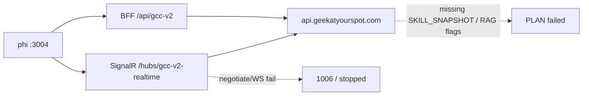
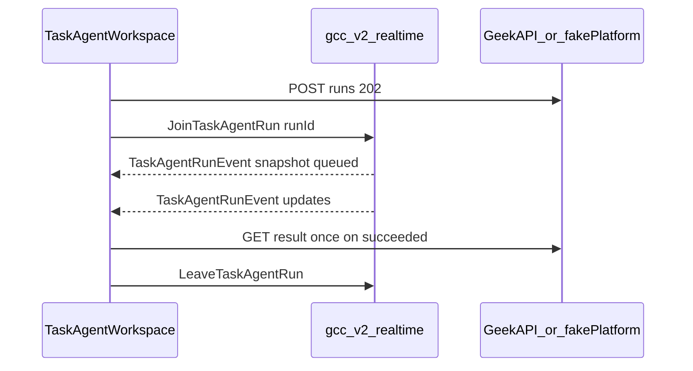
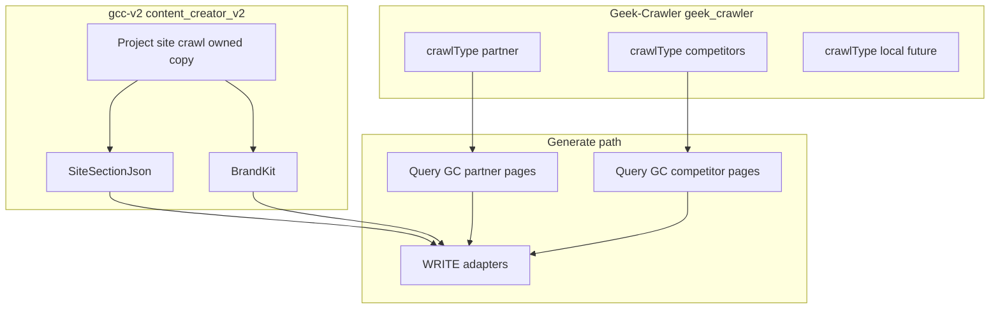
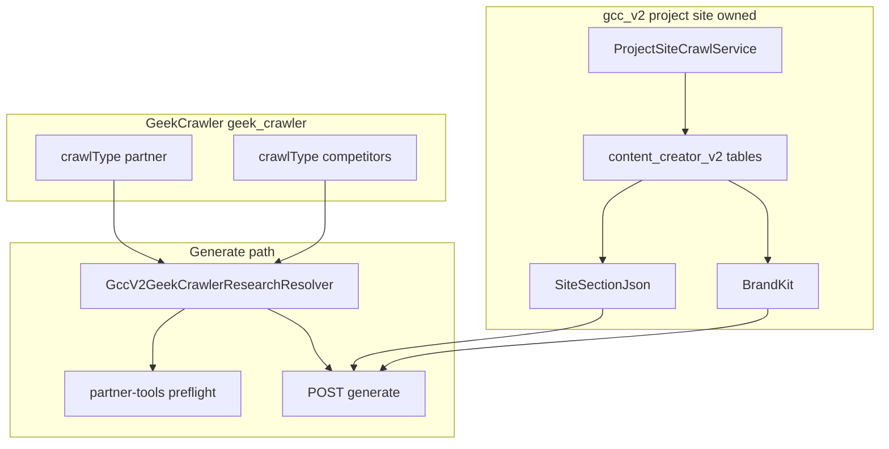
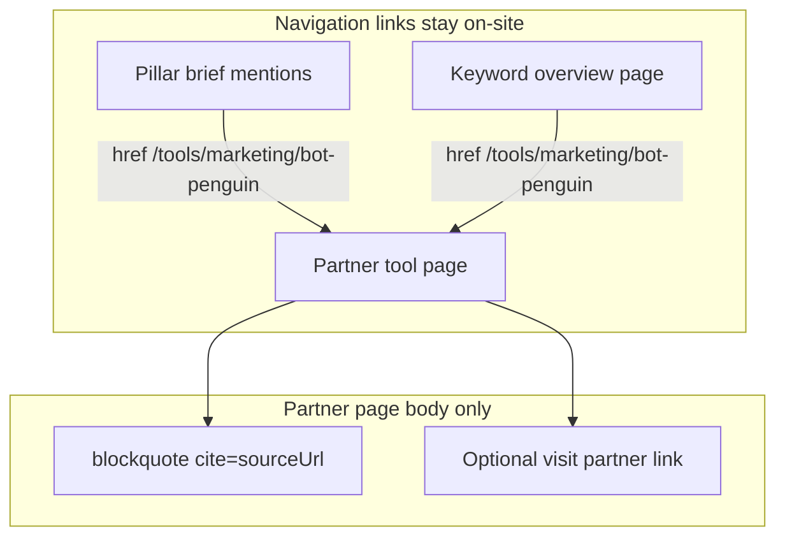
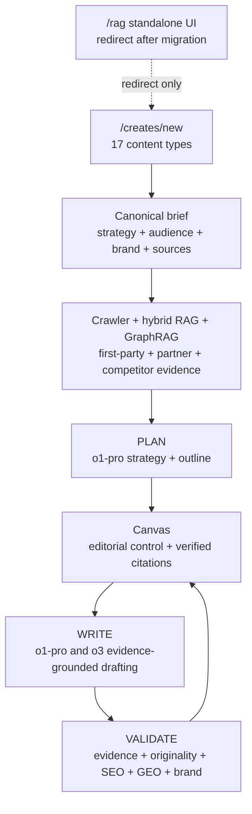
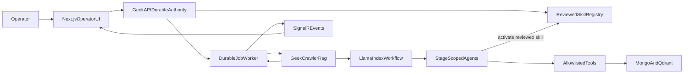
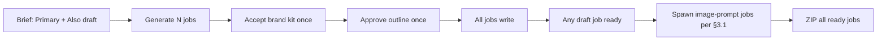

> **ARCHIVED 2026-09-13.** Not the program of record. Living plan: [`../master-plan.md`](../master-plan.md). Tools/partners ≠ competitors — prefer the living plan’s naming table if this dump conflicts.

# Content Creator v2 — Master Plan

**Consolidated:** 2026-09-13 from `content-creator-v2/plans/` (6 docs) and `content-creator-v2/plan/` (15 docs) into this single file. Original directories/files removed after this consolidation — recoverable via `git log` / `git checkout` if needed.

**Status legend:** 🟢 ACTIVE · 🟡 NEAR-DONE · ⚪ HISTORICAL-SHIPPED · ⚫ HISTORICAL-SUPERSEDED · 📘 REFERENCE POLICY

## Table of contents

0. 📘 [Rules](#part-0-rules) — authoritative correctness policy
1. 🟢 [Remaining Jasper work](#part-1-remaining-jasper-work) — product roadmap
2. ⚪ [Fix create PLAN + SignalR errors](#part-2-fix-create-plan--signalr-errors) — production incident, resolved
3. ⚪ [RAG-backed content writing](#part-3-rag-backed-content-writing) — writer implementation history
4. 🟢 [Make Content Creator workable](#part-4-make-content-creator-workable) — active RAG-unification plan
5. 🟡 [Fix code-review findings](#part-5-fix-code-review-findings) — SignalR compliance, near-done
6. 🟢 [Full-app fallback audit + create-wizard UX cleanup](#part-6-full-app-fallback-audit--create-wizard-ux-cleanup) — active, not started, audit section corrected
7. 📘 [Crawl architecture](#part-7-crawl-architecture) — three crawl domains
8. ⚪ [Crawl architecture — implementation plan](#part-8-crawl-architecture--implementation-plan) — shipped
9. 📘 [Executor plan](#part-9-executor-plan) — build sequence
10. 📘 [Geek-Crawler integration](#part-10-geek-crawler-integration) — read boundary
11. ⚪ [Tool pages v2](#part-11-tool-pages-v2) — shipped
12. 📘 [Long-form content types](#part-12-long-form-content-types) — type catalog
13. 📘 [PDF slide deck](#part-13-pdf-slide-deck) — carousel transform
14. 🟢 [PDF as new long-form content type](#part-14-pdf-as-new-long-form-content-type) — proposed, not started
15. 📘 [Workflow discrepancies](#part-15-workflow-discrepancies) — v2 vs Content Writer audit
16. 🟢 [Unify RAG into the canonical create pipeline](#part-16-unify-rag-into-the-canonical-create-pipeline) — target architecture, not started
17. 📚 [Jasper agent research](#part-17-jasper-agent-research) — competitive research
18. 🟢 [LlamaIndex agents with governed agent skills](#part-18-llamaindex-agents-with-governed-agent-skills) — proposed architecture
19. ⚫ [v2-master (superseded)](#part-19-v2-master-superseded) — kept for historical reference only; `jasper-remaining-work.md` (Part 1) is current authority

---

<a id="part-0-rules"></a>
## Part 0 — Rules 📘 REFERENCE POLICY

**Correctness over expediency.**

Authoritative rules for **content-creator-v2** (phi), executors, and agents. When this file conflicts with an older plan snippet, **this file wins** unless the owner overrides in chat.

| Doc | Role |
|-----|------|
| **This section** | Hard rules — pass/fail |
| Part 9 (Executor) | Build sequence for phi |
| Part 19 (v2-master, superseded) | Product scope and cutover |
| Part 11 (Tool pages v2) | Tool page generation |
| Part 7 (Crawl architecture) | Three crawl domains — project site vs Geek-Crawler |
| Part 8 (Crawl implementation) | Phased build — Geek-Crawler read, project-site crawl, phi cutover |
| Part 10 (Geek-Crawler integration) | Geek-Crawler ↔ gcc-v2 read boundary |
| **Geek-Crawler-Rag** | Separate repo: `/Users/jeffmartin/development/Geek-Crawler-Rag` — corpus RAG; phi **consumes** only |
| `architecture.md` (repo root, not consolidated here) | Platform map, copy / call / do not reuse |

---

### 1. Workspace and repos

| Rule | Detail |
|------|--------|
| **Phi workspace** | `/Users/jeffmartin/development/content-creator-v2` only — app at repo root, not `web/`, `frontend/`, or sibling `GeekContentCreatorV2` |
| **Preserve** | `plan/` and `architecture.md` at repo root — **note:** `plan/` and `plans/` are now consolidated into this single file per the master-plan directive; this "preserve" rule predates that consolidation |
| **Geek-Crawler** | **Separate repo:** `/Users/jeffmartin/development/Geek-Crawler` — not inside GeekBackend, **not** in content-creator-v2 `src/` |
| **Geek-Crawler-Rag** | **Separate repo:** `/Users/jeffmartin/development/Geek-Crawler-Rag` — Python + Qdrant over Mongo `geek_crawler`; **not** in phi `src/`, **not** a GeekAPI feature |
| **Do not invent repos** | No new sibling products without owner approval |

---

### 2. Isolation — zero diffs where forbidden

Fail any change that touches:

| Forbidden path | Notes |
|----------------|-------|
| `/Users/jeffmartin/development/GeekContentCreator` | v1 UI — **zero diffs** unless owner documents a one-line scoped exception |
| `GeekAPI/Controllers/ContentCreator` (non-V2), `Services/ContentCreator`, `HttpGccRepository.cs` | v1 API |
| `GeekRepository` Content Creator (non-V2) tables/controllers | v1 data |
| **Geek-SEO** hubs / crawlers | **Read-only** from v2 — no edits |

**Allowed additive GeekBackend edits:** `ContentCreatorV2/*`, `HttpGccV2Repository`, additive `Program.cs` / CORS / migrations for schema `content_creator_v2` only.

---

### 3. Correctness — no silent failures

- Jobs must reach **`ready`**, **`failed`** (with error), or an explicit **`awaiting_*`** state — never **`pending`** forever.
- **Fail closed** when **project grounding** fails: missing brief, empty `relatedPages`, failed project-site crawl gate — surface errors to the operator.
- **External partner/competitor research (Geek-Crawler):** **notify and skip** — append `partnerResearchWarnings`, generate continues. Never block generate or expose Geek-Crawler page-limit / operator config changes from Content Creator. See Part 7 (Crawl architecture).
- **No silent fallbacks:** do not substitute guessed data, blank forms, or "good enough" success when a **required project-site** step failed.
- **No timer polling as a fallback** when SignalR or push fails — fix hub/reconnect; do not add `setInterval` "just in case."

---

### 4. Realtime — push, not poll

**Forbidden in phi `src/`:**

- `usePollJob`, `pollUntilReady`, `POLL_MS`
- `setInterval` / `setTimeout` loops whose purpose is job, crawl, or analysis **status**
- Worker `SELECT … WHERE status = 'pending'` on a sleep ticker

**Required:**

- Long-running progress over **SignalR** (GeekAPI `/hubs/gcc-v2-realtime` for v2 jobs; `/hubs/geek-crawler-realtime` for Geek-Crawler runs)
- Hub **`Join*`** methods with snapshot on connect / **`lastSeq`** replay for jobs
- REST GET for history, initial load, manual refresh, reconnect catch-up only — **never on a timer**

---

### 5. Crawlers and site facts

See Part 7 (Crawl architecture). Three domains — do not collapse them.

| Rule | Detail |
|------|--------|
| **Project site crawl** | **gcc-v2 owned** — copy Geek-Crawler engine patterns into `ContentCreatorV2/ProjectSite/*`; store in `content_creator_v2`. Powers `relatedPages`, BrandKit, `siteHierarchy`. **Not** a Geek-Crawler `crawlType`. |
| **Project site ≠ always "client's site"** | Say **project site** (URL bound to a create). Often a client property today; do not hard-code that assumption in APIs or tenancy. |
| **No Site Analyzer runtime** | Copy former Site Analyzer **behavior** into owned project-site crawl — do **not** call Geek-SEO analyze APIs or keep `siteAnalysisProfileId` as permanent gate. |
| **Partner / Tools crawl** | **Geek-Crawler** (`crawlType: "partner"`) — start in Geek-Crawler UI; gcc-v2 **reads** via **Geek-Crawler-Rag** (preferred) with seed HTML fallback — does not inline-crawl |
| **Competitors crawl** | **Geek-Crawler** (`crawlType: "competitors"`) — same read-only / RAG-consume rule |
| **Local / regional crawl** | **Geek-Crawler** (`crawlType: "local"`) — future South Florida / local business scope; not project site |
| **External research RAG** | **Geek-Crawler-Rag** owns index/query — phi/GeekAPI are thin consumers only. See that repo's `architecture.md` / `plans/geek-crawler-rag.md` |
| **Mobile-only** | Pixel 7 viewport for all BFS crawls — never desktop |
| **No crawl UI in phi** | No Geek-Crawler BFF, hub, or start-crawl UI in content-creator-v2 `src/` |
| **No RAG impl in phi** | No Qdrant, embed, or indexer under `src/` |

**Do not use:** `gcc_v2_tool_source_crawl_*`, `gcc_v2_partner_research_records` (dropped), `api/geek-content-creator-v2/tool-sources/crawl*`, `tool-vendor-crawl`, **vendor crawl**, **vendor research**, `ai-tools` — use **partner crawl** / **`crawlType: "partner"`**.

---

### 6. Next.js (phi) structure

| Rule | Detail |
|------|--------|
| **App Router** | Routes under `src/app/` — product URLs `/`, `/creates/...`, `/legacy/...` |
| **No nested `/app` URL** | `src/app/` is the router root only — no `src/app/app/` |
| **Auth** | Colocated under `src/app/auth/` + handlers under `src/app/api/auth/` |
| **No `server/` tree** | Do not create top-level `src/server/` |
| **No API clients in `lib/`** | BFF routes under `src/app/api/*`; helpers under `src/app/auth/` or next to features — not `src/lib/` for GeekAPI fetch |
| **GeekOAuth** | Client only — distinct client id and cookies from v1; **never** duplicate the IdP |

---

### 7. Brief and catalogs

- **Content Brief** fields and catalogs live in **`brief-catalog.ts`** in this app — phi owns them.
- Do not call v1 for brief data or ship blank Infobase-style forms.
- Generate reads **persisted** create/brief JSON — no client-only bypass.

---

### 8. Copy, call, do not reuse

| Action | What |
|--------|------|
| **Copy** | v1-specific shapes into v2-owned files (`ContentCreatorV2/*`, phi components) |
| **Call** | Shared engines in GeekAPI (`ContentPromptBuilder`, analyzers, review) — **called, not edited** |
| **Do not reuse** | v1 `GccController`, `HttpGccRepository`, or v1 generate routes for **new** work |

Tool pages: copy workflow logic into `GeekAPI/Services/ContentCreatorV2/ToolPages/*` per Part 11 (Tool pages v2) — do not call workflow `ToolPageGenerator` at runtime.

---

### 9. Language

Use ordinary English in plans, API names, UI copy, and comments.

| Avoid | Use instead |
|-------|-------------|
| vendor crawl / vendor research | **partner crawl**, partner tool URLs |
| `ai-tools` | `partner` (`crawlType`) |
| force (as product verb) | start a crawl / crawl again |
| cache (stretched) | saved results / past run |
| metadata (for run info) | run details |

Write the full term before an acronym once per section (e.g. "Hypertext Markup Language (HTML)" then "HTML").

**Geek-Crawler plans:** do not label work as "Phase 1", "Phase 2", etc. Describe scope directly.

---

### 10. Geek-Crawler (standalone product)

| Item | Value |
|------|-------|
| **Repo (UI)** | `/Users/jeffmartin/development/Geek-Crawler` |
| **Engine + DB** | GeekBackend `GeekAPI/Services/GeekCrawler/*`, `MongoGeekCrawlerService` → Mongo DB `geek_crawler` (`MONGO_CRAWLER_URL`) |
| **Auth** | GeekOAuth on public API; machine JWT GeekAPI → GeekRepository only |
| **Progress** | SignalR `/hubs/geek-crawler-realtime` on GeekAPI |
| **Phi** | No crawl start UI, BFF, or hub — operator URLs on brief only |
| **gcc-v2 read** | Query `partner` and `competitors` runs/pages at generate — see Part 10 (Geek-Crawler integration) |

GeekBackend keeps **read bridge** for gcc-v2 (`HttpGeekCrawlerApiClient` / page resolver) — **not** a second store for partner/competitor HTML in `content_creator_v2`.

Wrong duplicate storage: `gcc_v2_partner_research_records`, revived `tool_source_crawl_*`.

---

### 11. Verification before merge

```bash
# Isolation
git diff --name-only | rg 'GeekContentCreator|ContentCreator/(?!V2)' || true

# No polling (phi)
rg 'setInterval|pollUntilReady|POLL_MS|usePollJob' src/

# No forbidden vendor crawl strings (phi src)
rg -i 'vendor.?crawl|tool-vendor-crawl|tool-sources/crawl' src/

# Structure
test ! -d src/server
test ! -d src/lib  # or ensure no GeekAPI clients there

# Build
npm run build
```

GeekBackend changes: `dotnet build` + targeted `dotnet test` for touched areas.

---

### 12. Git

- **Do not commit** unless the owner asks.
- **Do not force-push `main`** without explicit owner approval.
- Prefer **revert commits** over `reset --hard` + force push when rolling back published history on `main`.

---

### 13. Isolation checklist (every change)

```text
[ ] No edits under GeekContentCreator (unless documented exception)
[ ] No edits under Geek-SEO (read APIs only)
[ ] No edits under GeekAPI ContentCreator v1 or HttpGccRepository for new features
[ ] GeekBackend Program.cs diffs additive only
[ ] No sibling GeekContentCreatorV2 / web / frontend folders
[ ] Auth under src/app/auth + src/app/api/auth — no src/server/
[ ] No GeekAPI BFF clients under lib/
[ ] No job/crawl/analysis timer polling
[ ] Geek-Crawler code only in Geek-Crawler repo
[ ] Geek-Crawler-Rag only in Geek-Crawler-Rag repo (phi consumes)
[ ] Partner naming — not "vendor crawl"
[ ] Crawl split — project site owned; partner/competitors read Geek-Crawler only (RAG via Geek-Crawler-Rag)
```

---

### 14. Out of scope (unless owner expands)

- Editing GeekContentCreator for v2 features
- Embedding Geek-Crawler in GeekBackend or phi
- Redis/Hangfire/job HTTP pollers
- Content Writer v3/v4
- Force-push rollback of `main` without approval
- Mock or placeholder external services when a real integration is required

---

<a id="part-1-remaining-jasper-work"></a>
## Part 1 — Remaining Jasper work 🟢 ACTIVE

**Created:** 2026-09-12
**Authority:** current code + recent commits — not Part 19 (v2-master, superseded) or other obsolete plans
**Related:** Part 2 (Fix create PLAN + SignalR errors) — P0 production create/SignalR

### Product goal

Ship Jasper-parity **task applications**:

- Fourteen purpose-built agents discovered through an **Agent Library**
- Grounded by **Geek IQ** (shared context plane)
- Fed by **CC-owned Google Search Console** (copy Geek-SEO patterns; do not call Geek SEO at runtime for Creator GSC)
- Composable through **Geek Content Pipelines** + **Grid**
- Plus **ROI Business Calculator** and **Custom Agent Studio**

Not a flat Writing/Marketing/SEO/AEO specialist picker.

#### Hard constraint

All backend work stays inside **GeekAPI + GeekRepository**. No new Railway compute services. Keys and orchestration on GeekAPI only.

#### The fourteen agents

| # | Name | Capability ID | Workflow |
|---|------|---------------|----------|
| 1 | AI Readiness Score | `ai-readiness` | Optimize |
| 2 | Fact Density Audit | `fact-density` | Optimize |
| 3 | Entity Mapper | `entity-mapper` | Optimize |
| 4 | Schema Markup | `schema-markup` | Optimize |
| 5 | Query Planner | `query-planner` | Originate |
| 6 | AI Readiness Comparison | `ai-readiness-comparison` | Optimize |
| 7 | Gap Finder | `content-gap` | Outrank/Optimize |
| 8 | Competitor Audit | `competitor-audit` | Outrank |
| 9 | Competitor Positioning | `competitor-positioning` | Outrank |
| 10 | Citable Claims | `citable-claims` | Originate/Optimize |
| 11 | FAQ Generator | `faq-generator` | Originate |
| 12 | Comparison Brief | `comparison-brief` | Originate |
| 13 | Pillar Article | `pillar-article` (outline remains `pillar-outline`) | Originate |
| 14 | Competitive Response | `competitive-response` | Outrank |

**Custom Agent** (Studio) is a separate 15th capability. **ROI** is `roi-business-calculator`.

#### Per-agent definition of done

1. Immutable task-agent version: input/output schemas, discovery facets, context policy, renderer, next actions, digest
2. Durable owner-scoped run: progress, cancel, typed artifact, citations/evidence, rerunnable snapshot
3. Purpose-specific result view (not raw JSON fallthrough)
4. Cross-language contract fixtures + fake-platform e2e (form → run → result)
5. Partial-source / missing-crawl → typed findings — never silent cohort reduction
6. Query provenance labeled `observed` | `imported` | `generatedHypothesis` where applicable
7. Discoverable in Agent Library by outcome facets

---

### Already shipped (do not re-plan)

Treat these as done unless a regression appears:

- **Geek IQ** UI (`/brand-sources`) + catalogs: Brand Voice, Knowledge, Audiences, Style Guide, Visual Guidelines schema, Product IQ gates
- **Knowledge connectors:** URL, GSC, Drive, SharePoint; gated local **image** OCR; run attachments from-url
- **CC-owned GSC** OAuth + Knowledge `from-gsc`
- **Agent Library** prefs on `/task-agents`: favorites, saved configs, facets
- **Fourteen agents + ROI** seeded; `pillar-article` exists alongside outline
- **Pipelines:** definition/run/work-item/stage-attempt, TaskRun fan-out, approval pause, canvas/publish handoffs, Grid↔pipeline binding, Optimize ROI stage
- **Studio:** custom-agent authoring/generate gates
- **Grid:** CSV import/export, Canvas asset attach, pipeline projection

Recent BE/FE commits through image OCR / SharePoint / Drive / pipeline approval are in this bucket.

---

### Remaining backlog (priority order)

#### P0 — Make production creates work

Local phi on `:3004` defaults to production GeekAPI. Creates currently fail PLAN / SignalR when prod env is incomplete.

- [x] Set/verify Railway GeekAPI: `SKILL_SNAPSHOT_*`, agent-team signing, `GEEK_CRAWLER_RAG_*`, citeable generate flags
- [x] Match RAG `SKILL_SNAPSHOT_SIGNING_KEY_ID`
- [x] Redeploy GeekAPI; harden empty-config masking of env
- [ ] Operator: retry create / confirm SignalR with valid hub-token session
- Details: Part 2 (Fix create PLAN + SignalR errors)

#### P1 — Close the fourteen agents to DoD

Most agents are **partial shells** (seeded + UI + some RAG path). Bring each to the DoD checklist above.

**Suggested order**

1. Diagnostics: `ai-readiness`, `fact-density`, `entity-mapper`, `schema-markup`
2. Planning / competitive: `query-planner`, `ai-readiness-comparison`, `content-gap`, `competitor-audit`, `competitor-positioning`
3. Content: `citable-claims`, `faq-generator`, `comparison-brief`, `pillar-article` (full article quality, not outline-only), `competitive-response`

Gaps to close across the set: evaluation suites / release thresholds, partial-crawl honesty everywhere, production smoke, purpose renderers, follow-on chains.

#### P2 — Geek IQ completion

- IQ selectors on every task-agent run form; exact versions pinned in every run snapshot
- Knowledge freshness warnings; clear **Add content** (run attachment) vs **Add to Knowledge**
- Project-site crawl → governed Knowledge promotion (preserve crawl/page IDs, digests, freshness)
- Product IQ approved-claim + mandatory-disclaimer gates on paths that assert product truth
- **Audio/video** Knowledge remain fail-closed until local transcription/keyframes (image OCR already feature-gated)

#### P3 — GSC as agent data (not only Knowledge)

CC-owned OAuth + Knowledge ingest exists. Still needed:

- Query Planner (and any agent claiming "real query data") labels `observed` only from CC GSC store or explicit import
- Prefer `/gsc/connections/{id}/observed-queries`; finish deprecation of any Geek SEO rankings bridge for Creator
- Keep GSC metrics separate from AI-visibility / model observations

#### P4 — Pipelines + Grid maturity

- Fuller **async DAG** workers (durable stage advancement beyond sync `StartRun`)
- Budgets, richer Plan→Create→Adapt→Activate→Optimize templates, history UX
- Grid schedules trigger **pipeline** runs (not orphaned cell stubs only)
- Expand Grid demos beyond `faq-generator` / `pillar-outline` once those agents meet DoD

#### P5 — Canvas / Studio / ROI

- Multi-asset project workspace: typed assets, handoffs across all fourteen capabilities
- Studio: visibility scopes, test suites/thresholds, publish / deprecate / rollback rigor
- ROI agent: transparent deterministic formulas + labeled reconciliation (`modeled` | `telemetry-measured` | …); `/roi` as thin entry into the same result shell

#### P6 — Verification and rollout

- Cross-language fixtures for all fourteen artifacts
- E2E: library → run → result → Canvas / Grid / pipeline handoff
- Server-side gates, signed-in production smoke, rollback runbooks per capability

---

### Explicitly out of scope

- Rewriting generation from obsolete v2-master (Part 19)
- New Railway sidecars (ClamAV, "context compute", etc.)
- Hosted multimodal parsers
- Consolidating historical garbage plans into a mega-master — **note:** this master-plan document is the exception explicitly requested by the owner, superseding this line item

---

### Immediate next slice

After **P0** env/SignalR fix is green, pick **one**:

1. Query Planner CC-GSC `observed` provenance (P3)
2. Async pipeline stage worker (P4)
3. Weakest diagnostic agent DoD gap (P1)

---

### Todos

- [ ] P0: production signing + RAG + SignalR (see Part 2)
- [ ] P1: fourteen agents to DoD (diagnostics → planning → content)
- [ ] P2: Geek IQ selectors, freshness, promotion, Product IQ gates; AV stay fail-closed
- [ ] P3: GSC observed provenance on agents; drop SEO bridge for Creator
- [ ] P4: async pipeline DAG + Grid schedule→pipeline
- [ ] P5: Canvas / Studio / ROI depth
- [ ] P6: fixtures, e2e, smoke, rollouts

---

<a id="part-2-fix-create-plan--signalr-errors"></a>
## Part 2 — Fix create PLAN + SignalR errors ⚪ HISTORICAL (resolved, one operator step open)

**Created:** 2026-09-12
**Incident create:** `http://localhost:3004/creates/21767258-0fd8-4f3d-bea5-4f19ba393697`
**Site:** `https://geekatyourspot.com`

### Status (2026-09-12 implementation)

- Confirmed phi `:3004` defaults to **production** GeekAPI (no `NEXT_PUBLIC_GEEK_API_URL` in `.env.local`).
- Railway GeekAPI already had signing + RAG URL/API key + `GEEK_OAUTH_AUTHORITY` (sufficient lengths).
- Hostinger RAG compose has matching `SKILL_SNAPSHOT_SIGNING_KEY_ID=gcc-skills-2026-09-09`.
- Incident timestamps overlapped GeekAPI redeploy → likely mid-deploy PLAN/SignalR failures.
- Set explicit `GEEK_RAG_GENERATE_ENABLED=true` and `GEEK_RAG_CITEABLE_GENERATE_ENABLED=true`; redeployed GeekAPI.
- Hardened GeekAPI signers so empty appsettings do not mask env (pushed separately).

**Operator next step:** retry the failed create (or start a new one) on localhost:3004 after the latest GeekAPI deploy is SUCCESS. Hub negotiate without token correctly returns 401; authenticated SignalR should work when session/hub-token is valid.

### What's broken

| Symptom | Cause |
|---------|--------|
| Most tabs: `PLAN failed: SKILL_SNAPSHOT_SIGNING_KEY is not configured` | GeekAPI process that ran PLAN has no skill-snapshot HMAC secret |
| Pillar: `Citeable RAG researchPlanning generation is unavailable` | Citeable generate path off — missing/unreachable `GEEK_CRAWLER_RAG_URL` and/or `GEEK_RAG_GENERATE_ENABLED` / `GEEK_RAG_CITEABLE_GENERATE_ENABLED` |
| SignalR: negotiate stopped / WebSocket `1006` | Hub at `${NEXT_PUBLIC_GEEK_API_URL}/hubs/gcc-v2-realtime` cannot complete auth/upgrade (wrong API host, bad JWT, or hub rejected) |

### Root topology (local phi)

`.env.local` only has Vercel OIDC — **no** `NEXT_PUBLIC_GEEK_API_URL`. `src/app/auth/config.ts` therefore defaults to **`https://api.geekatyourspot.com`**.

This create is almost certainly hitting **production GeekAPI**, not local `:8080` (even though a local GeekAPI may be up with signing + RAG keys in `GeekBackend/.env`).



### Fix path (production-first)

#### 1. Confirm which API phi is using

- Browser Network: BFF calls under `/api/gcc-v2/...` proxy to production unless overridden.
- Local override only if you want local GeekAPI:
  - `NEXT_PUBLIC_GEEK_API_URL=http://127.0.0.1:8080` in `.env.local`
  - restart `npm run dev`

Default for this incident: **fix Railway GeekAPI** so localhost:3004 → prod works.

#### 2. Railway GeekAPI — required env

On **GeekAPI** production, set/verify (secret values from secret manager / local `.env` — **key names only** in this doc):

- `SKILL_SNAPSHOT_SIGNING_KEY` (≥32 UTF-8 bytes)
- `SKILL_SNAPSHOT_SIGNING_KEY_ID` (must match RAG)
- `AGENT_TEAM_SNAPSHOT_SIGNING_KEY` + `AGENT_TEAM_SNAPSHOT_SIGNING_KEY_ID` (PLAN uses agent teams)
- `GEEK_CRAWLER_RAG_URL` (reachable from Railway → Hostinger RAG)
- `GEEK_CRAWLER_RAG_API_KEY`
- `GEEK_RAG_GENERATE_ENABLED=true` (or confirm code default ON)
- `GEEK_RAG_CITEABLE_GENERATE_ENABLED=true`

On **Geek-Crawler-Rag**, matching verification map:

- `SKILL_SNAPSHOT_SIGNING_KEYS` JSON must include the same key ID → secret as GeekAPI

Redeploy GeekAPI after variable changes.

#### 3. SignalR on the same API

- Hub: GeekAPI `/hubs/gcc-v2-realtime` (`GccV2RealtimeHub`)
- Client: `src/app/auth/job-hub.ts` → `/api/auth/hub-token`

Checklist:

1. `GET http://localhost:3004/api/auth/hub-token` → `200` + `accessToken` (401 = session problem; hub will never start).
2. GeekAPI has `GEEK_OAUTH_AUTHORITY` / `AUTH_SERVER_URL` = `https://auth.geekatyourspot.com` (without this, hub rejects all connections).
3. Browser WS to `wss://api.geekatyourspot.com/hubs/gcc-v2-realtime?access_token=…` succeeds (negotiate not 401/500).
4. CORS unions defaults including `http://localhost:3004` (`CorsOriginParser`) — unlikely primary if BFF calls already work.

If hub-token is fine but WS `1006` persists after env fix: check Railway proxy / WebSocket upgrade. **Do not** add HTTP polling as a fallback.

#### 4. Verify end-to-end

1. New create (or retry jobs) on localhost:3004 against the fixed API.
2. No signing-key or citeable-RAG unavailable errors on PLAN.
3. Canvas receives SignalR job events (no negotiate-stop / `1006` loops).
4. At least one long-form tab leaves failed PLAN state.

#### 5. Optional local-only stack

- Point phi at `http://127.0.0.1:8080`
- Load `GeekBackend/.env` (signing + RAG already present there for local)
- Confirm Hostinger RAG is reachable from the Mac

### Out of scope

- Consolidating or deleting other plan docs
- Changing citeable RAG algorithm or removing skill snapshots
- Adding timer polling instead of SignalR

### Success criteria

- No `SKILL_SNAPSHOT_SIGNING_KEY is not configured` on new PLAN
- No `Citeable RAG … generation is unavailable` when RAG is intentionally enabled
- SignalR connects and streams job progress without negotiate-stop / `1006` loops

### Todos

1. Confirm phi `:3004` → production GeekAPI vs local `:8080`
2. Set/verify GeekAPI + RAG signing keys and RAG generate flags on Railway; redeploy
3. Verify hub-token, OAuth authority, and WS negotiate to `/hubs/gcc-v2-realtime`
4. Re-run or retry create; PLAN + Canvas SignalR progress succeed

---

<a id="part-3-rag-backed-content-writing"></a>
## Part 3 — RAG-backed content writing (content-creator-v2 scope) ⚪ HISTORICAL-SHIPPED

Status: **Phase C + D1–D4 implemented**.
Sibling plans: Geek-Crawler-v2 (crawl markdown), Geek-Crawler-Rag (index/query), GeekBackend (`POST /api/rag/generate`).

### This app owns

- Operator UX for choosing **writing intent** (long-form vs short-form vs battlecard vs slides/strategy)
- Calling GeekAPI to generate drafts grounded on partner + competitor crawl RAG
- Displaying citations/sources (entity, URL, **verbatim quotes**, themes, applied templates)
- **Ad template corpus** get/apply/manage (local seed + operator saves) for few-shot short-form
- Multi-step outline→fill agent UX (D4)

### Today

- Content Creator v2 talks to GeekAPI for research / WRITE flows **and** intent-routed RAG generate
- GeekAPI calls RAG `v1/query` / `v1/generate` / `v1/pages` via `HttpGeekCrawlerRagClient`
- Writer for `/rag`: prefer Rag citeable multi-step generate; GeekAPI one-shot is fallback
- Soft-disable: when RAG URL unset or `GEEK_RAG_GENERATE_ENABLED=false` → UI falls back to create → research resolver WRITE
- GraphRAG + Rag ad-template index + citeable generate: shipped; status flags from GeekAPI

### Product content matrix

| Writing intent | User-facing labels (examples) | Retrieval expectation (via API) |
|----------------|-------------------------------|----------------------------------|
| Long-form | Technical article, case study | Prefer **parent**; o1/o3 writer |
| Short-form | Ads, social, short blurbs | Prefer **child**; optional few-shot ad templates |
| Battlecard | Competitive compare | Dual query partner vs competitors |
| Slides / strategy | Pitch slides, strategy theme | GraphRAG when enabled; else parent hybrid + theme sources |

### Locked decisions (cross-repo)

- Keep **Crawlee** crawl corpus (not Firecrawl)
- Keep **Qdrant** + Geek-Crawler-Rag FastAPI shell; **LlamaIndex** is adopted **inside** that Rag service
- Keep **OpenAI** as writer; **long-form uses o1/o3** via GeekAPI Phase F
- Hybrid + rerank happen in RAG service; this app only passes intent + topic + entities (+ templates)
- **GraphRAG** index lives in Geek-Crawler-Rag; **ad templates are owned by this app**

### Phase 0 — done

### Phase C — **shipped**

### Phase D — **shipped**

#### D1. Slides / strategy

- Intents: `Pitch Slides`, `Strategy Theme` on `/rag`
- Theme sources panel on results
- Soft warning when GraphRAG unavailable; generate still uses parent hybrid via GeekAPI

#### D2. Few-shot ad template picker

- Local corpus (`src/app/rag/ad-templates.ts` + localStorage)
- Pick up to 3 templates; sent as `adTemplates` on generate
- Result shows **Templates applied**

#### D3. Long-form writer signal

- Status line shows `longFormModel` / `shortFormModel` from GeekAPI
- Result shows `modelUsed`

#### D4. Guided outline → sections

- Long-form toggle on `/rag` generates a structured outline first
- Operator can edit section headings and briefs before writing
- Write or retry one section at a time, or write all remaining sequentially
- Every section uses the Rag citeable workflow: hybrid retrieval → full Mongo Markdown → draft → quote verification
- Completed section summaries are passed to later sections to reduce repetition
- Assembles and copies the finished Markdown client-side; generation remains owned by Rag

### Success criteria

- [x] User can generate long-form and short-form drafts from partner/competitor RAG with visible citations
- [x] Intent choice changes retrieval behavior without this app talking to Qdrant directly
- [x] Works with OpenAI writer configured in GeekAPI (soft fallback to default provider)
- [x] Phase D1: slide/strategy flow (GraphRAG soft-off → hybrid + theme sources)
- [x] Phase D2: short-form can get/apply few-shot ad templates via generate
- [x] Phase D3: long-form generate uses GeekAPI o1/o3 path when enabled (UI surfaces model)
- [x] Phase D4: guided outline → independently citeable section drafting

---

<a id="part-4-make-content-creator-workable"></a>
## Part 4 — Make Content Creator workable: one RAG-grounded content pipeline 🟢 ACTIVE

**Created:** 2026-09-12
**Target environment:** deployed phi → production GeekAPI
**Related:** Part 2 (P0 production create/SignalR), Part 1 (fuller product backlog), Part 3 (writer implementation history)

### Context

The stated job: produce content for geekatyourspot.com, grounded in RAG over partners and competitors, with tool advertisements as the near-term output — using the fourteen specialized agents **as part of** that pipeline, not as a separate track.

Verified against code, not assumed: nothing is stubbed at the code layer — ~28k lines of frontend, all 18 purpose-specific result renderers exist, all 16 RAG analysis endpoints exist backed by ~3,700 lines of real Python analysis, and the RAG service answers live right now. The problem is that three RAG-grounded systems exist and none of them know about each other, and a first pass at this plan tried to fix all three in place at once. Revised below into a contract-first, vertical-slice-first sequence after review.

#### The three systems, and why they don't tie together

**1. `/rag` — the writer.** Retrieves from the indexed partner/competitor crawl corpus automatically, verifies quotes, shows citations, supports ad-template few-shot. `GeekAPI POST /api/rag/generate` → `RagGenerateService` → Geek-Crawler-Rag `v1/query` / `v1/generate`.

**2. The fourteen task agents — a second, disconnected generation path.** Nine diagnostics/intelligence (readiness, fact-density, entity-mapper, schema-markup, query-planner, readiness-comparison, content-gap, competitor-audit, competitor-positioning), five content (citable-claims, faq-generator, comparison-brief, pillar-article, competitive-response). All fourteen run through `GccV2TaskRunWorker` → `RunDiagnosticAsync` → Geek-Crawler-Rag `v1/diagnostics/*`, `v1/intelligence/*`, `v1/content/*` — the same underlying corpus and RAG service, through entirely separate code, with no shared entity model, no shared ad templates, no shared citation format.

Several agents don't retrieve from the corpus at all: `content-gap`'s input form (`src/app/task-agents/input-adapters.ts:311-329`) asks the user to **paste competitor page content by hand** into `competitorContent`. That's a form calling an LLM, not RAG. The corpus `/rag` already draws from sits unused.

**3. Chaining exists in the backend but reaches nothing.** `GccV2TaskAgentNextActions.cs` maps each agent's output artifact type to a downstream capability (e.g. `contentGapAnalysis.v1 → content-gap`) but only ever agent-to-agent. Nothing maps a diagnostic finding into `/rag`; nothing maps a finished draft back into an agent.

**Two secondary findings:**

- **`/rag` is not in top-level navigation** (`src/app/components/product-shell.tsx:8-18` lists eleven items, none is `/rag`). Reachable only by typing the URL.
- **Pipelines is a dead end.** `GccV2PipelinesController.StartRun` writes a run row; no worker in `AddHostedService` (`ServiceRegistration.cs:67-161`) ever advances a stage after that. A pipeline has ordered stages where stage 2 waits on stage 1 finishing — that stage-advancing code doesn't exist. Unrelated to the fourteen agents, which run fine on their own worker.

#### Why this plan is sequenced the way it is

An earlier draft proposed migrating all five content agents onto `RagGenerateService`, building bidirectional chaining, moving ad templates to a database, and redoing navigation — as parallel milestones with no shared data contract between them. That risks standardizing the UI while backends keep interpreting payloads differently, and turns "migrate the content agents" — the highest-risk item, since it touches artifact schemas, versioning, discovery facets, and retry/idempotency for five live capabilities — into an unstaged one-line bullet.

This revision fixes that: define the contracts once, prove them on one capability end-to-end, then generalize. Security remediation is pulled out of "polish" and moved first, since it's independent of everything else and shouldn't wait on product sequencing.

### P0 — Security prerequisite (independent of everything below)

`GEEK_CRAWLER_RAG_URL=http://2.24.101.90:8080` — plaintext HTTP to a bare IP, carrying `GEEK_CRAWLER_RAG_API_KEY` in the clear on every GeekAPI → RAG call.

- Terminate TLS in front of Geek-Crawler-Rag; move to a hostname; verify GeekAPI validates the certificate (not just that the request succeeds).
- Confirm both local GeekAPI and Railway production point at the new URL; disable the old plaintext listener rather than leaving it reachable alongside.
- Rotate `GEEK_CRAWLER_RAG_API_KEY` — it has been transmitted in the clear.
- Audit logs/config for the key in plaintext.

This blocks nothing else in the plan and should not wait on it.

### Milestone 1 — Canonical contracts

No UI or migration work until these are written down and agreed, because Milestone 2's vertical slice and Milestone 3's generalization both depend on them being right the first time.

- **`ResearchEntity`** — the shared partner/competitor representation, replacing `/rag`'s ad hoc `entitySeeds` (`rag-writer-form.tsx:33`) and each agent's own free-text fields. Must answer: what is the identity key (crawl corpus page ID, URL, or a new GeekRepository entity record)? How does one company with multiple indexed pages resolve to one entity? Is `partner`/`competitor` role stored on the entity or supplied per-request? What happens when an entity has no crawl yet (manual paste-in remains the fallback, never the primary path)?
- **`WriterBrief`** — the handoff payload from any diagnostic/intelligence result into `/rag`. Must carry the originating artifact ID (for lineage), topic, `ResearchEntity[]`, and capability-specific evidence (gap findings, recommended queries, evidence URLs) rather than each result view inventing its own mapping into `/rag`'s form fields.
- **Retrieval equivalence definition** — "same corpus" does not imply "same retrieval." Before any content agent is migrated, define what equivalence means (same entity pair + topic + corpus snapshot → same retrieved document IDs and source URLs) so Milestone 3's migration has something concrete to verify against, not just "both requests succeed."
- **Next-action edges** — extend `GccV2TaskAgentNextActions`' existing artifact-type → capability map to include `/rag` as a valid destination in both directions, rather than adding a second, frontend-only mapping. This is the one typed map every "write from this finding" and "follow-on from this draft" affordance reads from.

### Milestone 2 — One vertical slice, end to end

Prove the contracts on a single path before touching the other thirteen agents or any UI chrome.

1. Migrate `content-gap` off manual paste-in to `ResearchEntity`-based corpus retrieval.
2. Add "Write from this finding" on its result view, constructing a `WriterBrief` and landing in `/rag` with entities and topic pre-filled.
3. Generate a draft in `/rag`; confirm citations trace back to the same corpus documents `content-gap` retrieved (retrieval-equivalence check from Milestone 1, not just "it rendered").
4. Add one reverse edge: the finished draft offers `faq-generator` as a follow-on, using the next-action map, carrying the draft's entities and at least one evidence reference forward.
5. Write contract/fixture tests for `ResearchEntity` normalization, `WriterBrief` construction, and the next-action edge — before any production smoke test, so the common failure modes are caught deterministically.

Do not proceed to Milestone 3 until this slice works signed-in against deployed phi and the fixtures pass.

### Milestone 3 — Generalize

- Migrate the remaining eight diagnostics/intelligence agents onto `ResearchEntity` retrieval, same pattern as `content-gap`.
- Migrate the four remaining content agents (citable-claims, comparison-brief, pillar-article, competitive-response) onto the same `RagGenerateService` path `faq-generator` proved in Milestone 2, one at a time. For each: confirm the artifact schema stays backward-compatible (existing saved artifacts of that type must still render), keep the old `v1/content/*` route live until the migrated version is confirmed in production use, then retire it explicitly rather than leaving both paths running indefinitely.
- Wire the remaining next-action edges (diagnostic → `/rag`, draft → remaining content agents) using the same typed map extended in Milestone 1.

### Milestone 4 — Shared persistence: ad templates

- Move ad templates off `localStorage` (`src/app/rag/ad-templates.ts:3`, key `gcc-v2-rag-ad-templates`, seeded with three generic samples unrelated to tool ads) into a GeekRepository collection with a GeekAPI controller, per the standing constraint that backend work stays inside GeekAPI + GeekRepository with no new Railway services.
- Define ownership before writing the schema: are templates per-user or shared org-wide? What's the authorization check on write? How are duplicate names, soft deletion, and a max body size handled? Existing `localStorage` templates need an explicit one-time migration path (import on next visit, or accept they're lost) — decide which, don't leave it implicit.
- Seed with real tool-ad templates once the schema is settled.
- Acceptance criterion is tenancy-scoped, not just "appears in another browser": a template saved by one user appears for every session **that should** see it, and not for one that shouldn't.

### Milestone 5 — Surface it, bounded

- **Add `/rag` to primary navigation**, labeled for the job ("Write"). Regroup `product-shell.tsx`'s flat eleven-item `NAV` into a short **Create** group and a collapsed **Configure** group, reusing the existing `futureNav` pattern (`product-shell.tsx:21`) built for this exact demotion. Bounded acceptance: the primary CTA opens `/rag`; no other nav or dashboard change is required to close this milestone.
- **Dashboard leads with the writer**, extending the existing "Recent content" panel: acceptance is the three most recent drafts are visible and resumable in one click. Nothing broader than that is in scope here.
- **Hide Pipelines completely, not just from nav.** Confirm `/pipelines` and `/pipelines/[id]` either redirect or render an explicit "not available" state rather than a working-looking form that silently does nothing; confirm `StartRun` is disabled server-side, not only hidden client-side, since a direct API call or bookmark must not still create an inert run.
- **Replace the blanket agent failure message** with `RagGenerateService.GetStatus()`'s specific reason (already computed, already wired to `/api/rag/status`), so a RAG hiccup doesn't read as fourteen simultaneous feature failures.

### Verification

**Deterministic, before any production check** — these catch the common failure modes without depending on live infrastructure:
- `ResearchEntity` normalization (single entity with multiple crawled pages resolves to one record; missing corpus entry falls back correctly)
- `WriterBrief` construction from each migrated capability's artifact shape
- Next-action edge resolution in both directions
- Retrieval-equivalence check between `content-gap` and `/rag` on a fixed entity pair and corpus snapshot
- Backward-compatible artifact parsing for each migrated content agent's pre-migration output
- `RagGenerateService.GetStatus()` reason propagation when RAG is forced unreachable

**Signed-in against deployed phi → prod**, since that's this plan's definition of "working":
1. `GET /api/rag/status` → `available: true`, or a `reason` that names the cause.
2. Round trip: `content-gap` on a real entity pair → "Write from this finding" → `/rag` draft with entities pre-filled and citations that trace to the same corpus documents → follow-on into `faq-generator`.
3. Template saved in one session is visible in another session with access, absent from one without.
4. Every remaining primary nav item reaches something that performs work; `/pipelines` shows its explicit unavailable state rather than a live-looking dead end.

Add one signed-in production smoke spec covering steps 1-2, using a fixed seeded entity pair (not arbitrary user input) so it's reproducible and doesn't create unbounded content, kept separate from the fake-platform suite and out of `test:ci` so real-infrastructure failures stay visible instead of mocked away.

### Out of scope

- Building the Pipelines stage-advancing worker (a durable executor where each stage waits on the one before it) — a separate, larger piece of work that doesn't block the RAG content job. This plan only requires Pipelines to stop presenting as functional.
- ROI calculator and Studio (custom agent authoring) — neither blocks the partner/competitor content job.
- Rebuilding generation from Part 19 (v2-master, superseded) or other historical plans.
- New Railway compute services.
- Consolidating the fifteen documents in `plan/` — **note:** superseded by this master-plan consolidation, per owner directive.
- Observability (correlation IDs, latency/citation-rate dashboards, feature-flagged rollout) — real needs, but a separate initiative once the vertical slice proves the contracts are right; adding instrumentation before that risks building telemetry for a shape that's about to change.

### Todos

- [ ] P0: TLS + hostname for Geek-Crawler-Rag; rotate API key; confirm cert validation, not just request success
- [ ] M1: define `ResearchEntity`, `WriterBrief`, retrieval-equivalence criteria, and extended next-action map
- [ ] M2: migrate `content-gap` to corpus retrieval; wire "Write from this finding"; verify retrieval equivalence; add `faq-generator` follow-on; write fixture tests
- [ ] M3: migrate remaining 8 diagnostic/intelligence agents to `ResearchEntity`
- [ ] M3: migrate remaining 4 content agents to `RagGenerateService`, one at a time, old routes retired explicitly after confirmation
- [ ] M3: wire remaining next-action edges
- [ ] M4: ad templates to GeekRepository with explicit tenancy model and migration path from `localStorage`
- [ ] M5: `/rag` in primary nav; dashboard shows 3 most recent resumable drafts
- [ ] M5: `/pipelines` disabled server-side, not just hidden
- [ ] M5: blanket agent failure message replaced with specific RAG status reason
- [ ] Deterministic fixture tests (entity, brief, next-action, retrieval-equivalence, backward-compat, status propagation)
- [ ] Signed-in production smoke spec on fixed seeded entities, excluded from `test:ci`

---

<a id="part-5-fix-code-review-findings"></a>
## Part 5 — Fix plan — code-review findings on the working-tree diff 🟡 NEAR-DONE

**Created:** 2026-09-12
**Revised:** 2026-09-12 — **implemented** (phi + fake-platform + GeekAPI hub code); owner/issues assigned

**Implementation owner:** **Cursor Agent (Auto)** — owns delivery and tracking for all work spawned by this plan (phi, e2e, GeekAPI hub, deploy follow-ups).

**Related:** Part 0 §4 (Rules) · Part 2 (hub auth / WS on live API)

### Compliance statement — read first

**Veto: no polling.** Part 0 §4 applies with no exceptions, target dates, or "land a11y first" carve-outs. Nothing from this plan merges until task-agent run progress is SignalR-only and the Verification `rg` gate passes.

**Nothing in Parts 1–2 (of this fix-plan, not the master-plan Parts) satisfies §4.** They may be implemented on the same branch as Part 3 (of this fix-plan), but **must not merge** until Part 3 removes all timer-based run status reads from `src/`.

- **`main` today is non-compliant** (`setInterval` on run status in `task-agent-workspace.tsx`). That is not grandfathered — Part 3 fixes it before any merge from this work.
- **Working-tree chained `setTimeout` polling is vetoed** — do not merge it; do not "revert to `HEAD`" as a merge strategy (that reintroduces `setInterval`). Part 3 **deletes** the whole effect; there is no acceptable interim timer loop.
- **Option "ship smarter polling" is deleted.** No variant may reappear.
- Part 3 requires owner, issue, and acceptance criteria filled before implementation starts (spec alone is insufficient).

| Field | Value |
|---|---|
| Outcome | Task-agent run UI receives state via SignalR; zero periodic HTTP reads for run status |
| Status | **Complete in repo** — production API requires GeekAPI deploy ([#1](https://github.com/jmartinemployment/content-creator-v2/issues/1)) |
| Owner | **Cursor Agent (Auto)** |
| Issue | [#1 Deploy GeekAPI JoinTaskAgentRun hub to production](https://github.com/jmartinemployment/content-creator-v2/issues/1) (deploy/verify); phi/e2e hub **done** |
| Merge gate | **Part 3 complete + Verification `rg` clean — satisfied in working tree** |
| Blocking dependency | Fake-platform hub first (3i); GeekAPI production hub before live API |
| Acceptance criteria | 3g (six tests) + 3h (five checks) + `rg` gate + `architecture.md` aligned with §4 |

Until GeekAPI [#1](https://github.com/jmartinemployment/content-creator-v2/issues/1) is deployed, operators pointing phi at **production** GeekAPI still need the old behavior removed on the server — local/e2e use fake-platform + GeekAPI source in `../GeekBackend/GeekAPI`.

**GeekAPI code (3i.3):** `GccV2TaskAgentRunProgressNotifier`, hub `JoinTaskAgentRun` / `LeaveTaskAgentRun`, pushes from `GccV2TaskAgentsController` + `GccV2TaskRunWorker` — build verified with `dotnet build`.

**Execution order:** Done in this branch: fake-platform + phi client → Parts 1, 2, gaps → GeekAPI hub code → deploy tracked on #1.

**Review scope:** Implemented on branch (may be uncommitted). Originally: uncommitted working tree vs `main`.

| File | Role in plan |
|---|---|
| `task-agent-workspace.tsx` | Part 1 deferral (WIP), Part 3 poll effect (WIP — **discard**, do not merge) |
| `loading-indicator.tsx` | Part 2 partial (see below) |
| `playwright.config.ts`, `tests/e2e/helpers.ts` | Scope gaps — ports only in WIP; Gaps 1–3 **not complete** |
| `tests/e2e/task-agents.spec.ts` | Straggler renames (WIP); Part 1 URL test **not yet**; Part 3h extensions **not yet** |
| `architecture.md` | WIP adds **No Polling** banner — still contradicts §4 at async-job row until Part 3 merge |

`npx tsc --noEmit` is clean before any of these changes and must stay clean after.

### Working tree — merge when verified

Under the **veto: no polling** gate, merge once CI/local verification passes (`rg`, tsc, e2e gates below).

| Hunk | Action before merge |
|---|---|
| Chained `setTimeout` run status poll | **Remove** — replace with `task-agent-run-hub.ts` (Part 3) |
| `await Promise.resolve()` URL handoff deferral | **Revert** (Part 1) in the same merge as Part 3 |
| `LoadingSpinner` `decorative` + `ButtonBusyLabel` | **Keep** — supports Part 2; finish `LoadingRow` / `ProcessBanner` / `create-draft-tabs` |
| E2E port override (no `outputDir` / `ports.ts`) | **Complete** Gaps 1–3 in the Part 3 merge |
| `architecture.md` one-line banner | **Extend** — fix stale poll wording (see Part 3 docs) |
| Geek IQ e2e string renames | **Keep** in the Part 3 merge bundle |

### Implementation checklist

Use this to track the single allowed merge unit:

- [x] Owner + issue filled on compliance table ([#1](https://github.com/jmartinemployment/content-creator-v2/issues/1))
- [x] Fake-platform `JoinTaskAgentRun` / `LeaveTaskAgentRun` + emitter (3i.1)
- [x] `src/app/task-agents/task-agent-run-hub.ts` + `task-agent-contract.ts` normaliser (3b)
- [x] Poll effect deleted from `task-agent-workspace.tsx`; hub wired; `useEffect` deps = `runId` only (3f)
- [x] 3g contract tests in `tests/e2e/task-agent-run-hub.spec.ts` (five scenarios; fake-platform)
- [x] 3h UI tests in `tests/e2e/task-agents.spec.ts` (`__requests` + `taskRunHold`)
- [x] `rg 'setInterval|pollUntilReady|POLL_MS|usePollJob' src/` clean for status polling
- [x] Part 1: deferral reverted + URL-scrub `waitForFunction` test
- [x] Part 2: `LoadingRow` / `ProcessBanner` / `create-draft-tabs` + sibling-job fixture + create-flow test
- [x] Gaps 1–3: `E2E_OUTPUT_DIR`, coupled ports or fail-fast, `tests/e2e/ports.ts`
- [x] `architecture.md`: **No Polling** banner + §7 SignalR row
- [ ] GeekAPI **production deploy** (3i.3 code in GeekAPI repo) — [#1](https://github.com/jmartinemployment/content-creator-v2/issues/1)

### Correction to the review

An earlier draft cited `tests/e2e/create-flow.spec.ts:50` as a concrete strict-mode failure. That was wrong, and verified so: the bare `getByRole("status")` assertions in `create-flow.spec.ts:50/92/127` run on `/agents/admin`, and those in `context-layer.spec.ts:58/79/82/285` run on `/brand-sources`. Neither page renders `LoadingRow` or `ProcessBanner`. There is **no currently-failing assertion**; the strict-mode collision is a latent risk on `/creates/new` and `/creates/{id}`. The accessibility defects stand on their own merits.

### Findings → disposition

| # | Location | Defect | Disposition |
|---|----------|--------|-------------|
| 1 | `loading-indicator.tsx:40` | `LoadingRow`'s live region announces "Loading", never the label | **Part 2** — same merge as Part 3 |
| 2 | `loading-indicator.tsx:124` | `ProcessBanner` nests `role="status"` inside a `role="status" aria-live` banner | **Part 2** — same merge as Part 3 |
| 3 | `create-draft-tabs.tsx:117` | Spinner's `aria-label` leaks into the `<Link>`'s accessible name | **Part 2** — same merge as Part 3 |
| 4 | `task-agent-workspace.tsx:347–384` | **`HEAD`:** `setInterval` run status. **Working tree:** chained `setTimeout` — both forbidden | **Part 3** — delete effect; hub only |
| 5 | `task-agent-workspace.tsx:358–382` | Eager status GET races run creation (202) → spurious error banner | **Part 3** — fixed by hub boundary, not guards |
| 6 | `task-agent-workspace.tsx:211–213` (WIP) | `await Promise.resolve()` deferral is unjustified | **Part 1** — same merge as Part 3 |

**Not in scope until Part 3 merge:** the `tests/e2e/task-agents.spec.ts` rename (`"Run context"` → `"Geek IQ"`, etc.) may ride along in that single merge; do not merge it alone.

---

#### Scope change — two files entered the diff mid-review

`playwright.config.ts` and `tests/e2e/helpers.ts` make e2e ports overridable via `E2E_APP_PORT` / `E2E_PLATFORM_PORT`. Gaps 1–3 ship in the **same merge as Part 3** (needed for 3h and stable e2e gates).

**Working tree:** Drop any polling hunk in `task-agent-workspace.tsx` when implementing Part 3 — replace with hub code only. Never merge timer-based run status in any form.

##### Verified correct

- **Duplicate `-p` resolves as intended.** `npm run dev` is `next dev -p 3004`, so the command becomes `next dev -p 3004 -p 3005`. Next 16 parses with commander (`node_modules/next/dist/bin/next:155`), which takes the **last** occurrence of a non-variadic option.
- **Arg-append is the only approach that works here.** The same option declares `.env('PORT')`, and commander ranks CLI args above env — so with `-p 3004` hardcoded in the script, a `PORT` env var would be ignored. Worth a comment so nobody "simplifies" it later.

##### Gap 1 — `outputDir` is hardcoded (not fixed in current WIP)

`playwright.config.ts:47` is still `outputDir: "test-results"`. Port override alone can **increase** trace `ENOENT` flakes when two runners share artifacts. Fix in the Part 3 merge:

```ts
outputDir: process.env.E2E_OUTPUT_DIR ?? `test-results-${appPort}`,
```

##### Gap 2 — setting only `E2E_APP_PORT` silently shares the fake platform

The variables are independent, so the platform stays on 4310 where `reuseExistingServer` attaches to an already-running instance. Both runners then mutate one `taskRuns` / `scenario` store, and `resetPlatform()` in `beforeEach` wipes the other run's state mid-test. Either derive the platform port, or fail fast when exactly one of the pair is set.

##### Gap 3 — empty/non-numeric values degrade differently in the two files

`??` only catches `null`/`undefined`, so `E2E_APP_PORT=""` yields port `0` in the config but a malformed `http://127.0.0.1:` in helpers; `" 3005"` yields `3005` vs `…: 3005`. Share one validating parser (`tests/e2e/ports.ts`) imported by both files, throwing on anything that is not an integer in 1–65535.

---

### Part 1 — Revert the microtask deferral

The conclusion stands: revert an unexplained `await Promise.resolve()`. The justification is restated carefully, since earlier wording overclaimed.

**Corrected claim 1.** It is wrong to say `replaceState` "now runs after commit instead of during the effect" — passive effects always run after commit. The meaningful distinction is **synchronous execution within the effect body versus deferral to a later microtask**. Before, the URL scrub completed before the effect returned; now it completes on a separate microtask turn.

**Corrected claim 2.** "Produces exactly one extra render pass" is not defensible — batching and scheduling are React-version and context dependent, and it was not measured. The durable objection is narrower and sufficient: **the deferral has no demonstrated benefit, its stated rationale is inaccurate, and it makes lifecycle reasoning harder.** React batches `setState` calls made in an effect body, so the original code did not "cascade renders" as the comment claims.

**Corrected claim 3.** A `cancelled` guard would be **defensive, not evidence of a bug**. For a single microtask the window in which the body could outlive cleanup is negligible. It becomes material only if awaited work grows inside that IIFE — an argument for reverting rather than for adding a guard.

A whitespace-normalised diff confirms the effect body is otherwise byte-identical to `HEAD`. The revert is mechanical: delete the comment lines, the `void (async () => {`, the `await Promise.resolve();`, and the matching `})();`, then de-indent one level.

#### Test (implement before Part 1 revert on branch; merge only with Part 3)

`tests/e2e/task-agents.spec.ts:180` exercises the GSC round-trip but never asserts the URL scrub, so this behaviour is currently uncovered. Assert on **parsed search parameters**, not a regex.

**Note:** Playwright `expect.poll` / `waitForFunction` retries are **test harness** synchronization — not the forbidden phi timer polling in §4.

Prefer a single condition waiter (avoids "poll" wording in reviews):

```ts
await page.waitForFunction(() => {
  const params = new URL(location.href).searchParams;
  return ["gsc", "connectionId", "siteUrl", "message"].every((k) => !params.has(k));
});
```

Acceptable alternative: `expect.poll` on the list of remaining param keys, same assertion as above.

---

### Part 2 — Accessibility cleanup

**WIP status:** `LoadingSpinner` supports `decorative`; `ButtonBusyLabel` already uses it (reduces double live-region noise — keep). **Still required for findings 1–3:** `LoadingRow`, `ProcessBanner`, and `create-draft-tabs.tsx:117`.

`decorative` renders `aria-hidden="true"`, which removes the element and its subtree from the accessibility tree and stops it contributing to any ancestor's accessible name — so both defects are genuinely fixed, not merely hidden.

- **`LoadingRow`** (`loading-indicator.tsx:40`) — move `role="status"` to the `<p>` so the live region carries the real label; spinner becomes `decorative`.
- **`ProcessBanner`** (`:124`) — spinner becomes `decorative`; the banner already has `role="status" aria-live="polite"`.
- **`create-draft-tabs.tsx:117`** — spinner becomes `decorative`; it currently folds "Loading" into the enclosing `<Link>`'s accessible name.

```tsx
export function LoadingRow({ label, size = "sm", className = "" }: LoadingRowProps) {
  return (
    <p role="status" className={`flex items-center gap-2 text-sm text-[var(--cc-muted)] ${className}`}>
      <LoadingSpinner size={size} decorative />
      <span>{label}</span>
    </p>
  );
}
```

#### Blocking fixture gap (verified)

**Neither assertion is writable against today's fixtures.**

- `siblingRunningCount > 0` (`create-draft-tabs.tsx:51`) requires ≥2 jobs with a running non-active one. The fake platform models a **single** job, `job-1` (`fake-platform.mjs:279`) — deliberately, per `playwright.config.ts:12`: *"The fake platform deliberately models one tenant/job."*
- The "Connecting to job…" `LoadingRow` (`canvas.tsx:1288`) is gated on `jobHydrating`, which initialises `true` and clears on load (`canvas.tsx:386`). It is transient, so asserting on it is inherently racy — **do not target it.**

**Fixture:** extend `fake-platform.mjs` with a second job for `create-1` (`job-2`, `status: "running"`), exposed via the create's jobs list, behind a `__scenario` flag (e.g. `siblingDraftRunning: true`) so existing single-job tests are unaffected.

**Test:** `tests/e2e/create-flow.spec.ts` → `"running sibling draft announces progress without a Loading spinner name"`, opening `/creates/create-1?jobId=job-1` with that scenario set.

```ts
// Live region carries the meaningful label, scoped — not a bare getByRole("status").
await expect(
  page.getByRole("status").filter({ hasText: /still generating/ }),
).toHaveAccessibleName(/1 other draft still generating/);

// The known running sibling, selected by identity — not .first().
await expect(
  page.getByRole("navigation", { name: "Drafts for this create" })
      .getByRole("link", { name: /Draft 2/ }),
).not.toHaveAccessibleName(/Loading/);
```

Both fail before the component changes and pass after.

#### Note on `role="status"` multiplicity

After this change `/creates/new` and `/creates/{id}` can legitimately show two `role="status"` elements at once. Any future assertion on those pages must scope with `.filter({ hasText: … })` — the idiom already used at `context-layer.spec.ts:105/123/129` and `task-agents.spec.ts:700` — rather than stripping the live region.

---

### Part 3 — SignalR run updates (specification; blocked)

The existing `gcc-v2-realtime` hub, extended with a task-agent run group, mirroring `agent-test-hub.ts` + `agent-admin-client.tsx:109–134`. Task-agent runs are the only long-running operation in the app without a hub subscription:

| Feature | Client module | Join | Event |
|---|---|---|---|
| Create jobs | `src/app/auth/job-hub.ts` | `JoinJob(jobId, lastSeq)` | `JobEvent` |
| Context ingestion | `src/app/auth/context-ingestion-hub.ts` | `JoinContextIngestion(lastSeq)` | `ContextIngestionEvent` |
| Agent test runs | `src/app/agents/admin/agent-test-hub.ts` | `JoinAgentTest(runId)` | `AgentTestEvent` |
| **Task-agent runs** | **absent — this is the gap** | **`JoinTaskAgentRun(runId)`** | **`TaskAgentRunEvent`** |

Snapshot-on-join is the right model (`JoinAgentTest` sends one before resolving — `fake-platform.mjs:6574–6582`; `job-hub.ts:43–46` documents the equivalent replay for `JoinJob`). It does not alone prove correctness. The following contracts are required.



#### 3a. Ordering contract

Every `TaskAgentRunEvent`, **snapshots included**, carries a monotonic per-run `seq`. The client retains the highest applied `seq` per `runId` and **ignores any event with `seq <= highestApplied`**.

Without this, a delayed event or a reconnect snapshot can regress `succeeded` back to `running`, recreate the cancellation race in a new transport, or scramble progress.

#### 3b. Snapshot-vs-patch semantics

An earlier draft was mixed — `sharedContext` had special merge semantics while other fields read as required. Resolve it by making **every event a complete, authoritative snapshot of run state**. `kind` then records only why it was sent, and no field needs merge logic:

```ts
export type TaskAgentRunEvent = {
  contractVersion: "gcc-task-agent-run-event.v1";
  kind: "snapshot" | "update";   // why sent; both are complete state
  runId: string;
  seq: number;                   // monotonic per run, snapshots included
  status: string;
  phase: string;
  progressPercent: number;
  terminalError: string | null;
  sharedContext: SharedContextPin | null;
  message: string | null;
};
```

If the server cannot always populate `sharedContext`, that must be declared as partial-patch semantics with omitted-means-unchanged, applied uniformly to every optional field — not to one field by exception. Complete snapshots are **strongly preferred** for this event type; avoid shipping GeekAPI with patch semantics unless every optional field follows the same rule.

**Remove client merge on hub landing:** Today's poll path does `sharedContext: next.sharedContext ?? previous?.sharedContext` — delete that when applying hub events; rely on complete snapshots + seq discard instead.

Validate with a versioned normaliser that rejects on `contractVersion` mismatch, mirroring `normalizeAgentTestEvent` (`src/app/agents/agent-contract.ts:286`).

**Client files (3i.2):**

- `src/app/task-agents/task-agent-run-hub.ts` — mirror `src/app/agents/admin/agent-test-hub.ts`: reuse `createJobHubConnection`, `joinTaskAgentRun` / `leaveTaskAgentRun`, `onTaskAgentRunEvent`.
- `src/app/task-agents/task-agent-contract.ts` (preferred) — `TaskAgentRunEvent` type + `normalizeTaskAgentRunEvent`; reject wrong `contractVersion`. Extend `agent-contract.ts` only if types must stay shared with agent admin.

#### 3c. Startup contract

- **Joinable immediately after 202.** Every accepted run must be joinable the instant the POST returns, even before execution starts, and the join must emit a `queued` snapshot. This is a hard API contract, not a client concern: without it the client needs a join-retry loop, which is polling by another name. A join reporting "not found" for an accepted run is a **contract violation** — surface an error; do not retry.
- **Initial connect failure.** `withAutomaticReconnect` does not cover a failed `connection.start()`. Define the UI state explicitly: the run card shows "Live updates unavailable — the run is still executing", with a single explicit **Reconnect** action. No automatic retry loop.

#### 3d. Result-availability contract

**A terminal `succeeded` event must mean the result is already committed and retrievable.** Otherwise the single permitted `/result` request races persistence and fails.

If the backend cannot guarantee that, pick one — do not silently retry:

1. Carry the result payload in the terminal event, or
2. Surface an explicit **Load result** action for the user.

#### 3e. Authorization

`JoinTaskAgentRun` must validate on the server that the caller is entitled to observe that run **before** adding them to the group. Unauthorized joins fail the invocation; they must not silently succeed into an empty group.

#### 3f. Lifecycle

| Phase | Behaviour |
|---|---|
| **Initial state** | `POST …/runs` returns 202. Client calls `JoinTaskAgentRun(runId)`; the join snapshot — not the POST body — is the source of truth. |
| **Progress** | Server pushes complete-state events per transition; client applies only if `seq > highestApplied`. |
| **Success** | `status: "succeeded"` ⇒ result already committed. Fetch `/result` once, then leave the group. |
| **Failure** | `status: "failed"` with `terminalError`. No result fetch. |
| **Cancellation** | `POST …/cancel` is the command; the `cancelled` **event** is the confirmation. Never treat the cancel response as terminal on its own. |
| **Reconnect** | `withAutomaticReconnect([0, 2000, 5000, 10000, 20000, 30000])` as in `job-hub.ts:38`; on `onreconnected`, re-invoke `JoinTaskAgentRun(runId)`. Ordering rule (3a) makes the replayed snapshot safe. |
| **Cleanup** | Set `disposed`, detach handlers, invoke `LeaveTaskAgentRun(runId)`, then `connection.stop()` — per `agent-admin-client.tsx:129–133`. |
| **Stale isolation** | Handlers guard `if (disposed || event.runId !== currentRunId) return;` (`agent-admin-client.tsx:114`). |
| **Exactly-once result** | `/result` latches behind a ref keyed on `runId`, so a replayed terminal snapshot cannot re-trigger it. |

**Client `useEffect` dependencies:** Subscribe on **`runId` only** (plus hub connection lifecycle). Do **not** key the subscription effect on `runStatus` — today's `[runId, runStatus]` poll effect re-runs the loop on every transition and would duplicate joins or teardown churn. Terminal handling lives inside the event handler.

**Transport vs status polling:** `withAutomaticReconnect` on the SignalR connection is allowed (same as `job-hub.ts`). Forbidden: HTTP GET on a timer, join-not-found retry loops, or automatic background retry after failed `connection.start()` (use explicit **Reconnect** per 3c).

#### 3g. Backend/integration tests (required — UI tests are not sufficient)

Add **`tests/e2e/task-agent-run-hub.spec.ts`** — Playwright against fake-platform with `__scenario` hooks (keeps `task-agents.spec.ts` from growing without bound). Each of the six items must fail before the hub exists and pass after 3i.1–3i.2:

1. Joining an accepted-but-not-started run emits a `queued` snapshot.
2. Reconnect returns an authoritative current snapshot.
3. Events are ordered and versioned; `seq` is monotonic per run across snapshots and updates.
4. Unauthorized joins are rejected.
5. Terminal-success events are emitted only after the result is retrievable.
6. Connection teardown removes group membership.

#### 3h. UI tests

Extend **`tests/e2e/task-agents.spec.ts`** — reuse `platformOrigin/__requests` (patterns at ~`:337`, `:708` `taskRunHold`) and assert:

- No periodic reads: while `taskRunHold: true`, `GET …/task-agents/runs/{id}` count in `__requests` must not grow during `running`.
- Progress and terminal state render from hub events (no status timer).
- A stale terminal event for run A cannot affect run B.
- Disconnect/unmount cleanup invokes `LeaveTaskAgentRun` and stops handler work.
- Exactly one `GET …/runs/{id}/result` across a forced reconnect after success.

#### 3i. Delivery dependencies (fake-platform-first)

Recommended order — phi and e2e can comply with §4 before production GeekAPI ships:

1. **`tests/e2e/fake-platform.mjs`** — `JoinTaskAgentRun` / `LeaveTaskAgentRun` beside `JoinAgentTest` (`:6574`); task-run emitter analogous to `sendAgentTest` (`:765`); wire into `createTaskRun` / `taskRunHold` (`:4994`) so held runs push hub events instead of relying on status GETs. Validate 3g in `task-agent-run-hub.spec.ts`.
2. **This repo** — hub + contract files above; replace the effect at `task-agent-workspace.tsx:347–384`; run 3h in `task-agents.spec.ts`.
3. **GeekAPI (separate repo)** — hub code **implemented** in `GeekBackend/GeekAPI`; **deploy** tracked on [#1](https://github.com/jmartinemployment/content-creator-v2/issues/1).

**Docs on Part 3 completion — `architecture.md`:**

| Location | Current (WIP / HEAD) | Target |
|---|---|---|
| Top banner | WIP adds `**No Polling.**` | Keep |
| §7 Long-running jobs table ~L143 | `Async job + poll/status` — "Next polls status / websocket later" | **SignalR** on `/hubs/gcc-v2-realtime` for v2 jobs and task-agent runs; REST for one-shot history, `/result`, and explicit user refresh only — match Part 0 §4 |

Scan for other "poll/status" wording and align the same way.

---

### Sequencing

**Single merge unit — Part 3 first in implementation order:**

1. Fill **owner** and **issue** on the compliance table; agree GeekAPI event contract (3a–3e).
2. **Part 3 track A** — fake-platform hub (3i step 1) + hub/contract + delete poll effect (3i step 2); pass `task-agent-run-hub.spec.ts`, 3h, and `rg`.
3. **Part 3 track B** — GeekAPI production hub (3i step 3) before operators depend on live API (can follow merge if local/e2e already green on fake-platform).
4. **Same PR / merge:** Part 1 (deferral revert + URL-scrub test), Part 2 (a11y + multi-job fixture), scope Gaps 1–3, straggler e2e renames, `architecture.md` update.

Do not merge steps 4 without step 2 complete and Verification `rg` clean.

### Verification

**Required before merge (entire plan):**

```
rg 'setInterval|pollUntilReady|POLL_MS|usePollJob' src/
npx tsc --noEmit
```

`rg` must not match timer-based run/job/crawl/analysis **status** polling. Task-agent updates: hub + one-shot REST only (`/result`, explicit user refresh) per §4.

Run all Part **3g** (`task-agent-run-hub.spec.ts`) and **3h** tests, then:

```
npx playwright test tests/e2e/task-agent-run-hub.spec.ts
npx playwright test tests/e2e/task-agents.spec.ts -g "query planner loads observed GSC queries"
npx playwright test tests/e2e/create-flow.spec.ts -g "running sibling draft announces progress"
npx playwright test tests/e2e/task-agents.spec.ts -g "pins governed context digest"
```

Add `-g` filters for new 3h titles when written (e.g. hub request-count / reconnect result tests).

**On full-suite gating.** Named tests are a temporary measure, not a permanent escape hatch. File the trace-artifact flake (`ENOENT … .playwright-artifacts-0/traces/…`) as its own issue against Gap 1. Until Gaps 1–3 land in the Part 3 merge, **`E2E_OUTPUT_DIR` is required** (not optional) whenever running concurrent or isolated suites — otherwise trace collisions recur. Required gate until whole-suite restore:

```
E2E_APP_PORT=3014 E2E_PLATFORM_PORT=4320 E2E_OUTPUT_DIR=test-results-3014 \
  npx playwright test tests/e2e/task-agent-run-hub.spec.ts \
  tests/e2e/task-agents.spec.ts tests/e2e/create-flow.spec.ts
```

Restore whole-suite gating once Gaps 1–3 land (in the Part 3 merge).

#### Context on the flakiness

Three consecutive full runs of `task-agents.spec.ts` during review produced 3, 13, and 11 failures with a different set of tests each time, several being Playwright trace-artifact `ENOENT`s rather than product errors. Root cause is Gap 1 (shared `outputDir`) compounded by Gap 2 (shared fake-platform state). Do not read those numbers as product regressions.

---

<a id="part-6-full-app-fallback-audit--create-wizard-ux-cleanup"></a>
## Part 6 — Full-app fallback/correctness audit, plus create-wizard UX cleanup 🟢 ACTIVE (not started)

**Created:** 2026-09-13
**Related:** Part 4 (Make Content Creator workable), Part 2 (Fix create PLAN + SignalR errors), Part 0 §3–4 (the correctness policy this audit is measured against)

**Status:** Planning complete, nothing implemented yet. Every finding below is traced to file:line
against the actual code, not assumed. This document consolidates: two production bugs found and fixed
live during this session (Source Library bucket 404, RAG CanonicalContent 422 — see session history,
not repeated here), a fourth production bug found mid-session (Knowledge ingestion, item 0 below), a
full audit of every fallback mechanism in the app against the written no-silent-fallback policy, an
expansion of that audit to every bug class (races, authorization, input validation) across every repo
this product created or depends on, and a set of create-wizard UX fixes identified along the way.

**Correction note (applied during master-plan consolidation, per direct review):** this section corrects
seven issues found in the original audit draft — a wrong classification bucket, a non-reproducible
methodology claim, two under-prescribed fixes, one item that needed merging with siblings rather than
staying split, one item needing consolidation with a related fix elsewhere in the same document, and a
missing regression-test requirement on the two patterns held up as the standard everything else should
match. Each correction is marked inline where it applies, below.

### Create-wizard UX cleanup, plus a newly-found backend outage

#### ⚠ Security-critical — fix before anything else in this plan

Found during the round-3 Geek-Crawler audit. These are actual security vulnerabilities, not
correctness/UX bugs, and outrank every other item in this document.

**SSRF via unvalidated crawl seed hosts.** `GeekApplication/Models/GeekCrawler/
GeekCrawlerSeedNormalizer.cs:157-164` (`IsValidCrawlHost`) explicitly accepts `localhost` and **any**
parseable IP literal — no check against loopback/link-local/private ranges. The crawl engine runs
server-side with a full Playwright browser and fetches whatever URL is supplied. Any authenticated
user can submit a seed like `http://169.254.169.254/...` (cloud metadata endpoint — AWS/GCP/Azure
credential exposure), `http://127.0.0.1:<port>/...`, or an internal `10.x`/`192.168.x` address, and the
server will fetch and render it as a crawled page. Fix: reject loopback, link-local, and private-range
hosts/IPs in `IsValidCrawlHost` unless explicitly allow-listed.

**Unbounded crawl / resource-exhaustion.** No cap exists anywhere in the call chain on the number of
seed URLs a single request can submit — `GeekCrawlerSeedNormalizer.NormalizeSeeds`/`ValidateRawSeeds`
only reject an empty list, never a maximum, and neither `GeekCrawlerController.StartCrawl` nor
`GeekCrawlerIngestController.CreateRun` add one. Each distinct-host seed gets its own sitemap pass (up
to 5,000 URLs per origin, `GeekCrawlerCaps.MaxSitemapUrlsPerOrigin`) plus full BFS crawling — a single
authenticated call with hundreds of hosts triggers an effectively unbounded crawl. Fix: add a
server-side max-seed-count check (the UI form has no client cap either, so don't rely on that alone).

**Rate-limit bypass on GeekOAuth's login/token/authorize endpoints.**
`GeekOAuth/src/GeekOAuth.Server/Program.cs:47-52` clears `KnownIPNetworks`/`KnownProxies` on
`ForwardedHeadersOptions`, unconditionally trusting `X-Forwarded-For` from any client. Since rate-limit
partitioning keys on `HttpContext.Connection.RemoteIpAddress` (overwritten by that header), an attacker
can rotate the header per request to fully bypass the IP-based sliding-window limits on login (10/min),
token, and authorize endpoints. Per-account lockout still applies (keyed by user, not IP), so this
doesn't enable full credential-stuffing takeover, but it defeats the throttling meant to slow
distributed guessing and endpoint DoS. Fix: configure a real known-proxy allowlist instead of clearing
it.

**Overly permissive redirect-URI pattern on a public OIDC client.**
`GeekOAuth/src/GeekOAuth.Server/Infrastructure/ContentWriterAwareApplicationManager.cs:48-102` — regexes
like `^https://content-writer-v3([\w.-]+)?\.vercel\.app/auth/callback$` allow any suffix matching
`[\w.-]+` directly appended with no required separator, so `content-writer-v3-evil-actor.vercel.app` or
`content-writer-v3xyz.vercel.app` both validate. Any unclaimed Vercel account can register a project
name that matches this pattern and receive a valid redirect URI for this client's authorize flow. Fix:
require a literal `-` (or similar fixed separator) immediately after the known prefix in each regex.

**Cross-tenant write/delete capability in Geek-Crawler-Rag's "trusted" routes.**
`Geek-Crawler-Rag/src/geek_crawler_rag/app.py:637-659` (`/v1/context/assets/index` and `/delete`) — unlike
every other asset route, these two are gated only by the shared service-wide `X-Api-Key`, with
`owner_user_id` taken directly from the request body and **no HMAC-signed manifest** binding it to an
authorized caller (contrast: `index`/`delete`/`query` all call `self._verify(request)` against a signed
manifest). Any holder of the shared API key can index or delete content under an arbitrary owner id.
Bounded today by "only GeekAPI should hold that key" — worth confirming that's actually true, and
tightening the trust model to match the signed-manifest pattern used everywhere else in the same file.

### Context

**Update:** while walking the Review page's Geek IQ panel, a fourth production bug surfaced —
Knowledge ingestion is completely broken, backend-confirmed. This one goes in `content-creator-v2/plans/`
once plan mode exits, alongside the UX items below; it's higher severity than everything else in this
file and should land first.

#### 0. Knowledge ingestion fails on every job (GeekRepository, not this repo)

Confirmed with a full server-side stack trace from GeekRepository's own logs (Railway project
`GeekRepository`, not GeekAPI's proxied view of a 500): every call to
`POST /repo/content-creator-v2/context/ingestion-jobs/{id}/transition` throws

```
Microsoft.EntityFrameworkCore.DbUpdateConcurrencyException: The database operation was expected to
affect 1 row(s), but actually affected 0 row(s); data may have been modified or deleted since entities
were loaded.
  at GeekRepository.Controllers.ContentCreatorV2.GccV2ContextController.TransitionIngestionJob(...)
    in GeekRepository/Controllers/ContentCreatorV2/GccV2ContextController.cs:line 276
```

This fires on the **very first** transition of a brand-new job (`"scanning"`, 10%) — not something
that degrades under load, something broken from the first call. `GccV2ContextIngestionWorker.ProcessAsync`
(GeekAPI) then tries to record the failure and gets the *same* exception trying to write the "failed"
terminal state, logging "Could not persist terminal failure" — so jobs never reach a terminal state at
all, just sit at whatever state they were created in ("queued"/"extracting: queued", matching exactly
what the Geek IQ → Knowledge Base panel showed: `Extraction: queued`, `Index: pending`, unmoving).

Practical effect confirmed against production: **the Source Library / Knowledge Base promotion fixed
earlier this session (the missing bucket) now uploads successfully, but the record can never finish
ingesting** — the object write succeeds, then every state transition after it 500s. Every
knowledge-base entry, every promoted website, every uploaded file is stuck at "queued" forever, which
is exactly the "whole lot of nothing" and "everything is disabled" you're seeing.

**Root cause, confirmed by the fallback audit below:** `ContentCreatorV2DbContext` configures **no
concurrency token at all** on `GccV2ContextIngestionJob` (no `RowVersion`/`[Timestamp]`/`xmin`) —
unlike `ContentCreatorDbContext` and `ContentWriterV3DbContext`, which both do configure one. Without a
concurrency token, EF Core's `DbUpdateConcurrencyException` on "0 rows affected" almost always means
the `WHERE` clause EF generated (matching on the loaded snapshot's original values) no longer matches
the current row — i.e. something else updated the row between load and save. Given this fires on the
very first transition of a brand-new job, the likely candidate is a claim/transition race in
`GccV2ContextIngestionWorker` or duplicate wake events processing the same job concurrently. Fix
needs: (a) either add a proper concurrency token to this entity to match its siblings, or (b) find and
close the race that's double-writing the same job — start by reading `TransitionIngestionJob`
(`GccV2ContextController.cs:242-276`) and the worker's claim/wake path together to see if two calls can
reach `Transition(...)` for the same job id concurrently.

#### 0a. Item 0 is systemic, not isolated — confirmed by a full concurrency-token sweep

A dedicated audit checked every `GccV2*` entity in `ContentCreatorV2DbContext` for the same shape as
item 0's bug (load an entity, mutate a status field, `SaveChangesAsync`, no concurrency protection).
Two findings change the fix:

**A solution-wide grep for `catch (DbUpdateConcurrencyException`) across all of GeekBackend returns
zero matches.** Even the handful of entities that *do* have a concurrency token configured (the
governed-catalog entities' `Revision` field, `ContentCreatorDbContext`/`ContentWriterV3DbContext`'s
`RowVersion`) have nowhere that catches a real conflict — it would still surface as an unhandled 500,
not a clean 409. This means the **single highest-leverage fix is one global exception handler** in
GeekRepository that maps `DbUpdateConcurrencyException` → 409, added once. That alone stops every one
of these from crashing to an unhandled 500 and, for the ingestion-job case specifically, stops jobs
from getting stuck (the worker's retry/backstop logic can actually see a clean failure to react to).
It does not fix the underlying race — data can still silently get overwritten for entities with no
token — but it converts every "silent forever-stuck" case in this list into a visible, recoverable one
immediately.

**Consolidated with the `RagController` exception-handling gap noted separately below (§0e) — one
work item, not two.** The same repo-wide problem — no global exception handler, so anything beyond the
one narrow `catch` clause a controller happens to have falls through to a generic framework 500 with no
readable body — shows up twice in this audit: here as the *specific* fix for `DbUpdateConcurrencyException`,
and again in §0e as a *general* observation about `RagController.cs:57-68` only catching
`ArgumentException`. These are the same fix. Build **one `IExceptionHandler`** (ASP.NET Core's
`Microsoft.AspNetCore.Diagnostics.IExceptionHandler`) registered globally in GeekRepository (and GeekAPI
where `RagController` lives, if they're separate hosts — confirm before implementing) with a
`ProblemDetails` mapping table:

| Exception | Response |
|---|---|
| `DbUpdateConcurrencyException` | 409, distinguishing "row changed" (someone else's write won) from "row absent" (deleted concurrently) in the problem detail |
| `ArgumentException` | 400 |
| The existing deliberately-informative `InvalidOperationException` messages elsewhere in the codebase (e.g. in `RagController.cs` and others) | 409 or 422 as appropriate, preserving the message text instead of discarding it to a generic 500 |

This closes both the ingestion-job 500s and the wasted-informative-error-messages problem in one pass,
instead of shipping two overlapping partial fixes in two different files.

**~30 entities share the exact no-token, no-catch shape**, and most of them share one of two base
classes, which makes this genuinely tractable rather than 30 one-off patches:

- `GccV2GovernedVersion` (base class for the `*Version` entities that actually carry the
  draft→in_review→approved→deprecated→revoked lifecycle) has **no concurrency token at all** — only the
  parent *catalog* row does. This one base-class fix covers `GccV2KnowledgeAssetVersion`,
  `GccV2AudienceVersion`, `GccV2StyleGuideVersion`, `GccV2VisualGuidelineVersion`,
  `GccV2ProductSchemaVersion`, and `GccV2ProductVersion` in a single change.
- The remaining single-row state machines each need their own one-line Fluent API addition once the
  pattern from the fix above is established: `GccV2Job` (transition path — its `Claim` path is already
  safe via an atomic conditional UPDATE, only `Transition` is exposed), `GccV2SkillVersion`,
  `GccV2AgentVersion`, `GccV2TaskAgentVersion`, `GccV2PublishRecord`, `GccV2ProjectSiteCrawlRun`,
  `GccV2CanvasProject`, `GccV2CanvasAssetVersion`, `GccV2TaskAgentDefinition`, `GccV2Agent`,
  `GccV2SkillPackage`, and the GSC/Drive/SharePoint connection entities.
- **Widest blast radius, worth calling out specifically:** `GccV2GridRun`/`GccV2GridRow`/`GccV2Grid`
  and `GccV2PipelineRun`/`GccV2PipelineWorkItem`/`GccV2PipelineStageAttempt` are multi-row orchestration
  state machines with the identical unprotected shape — a race here risks an entire grid or pipeline
  run silently appearing stuck, the same failure mode as item 0 but across a whole batch run instead of
  one ingestion job.
- **Worth a closer look, not just a token:** `GccV2TaskRun`/`GccV2TaskArtifact(Version)`'s `Transition`
  checks `ExpectedClaimedBy` in application code before mutating — better than nothing, but it's a
  check-then-act race (TOCTOU), not enforced atomically at the database layer, so a token still closes
  a real gap. `GccV2AgentTestRun.PatchTestRun` has **no** ownership/lease check at all (unlike its
  sibling `Claim`, which is atomic) — a late heartbeat and a completion call can silently clobber each
  other's write to the same test run.

**Binary acceptance standard — applies to every entity below individually, no exceptions:** a
concurrency token is configured on the entity, AND a write conflict on that entity's transition/save
path is caught and returns a handled 409 via the one global `IExceptionHandler` above (or an equivalent
explicit "someone else changed this, retry" signal) — never an unhandled 500, and never a silent
last-write-wins overwrite. The base-class fix and the global exception handler are *implementation*
shortcuts (one code change can satisfy several rows at once) — they do not reduce what gets verified.
Every row below gets checked off individually against this same standard, including the ones marked
"low risk," which still need the handled-409 half even where a token is already present.

**Global handler (applies to all rows at once, verify separately after):**
- [ ] One `IExceptionHandler` exists (GeekRepository, and GeekAPI if `RagController` is a separate
  host), mapping `DbUpdateConcurrencyException` → 409, `ArgumentException` → 400, and the existing
  informative `InvalidOperationException` messages → 409/422, and is hit by an actual test for at least
  one entity from each risk tier below plus one `RagController` case, not just assumed to work
  everywhere.

**`GccV2GovernedVersion` base class — one code change, six rows, each still verified individually:**
- [ ] `GccV2KnowledgeAssetVersion` — token added, 409 verified on `TransitionKnowledge`
- [ ] `GccV2AudienceVersion` — token added, 409 verified on its transition endpoint
- [ ] `GccV2StyleGuideVersion` — token added, 409 verified
- [ ] `GccV2VisualGuidelineVersion` — token added, 409 verified
- [ ] `GccV2ProductSchemaVersion` — token added, 409 verified
- [ ] `GccV2ProductVersion` — token added, 409 verified

**Parent catalog rows — token already present, missing half is the handled-409:**
- [ ] `GccV2KnowledgeAsset` (`PatchKnowledge`)
- [ ] `GccV2Audience`
- [ ] `GccV2StyleGuide`
- [ ] `GccV2VisualGuideline`
- [ ] `GccV2ProductSchema`
- [ ] `GccV2Product`
- [ ] `GccV2ContextFinding` — token present, disposition-update path still needs the 409 handling

**Grid/pipeline orchestration — widest blast radius after item 0 itself, each its own token:**
- [ ] `GccV2Grid`
- [ ] `GccV2GridRow`
- [ ] `GccV2GridRun`
- [ ] `GccV2PipelineDefinition`
- [ ] `GccV2PipelineRun`
- [ ] `GccV2PipelineWorkItem`
- [ ] `GccV2PipelineStageAttempt`

**Job/task/test-run claim-and-transition entities:**
- [ ] `GccV2Job` — `Claim` path already atomic; `Transition` (`GccV2JobsController.cs:205`) needs the
  token + 409
- [ ] `GccV2TaskRun` — replace the application-level `ExpectedClaimedBy` check (TOCTOU) with a real
  token; both the relational claim fallback and `Transition` need it
- [ ] `GccV2TaskArtifact` / `GccV2TaskArtifactVersion` — same TOCTOU fix as `GccV2TaskRun`
- [ ] `GccV2AgentTestRun` — `PatchTestRun` has **no** ownership/lease check at all (worse than the
  others here); needs both the token and an `ExpectedClaimedBy`-style guard, not just the token
- [ ] `GccV2SkillVersion` — reviewer/publish transition needs token + 409
- [ ] `GccV2AgentVersion` — `Transition` (`GccV2AgentsController.cs:357+`) needs token + 409
- [ ] `GccV2TaskAgentVersion` — publish/deprecate/revoke transition needs token + 409

**Single-row status patches — same shape, lower concurrency frequency, still each its own row.
Correction: four rows below (`GccV2ResearchEntity`/`GccV2AdTemplate`, `GccV2BrandKit`/`GccV2Outline`/
`GccV2Brief`, `GccV2TaskAgentLibraryPreference`, `GccV2CanvasAsset`) were originally miscategorized as
"confirmed low-risk / insert-only" further down this document — they are not append-only, and are
listed here instead, each requiring the full token + 409 treatment, not just a classification check:**
- [ ] `GccV2PublishRecord`
- [ ] `GccV2ProjectSiteCrawlRun`
- [ ] `GccV2CanvasProject`
- [ ] `GccV2CanvasAssetVersion`
- [ ] `GccV2TaskAgentDefinition`
- [ ] `GccV2Agent` (`PatchAgent`, `LifecycleState`)
- [ ] `GccV2SkillPackage` (`LifecycleState` rollup from child versions)
- [ ] `GccV2GscConnection`
- [ ] `GccV2DriveConnection`
- [ ] `GccV2SharePointConnection`
- [ ] `GccV2ResearchEntity` / `GccV2AdTemplate` — **reclassified from "confirmed low-risk" (see
  correction above).** §0i describes `Create`/`Update`/`Archive` endpoints on both — `Archive` is a
  status mutation (a state-machine transition, not an append), so this belongs in the same tier as the
  other single-row status patches, not with genuinely insert-only rows.
- [ ] `GccV2BrandKit` / `GccV2Outline` / `GccV2Brief` — **reclassified from "confirmed low-risk."**
  These are user-editable documents (an operator revises a brief or edits an outline after initial
  creation) with no append-only evidence given anywhere in the original audit for treating them as
  insert-only.
- [ ] `GccV2TaskAgentLibraryPreference` — **reclassified from "confirmed low-risk."** A preference row
  (favorite, saved config) is an upsert by definition — that is itself a mutate-in-place operation, not
  an append.
- [ ] `GccV2CanvasAsset` — **reclassified from "confirmed low-risk."** It is the parent of
  `GccV2CanvasAssetVersion`, which is already correctly listed in the claim-and-transition tier above —
  the same parent/child split already flagged for `GccV2SkillPackage` (parent catalog row needs its own
  protection even when a child `*Version` entity is separately protected).

**Confirmed low-risk (insert-only or no status-machine field) — verify the classification holds
individually, don't just take it on faith. Converted to individual checkboxes (an earlier draft grouped
these behind one attestation checkbox, which doesn't match this document's own binary-per-entity
standard):**
- [ ] `GccV2JobEvent`
- [ ] `GccV2StageResult`
- [ ] `GccV2ContextIngestionEvent`
- [ ] `GccV2ContextSelection`
- [ ] `GccV2RunContextManifest` / `GccV2RunContextManifestEntry`
- [ ] `GccV2ContextAuditEvent`
- [ ] `GccV2KnowledgeResource`
- [ ] `GccV2SkillFile`
- [ ] `GccV2SkillApplicability`
- [ ] `GccV2SkillReviewFinding`
- [ ] `GccV2SkillAuditEvent`
- [ ] `GccV2AgentVersionSkillVersion`
- [ ] `GccV2AgentStageParticipation`
- [ ] `GccV2AgentAuditEvent`
- [ ] `GccV2AgentReviewFinding`
- [ ] `GccV2JobAgentVersion`
- [ ] `GccV2AiVisibilitySnapshot`
- [ ] `GccV2ProjectSiteCrawlPage`
- [ ] `GccV2ProjectSiteCrawlLink`
- [ ] `GccV2TaskRunEvent`
- [ ] `GccV2TaskArtifactLineage`
- [ ] `GccV2CustomerOutcome`

One exception noted directly by the earlier audit: `GccV2RunAttachment`'s `IngestionState` field is
mutated by the same `TransitionIngestionJob` path as item 0 itself — fixed as part of item 0's own fix,
not a separate row, but confirm it's covered when item 0 is verified.

#### 0b. Published content silently republishes under the wrong category — and two sibling bugs in the same file, merged into one fix

**Correction: this item, and the two "CMS-publish bugs" originally listed separately under §0e, are one
shape and one fix, not three separate patches — merged here.** All three live in
`GeekAPI/Services/ContentCreatorV2/Publish/GccV2CmsPublishService.cs` and share the identical root cause:
an external lookup (category taxonomy, or existing-post-by-slug) fails or misses, and the publish
proceeds anyway instead of failing closed. That is one rule to fix ("a failed or inconclusive lookup on
the publish path is fatal to the publish"), not three independent patches applied to nearby line
numbers.

Found during the fallback audit, and it's the sharpest available proof of why Part 0 §3 ("No silent
fallbacks... do not substitute... 'good enough' success") is a hard rule, not a style preference:

1. **Silent category swap (`:337,343`).** When the preferred CMS category slug for a publish isn't
   found, the service **silently republishes under a different category** (first available, or a
   generic default) instead of failing the publish and telling the operator. Only a server-side
   `_logger.LogWarning` — nothing reaches the UI. This changes *live, public-facing published output*
   with no visibility at all: the operator believes their content published where they asked, and it
   didn't.
2. **Category-validation bypass on lookup failure (`:311-322`).** If the category-taxonomy lookup
   itself *throws* (distinct from "not found" in #1 — this is the lookup call failing entirely), the
   code bypasses its own validation and passes the **unvalidated preferred slug straight through** to
   the CMS write, deferring failure to a less legible downstream error instead of failing closed here.
3. **Duplicate-post creation on lookup failure (`:490-503`).** If the lookup-by-slug (to find an
   existing post to update) throws, it's treated identically to "no existing post" — silently
   **creating a duplicate post** instead of updating the original, with no notification that the lookup
   itself failed.

**Fix, as one pass across the file:** any lookup failure or non-match on this path — category-not-found,
category-lookup-throws, existing-post-lookup-throws — fails the publish closed and surfaces a specific,
readable error to the operator (not a generic 500, not a silent substitution). No path in this service
should treat "the lookup errored" the same as "the lookup cleanly returned nothing" as if they carry the
same meaning; only the latter is potentially safe to treat as "create new," and even then only when the
category itself resolved correctly.

**Missing remediation item, not present in the original draft's fix list:** a code fix here does not
retroactively correct **content that has already been published under the wrong category** while this
bug was live. Add a reconciliation task — identify existing `GccV2PublishRecord` / CMS rows published
via this path since it shipped, cross-check their actual category against the operator's originally
requested category, and correct or flag the mismatches. Shipping the code fix alone leaves already-wrong
public output uncorrected.

#### 0c. Full fallback-mechanism audit — methodology

**Rewritten per correction: the original text here asserted "all three audits complete" while also
reporting that later rounds found more, which is self-contradicting, and characterized the policy in
paraphrase without naming what was actually checked. This section states what was examined, what
wasn't, and reports round-by-round coverage explicitly, so the audit is re-runnable against a later
commit rather than taken on faith.**

**What "the policy" means, quoting Part 0 §3–4 directly rather than paraphrasing:**
- "Jobs must reach `ready`, `failed` (with error), or an explicit `awaiting_*` state — never `pending`
  forever."
- "Fail closed when project grounding fails: missing brief, empty `relatedPages`, failed project-site
  crawl gate — surface errors to the operator."
- "External partner/competitor research (Geek-Crawler): notify and skip — append
  `partnerResearchWarnings`, generate continues." The violation this audit looks for is skipping with
  *no* notification reaching the caller — the skip itself is explicitly allowed by policy.
- "No silent fallbacks: do not substitute guessed data, blank forms, or 'good enough' success when a
  required project-site step failed."
- "No timer polling as a fallback when SignalR or push fails."

**What was actually searched, by round, so this is re-runnable rather than asserted:**

- **Round 1 (this document's §0/§0a/§0b, §0d–§0f):** targeted reading of the files already touched
  earlier in the same working session (Source Library, RAG CanonicalContent, Knowledge ingestion), plus
  grep patterns `catch\s*\{\s*\}` (bare empty catch blocks), `catch \(Exception` combined with a
  following `LogWarning`-only body (silent-continue shape), and `?? \[\]` / `return null` immediately
  after an awaited external call (default-on-failure shape), run across `GeekAPI/Services/ContentCreatorV2/`,
  `GeekAPI/Controllers/ContentCreatorV2/`, and `content-creator-v2/src/app/`. This round did **not**
  cover GeekRepository, Geek-Crawler, GeekOAuth, or Geek-Crawler-Rag — those are Round 3.
- **Round 2 (§0h):** re-scope of the same grep patterns plus a manual read (not grep-driven, since the
  target shape — optimistic UI, missing ownership checks — doesn't reduce to a text pattern) across
  frontend areas not in Round 1's file list: task-agent admin forms, agent/skill admin, Studio,
  pipelines, grid/project lists, create-detail pages.
- **Round 3 (§0i/§0j):** authorization/input-validation sweep of all ~48 controllers across GeekAPI and
  GeekRepository (manual read, ownership-check-per-action), plus the same Round 1 grep patterns extended
  to Geek-Crawler, GeekOAuth, and Geek-Crawler-Rag, plus a targeted look at concurrency-write shapes in
  Mongo (`ReplaceOneAsync` without a version filter) and GeekOAuth's Dapper user store, prompted directly
  by finding the same shape once already in §0a's EF Core sweep.

**What this methodology does not claim:** it is not a complete audit of every file in every repo listed.
Round 1's grep patterns catch the specific silent-fallback *shapes* named in Part 0 §3 — bare catches,
default-on-failure, silent-downgrade — and will miss shapes that don't match those patterns (e.g. a
fallback that logs correctly but at a filtered-out log level, which Round 3 caught once by inspection in
Geek-Crawler-Rag's `indexer.py`, not by grep). Each round found violations the previous round's scope
didn't cover; that is evidence the true violation count could still be higher than what's listed here,
not that this document's coverage is exhaustive. Treat "all three rounds complete" as "three
independently-scoped passes were run and are individually documented below," not as "no further
violations exist."

All three rounds (GeekAPI: §0e · frontend: §0d, §0h · GeekRepository + Geek-Crawler-Rag: §0f ·
Geek-Crawler/GeekOAuth/remaining surface: §0j) are recorded below with their findings. §0g has the
priority order across all of it.

#### 0e. GeekAPI — confirmed rule violations, classified against Part 0 §3

**Fire-and-forget with a bare `catch {}` — completely invisible, root cause of a symptom already
found.** `GeekAPI/Controllers/GeekCrawler/GeekCrawlerIngestController.cs:132-145` — on crawl-run
completion, RAG indexing is triggered via `_ = Task.Run(...)` with an empty catch block: no log, no
metric, no persisted state. A crawl can report "complete" while its RAG index silently never gets
enqueued — this is upstream of, and likely explains, the "no Geek-Crawler run found for seed" skip
warnings already traced in item 6 in the UX cleanup section below. The near-identical trigger in
`GeekAPI/Services/GeekCrawler/GeekCrawlerService.cs:504-519` at least logs a warning; this copy doesn't
even do that.

**Correction — strengthened fix, a log line is not sufficient.** The original draft's fix was "log the
failure." That does not fix this: `_ = Task.Run(...)` is not registered with the host's lifetime, so a
redeploy or process restart silently drops any indexing work still in flight — logging the failure after
the fact doesn't recover the lost enqueue, and by the time a log line would fire, the crawl has already
reported "complete" to the caller with no way to retry the specific missed index job. The `Task.Run`
closure also plausibly captures scoped services (DbContext, HTTP clients tied to the request scope) that
are already disposed by the time the detached task runs — a credible root cause for the *silent*
exceptions this bug is architecturally set up to swallow even before reaching the empty catch block,
worth confirming during implementation rather than assuming the catch block is the only failure surface.
**Prescribed fix:** replace the fire-and-forget `Task.Run` with the pattern this same codebase already
uses correctly elsewhere — a persisted enqueue (a durable row: "index this run") plus a real worker that
claims and processes it, matching `GccV2JobWorker`'s pattern (bounded retries, terminal `failed` state
with error, one-shot startup reclaim scan). A log line on a fire-and-forget task is not an acceptable
substitute for that; it documents the loss without preventing or recovering it.

**Guardrail repair silently no-ops, flagged content ships anyway.**
`GeekAPI/Services/ContentCreatorV2/Guardrail/GccV2RestructurePassService.cs:58-68` — when the LLM
restructure call (meant to rewrite a section to remove flagged/banned phrases) fails, it returns the
**original, still-flagged section unchanged**, with only a server-side `LogWarning` — no warning
threaded back to the caller. The one subsystem that exists specifically to stop bad content from
publishing silently fails open.

**Correction — strengthened fix, threading a warning is not sufficient here either.** The original
draft's fix was "thread a warning back to the caller." That still ships the flagged content — a warning
attached to content that violates the guardrail rule this finding is itself measured against ("no
silent fallbacks... 'good enough' success") is a softer restatement of the same problem, not a fix.
**Prescribed fix:** require an explicit decision recorded in the job/pipeline state when the restructure
call fails — either **block the publish** for that section outright, or route the job to an
`awaiting_guardrail_repair` state (matching the `awaiting_*` pattern Part 0 §3 already requires for
required-step failures) so a human explicitly clears it before the content can ship. A warning that
still lets the content through does not satisfy the rule; only a decision that actually stops or pauses
the ship path does.

**Tool-page content ships with blank sections, no notice.**
`GeekAPI/Services/ContentCreatorV2/ToolPages/GccV2ToolResearchExtractor.cs:60-66` — an LLM
extraction failure returns a result with empty Summary/WhatItDoes/Features/UseCases/Positioning/Pricing
(only the verbatim source quote survives), logged server-side only. Matches the rule's own example
language almost exactly: *"do not substitute guessed data, blank forms, or 'good enough' success."*

**Context ingestion's real-time wake can be silently disabled at startup.**
`GeekAPI/Services/ContentCreatorV2/Context/GccV2ContextIngestionWorker.cs:264-266` — if neither
`GCC_V2_LISTEN_DATABASE_URL` nor `DATABASE_URL` is set, the Postgres LISTEN/NOTIFY wake mechanism
silently returns at startup with **no log line at all**. Lower severity than the other findings here —
the worker's periodic lease-reclaim scan is a backstop, so jobs are delayed rather than stuck — but
still a completely invisible misconfiguration, and worth checking alongside the already-confirmed
ingestion-transition bug (item 0) since both live in the same subsystem.

**One lower-priority, non-blocking note from the same audit:**
- Several `warnings.Add(...)` sites in `RagGenerateService.cs` (lines ~220, ~402) satisfy "notify and
  skip" literally — a warning does reach the response — but the *specific* underlying error from
  `HttpGeekCrawlerRagClient` is discarded first, so the notification says "something failed" without
  saying what. Borderline-compliant; worth tightening but not a hard violation.

**Correction — the `RagController.cs` exception-handling note that was here has been moved and merged
into §0a**, since it's the same underlying gap (no global exception handler) as the
`DbUpdateConcurrencyException` fix already being made there — see §0a's `IExceptionHandler` /
`ProblemDetails` work item for the combined fix covering both.

**Correction — the two additional CMS-publish bugs that were listed here have been merged into §0b**,
since they, the category-swap bug, and this file share one root cause and one fix — see §0b.

**Confirmed compliant (no fix needed, included because it's the pattern everything above should
match):** the partner/competitor "notify and skip" path (`GccV2GeekCrawlerResearchResolver.cs`) does
correctly thread `partnerResearchWarnings` all the way to the API response
(`GccV2Controller.cs:422,529`) — this is the rule's own explicitly-allowed design, working as intended.
`GccV2JobWorker.cs` is a clean positive example too: bounded retries, proper terminal `failed` state
with error, `awaiting_*` states for real pauses, one-shot startup reclaim scans (not polling) — exactly
what §3/§4 require.

**Correction — added requirement, missing from the original draft.** Both of these are held up
explicitly as *the pattern everything else should match* — which means a future refactor that quietly
regresses either one would remove the standard the rest of this remediation work is being measured
against, with nothing to catch it. Add characterization tests for both before or alongside the rest of
this plan's fixes:
- [ ] `GccV2GeekCrawlerResearchResolver.cs` — a test asserting `partnerResearchWarnings` threading
  survives end-to-end from a resolver-level skip to the `GccV2Controller.cs` response, so a future
  refactor that breaks the thread (e.g. catching the warning one layer too early) fails a test instead
  of silently regressing to the exact "notify and skip" violation shape this whole audit is about.
- [ ] `GccV2JobWorker.cs` — a test (or a small set) asserting the bounded-retry, terminal-`failed`-with-
  error, and one-shot-startup-reclaim-scan behaviors specifically, not just "the job eventually
  succeeds" — since those three properties are exactly what distinguishes this file from every violation
  documented elsewhere in this section.

#### 0d. Frontend — worst first (from the completed audit)

**Success-worded fallback masking a failure — highest severity of the batch.**
`src/app/task-agents/[capability]/task-agent-workspace.tsx:476-525` (`connectGscProperty`) — when the
GSC OAuth route returns 503/404 (meant only for a local/e2e env with OAuth unset), the client
**substitutes a stub connection** (`sc-domain:example.test`) and shows *"Connected GSC property
sc-domain:example.test."* — phrased as success. In a misconfigured production environment this reads
as a real GSC connection succeeding when it's a fake stub. Fix: detect env and never show a stub as a
success message; fail with a real error in production.

**Looks-empty-but-is-actually-broken, no error state at all** (the largest cluster — 9 instances, same
shape): a secondary list fetch fails, state defaults to `[]`, and the UI renders an empty picker
indistinguishable from a legitimate "you have none of these yet." Fix is the same pattern everywhere:
add a distinct disabled/error state to the picker instead of `.catch(() => setX([]))` with nothing else.
- `src/app/components/workspace-ops-card.tsx:18-27` — Dashboard "Operations" card: failed loads render as "0"/"—", indistinguishable from real zeros.
- `src/app/creates/new/new-create-form.tsx:331-344` — saved project-site picker silently empty.
- `src/app/brand-sources/catalog-workspace.tsx:1117-1187` — GSC/Drive/SharePoint connection dropdowns silently empty on failure.
- `src/app/task-agents/result-shell.tsx:206-245` — project/grid attach dropdowns silently empty.
- `src/app/grid/grid-detail.tsx:74-96`, `src/app/projects/project-detail.tsx:75` — attach-to-project/pipeline pickers silently empty.
- `src/app/creates/canvas.tsx:682-697,699-734,606-623` — "Writing for" banner and job-status hydration are both best-effort try/catch with no error path; a hub hiccup at the same time can leave the whole canvas stuck with no message at all.

**Structural root cause, not just a caller bug:** `src/app/rag/ad-templates.ts:34-39` and
`src/app/rag/rag-generate-client.ts:14-19` — `loadAdTemplates()`/`fetchRagStatus()` swallow non-OK
responses *at the source*, returning `[]`/`null`. Every caller is silent by construction; fixing call
sites without fixing these two functions won't help.

**Real demo-data substitution, partially mitigated:** `src/app/roi/roi-calculator.tsx:149-170` already
shows a visible amber "Showing demo numbers" alert plus a source badge when telemetry fails — this one
is closer to compliant, just easy to miss since it's one paragraph above a table that otherwise looks
real. `src/app/roi/roi-api.ts:26-33` compounds it: even on a *successful* response, an `observed.source`
value the client doesn't recognize gets silently mapped to `"demo"` — a malformed backend payload and
an intentional demo response look identical to the user.

**Lower severity, still worth a line-item fix (persistence-only, no functional impact this session):**
`sessionStorage`/`localStorage` read/write failures swallowed with a comment in
`src/app/creates/create-detail-shell.tsx:17-33`, `src/app/roi/roi-model.ts:340-372`,
`src/app/creates/brief-catalog.ts:539-548` — assumptions/warnings silently fail to persist across
reloads with no notice. Also `src/app/auth/job-hub.ts:58-75` / `project-site-hub.ts:58-67` — a failed
SignalR rejoin after reconnect leaves the client silently no longer receiving live events, which is a
direct instance of the exact failure mode Part 0 §4 exists to prevent.

**Confirmed correctly handled (for contrast, no fix needed):** `context-selector.tsx`, the ROI
customer-outcomes table, and the create/generate submission gate all set a real error state and either
block the action or show an unmistakable failure message. This is the pattern everything above should
match.

#### 0f. GeekRepository + Geek-Crawler-Rag — confirmed rule violations

**Skill-envelope protocol silently downgrades from agentic v3 to legacy v2.**
`GeekAPI/Services/ContentCreatorV2/Generation/GccV2SkillSnapshots.cs:148-168` (`NegotiateAsync`) — if
`rag.GetCapabilitiesAsync` returns `null` for *any* reason (network error, non-2xx, timeout, malformed
body), the negotiation check short-circuits and silently falls back to the older v2 pipeline — no
exception, no marker anywhere in the job record that a downgrade happened. Same shape as the
CanonicalContent bug fixed earlier this session, in the neighboring negotiation path. The client this
depends on, `HttpGeekCrawlerRagClient.GetCapabilitiesAsync` (`:914-946`), collapses every failure mode
(bad status, thrown exception, null body) into one `return null`, and doesn't even log the "bad status
code" or "null body" cases — only the exception case gets a `LogWarning`.

**A RAG smoke test can be recorded "passed" without ever actually running.**
`GeekAPI/Services/ContentCreatorV2/AgentTests/GccV2AgentRagSmokeExecutor.cs:20-30` — for most test
scenarios, `RequiresReal(run)` is `false`; if capabilities are unavailable in that case,
`Passed = !required` evaluates to `true`. The run is recorded as passed with no real execution having
happened, and the explanatory `Reason` string only ever surfaces on the *failure* path. Worth fixing
given this directly undermines confidence in the agent-test pipeline that gates publishing agents.

**Malformed evidence JSON silently discarded, not even logged.**
`GeekAPI/Services/ContentCreatorV2/TaskAgents/GccV2TaskRunWorker.cs:318-333` (`MergeContextEvidence`)
— a `JsonException` on parsing prior evidence is caught and the run continues as if there was simply no
prior evidence. The comment documents the silent drop as intentional; there's still zero signal
anywhere, not even in server logs.

**Job succeeds, but a requested side-effect silently doesn't happen.**
`GeekAPI/Services/ContentCreatorV2/Jobs/GccV2JobWorker.cs:214-235` (`ApproveIfRequestedAsync`) — if
auto-approving a knowledge version right after ingestion throws, it's swallowed to a `LogWarning`; the
ingestion job still reports success while the knowledge version silently stays in `draft`/`in_review`.
Same file, `:673-692` (`TrySpawnLinkedInCarouselAsync`) — unlike its sibling spawn methods, a failure
here has no `*SpawnSkipped` event appended to the job's timeline at all, so the PDF/carousel spawn
failure is invisible even to someone looking directly at the job's event history.

**Geek-Crawler-Rag (Python) — the same shape, worst two:**
- `src/geek_crawler_rag/rerank.py:59-63` + `query.py:236-238` — on any Cohere rerank failure, the
  service silently falls back to identity order, but `rerank_score` is set based on whether reranking
  is *configured*, not whether it *succeeded* — a transient Cohere outage produces a response
  indistinguishable from a normal successfully-reranked one.
- `src/geek_crawler_rag/indexer.py:433-440` — a zero-page crawl run is marked index state `COMPLETE`
  (not `FAILED`) with only `status.error = "No Mongo pages for run"` attached — a caller checking only
  `state` reads this as a normal, successful (if empty) index.
- `src/geek_crawler_rag/indexer.py:341-368` — Qdrant point-delete cleanup failures are logged at
  `debug` level only (`logger.debug(..., exc_info=True)`), which is filtered out in production —
  effectively invisible despite a log call existing in the source.
- `src/geek_crawler_rag/mongo.py:249-278` (`resolve_entity`) — when no domain match is found in the
  entities collection, a heuristic guess is returned with **no log call at all** (the exception path one
  line above does at least log).

**Confirmed compliant, worth knowing about (no fix needed):**
- `ContentCreatorDbContext`/`ContentWriterV3DbContext` **do** configure a `RowVersion` concurrency
  token — confirming item 0's ingestion-job entity is the outlier, not the norm, in this codebase.
- `GccV2JobWorker.cs:168-178` (transient-retry-with-signal) and GeekRepository's claim endpoints
  (`GccV2JobsController.cs:253-301`, `GccV2ContextController.cs:221-236`, both correctly returning
  `Conflict()` on "0 rows affected" instead of silently no-op'ing) are the pattern item 0's fix should
  match.
- Geek-Crawler-Rag's embedding pipeline (`embedding_circuit.py`, `indexer.py:517-536`) is a strong
  positive example: OpenAI embedding failures are explicitly documented as fail-closed — a full
  diagnostic quarantine file, a structured log event, and a `FAILED` state with a detailed error, no
  silent retry or default.

#### 0h. Full-app audit, round 2 — frontend areas not previously covered

Per your direction to audit everything, not just fallbacks: task-agents forms, agent/skill admin,
Studio, pipelines, grid/project lists, and create-detail pages, checked for silent fallbacks,
optimistic UI that lies about success, and missing client-side ownership gating on destructive actions.

**Optimistic UI showing an unsaved item as saved.** `src/app/rag/rag-writer-form.tsx:110-127`
(`addFreeEntity`) — when `createResearchEntity` fails, the code falls through to the same branch as
success and pushes the typed entity into `selectedEntities` as if persisted (`{id: "", name, ...}`),
with no error shown. The user believes it's saved to their curated library; it silently isn't, and
vanishes on reload. Same file, `:135-148` (`addTemplate`) — the input fields are already cleared before
the async call resolves, so a failed template save loses the user's typed content with zero feedback.

**Missing ownership gating on destructive actions — the same gap in four separate admin surfaces:**
- `src/app/agents/admin/agent-admin-client.tsx:356-361` — Approve/Publish/Deprecate/Revoke for
  specialist agents gated only on lifecycle status, no ownership/reviewer check.
- `src/app/skills/admin/skill-admin-client.tsx:211-214` — same pattern for skills.
- `src/app/pipelines/pipeline-detail.tsx:143-162` — Approve/Reject a paused pipeline run shown to any
  viewer, no approver-role check.
- `src/app/studio/studio-editor.tsx:574-593` — the worst of the four: `StudioAgentSummary` (`studio-api.ts:13`)
  **already carries `ownerUserId`**, and Studio agents are meant to be private-per-user, but
  `onDeprecate`/`onRevoke` never compare it to the signed-in user before enabling the buttons. The data
  needed for the check exists and is simply unused. All four end in an unexplained 403 rather than a UI
  that never offered the action in the first place.

**More silent fallbacks:** `src/app/creates/[id]/page.tsx:20-23` — a failed create-metadata fetch falls
back to showing the raw GUID as the page title with no error banner. `task-agent-workspace.tsx:256-295`
— the whole "prefill from a parent artifact" handoff swallows every failure path (bad response, missing
artifact, failed merge) with no notice; a user following a "continue from artifact" link to a
stale/inaccessible run just sees a blank form, no explanation.

**No-confirmation gap (the opposite failure mode, included for completeness):**
`task-agent-workspace.tsx:903-920` (`cancelRun`) — on a successful cancel, local state isn't updated at
all; the UI relies entirely on a SignalR event to reflect "cancelled." If the hub is slow/down, the
button re-enables while still showing "running," with nothing telling the user whether their click
actually worked.

#### 0i. GeekAPI + GeekRepository — authorization and input-validation sweep

Checked all ~48 controllers across both projects. **The real boundary (GeekAPI) is generally solid** —
every action that loads an entity by ID checks ownership before reading or mutating it; no route was
found that lets one user read or write another user's job, create, grid, pipeline, canvas project,
knowledge asset, or connection. The real findings:

**Actual inconsistency bug, not just defense-in-depth:** `GccV2ResearchEntitiesController.cs` and
`GccV2AdTemplatesController.cs` (both layers) gate `Create`/`Update`/`Archive` on
`user.IsAuthenticated` only — no admin check. Every other shared/org-wide catalog in the codebase
(`GccV2AgentsController`, `GccV2SkillsAdminController`, task-agent definitions) requires
`GccV2SkillAdminPolicy`/`IsAdmin` for the same kind of mutation. Any authenticated user can edit or
archive another user's shared partner/competitor research entity or ad-copy template right now. Fix:
add the same admin gate these sibling catalogs already have.

**Identity spoofing in a shared audit trail.** `GeekAPI/Controllers/ContentCreatorV2/
GccV2CanvasProjectsController.cs:290,357,451,519` — `AppendVersion`/`AddComment`/`ConvertToGrid`/
`SendToAgent` accept a client-supplied `CreatedBy` that overrides the authenticated caller's identity
in the persisted `createdBy`/`activity[].actor` fields other project collaborators see. Not an
ownership bypass (caller must already own/access the project), but it lets one collaborator impersonate
another by name in data the rest of the team trusts. Same field also has no length cap, unlike
`AddComment`'s `Message` two lines above it in the same file.

**Unbounded input reaching an LLM prompt.** `GccV2CreatesController.cs:43-61` (repo) /
`GccV2Controller.cs:101-155` (`CreateCreate`) — `Title` is checked for non-empty only, no max length,
no content-type validation, and flows directly into generation prompts/agent context per the file's own
comments. Prompt-injection/cost-abuse shape, not a cross-user issue, but worth a length cap.

**Defense-in-depth gap, not currently reachable but worth closing:** seven GeekRepository controllers
(`GccV2BriefsController`, `GccV2OutlinesController`, `GccV2BrandKitsController`,
`GccV2PublishRecordsController`, `GccV2ProjectSiteCrawlRunsController`,
`GccV2ResearchEntitiesController`, `GccV2AdTemplatesController`) fetch/patch/archive purely by `id`
with no owner filter at the repository layer — unlike most sibling repo controllers, which filter by
owner even though GeekRepository is only reachable via a trusted internal service policy. Every current
GeekAPI caller does check ownership before reaching these, so nothing is exploitable today — but these
tables have no second line of defense, unlike the rest of the codebase, so a future regression here
(exactly the shape of bug this whole audit has been finding) would have nothing to catch it.

#### 0j. Round 3 — Geek-Crawler, GeekOAuth, Geek-Crawler-Rag's remaining surface, and shared GeekAPI engines

The security-critical SSRF/unbounded-crawl findings and the GeekOAuth/Geek-Crawler-Rag security
findings are already at the top of this document. The remaining findings from round 3:

**Same concurrency-race shape, now confirmed in Mongo (not just EF Core) and in GeekOAuth's own user
store:**
- [ ] `GeekRepository/Services/MongoGeekCrawlerService.cs:691-711` (`UpdateRunAsync`) — unconditional
  `ReplaceOneAsync` filtered only by `Id`, no version/ETag. A progress-ping write racing a
  cancel/complete write can silently un-cancel a run or get clobbered by a late progress patch.
- [ ] `GeekCrawlerRun`/`GeekCrawlerSchedule` entities — no version field at all, root cause of the above.
- [ ] `GeekAPI/Services/GeekCrawler/GeekCrawlerService.cs:208-234` (`ExecuteRunAsync`) — pending→running
  claim is TOCTOU (checked in app code, not atomic at the DB layer); combined with
  `GEEK_CRAWLER_WORKER_COUNT>1` or multi-instance scaling, two workers can run the same crawl twice.
- [ ] `GeekCrawlerStallRecoveryHostedService.cs:51-88` and `GeekCrawlerWorker.cs:71-146` — both reset
  "stalled" runs back to `pending` and re-wake them with no check that a worker isn't still genuinely
  mid-fetch; a misfired heuristic causes the same double-execution as above, automatically.
- [ ] `MongoGeekCrawlerService.cs:844-878` (`ClaimDueScheduleAsync`) — intended-atomic claim is actually
  Find-then-Replace with the replace filter not re-checking `NextRunUtc`; two callers can double-fire
  the same scheduled crawl.
- [ ] `GeekOAuth/src/GeekOAuth.Infrastructure/Repositories/UserRepository.cs:54-76` (`UpdateAsync`) — the
  `asp_net_users` row has a `concurrency_stamp` column that ASP.NET Identity expects the store to
  enforce; the Dapper store doesn't check it, so concurrent updates (e.g. password reset + role change)
  silently last-write-wins over each other, including security-relevant fields
  (`security_stamp`/`lockout_end`/`access_failed_count`).
- [ ] `UserRepository.cs:334-340` (`RedeemRecoveryCodeAsync`) — reads the full recovery-code list,
  removes one locally, writes the whole list back with no atomic single-code delete; two concurrent
  redemptions of the same code can both succeed, defeating single-use 2FA recovery codes.

**Silent fallbacks:**
- [ ] `Geek-Crawler/src/app/crawl/run-history.ts:19-23` and `fetch-schedules.ts:5-8` — any non-2xx,
  non-404 response (expired auth, 500, 502) is silently rendered as "no history"/"no schedules," not
  as an error — could mask session expiry or a backend outage as "you have nothing yet."
- [ ] `Geek-Crawler-Rag/src/geek_crawler_rag/qdrant_store.py:80-96` (`ensure_collection`) — check-then-act
  collection creation with no lock; low severity, deploy-time only, self-heals on restart.

**Shared-engine finding:** `GeekAPI/Services/Workflow/Services/Review/EditorialReviewService.cs:106` —
`ReviewAsync` builds its rubric using the injected global `CompanyProfileOptions.ImplementerPositioning`
instead of the per-call `context.ImplementerPositioning` V2 explicitly sets from the client's brand kit
(`GccV2ContextAdapter.cs:103`). When a client's brand positioning differs from the generic default, the
shared editorial review — the actual quality gate — silently judges content against the wrong standard,
with zero visibility to V2 or its callers. Fix: pass `context.ImplementerPositioning` through instead of
falling back to the injected global option.

**Policy violation, not a bug class:** `GeekAPI/Controllers/ContentCreatorV2/GccV2LegacyController.cs`
directly calls `HttpGccRepository` (`ListCreatesAsync`/`GetCreateAsync`/`ListArtifactsAsync`/
`ListVersionsAsync`) — a class this product's own Part 0 (Rules) explicitly names as forbidden for V2
to touch, regardless of the file's "read-only v1 view" framing. Functionally safe today (read-only,
correct ownership checks), but it's an undocumented coupling across the architectural boundary the
rules exist to enforce. Fix: either get an explicit owner exception documented in Part 0, or replace
it with a V2-owned read path.

**Confirmed clean, worth knowing:** ownership checks in Geek-Crawler's user-facing controllers are
consistent; GeekOAuth's token issuance/validation has no silent-degrade path (throws/`Forbid`s
correctly); refresh-token rotation is protected by OpenIddict's own EF Core concurrency tokens, not
subject to this audit's race pattern; Geek-Crawler-Rag's manifest signing/verification is solid
(constant-time HMAC comparison, expiry checked, owner-consistency cross-checked); V2's real shared-engine
surface (`ContentPromptBuilder`'s two metadata methods, `LlmResponseJsonParser`, `SectionHtmlRenderer`,
`SlugHelper`, the LLM concurrency semaphore) is otherwise stateless and well-hardened.

---

### Full-app audit — status: all three rounds complete

Every piece of this product's own code, everything it depends on (Geek-Crawler, GeekOAuth,
Geek-Crawler-Rag), and the shared GeekAPI engines it calls into have been audited for silent fallbacks,
concurrency/race conditions, authorization gaps, and input-validation gaps, per your direction to cover
everything, not just fallbacks. Index of what's above:

- **Security-critical (fix first, ahead of everything else):** SSRF via crawl seeds, unbounded-crawl
  DoS, GeekOAuth rate-limit bypass, GeekOAuth redirect-URI pattern, Geek-Crawler-Rag trusted-route
  authorization gap.
- **§0 / §0a:** the ingestion-job bug and its systemic root cause, plus the consolidated
  `IExceptionHandler` fix (correction: now covers the `RagController` gap too) — full binary checklist
  for every affected entity across GeekRepository, including the four reclassified entities.
- **§0b:** CMS silent category swap, merged with its two sibling bugs into one fix (correction: no
  longer split across §0b and §0e), plus a new reconciliation task for already-mispublished content.
- **§0d, §0h:** frontend — silent fallbacks, one optimistic-UI bug, four admin surfaces with missing
  ownership gating.
- **§0e:** GeekAPI fallback violations (fire-and-forget indexing — strengthened fix requiring a durable
  enqueue+worker, not just a log line; guardrail bypass — strengthened fix requiring an explicit
  block/`awaiting_*` decision, not just a threaded warning; blank tool-page content), plus new
  characterization-test requirements for the two patterns held up as compliant examples.
- **§0i:** GeekAPI/GeekRepository authorization and input-validation (shared-catalog admin-gate gap,
  identity spoofing, unbounded title length).
- **§0j:** Geek-Crawler/GeekOAuth/Geek-Crawler-Rag races and fallbacks, shared-engine brand-positioning
  bug, the `HttpGccRepository` policy violation.
- **§0g:** priority order across all of the above, corrected below to reflect the CMS-bug merge.

#### 0g. Priority order for the fallback-audit fixes

**Corrected: the original priority list had the category-validation-bypass and duplicate-post-creation
bugs as separate numbered steps from the category-swap bug they've now been merged with in §0b — fixing
the category-validation bypass first could make the category-swap symptom unreachable before it's
addressed as its own step, which is exactly the ordering hazard merging them into one item avoids.**

Fix in this order — earlier items are either currently live production breakage or directly explain
something already reported broken this session:

1. **Item 0** — ingestion jobs stuck forever (missing concurrency token / claim race). Blocks all
   Knowledge Base functionality right now.
2. **Item 0b, as one merged pass** — CMS silently publishes under the wrong category, plus its two
   sibling bugs (category-validation bypass, duplicate-post creation on lookup failure) in the same
   file, fixed together since they share one root cause. Includes the reconciliation task for content
   already mispublished before the fix ships. Live, public-facing wrong output.
3. **`GeekCrawlerIngestController.cs` fire-and-forget bare `catch {}` (§0e)** — likely root cause of the
   partner/competitor research gaps already found and explained to you this session (item 6 in the UX
   section below). Fix is the persisted-enqueue-plus-worker pattern, not a log line.
4. **`GccV2SkillSnapshots.cs` silent v3→v2 downgrade + `GetCapabilitiesAsync`'s collapsed failure modes
   (§0f)** — same negotiation-fallback shape as the CanonicalContent bug already fixed this session.
5. **Guardrail restructure silent no-op + tool-research blank-section substitution (§0e)** — both
   directly violate the rule's own example language ("blank forms," "good enough' success"). The
   guardrail fix requires the explicit block/`awaiting_*` decision described in §0e, not a warning.
6. **The consolidated `IExceptionHandler` (§0a)** — one global handler covering both the
   `DbUpdateConcurrencyException` → 409 mapping (supports item 1's fix) and the `RagController.cs`
   informative-error-discarding problem. Do this alongside or immediately after item 1, since item 1's
   fix depends on it existing.
7. Everything else in §0d/0e/0f, roughly in the tier order each audit already assigned — the "silent,
   looks like a real empty state" frontend cluster (§0d) is high-volume but lower severity per-instance
   than 1-6 above.
8. The two characterization-test additions in §0e (for `GccV2GeekCrawlerResearchResolver.cs` and
   `GccV2JobWorker.cs`) can land any time after item 1 stabilizes the codebase enough to write stable
   tests against — not blocking, but don't let them slip indefinitely since they protect the reference
   pattern the rest of this remediation is measured against.

---

### Create-wizard UX cleanup: the non-fix-testing items from the Review walkthrough

While testing the two production-blocking fixes shipped this session (the specialist-compatibility
400 and the RAG 422), you flagged a batch of separate rough edges in the `/creates/new` wizard —
unexplained fields, empty dropdowns with no guidance, a renamed field that lost its explanation, dead
code, and a weak progress signal after starting a job. None of these block content creation; they're
what makes the tool confusing to actually live in day to day. This plan closes all of them in one pass.

All line numbers below are verified against the current file, not guessed — this plan skipped the
Explore/Plan sub-agent phases because the investigation was already done live in this session while
diagnosing the adjacent bugs, down to exact line numbers and (for the dead-code and upload items)
confirmed by grep against the actual file.

### Work

#### 1. Explain "Working Title" and "Key concepts to emphasize"
`src/app/creates/new/new-create-form.tsx` — the `goal` step, `<label htmlFor="title">` (~1156) and
`<label htmlFor="keyConcept">` (~1226). Add one line of helper text under each, matching the existing
`text-xs text-[var(--cc-muted)]` helper-text style already used elsewhere on this same step (e.g. the
Source Library status line added earlier this session):
- Working Title: "Your internal name for this draft — not published copy, shown in your content list."
- Key concepts to emphasize: "Specific things this piece should call out or cover — passed to
  generation and shown as a Key concepts summary on Review."

#### 2. Point people at the file-upload that already exists
`src/app/creates/new/new-create-form.tsx`, Research step's "Additional research sources" `<details>`
block (~1286-1298). This panel only offers URL textareas (Reference page URLs, Partner destination
URLs) — no upload control, and there isn't meant to be one here: real file upload for a run
(`<input type="file">`, `context-selector.tsx:397`) requires a saved `createId`, which doesn't exist
until Review. Add one line inside this `<details>` telling people where it actually is: "To attach
local files (PDF, HTML, docs) instead of URLs, continue to Review — file upload becomes available
once this draft is saved." No new upload mechanism needed.

#### 3. Explain the empty Geek IQ dropdowns instead of just showing "No approved X available"
`src/app/creates/new/context-selector.tsx`, the Geek IQ section (~258-400) rendering Audience / Style
Guide / Visual Guidelines selects. Currently the disabled-empty state is a bare
`"No approved audience available"` placeholder with no explanation. Add a short shared helper line
under the "Manage Geek IQ" link (already at line 267, `<a href="/brand-sources">`) that fires only when
one or more of these three lists is empty: "Audience, Style Guide, and Visual Guidelines are optional,
reusable brand records — none are approved yet. Create and approve one on the Geek IQ page to have it
available here." This turns "empty and unexplained" into "empty, expected, and actionable" without
requiring new backend work.

#### 4. Visual Guidelines empty state
You didn't recall the specific intent behind "should be enabled by default," so treat it the same as
item 3 above rather than inventing new behavior (e.g. auto-seeding a placeholder record) that nobody
actually asked for — the shared empty-state explanation covers this. If you think of the original
intent later, this can be revisited as its own item.

#### 5. Restore the explanation for the competitor-URLs field
`src/app/creates/new/new-create-form.tsx:1287-1288` — the live "Reference page URLs" field
(`competitorUrlsText`) has only a bare `placeholder="One URL per line"`, no helper text. The clearer
copy survives in the dead legacy renderer at line ~2114-2124 ("Optional rival pages for polite crawl —
differentiation notes only. Never used as inline CTAs or outline must-mentions.") — port that sentence
to the live field as a `<p className="mt-1 text-xs text-[var(--cc-muted)]">` under the textarea. This
directly answers "how is this actually used" without any behavior change.

#### 6. Salvage the honest partner-research disclosure, then remove the dead legacy renderer

Traced live during this session's walkthrough, not assumed: the "Confirm the partners we found" step
(`step === "review"`, ~1413-1436) claims *"These partners will be researched and included where they
support your content"* unconditionally. That's not true. Verified end to end against
`GccV2GeekCrawlerResearchResolver.cs`: `TryResolveExternalSeedAsync` → `FindRunForSeedsAsync` only
*looks up* an existing Geek-Crawler run for a seed URL — nothing in this path ever starts a new crawl.
If no matching run already exists, the partner/competitor is silently skipped from RAG grounding with
no crawl ever triggered. The backend already says this honestly in a field the UI just never shows:
`externalResearchNote` — *"External partners and competitors are retrieved from the research index when
ready (seed pages as fallback). If an external crawl or index is still building, that source may be
skipped or use seed pages only — generate still runs."*

Separately, **"Edit partner destinations" is narrower than it looks.** Verified in
`GccV2PartnerUrlResearchService.CollectPartnerToolRows`: it can only overwrite the URL on a partner row
your own site's hierarchy match (`hierarchyPlan.recommendedTools`) already discovered by name
(`FindCrawlToolIndex`) — it can never add a brand-new partner, and if that hierarchy match found zero
tools, the whole edited list is discarded (`if (rows.Count == 0) return [];`) regardless of what you
typed.

Both gaps have an existing, already-built answer sitting in dead code: the unreachable
`step === "tools"` block (~2199-2240, part of the migration-fallback renderer covered below) already
renders `externalResearchNote`, `matchedHeading` / `matchTopic` / `path` (which page on your own site
and which heading produced this partner list — the literal "show it to me" proof), and
`partnerResearchWarnings`. This was built once, shipped, then orphaned when the wizard migrated to the
current step set and never carried forward.

**Action:** before deleting the dead renderer, port its partner-transparency JSX (the
`externalResearchNote`, `matchedHeading`/`matchTopic`/`path`, and `partnerResearchWarnings` blocks —
roughly lines 2211-2240) into the live review step's partner-confirmation section (~1417-1424),
replacing the unconditional "will be researched" sentence. `PartnerToolsPreflight`
(`new-create-form.tsx:155`) already carries all these fields end to end — this is display work only,
no new API surface. While there, add one line near "Edit partner destinations" clarifying it can only
retarget an already-discovered partner's URL, not add a new one.

**Then** delete the rest of the dead legacy renderer: `step === "url"` / `step === "brief"` /
`step === "tools"`, explicitly marked in the code's own comment as "kept only while the previous
renderer remains as an unreachable migration fallback" (`Step` type, line ~85). Confirmed genuinely
unreachable: no `setStep("url")`, `setStep("brief")`, or `setStep("tools")` call exists anywhere in the
file. Delete the three step values from the `Step` type and the corresponding JSX blocks (roughly
lines 1600-2340, minus what was just salvaged). This is a large mechanical deletion; diff carefully and
confirm `tsc`/`eslint`/build stay clean, since a ~700-line deletion is easy to botch with a stray
unclosed tag.

#### 7. Make "Confirm partners & create" show real progress, not just a button label
`src/app/creates/new/new-create-form.tsx`, `confirmAndGenerate` (~830) and its button (~1582). Today
the only feedback is `ButtonBusyLabel` swapping the button text to "Starting…" — easy to miss,
especially if the page has scrolled, and gives no sense of what's happening during the `/generate`
POST (which can take several seconds). Add a page-level status row using the existing `LoadingRow`
component (`src/app/components/loading-indicator.tsx`, already used elsewhere on this same file — e.g.
`<LoadingRow label={analyzingLabel} />` at line 1087) directly above or below the button, shown while
`busy` is true during this specific action: `<LoadingRow label="Starting your content — this can take
a few seconds…" />`. Reuses the exact pattern fixed for accessibility earlier this session (spinner
`decorative`, label carries the live announcement) rather than inventing a new loading affordance.

### Verification

1. `npx tsc --noEmit` and `npx eslint src/app/creates/new/new-create-form.tsx src/app/creates/new/context-selector.tsx` — clean.
2. `npm run build` — confirms the large deletion in item 6 didn't break anything structurally.
3. Manual walkthrough against the deployed app (browser extension may still be unavailable — if so,
   ask for a screenshot at each step as done earlier this session): Goal step shows the two new helper
   lines; Research step's Additional sources panel points to Review for uploads; Review step's Geek IQ
   panel explains empty dropdowns; the competitor-URLs field explains its purpose; clicking "Confirm
   partners & create" shows a visible status row, not just the button label.
4. Confirm no `setStep("url"|"brief"|"tools")` reference remains and the wizard still completes an
   end-to-end run (this is a good moment to also confirm the two earlier fixes together, since you'll
   be in the flow anyway).
5. **Audit-fix verification (corrections applied above), in addition to the UX items:**
   - `ls`/`grep` confirm one `IExceptionHandler` registration exists and is exercised by a test for at
     least one entity per risk tier plus a `RagController` case.
   - Grep this document's own checklist for `GccV2ResearchEntity`, `GccV2BrandKit`,
     `GccV2TaskAgentLibraryPreference`, `GccV2CanvasAsset` to confirm they no longer appear under a
     "confirmed low-risk" heading (they should only appear in the "Single-row status patches" tier now).
   - Confirm the CMS-publish section reads as one merged item with a reconciliation task, and §0g's
     priority list no longer lists the category-validation bypass as a separate numbered step from the
     category swap.
   - Confirm the fire-and-forget indexing fix is a persisted-enqueue-plus-worker, not a log line added
     to the existing `Task.Run`.
   - Confirm the guardrail-repair fix results in an explicit block or `awaiting_guardrail_repair` state,
     not a warning threaded back while the flagged content still ships.
   - Confirm the two characterization tests (`GccV2GeekCrawlerResearchResolver`, `GccV2JobWorker`) exist
     and fail if the respective pattern is broken (verify by temporarily breaking each locally, if
     practical, or by code review of what the test actually asserts).

---

<a id="part-7-crawl-architecture"></a>
## Part 7 — Crawl architecture 📘 REFERENCE POLICY

**Correctness over expediency.** When this file conflicts with an older snippet in Part 19 (v2-master,
superseded) or `architecture.md` (repo root), **this section wins** for crawl boundaries unless the owner
overrides in chat.

Hard rules: Part 0 §5, §10.

---

### Three crawl domains

Crawling is **not** one product. Three separate domains share similar engine patterns (mobile Playwright, polite BFS, link extraction) but differ in **who runs the crawl**, **where HTML is stored**, and **what consumes it**.

| Domain | Product / owner | Storage | Typical seeds | Consumed for |
|--------|-----------------|---------|---------------|--------------|
| **Partner / Tools** | Geek-Crawler | Mongo DB `geek_crawler` (`crawl_runs` / `crawl_pages`), `crawlType: "partner"` | Operator tool URLs, partner marketing sites | Tool page blockquotes, extraction, WRITE research excerpts |
| **Competitors** | Geek-Crawler | Same Mongo DB, `crawlType: "competitors"` | Rival URLs from brief `competitorUrls` | Differentiation notes in WRITE — research only, no rival CTAs |
| **Local / regional** (future) | Geek-Crawler | Same Mongo DB, `crawlType: "local"` | Local or South Florida business sites | Standalone Geek-Crawler product scope — **not** Content Creator project grounding |
| **Project site** | **gcc-v2 (owned)** | `content_creator_v2` project-site crawl tables (TBD name) | URL bound to the create / project | `relatedPages`, BrandKit, `siteHierarchy` |

**`partner` = Tools** — one crawl type, one query path. UI copy may say "partner tool URLs"; API and database use `crawlType: "partner"`.

---

### Project site (gcc-v2 owned)

The **project site** is the web property whose crawl grounds a create: real URLs, titles, headings, and excerpts for site section context, plus hierarchy for on-site tool discovery.

- **Today** this is usually the operator's client property — but that is **not** a permanent rule. Tenancy may later bind other site types to a create; docs and code should say **project site**, not assume "client's site."
- **Not** a Geek-Crawler crawl type. Do not store project-site HTML in `geek_crawler`.
- **Copy, not reuse:** port crawl mechanics from Geek-Crawler / gcc-v2 reference code (`GeekCrawlerService` BFS, polite delay, mobile fetch, link extraction) into **`ContentCreatorV2/ProjectSite/*`** (or equivalent namespace). Same patterns, owned tables, owned API routes under `api/geek-content-creator-v2`.
- **Retire Site Analyzer as runtime dependency:** no `HttpGeekSeoSiteAnalyzerClient`, no phi `site-analyzer` analyze/poll path, no `siteAnalysisProfileId` as permanent gate — replace with **project-site run id** + `SiteSectionJson` on the create.

Outputs:

1. **`relatedPages`** → persisted `SiteSectionJson` on create (required for WRITE).
2. **BrandKit** → built from owned project-site crawl facts, not Geek-SEO profiles.
3. **`siteHierarchy`** → mobile heading/link tree on brief for tool preflight and on-site `/tools/…` hrefs.

#### Runtime: Chromium comes from the base image (2026-09-11)

The mobile Playwright crawl runs inside **GeekAPI**, so GeekAPI's container needs
Chromium. It now inherits it:

```dockerfile
# GeekBackend/Dockerfile
FROM mcr.microsoft.com/playwright/dotnet:v1.51.0-noble AS final
COPY --from=build /app/publish .
```

This matches `Dockerfile.repository`, which has always used that base — which is
why GeekRepository never showed the problem described below.

**What it replaced.** GeekAPI previously built from `dotnet/aspnet:10.0-noble` and
installed Chromium by hand — adding the Microsoft package repo, installing
PowerShell, then `pwsh ./playwright.ps1 install --with-deps chromium`. That block
sat *below* `COPY --from=build /app/publish .`, so every code change invalidated
the layer and each deploy re-downloaded ~28 MB of Ubuntu package indexes plus a
full browser. Normally ~3 minutes; on 2026-09-11 `archive.ubuntu.com` was slow and
a single deploy took **28 minutes**, with builds stacking on top of each other.

**Version coupling.** The image tag tracks `Microsoft.Playwright` in
`GeekAPI.csproj` — both are `1.51.0`. **Bump them together**; a mismatch means the
driver and the bundled browser disagree. `Dockerfile.repository` carries the same
tag, so all three move as one.

**Consequences worth knowing.** Chromium now updates only on a Playwright version
bump rather than drifting on every deploy — more reproducible, but a stale browser
persists until you bump. And GeekAPI deploys no longer depend on Ubuntu's CDN
being healthy.

---

### Geek-Crawler (external crawls)

Geek-Crawler's **primary purpose** is crawling **external** sites: competitors, partner/tool destinations, and eventually local or regional properties.

| Item | Value |
|------|-------|
| Repo (UI) | `/Users/jeffmartin/development/Geek-Crawler` |
| Engine + data | GeekBackend `GeekAPI/Services/GeekCrawler/*`, `GeekRepository/Services/MongoGeekCrawlerService.cs` → Mongo DB `geek_crawler` (`MONGO_CRAWLER_URL`) |
| Start crawls | Geek-Crawler UI (or API) — **not** inline during gcc-v2 generate |
| Progress | SignalR `/hubs/geek-crawler-realtime` on GeekAPI |

Full product spec: Part 10 (Geek-Crawler integration) and `/Users/jeffmartin/development/Geek-Crawler/plans/geek-crawler.md`.

**Corpus RAG:** `/Users/jeffmartin/development/Geek-Crawler-Rag` — full-run English index per `runId` for `partner` + `competitors`; gcc-v2 is a **consumer** only (see that repo's plan). **Shipped:** generate prefers Geek-Crawler-Rag chunks (topic-aware `need`, filter `runId` / `host` / `crawlType`); seed-targeted Mongo HTML remains the fallback when the index is building or empty.

---

### gcc-v2 reads Geek-Crawler (partner + competitors only)

At **preflight**, **generate**, and **tool spawn**, gcc-v2 **queries** Geek-Crawler storage and **Geek-Crawler-Rag** — it does **not** re-crawl partner or competitor URLs inline.

1. Resolve seeds from brief (partner tool rows → `partner`; `competitorUrls` → `competitors`).
2. Find the latest run for seeds (`GetLatestRunAsync` / slot lookup) — **any status** is acceptable when seed HTML exists.
3. **Preferred:** retrieve chunks via Geek-Crawler-Rag (`POST /v1/query`) with a topic-aware `need` (create title, target keyword, brief fields) and filters `runId` / `host` / `crawlType`. **Fallback:** seed-targeted Mongo lookup (`ListPagesBySeedsAsync`) — never paginate an entire large run into memory.
4. Inject into shapes WRITE already uses (`GccQuoteablePage`, blockquote attribution).
5. **Notify and skip** when external research is unavailable — generate **continues**; return `partnerResearchWarnings[]` to phi (includes soft warnings when the RAG index is still `pending`/`running`). Do **not** block generate or ask the operator to change Geek-Crawler page limits from Content Creator.

**Operator flow:** finish Geek-Crawler `partner`/`competitors` runs → wait for RAG index **`complete`** (SignalR `GeekCrawlerRagIndexEvent` in Geek-Crawler UI) → generate in content-creator-v2.

#### What `POST /v1/query` returns (2026-09-11)

- **`topK` now yields `topK` distinct texts.** Short heading sections produce a
  child chunk byte-identical to its parent, and identical vectors score
  identically, so the pair used to occupy adjacent result slots. Repeated text is
  now dropped before the `topK` cap and the candidate pool over-fetches to
  compensate. Previously a `topK: 8` could return 8 rows with only 5 distinct
  texts — ~37% of the requested context silently lost, rising to ~48% at
  `topK: 40`.
- **De-duplication is unconditional.** It no longer depends on `preferParent` /
  `preferChild`. Those flags now only select which text a hit returns;
  `preferParent: true` additionally collapses sibling children sharing one parent.
  Callers that omit both flags are no longer penalised.
- **Practical effect:** prompts sized against the old "rows ≈ unique texts"
  assumption now receive **more distinct evidence for the same `topK`** — context
  volume grows without changing the request. Re-check token budgets before
  assuming the old effective fill.

##### Consumer re-measure (GeekAPI callers of `/v1/query`)

Family switch lives in `GeekBackend/GeekAPI/Services/Rag/RagGenerateService.cs`
(~line 236). **Not in scope:** `QueryTemplatesAsync` (`topK: 3` → `/v1/templates/query`)
— ad-template index, unaffected by this corpus-query change.

| Call site | topK | Old parent collapse? | Exposure |
|-----------|------|----------------------|----------|
| `RagGenerateService` **ShortForm** (`preferParent: false`, `preferChild: true`) | 5 | **No** — `_should_collapse_parents` was false | **Worst proportional** — tightest budget previously skipped the only dedup; at `topK: 5` that plausibly meant ~3 distinct texts in the prompt |
| `GccV2GeekCrawlerResearchResolver` (`preferParent: true`) | 12 | Yes | **Largest absolute** token growth if distinct fill lands |
| `RagGenerateService` Slides / default (`preferParent: true`) | 10 | Yes | Moderate |
| `RagGenerateService` Battlecard (`preferParent: true`) | 8 | Yes | Moderate |
| `HttpGeekCrawlerRagClient.QueryAsync` default | 8 | Depends on caller flags | Any caller that omitted flags |

**Re-measure order for prompt / injection tuning:** ShortForm first (quality and
noise on a newly filled budget), then the `topK: 12` WRITE research path (token
ceiling), then Slides/default and Battlecard.

Index-side notes that affect when results appear: re-running a failed index job
resumes rather than restarting from zero, and embedding throughput is capped well
below the OpenAI account ceiling — so a large run is slower but no longer dies
part-way. See `Geek-Crawler-Rag/plans/embedding-cache-and-duplicate-results.md`.

Phi keeps operator URLs on the brief only — **no** Geek-Crawler BFF, crawl UI, or RAG indexer in content-creator-v2 `src/`.

#### External research policy (product)

| Scenario | Behavior |
|----------|----------|
| Indexed run (`complete`) with RAG hits | Merge RAG chunks into brief |
| Index still `pending`/`running` | Soft warning; use seed HTML if available; generate continues |
| Completed run with extractable seed HTML (RAG miss / disabled) | Merge seed HTML research into brief |
| Failed / incomplete run **with** stored seed HTML | Use partial HTML; log; continue |
| Missing run or run with no extractable seed HTML | **Skip** that seed; append human-readable warning; **generate still runs** |
| On-site partner URLs (project-site host) | Resolve from **project-site crawl** pages, not Geek-Crawler |

**Out of scope for Content Creator:** tuning Geek-Crawler `maxPages`, operator page-limit changes, or inline polite HTTP fetch as a fallback for external partners.

#### Implementation status (Sep 2026)

| Area | Shipped | Gap |
|------|---------|-----|
| `GccV2GeekCrawlerResearchResolver` + by-seeds reads | Yes (`ffc13ee`) | — |
| Partial/failed runs when seed HTML exists | Yes | — |
| Notify-and-skip at generate | **Yes** — `warnings.Add(warning)`; generate returns `202` + `partnerResearchWarnings[]` | — |
| Mongo partner + competitor read path | **Verified** — `MongoGeekCrawlerPartnerCompetitorReadTests` (EphemeralMongo; uses `MONGO_CRAWLER_URL` when set) | — |
| Local research read (`crawlType: local`) | Yes — on-site via project-site crawl; external via `localBusinessUrls[]` + Geek-Crawler | — |
| `partnerResearchWarnings` on generate response | Yes | — |
| Phi preflight `externalResearchNote` + amber banner | Yes (`dcaa377`) | — |
| Geek-Crawler-Rag indexer + query API | Yes (sibling repo + Hostinger) | Scale verify ~12k-page runs |
| GeekAPI WRITE consumer (`IGeekCrawlerRagClient`, topic-aware need, index soft-warn) | Yes | — |
| Phi amber banner (`sessionStorage`) | UI shipped (`dcaa377`) | Fires when generate returns warnings |

---

### Eliminate Content Creator crawl duplication

Geek-Crawler is the **single store** for partner/tool and competitor HTML. Remove duplicate persistence in `content_creator_v2`:

| Storage | Action |
|---------|--------|
| `gcc_v2_tool_source_crawl_runs` / `gcc_v2_tool_source_crawl_pages` | **Dropped** — do not revive |
| `gcc_v2_partner_research_records` | **Dropped** (migration) — do not revive |
| Brief JSON `partnerResearch` / `competitorResearch` as HTML blobs | **Stop writing** at crawl time; prefer run pointers or derive at generate from Geek-Crawler pages only |

**Keep** project-site artifacts: `gcc_v2_creates.SiteSectionJson`, BrandKit rows keyed to project-site run, brief `siteHierarchy` from owned crawl.

**Do not delete** shared writing engines or job tables.

---

**Implementation plan:** Part 8 (Crawl architecture — implementation plan) — phased build order (A: Geek-Crawler read, B: project-site crawl, C: phi cutover).

---

### Migration direction (code — shipped Sep 2026)



**Reference code to copy (read-only):** `GeekBackend/GeekAPI/Services/GeekCrawler/*`, `GccV2SiteHierarchyService`, `GccV2PageFetcher`, `GccV2SameOriginBfsCrawler` patterns cited in Geek-Crawler plan.

**Bridge + RAG:** `GccV2GeekCrawlerResearchResolver` + `HttpGeekCrawlerRagClient` (prefer RAG) with `HttpGeekCrawlerRepository` seed HTML fallback — not a second crawl engine in gcc-v2.

**Retrieval product:** `/Users/jeffmartin/development/Geek-Crawler-Rag` (Python + Qdrant); phi/GeekAPI call query API only.

---

### Verification

```bash
# Partner research table dropped (historical migrations may still mention the name)
rg 'GetFreshPartnerResearchAsync' /Users/jeffmartin/development/GeekBackend

# No Site Analyzer runtime on project-site path in phi
rg 'site-analyzer|pollUntilReady|POLL_MS' \
  /Users/jeffmartin/development/content-creator-v2/src

# No Geek-Crawler / RAG impl in phi
rg -i 'qdrant|GeekCrawler-Rag' /Users/jeffmartin/development/content-creator-v2/src
```

---

<a id="part-8-crawl-architecture--implementation-plan"></a>
## Part 8 — Crawl architecture — implementation plan ⚪ HISTORICAL-SHIPPED

**Correctness over expediency.**

| Doc | Role |
|-----|------|
| Part 7 (Crawl architecture) | **What** — three crawl domains, boundaries, terminology |
| Part 10 (Geek-Crawler integration) | Geek-Crawler ↔ gcc-v2 read contract |
| Part 0 (Rules) | Hard rules §5, §10 |
| **This section** | **How** — build order, files, verification |

**Scope:** GeekBackend + phi (this repo). No Geek-SEO edits. No Geek-Crawler UI in phi.

**Terminology:** **Project site** = URL bound to a create for grounding (`relatedPages`, BrandKit, `siteHierarchy`). Often a client property today — **not** assumed forever. Do not hard-code "client's site" in APIs or tenancy.

---

### Target architecture



---

### Build order

| Order | Phase | Delivers |
|-------|-------|----------|
| 1 | **A** — Geek-Crawler read bridge | Partner/tools + competitor excerpts at generate from `geek_crawler`; drop CC duplicate tables |
| 2 | **B** — Owned project-site crawl | Replace Site Analyzer for `relatedPages`, BrandKit, BFS `siteHierarchy` |
| 3 | **C** — Phi cutover | Remove `site-analyzer` BFF + `pollUntilReady`; SignalR for project-site crawl |

Site Analyzer BFF remains **interim** until B + C ship (`architecture.md`, repo root).

---

### Shipped status (Sep 2026 audit)

Commits referenced: GeekBackend `ffc13ee` (read bridge + by-seeds), `16fb679` (outline save); phi `dcaa377` (warnings UI). Mongo read path verified via `MongoGeekCrawlerPartnerCompetitorReadTests`.

| Item | Status | Notes |
|------|--------|-------|
| **A1** `GccV2GeekCrawlerResearchResolver` | Shipped | Uses `ListPagesBySeedsAsync`; accepts partial/failed runs when seed HTML exists |
| **A2** Wire generate + preflight | Shipped | Generate merges research; preflight returns `externalResearchNote`; notify-and-skip restored |
| **A3** Drop partner research records | Shipped | Table dropped; `GetFreshPartnerResearchAsync` gone |
| **A4** Resolver tests | Shipped | Assert **warn-and-skip** on missing external research |
| **Mongo partner/competitor reads** | Verified | EphemeralMongo (or `MONGO_CRAWLER_URL`) smoke: latest-run + by-seeds + resolver merge |
| **B2–B3** Project-site crawl | Shipped | `ContentCreatorV2/ProjectSite/*`, SignalR on gcc-v2 hub |
| **C2** Phi create flow cutover | Shipped | `new-create-form.tsx` — project-site crawl, no Site Analyzer poll |
| **C3** Phi Site Analyzer cleanup | Shipped | No site-analyzer BFF/poll in `src/` (legacy field on old list only) |
| **Outline PUT** `jobs/{id}/outline` | Fixed (`16fb679`) | No `OutlineReady` replay on manual save; hub push failures logged, not fatal |
| **Notify-and-skip** | Shipped | `warnings.Add(warning)` in partner/competitor/local merge; generate continues |
| **Geek-Crawler-Rag consumer** | Shipped | Prefer RAG chunks (topic-aware need); seed HTML fallback; index `pending`/`running` soft-warn |

---

### Phase A — Geek-Crawler read bridge (partner + competitors)

**Goal:** Populate WRITE research from `geek_crawler` without inline polite crawl or Content Creator HTML storage.

#### A1. Research resolver (GeekBackend) — shipped, spec drift on skip policy

`GeekAPI/Services/ContentCreatorV2/GeekCrawler/GccV2GeekCrawlerResearchResolver.cs`:

- Inject `IGccV2GeekCrawlerReadRepository` (wraps `HttpGeekCrawlerRepository`) + `IGeekCrawlerRagClient`.
- **Resolve run:** `GetLatestRunAsync` + `GetRunForSlotAsync` fallback — **any status** when seed HTML exists.
- **Preferred load:** Geek-Crawler-Rag `QueryAsync` with topic-aware `need` (create title, keyword, brief); filter `runId` / `host` / `crawlType`. Soft-warn when index is `pending`/`running`.
- **Fallback load:** `ListPagesBySeedsAsync(runId, seedUrls)` — **never** paginate full runs at generate (OOM-safe).
- **Extract:** RAG chunks mapped to `GccQuoteablePage`, or `GccV2ArticleHtmlExtractor.ExtractPartnerPage` from seed HTML.
- **Merge:** `GccV2PartnerUrlResearchService.MergePartnerResearchIntoBriefJson` / `MergeCompetitorResearchIntoBriefJson`.
- **Product policy:** notify-and-skip unavailable external seeds → `GccV2ExternalResearchMergeResult.PartnerResearchWarnings` (shipped).
- **Storage:** Mongo DB `geek_crawler` via `MongoGeekCrawlerService` (`MONGO_CRAWLER_URL`); vectors via Geek-Crawler-Rag / Qdrant.

~~**Gate:** `status == "complete"`; else fail closed.~~ **Superseded** by notify-and-skip policy in Part 7 (Crawl architecture).

Seed sources (existing static helpers on `GccV2PartnerUrlResearchService`):

- Partner (`crawlType: "partner"`): `CollectPartnerHrefs` + `CollectOperatorSeedUrls`
- Competitors: `CollectCompetitorHrefs`

Register in `GeekAPI/Services/ContentCreatorV2/ServiceRegistration.cs`.

#### A2. Wire generate + preflight — shipped

In `GeekAPI/Controllers/ContentCreatorV2/GccV2Controller.cs`:

| Entry point | Shipped behavior |
|-------------|------------------|
| `PreflightPartnerTools` | Hierarchy merge only (no research merge). Returns `externalResearchNote` (notify-and-skip copy). |
| `Generate` | Merges partner + competitor + local research before `CreateBriefAsync`. Returns `partnerResearchWarnings[]` on skip paths; generate continues (`202`). |

Phi (`dcaa377`): stores `partnerResearchWarnings` in `sessionStorage`; amber banner in `create-detail-shell.tsx` and tools preflight step.

#### A2b. Outline save (Canvas) — shipped (`16fb679`)

| Route | Behavior |
|-------|----------|
| `PUT jobs/{id}/outline` | Persists outline + patches `HierarchyChildHeadingsJson`. **Does not** append `OutlineReady` (avoids ~60s hub hang / BFF 500). |
| `POST jobs/{id}/regenerate-outline` | Still emits `OutlineReady` (server-driven replace). |
| `GccV2JobEventWriter.TryPushAsync` | Hub push failures log warning; persistence succeeds. |

Canvas uses PUT response body; `outlineDirtyRef` blocks hub `OutlineReady` while editing.

#### A3. Delete Content Creator duplicate storage — shipped

| Artifact | Action |
|----------|--------|
| `gcc_v2_partner_research_records` | **Dropped** — migration `ProjectSiteCrawlAndDropPartnerResearch` |
| `GccV2PartnerResearchRecordsController` | Removed |
| `HttpGccV2Repository` `GetFreshPartnerResearchAsync` / `CreatePartnerResearchRecordAsync` | Removed |
| `GccPartnerUrlResearchService` (v1) | Keep only if v1 still references; zero V2 call sites |
| Brief `partnerResearch` / `competitorResearch` blobs | Not source of truth — derive at generate from Geek-Crawler (may persist merged slice on brief for child jobs) |

`gcc_v2_tool_source_crawl_*` — already dropped; do not revive.

Note: historical EF migration *source files* still contain the table name string; runtime API/surface is gone (`rg GetFreshPartnerResearchAsync` → empty).

#### A4. Tests — shipped

- Resolver unit tests in `GeekBackend.Tests/ContentCreatorV2/GccV2GeekCrawlerResearchResolverTests.cs` — `*_warns_and_skips` for missing/incomplete external research.
- Mongo smoke in `GeekBackend.Tests/ContentCreatorV2/MongoGeekCrawlerPartnerCompetitorReadTests.cs` — `GetLatestRunAsync` + `ListPagesBySeedsAsync` + resolver merge for `partner` and `competitors` (EphemeralMongo; honors `MONGO_CRAWLER_URL` when set).

#### Phase A — done when

- [x] Resolver + by-seeds reads (`ffc13ee`)
- [x] Generate merges research when runs/pages available
- [x] Phi warnings UI wired (`dcaa377`)
- [x] Notify-and-skip on missing external research
- [x] `partnerResearchWarnings` populated on skip paths
- [x] Mongo partner/competitor read path verified
- [x] `GetFreshPartnerResearchAsync` gone; partner research table dropped (migration history may still mention the name)

---

### Phase B — Owned project-site crawl

**Goal:** Replace Site Analyzer as source for `relatedPages`, BrandKit, and full `siteHierarchy` (BFS). Copy Geek-Crawler mechanics; store in `content_creator_v2`.

**Not** a Geek-Crawler `crawlType`. Do not store project-site HTML in `geek_crawler`.

#### B1. Schema (`content_creator_v2`)

New tables (mirror `geek_crawler` shape):

- `gcc_v2_project_site_crawl_runs` — `Id`, `OwnerUserId`, `SiteUrl`, `Status`, `SeedUrlsJson`, `HostProgressJson`, timestamps
- `gcc_v2_project_site_crawl_pages` — `RunId`, `Url`, `FinalUrl`, `Html`, `StatusCode`, `RobotsAllowed`, `CrawledAtUtc`
- `gcc_v2_project_site_crawl_links` — optional; BFS resume

Add on `GccV2Create`: `ProjectSiteCrawlRunId` (nullable during migration).

Replace `SiteAnalysisProfileId` on jobs/brief gate with `ProjectSiteCrawlRunId` when cutover complete.

#### B2. Engine — copy from Geek-Crawler

New namespace `GeekAPI/Services/ContentCreatorV2/ProjectSite/`:

| Copy from | New owned type |
|-----------|----------------|
| `GeekAPI/Services/GeekCrawler/GeekCrawlerService.cs` BFS loop | `GccV2ProjectSiteCrawlService` |
| `GccV2PageFetcher` | Reuse or fold into project-site fetcher |
| `GccV2HeadingTreeBuilder` | `siteHierarchy` from crawled pages |
| Geek-Crawler worker/wake/recovery | `GccV2ProjectSiteCrawlWorker` + channel wake |

Single seed = normalized project site URL from create.

#### B3. Public API (GeekAPI)

Base: `api/geek-content-creator-v2/project-site/`

| Route | Purpose |
|-------|---------|
| `POST /crawl` | Start crawl `{ siteUrl }` |
| `GET /runs/{runId}` | Run snapshot |
| `GET /runs/{runId}/pages` | Pages for section context |
| `GET /runs/latest?siteUrl=` | Reuse prior complete run |

Progress: SignalR on `/hubs/gcc-v2-realtime` (or dedicated event type). **No phi timer polling** (Part 0 §4).

#### B4. Section context + BrandKit

| Current | Replace with |
|---------|--------------|
| `GccV2SiteSection.TryBuildSectionContext` from Site Analyzer pages | `relatedPages` from project-site crawl + gap topic |
| `GccV2BrandKitBuilder` + `HttpGeekSeoSiteAnalyzerClient` | BrandKit from owned crawl pages / heading trees |
| `GccV2Controller` `site-analyzer/*` routes | Deprecate; remove after phi cutover |
| `siteAnalysisProfileId` | `ProjectSiteCrawlRunId` |

Merge interim `GccV2SiteHierarchyService` (homepage-only) into project-site BFS; remove standalone `POST site-hierarchy` after phi uses project-site run.

#### B5. Generate gate

`GccV2SiteSection.ValidateSiteSectionGate` and `GccV2WriteService` — require `ProjectSiteCrawlRunId` + non-empty `SiteSectionJson.relatedPages` (fail closed).

#### Phase B — done when

- [ ] `POST project-site/crawl` → run reaches `complete` or `failed` with SignalR progress.
- [ ] Create with run id → non-empty `relatedPages` on create; BrandKit builds without Site Analyzer.
- [ ] `rg 'HttpGeekSeoSiteAnalyzerClient' GeekBackend/GeekAPI/Services/ContentCreatorV2` → empty.

---

### Phase C — Phi cutover

**Depends on Phase B API.**

#### C1. Remove Site Analyzer BFF

Remove `src/app/api/site-analyzer/*` (five routes). Use `src/app/api/gcc-v2/[...path]/route.ts` for `project-site/*`.

#### C2. Rewrite create flow

`src/app/creates/new/new-create-form.tsx`:

| Remove | Add |
|--------|-----|
| `pollUntilReady`, `POLL_MS` | SignalR crawl events (pattern: `src/app/auth/job-hub.ts`) |
| `fetchProfilesByDomain`, analyze POST | `POST project-site/crawl` via gcc-v2 BFF |
| `siteAnalysisProfileId` | `projectSiteCrawlRunId` |
| `GET site-analyzer/{id}` | `GET project-site/runs/{runId}/pages` |

Update `src/app/creates/site-section.ts`: rename field; `siteSectionFromCrawlPages(runId, …)`.

Stop sending `siteAnalysisProfileId` on preflight/generate; use run id or persisted `SiteSectionJson` on create.

#### C3. Copy cleanup

`src/app/creates/new/site-hierarchy-panel.tsx` — remove Site Analyzer references.

Legacy pages (`src/app/legacy/*`) — display-only; no migration unless needed.

#### Phase C — done when

- [ ] `rg 'pollUntilReady|POLL_MS|site-analyzer' src/` → empty (except legacy if kept).
- [ ] New create flow: project-site crawl → brief → preflight → generate without Site Analyzer.

---

### Verification (all phases)

```bash
# Phase A
rg 'GetFreshPartnerResearchAsync|gcc_v2_partner_research' /Users/jeffmartin/development/GeekBackend

# Phase B/C
rg 'site-analyzer/analyze|pollUntilReady|siteAnalysisProfileId' /Users/jeffmartin/development/content-creator-v2/src
rg 'HttpGeekSeoSiteAnalyzerClient' /Users/jeffmartin/development/GeekBackend/GeekAPI/Services/ContentCreatorV2

# Rules
rg 'setInterval|POLL_MS' /Users/jeffmartin/development/content-creator-v2/src

# No Geek-Crawler UI in phi
rg -i 'geek-crawler|GeekCrawler' /Users/jeffmartin/development/content-creator-v2/src
```

**Manual E2E:** project-site crawl → create with `relatedPages`; Geek-Crawler `partner` + `competitors` runs **complete** → RAG index **complete** → generate → tool blockquotes + competitor differentiation in WRITE.

---

### Out of scope

- Geek-Crawler UI (operator starts external crawls in `/Users/jeffmartin/development/Geek-Crawler`)
- **Geek-Crawler-Rag implementation** (sibling repo `/Users/jeffmartin/development/Geek-Crawler-Rag` — indexer/Qdrant stay there; gcc-v2 consumer glue is shipped)
- `crawlType: local` as a Geek-Crawler product expansion beyond current external `localBusinessUrls` bridge
- v1 `GccPartnerUrlResearchService` deletion unless v1 fully retired
- Geek-SEO repo edits

---

### Task checklist

- [x] **A1** — `GccV2GeekCrawlerResearchResolver` + DI registration
- [x] **A2** — Wire preflight + generate in `GccV2Controller` (notify-and-skip)
- [x] **A2-fix** — Notify-and-skip restored; resolver + Mongo smoke tests green
- [x] **A3** — Drop `gcc_v2_partner_research_records` + repo/API surface
- [x] **A4** — Resolver unit tests + Mongo partner/competitor read smoke
- [x] **B1** — Project-site schema + migration
- [x] **B2** — `ContentCreatorV2/ProjectSite/*` engine + worker
- [x] **B3** — `project-site/*` GeekAPI routes + SignalR
- [x] **B4** — `GccV2SiteSection` + BrandKit from owned crawl (Site Analyzer retired on path)
- [x] **B5** — `ProjectSiteCrawlRunId` gate on generate
- [x] **C1** — Remove phi site-analyzer BFF
- [x] **C2** — Rewrite `new-create-form` + project-site crawl
- [x] **C3** — Phi free of site-analyzer poll/BFF (`src/` clean; legacy list may still show `siteAnalysisProfileId` field)
- [x] **Outline** — Silent PUT save + `TryPushAsync` (`16fb679`)
- [x] **Verify** — Mongo partner/competitor read path + notify-and-skip unit/smoke
- [x] **Verify** — `GetFreshPartnerResearchAsync` absent; partner research records dropped
- [x] **RAG consumer** — WRITE research prefers Geek-Crawler-Rag (`IGeekCrawlerRagClient`); topic-aware need; index soft-warn; seed HTML fallback

---

<a id="part-9-executor-plan"></a>
## Part 9 — Content Creator v2 — Executor Plan 📘 REFERENCE POLICY

**Correctness over expediency.** See Part 0 (Rules).

**Workspace (only):** `/Users/jeffmartin/development/content-creator-v2`
**Design authority:** Part 0 (hard rules) + Part 7 (crawl domains) + Part 8 (crawl build phases) + Part 19 (v2-master, superseded) + Part 11 (tool generation) + `architecture.md` (repo root; platform map; **§8 copy / call / do not reuse** is canonical for v1 dependency boundaries).

**This file is what an executor follows.** Do not invent sibling repos. Use existing GeekOAuth as IdP (client only — never duplicate that service).

---

### Hard rules (fail the phase if broken)

1. **Do not modify v1.** Zero diffs under:
   - `/Users/jeffmartin/development/GeekContentCreator`
   - `GeekAPI/Controllers/ContentCreator` (non-V2), `Services/ContentCreator`, `HttpGccRepository.cs`
   - `GeekRepository` Content Creator (non-V2) tables/controllers
   - Geek-SEO hubs / crawlers (read-only from v2)
2. **No polling.** No `usePollJob`, no `setInterval` on job URLs, no worker `SELECT pending` sleep loop.
3. **Three crawl domains** (Part 7): project site = gcc-v2 owned copy; partner/tools + competitors = read Geek-Crawler; no Site Analyzer runtime; no inline partner crawl in generate. **External research:** notify-and-skip unavailable seeds (never block generate or Geek-Crawler page-limit UX from Creator).
4. **Content Brief** fields and catalogs live in `brief-catalog.ts` (this app owns them; do not call v1 for brief data or replace with blank Infobase forms).
5. **Next.js = standard App Router.** Routes under `src/app`. Auth colocated under `src/app/auth/` (next to callback) + `src/app/api/auth/` route handlers. **Do not** invent a top-level `server/` tree. **Do not** put GeekAPI/BFF fetch clients in a folder named `lib`.
6. **Use existing GeekOAuth — do not duplicate it.** This app is an **OAuth client** of the already-running GeekOAuth service. Distinct client id + cookies from v1. Do not copy the GeekOAuth repo or stand up a second IdP.
7. **Do not create** `/Users/jeffmartin/development/GeekContentCreatorV2` or folders named `web` / `frontend`. App lives **in this workspace**. Prefer **repo root** as the Next app (keep `plan/` + `architecture.md` beside it) — **note:** `plan/` no longer exists post-consolidation; this rule predates the master-plan directive. If a subfolder is required, ask the owner for the name first.
8. **One app, no `/app` URL.** `src/app/` is the Next App Router root only. Do not nest `src/app/app/`. Product routes are `/`, `/creates/...`, etc.

---

### Gate 0 — Owner decisions (only if blocking)

| Decision | Default |
|---|---|
| Auth | **GeekOAuth** — client of the existing service (not a duplicate IdP); distinct client + cookies from v1 |
| Next app location | **Repo root** of `content-creator-v2` |
| Local origin for CORS | Append when known (e.g. local Next port) — additive only |

---

### Phase 1 — Standard Next + GeekOAuth (this workspace only)

**Do:**

1. `create-next-app` (App Router, TypeScript, Tailwind) **into this repo root** (or owner-named path — never `web`/`frontend`/sibling `GeekContentCreatorV2`).
2. Preserve `plan/` and `architecture.md`.
3. Wire this app as a **GeekOAuth client** (Authorization Code + PKCE against the live GeekOAuth URLs): `app/api/auth/{start,callback,token,logout,hub-token}`, callback page, proxy refresh. Reference v1/GCW **patterns** only; **new files** here. Distinct client id + cookie names. **Do not** copy or redeploy GeekOAuth itself.
4. Colocate auth helpers under `src/app/auth/` (with callback). Route handlers under `src/app/api/auth/`. **No** top-level `server/` directory. **No** GeekAPI clients under `lib/`.
5. Empty authenticated page after sign-in. Confirm v1 still signs in with its own cookies.
6. Confirm `npm run dev` works.

**Do not:** duplicate GeekOAuth; put auth/API clients in `lib/`; edit GeekContentCreator.

**Verify:** sign-in hits real GeekOAuth; v1 cookies untouched; no second IdP; no `lib/` API layer; no sibling repo.

---

### Phase 2 — GeekAPI + GeekRepository stubs (additive)

**Do:**

1. New namespaces only: `Controllers/ContentCreatorV2`, `Services/ContentCreatorV2`, `ContentCreatorV2DbContext`, schema `content_creator_v2`.
2. Additive `Program.cs` only (register v2 context/migrate; `AddContentCreatorV2()`); append this app's origin to CORS allowlist.
3. Health (or ping) under `api/geek-content-creator-v2` requiring GeekOAuth bearer (same API auth middleware family as v1).
4. Next BFF proxy route under `app/api/...` → GeekAPI v2 prefix (helpers not in `lib/`).

**Do not:** poll worker, SignalR yet (Phase 3), edit v1 controllers.

**Verify:** authenticated BFF → health; empty diffs on v1 Content Creator paths; `content_creator` schema untouched.

---

### Phase 3 — Event infra (highest risk)

**Do:**

1. Tables: `GccV2Job`, `GccV2JobEvent` (append-only `Seq`), `GccV2StageResult`, creates/briefs as needed.
2. Enqueue = persist + `NOTIFY gcc_v2_job` (+ in-process `Channel`).
3. Worker **listens**; claims with `FOR UPDATE SKIP LOCKED` only when woken. Startup: **one** expired-lease scan. No pending ticker.
4. Hub `/hubs/gcc-v2-realtime` on GeekAPI; `JoinJob(jobId, lastSeq)` **replays** then streams. Copy SignalR **patterns** into **new** files; do not edit Geek-SEO hub.
5. Dummy multi-stage job + outline pause/resume + cancel.
6. UI: connect to hub only after Gate 0 auth exists; until then, prove hub with a non-browser test client if needed.

**Forbidden:** job HTTP poller; worker sleep loop.

**Verify:** grep no pollers; reconnect via `lastSeq`; restart mid-job resumes.

---

### Phase 4 — Brief + BrandKit + hierarchy (product core)

**Do:**

1. Copy **brief catalogs/fields** from v1 into this app (UI form only) — not auth.
2. Require **project-site crawl run id** (replaces Site Analyzer profile gate) — non-empty `relatedPages` on create.
3. `GccV2BrandKitBuilder`: map **owned project-site crawl** → Infobase/Brand Voice fields (Part 19 §1). Review UI; provisional voice.
4. Hierarchy-match (read-only) → outline children; partition must-mentions; research allocation map.
5. Outline approval gate before WRITE.
6. **Project-site** hierarchy: mobile-only (Pixel 7), part of owned project-site crawl — extend BFS beyond homepage-only when project-site service ships (Part 7). Do not desktop-crawl or dual-crawl.

**Do not:** blank Infobase; call Site Analyzer for project facts; inline-crawl partner/competitor URLs (read Geek-Crawler); invent SERP children; treat intentional mobile/desktop twin differences (e.g. no hero on mobile) as crawl bugs; flatten hierarchy to markdown for storage/retrieval.

---

### Phase 5 — WRITE / VALIDATE / Canvas (blog + pillar first)

**Do:**

1. Section-by-section WRITE with allocation + BrandKit; call `ContentPromptBuilder` / analyzers / review **via adapters** (no signature edits).
2. VALIDATE: review adapter + SEO + GEO + citations + **OverlapGate** (named H2 pair).
3. REPAIR flagged section only (cap 2).
4. Canvas: event-streamed sections + right-rail scores/overlap.

**Verify:** overlap fails with named headings; brief still required; BrandKit pre-filled from crawl.

---

### Phase 6 — Remaining types + guardrails

Tool pages v2 (Part 11): keyword overview + N partner pages, URL extract, `<blockquote cite="…">`, spawn after pillar `ready` — **copy** into `ContentCreatorV2/ToolPages/*`, do not call workflow `ToolPageGenerator`.

Social, image, ads, email; transforms; DB guardrail rules as hard gate. Spike evaluate prompts (go/no-go).

---

### Phase 7 — Backlog (explicitly later)

LLM Pass-2 restructure; read-only v1 create view; CMS publish; AI-visibility dashboards.

---

### Isolation checklist (every phase)

```text
[ ] No edits under GeekContentCreator
[ ] No edits under Geek-SEO (except zero — read APIs only)
[ ] No edits under GeekAPI ContentCreator (v1) or HttpGccRepository
[ ] Program.cs diffs additive only
[ ] No sibling GeekContentCreatorV2 repo
[ ] No folders named web/ or frontend/
[ ] No API layer under lib/
[ ] GeekOAuth used as existing IdP (client only — no duplicate service)
[ ] Auth under src/app/auth + app/api/auth — no top-level server/ directory
[ ] No GeekAPI clients under lib/
[ ] No job pollers / pending worker ticker
```

---

### Out of scope

GEO dashboards, Frase CMS, MCP, token streaming, Redis/Hangfire, Jasper Grid, Copy.ai GTM, live v1 data migration, guessing brand with no crawl.

---

<a id="part-10-geek-crawler-integration"></a>
## Part 10 — Geek-Crawler — Content Creator integration 📘 REFERENCE POLICY

Geek-Crawler is a **standalone crawl product**. This section is the **Content Creator v2** view: what gcc-v2 reads, what it must not own, and how partner/tools and competitors connect to generate.

**Authoritative crawl split:** Part 7 (Crawl architecture)

**Implementation plan:** Part 8 (Crawl implementation, Phase A: read bridge).

**Geek-Crawler product spec (UI repo):** `/Users/jeffmartin/development/Geek-Crawler/plans/geek-crawler.md`

**Corpus RAG (separate product):** `/Users/jeffmartin/development/Geek-Crawler-Rag` (`architecture.md`, `plans/geek-crawler-rag.md`). gcc-v2 **consumes** retrieval; does not own the indexer.

---

### Scope

Geek-Crawler crawls **external** sites:

| `crawlType` | Meaning |
|-------------|---------|
| `partner` | Partner tool / operator-supplied tool URLs (**Tools**) |
| `competitors` | Rival pages from brief `competitorUrls` |
| `local` | Local or South Florida business sites (future product scope) |

Geek-Crawler does **not** crawl the **project site** (the property bound to a create for `relatedPages` and BrandKit). That crawl is **gcc-v2 owned** — engine patterns copied from Geek-Crawler, storage in `content_creator_v2`. See Part 7 (Crawl architecture).

---

### gcc-v2 boundary

| gcc-v2 **does** | gcc-v2 **does not** |
|-----------------|---------------------|
| Query Geek-Crawler for `partner` and `competitors` runs; **prefer Geek-Crawler-Rag** chunks (topic-aware need) for WRITE grounding; fall back to seed-targeted pages | Start partner/competitor crawls inline or store raw HTML in `content_creator_v2` |
| Inject RAG chunks / extracted quoteable text into WRITE prompts (`GccQuoteablePage`) | Host Geek-Crawler or Geek-Crawler-Rag UI; own Qdrant/embed/index |
| **Notify and skip** when external research is missing — return `partnerResearchWarnings[]`; generate continues | Block generate, surface Geek-Crawler page-limit errors, or ask operators to change crawl config from Creator |
| Soft-warn when RAG index is still building; accept partial/failed runs when by-seeds lookup returns extractable seed HTML | Paginate entire runs (`ListPagesAsync`) for research merge; implement RAG inside phi |

Operator tool URLs stay on the brief (`operator-tools` / recommended tools). Crawl execution happens in **Geek-Crawler**; gcc-v2 **reads** results.

---

### API (read path for gcc-v2)

Public base: `api/geek-crawler` on GeekAPI (GeekOAuth bearer).

| Method | Route | Use |
|--------|-------|-----|
| GET | `/crawls/latest?crawlType=&seeds=` | Resolve latest run for seeds (any status) |
| GET | `/crawls/{runId}` | Run snapshot |
| GET | `/crawls/{runId}/pages/by-seeds?seeds=` | **Preferred** — HTML for specific seed URLs only |
| GET | `/crawls/{runId}/pages` | Paginated HTML — avoid at generate for large runs |

Crawl **start** is operator-driven in Geek-Crawler UI — not from Content Creator generate.

#### Generate response (phi)

| Field | When populated |
|-------|----------------|
| `partnerResearchWarnings` | Per skipped external partner/competitor/local seed (notify-and-skip). Verified via resolver + Mongo smoke tests. |

Phi surfaces warnings via `sessionStorage` → amber banner on create detail (`create-detail-shell.tsx`). Preflight returns `externalResearchNote` explaining notify-and-skip — must stay aligned with backend behavior.

#### Storage (Mongo)

| Item | Value |
|------|-------|
| Connection | `MONGO_CRAWLER_URL` (default `mongodb://localhost:27017`) |
| Database | `geek_crawler` |
| Collections | `crawl_runs`, `crawl_pages`, `crawl_links`, `crawl_schedules` |
| Partner vs competitors | Same collections; filter `CrawlType` = `"partner"` \| `"competitors"` |
| Service | `GeekRepository/Services/MongoGeekCrawlerService.cs` |

---

### Tables to remove from Content Creator (partner + competitors)

Single source of truth for external tool/competitor HTML: **Mongo `geek_crawler`**.

- `gcc_v2_tool_source_crawl_*` — already dropped; do not revive.
- `gcc_v2_partner_research_records` — remove after read path ships.
- Do not persist duplicate `partnerResearch` / `competitorResearch` HTML arrays on brief when Geek-Crawler pages exist.

---

### Naming

| Avoid | Use |
|-------|-----|
| vendor crawl | partner crawl, `crawlType: "partner"` |
| `ai-tools` | `partner` |
| client's site (as architecture term) | **project site** (URL bound to create; often a client property today, not assumed forever) |

---

### Related GeekBackend (engine lives here until fully extracted)

```
GeekBackend/
  GeekApplication/Models/GeekCrawler/CrawlTypes.cs
  GeekAPI/Services/GeekCrawler/
  GeekAPI/Controllers/GeekCrawler/
  GeekAPI/Services/ContentCreatorV2/GeekCrawler/GccV2GeekCrawlerResearchResolver.cs
  GeekRepository/Services/MongoGeekCrawlerService.cs
  GeekRepository/Data/Entities/GeekCrawler/
  GeekBackend.Tests/ContentCreatorV2/MongoGeekCrawlerPartnerCompetitorReadTests.cs
```

Wrong long-term placement for **product** UI: crawl start UI in content-creator-v2. Wrong duplicate: partner/competitor HTML in `content_creator_v2`.

---

### Verification (Sep 2026)

- Resolver unit tests: warn-and-skip for missing partner/competitor/local seeds; topic-aware `BuildRagNeed`; prefer RAG when index `complete`; soft-warn + seed HTML when index `pending`/`running`.
- Mongo smoke: `MongoGeekCrawlerPartnerCompetitorReadTests` — `GetLatestRunAsync` + `ListPagesBySeedsAsync` round-trip for `partner` and `competitors`; resolver merge populates `partnerResearch` / `competitorResearch`; missing competitor seed returns warning.
- Runtime path: GeekRepository crawl controllers use `IMongoGeekCrawlerService` (not EF) for reads.
- Partner research records table dropped; no `GetFreshPartnerResearchAsync`.
- Corpus RAG: `/Users/jeffmartin/development/Geek-Crawler-Rag` (separate product; not implemented in phi). GeekAPI consumes via `IGeekCrawlerRagClient` when `GEEK_CRAWLER_RAG_URL` is set.
- Operator path: Geek-Crawler run **complete** → RAG index **complete** (SignalR `GeekCrawlerRagIndexEvent`) → generate in content-creator-v2.

---

<a id="part-11-tool-pages-v2"></a>
## Part 11 — Tool pages v2 — keyword overview + partner pages ⚪ HISTORICAL-SHIPPED

**Status:** Implemented (Aug 2026). Verify end-to-end on a live create before calling shipped.

**Related:** Part 19 §5.7 (v2-master, superseded), Part 15 (Workflow discrepancies), Part 9 (Executor plan)

**Backend surface:** `GeekBackend/GeekAPI/Services/ContentCreatorV2/ToolPages/*`
**Frontend surface:** `content-creator-v2/src/app/creates/*`

---

### Agreed outputs

When **Tool page** is checked under Also draft:

| Artifact | Export path | Role |
|----------|-------------|------|
| **Keyword overview** (1 job) | `tools/{keyword-slug}.html` | Use-case page for the target keyword: Overview / Capabilities / Implementation / When to Use **plus** a tools index with **richer per-partner blurbs** and **on-site links** to individual tool pages |
| **Partner tool pages** (N jobs) | `tools/marketing/{tool-slug}.html` each | Full page per partner (BotPenguin, ManyChat, …) — **extract + rewrite** from operator-supplied URL (`partnerResearch`) |
| **Not produced** | — | v1 "Top AI Tools for {keyword}" hub |



---

### Linking and citation rules

| Page | Links to on-site `/tools/…` | External partner URL |
|------|----------------------------|----------------------|
| Pillar | Yes (brief inline) — unchanged | No |
| Keyword overview | Yes (tools index headings/blurbs) | No |
| Partner tool page | N/A (destination) | **Yes** — see blockquote citation below |

This **narrows** Part 19 (v2-master, superseded) ("Operator URLs … never in hrefs") to pillar/keyword navigation — partner page body is the exception.

---

### Partner page source citation — `<blockquote cite="…">`

Each **partner tool page** must attribute the supplied research URL using the HTML **`cite` attribute on `<blockquote>`**, not an inline `<cite>` element:

```html
<blockquote cite="https://botpenguin.com/…">
  <p>Short paraphrased excerpt or summary grounded in extracted research — not a raw crawl paste.</p>
</blockquote>
```

The **`cite` attribute** holds the operator-supplied `sourceUrl`; the **`<p>` inside** holds attributed prose (from `extractedResearch` or a short LLM blurb dedicated to the quote block).

**Why not prompt-only:** The workflow `Section` JSON model has no blockquote type; `SectionHtmlRenderer` only renders `p`, `ol`/`ul`, and run-level `<a>`. `LlmResponseJsonParser` rejects most inline HTML.

**Implementation (copy into v2, do not patch workflow renderer):**

1. **`GccV2ToolSectionRenderer.cs`** (new, copied from `SectionHtmlRenderer`) — v2-only **`SourceBlockquote`** that emits:
   ```html
   <blockquote cite="{sourceUrl}">
     <p>{attributedExcerpt}</p>
   </blockquote>
   <p><a href="{sourceUrl}">Visit {toolName}</a></p>   <!-- optional outbound CTA, separate from blockquote -->
   ```
2. **`GccV2PartnerToolWriteService`** — after the main body LLM sections, **deterministically append** a Sources area containing the blockquote built in code:
   - `cite` attribute = `toolPageTarget.sourceUrl` (HTML-encoded)
   - inner `<p>` text = 1–3 sentences from `extractedResearch.summary` / `whatItDoes`, or a tiny dedicated LLM call for quote-safe paraphrase
3. **`GccV2ToolPagePromptBuilder`** — main body LLM writes paraphrased sections only; **no HTML** in JSON runs. Blockquote attribution is pipeline-owned.
4. **Export** — partner tool HTML uses v2 renderer so `<blockquote cite="…">` survives in `tools/{tool-slug}.html`. Overview and pillar unchanged (no blockquote citation).

**Tests:** `GccV2PartnerToolWriteTests` asserts exported HTML contains `<blockquote cite="{sourceUrl}">` with non-empty inner `<p>`, and optional separate outbound `<a href="{sourceUrl}">`.

---

### Constraint: copy, do not reuse

Copy logic from workflow into new v2-owned files under `GeekBackend/GeekAPI/Services/ContentCreatorV2/ToolPages/`. **Do not** call `IToolPageGenerator`, `ToolPageGenerator`, or `IContentPromptBuilder` tool methods.

Replace stub in `GeekBackend/GeekAPI/Services/ContentCreatorV2/Write/GccV2WriteService.cs` L428–477.

---

### New backend files

| File | Purpose |
|------|---------|
| `GccV2ToolResearchExtractor.cs` | Join `recommendedTools` → operator URL → `partnerResearch`; LLM extract (copy `BuildToolResearchExtractionPrompt` L1450–1464) |
| `GccV2ToolPagePromptBuilder.cs` | Copied prompts: extraction, partner body, partner metadata, overview body, tools-index blurb |
| `GccV2PartnerToolWriteService.cs` | Copy `ToolPageGenerator.GenerateOneToolAsync` L327–394: body → metadata → JSON-LD |
| `GccV2ToolOverviewWriteService.cs` | Keyword use-case framing (not keyword-as-product) + tools index with on-site hrefs + richer blurbs |
| `GccV2ToolPageSpawnService.cs` | Copy spawn pattern from `GccV2ImagePromptSpawnService` |
| `GccV2ToolSectionRenderer.cs` | Copied from `SectionHtmlRenderer` + `<blockquote cite="…">` Sources rendering |
| `GccV2ToolMetadataDraft.cs`, `GccV2ToolPageSchemaBuilder.cs`, `GccV2ToolSlugHelper.cs` | Copied DTO, JSON-LD, slug helpers |

Register in `GeekBackend/GeekAPI/Services/ContentCreatorV2/ServiceRegistration.cs`.

---

### Job lifecycle

**Brief slice** on each tool job:

```json
{
  "toolPageTarget": {
    "kind": "overview" | "partner",
    "name": "BotPenguin",
    "slug": "bot-penguin",
    "onSiteHref": "/tools/marketing/bot-penguin",
    "sourceUrl": "https://…",
    "extractedResearch": { },
    "order": 1
  }
}
```

#### Generate — `GccV2Controller.cs` L501–510

When `contentTypes` includes `"tool"`:

- Create **one** job: `contentType: "tool"`, `toolPageTarget.kind: "overview"`, slug = keyword.
- Do **not** create partner jobs here (spawn handles N).
- Remove old keyword-as-product single job behavior.

#### Spawn — `GccV2JobWorker.cs` (after `TrySpawnImagePromptsAsync`)

On **pillar** `ready`, if `brief.contentTypes` includes `"tool"`:

1. Resolve partner slots from `recommendedTools` + operator URLs + `partnerResearch` (`CollectPartnerToolRows`).
2. Extract once per partner; attach `extractedResearch` to each job brief.
3. Spawn one job per partner: `kind: "partner"`, `InitialStage: "write"`, idempotent key `(createId, toolSlug)`.
4. **Wake overview job for WRITE** if it is still waiting (overview needs pillar excerpt + shared extraction for tools index).
5. Emit `ToolPageSpawnCompleted`.

#### WRITE routing — `GccV2WriteService.cs`

- `kind: "partner"` → `GccV2PartnerToolWriteService`
- `kind: "overview"` → `GccV2ToolOverviewWriteService` (defer WRITE until pillar sibling `ready` + extraction available)
- Zero partners → keyword-only overview fallback (logged warning)

**Partner WRITE:** real tool name, extracted JSON, on-site slug; body LLM for Overview/Capabilities/Implementation/When to Use; **post-append `<blockquote cite="{sourceUrl}"><p>…</p></blockquote>`** plus optional separate **Visit {name}** `<a>`; metadata + `jsonLdSchema` with pillar canonical in `subjectOf`.

**Overview WRITE:** four use-case H2s + H2 "Tools for {keyword}" with H3 `<a href="{onSiteHref}">{name}</a>` and blurb richer than pillar (copy word budgets from workflow pillar platform prompt L878–922); inject pillar excerpt from sibling `ResultJson`; **no external hrefs** in index.

---

### Export / publish

`GccV2HtmlExportService.cs`:

- Partner: `tools/{tool-slug}.html`, canonical `{ToolBaseUrl}/marketing/{tool-slug}`.
- Overview: `tools/{keyword-slug}.html`.
- Fix JSON-LD bug L227–230 (`pillarArticleUrl` must be sibling pillar URL, not tool URL).
- Persist/read `slug`, summary variants, `jsonLdSchema` on `ResultJson`.

Mirror in `GccV2CmsPublishService.cs`.

---

### Frontend (content-creator-v2)

- `src/app/creates/create-draft-tabs.tsx` — partner tabs **"Tool · {name}"**; overview **"Tool page"**.
- `src/app/creates/create-job-hub-provider.tsx` — reload on `ToolPageSpawnCompleted`.
- `src/app/creates/new/new-create-form.tsx` — preflight copy: one full page per partner from supplied URLs, plus keyword overview linking to them.

---

### Tests

- `GeekBackend.Tests/GccV2ToolPageSpawnTests` — spawn count, idempotency, overview wake, skip when tool unchecked.
- `GeekBackend.Tests/GccV2PartnerToolWriteTests` — extract; `<blockquote cite="{sourceUrl}">`; optional outbound visit link; slug; JSON-LD pillar URL.
- `GeekBackend.Tests/GccV2ToolOverviewWriteTests` — on-site index hrefs, no external links, richer blurbs.

---

### Out of scope

- "Top AI Tools" hub page.
- Changing pillar WRITE rules (already on-site `/tools/…`).
- Calling workflow tool generators or prompt builder directly.

---

### Implementation checklist

- [x] Add `ToolPages/` scaffold: prompt builder, extractor, slug helper, metadata DTO, schema builder, section renderer
- [x] `GccV2ToolPageSpawnService` + worker hook after pillar ready
- [x] `GccV2PartnerToolWriteService` (extract, full page, blockquote cite, optional outbound link)
- [x] `GccV2ToolOverviewWriteService` (keyword page + on-site tools index)
- [x] `GccV2Controller` overview job at generate; `GccV2WriteService` routing; remove keyword-as-product stub
- [x] ResultJson + HtmlExport/CmsPublish fixes; draft tabs, hub reload, preflight copy
- [x] Spawn, partner write, overview write tests

---

### Reference snippets to copy (do not import)

| Source | GeekBackend path |
|--------|------------------|
| Partner full page | `GeekAPI/Services/Workflow/Services/ToolPageGenerator.cs` L327–394 |
| Research extraction prompt | `GeekAPI/Services/Workflow/Services/PromptBuilders/ContentPromptBuilder.cs` L1450–1464 |
| Partner body prompt | same file L1350–1417 |
| Tools index blurb | same file L878–922 |
| Spawn pattern | `GeekAPI/Services/ContentCreatorV2/Jobs/GccV2ImagePromptSpawnService.cs` |
| Stub to remove | `GeekAPI/Services/ContentCreatorV2/Write/GccV2WriteService.cs` L428–434 |

---

<a id="part-12-long-form-content-types"></a>
## Part 12 — Long-form content types (gcc-v2) 📘 REFERENCE POLICY

Canonical registry: `GeekBackend/GeekAPI/Services/ContentCreatorV2/ContentTypes/GccV2LongFormTypes.cs`
Phi UI: `src/app/creates/content-types.ts`

All types below use the standard pipeline: **PLAN → outline approval → section WRITE → VALIDATE → REPAIR → export**. They are not short-form (`email`, `social`, `ads`, `image-prompt`).

### Type catalog

| `contentType` | Tier | Outline template (default) | WRITE path | FAQ | Export folder | CMS |
|---------------|------|----------------------------|------------|-----|---------------|-----|
| `pillar` | — | site hierarchy or narrative H2s | pillar | yes | `use-cases/` | yes |
| `blog` | — | site hierarchy or narrative H2s | blog | yes | `blog/` | yes |
| `tool` | — | overview + tools index | tool | no | `tools/` | yes |
| `comparison` | 1 | criteria → one row per option → verdict | pillar | yes | `comparison/` | yes |
| `case-study` | 1 | context → challenge → approach → implementation → results → lessons | pillar | optional | `case-studies/` | yes |
| `guide` | 1 | prerequisites → steps → faq | blog | yes | `guides/` | yes |
| `alternatives` | 1 | why alternatives → one per partner tool → faq | pillar | yes | `alternatives/` | yes |
| `tech-article` | 2 | architecture / implementation H2s | pillar | yes | `tech-articles/` | yes |
| `listicle` | 2 | intro → numbered rows → verdict | blog | yes | `listicles/` | yes |
| `service` | 2 | offer → deliverables → process → proof → CTA | pillar | no | `services/` | yes |
| `local` | 3 | service area → local proof → local FAQ | pillar | yes | `local/` | yes |
| `whitepaper` | 3 | exec summary → sections → methodology → findings → CTA | pillar | no | `whitepapers/` | **export-only** |

**Alternatives vs tool:** `alternatives` is a narrative page only — it does **not** auto-spawn partner tool jobs. Full partner pages remain `tool` under Also draft.

### Research hooks

| Type | Research |
|------|----------|
| `comparison`, `alternatives` | Partner + competitor Geek-Crawler reads; missing seeds **warn and skip** (`partnerResearchWarnings[]`) |
| `local` | Geek-Crawler `crawlType: local` for project site URL + optional `localBusinessUrls[]` in brief |
| Others | Project-site crawl + hierarchy plan as today |

### Image-prompt spawn (§3.1 in Part 19)

All article-like long-form types (except `tool`) get **hero + per-H2** prompts (FAQ excluded), same as pillar/blog. Source types use `{contentType}-hero` and `{contentType}` for section rows. Export folders mirror type (`image-prompts/comparison/`, etc.).

### JSON-LD

Built at job `ready` via `GccV2JsonLdBuilder` and persisted on `ResultJson.jsonLdSchema`:

- Article-like (pillar, comparison, case-study, alternatives, tech-article, service, local, whitepaper) → `TechnicalArticle`
- Blog-like (blog, guide, listicle) → `BlogPosting`
- Tool partner pages → `SoftwareApplication`; overview → `TechnicalArticle`

### Re-Purpose

All long-form types plus `email`, `social`, `ads` are valid Re-Purpose sources (`GccV2RepurposeSourceTypes`, `repurpose-channels.ts`).

### PDF slide deck

Not a long-form web page—this is an export-only PDF type. See Part 13 (PDF slide deck).

- **Canvas:** Generate PDF from any ready long-form tab
- **Also draft:** PDF spawns after the first long-form job on the create reaches `ready`
- **Export:** PDF + companion summary + structured page JSON

### Phi operator notes

- **Primary draft** dropdown lists all long-form types; **Also draft** offers the remaining long-form types plus email/social/ads/**PDF**.
- Amber banner for `partnerResearchWarnings` appears in create detail when external partner/competitor/local crawls are missing.
- Local crawls are started in **Geek-Crawler** (`crawlType: local`), not from Content Creator.

---

<a id="part-13-pdf-slide-deck"></a>
## Part 13 — PDF slide deck 📘 REFERENCE POLICY (carousel transform)

Turn a **ready long-form draft** into a **multi-page PDF slide deck** at **1080×1350** portrait (4:5).

The persisted values `linkedin-document` and `linkedin-carousel` are legacy compatibility
identifiers. They are not product labels and must be displayed as **PDF**.

### Entry points

| Path | When |
|------|------|
| **Canvas → Generate PDF** | Any ready long-form tab (pillar, blog, case-study, guide, …) |
| **Also draft → PDF** | Checked at create; job spawns when the first long-form job on that create reaches `ready` |
| **Export ZIP** | Includes document artifacts from transform or document jobs |

Tool pages, email, social, and ads are **not** valid carousel sources.

### Slide template (LLM transform)

1. **cover** — hook + subtitle
2. **problem** — why it matters
3–6. **teach** — one tactical insight each (2–4 bullets)
7. **framework** — mini-playbook / before-after
8. **cta** — soft CTA + takeaway

Plus a **companion summary** (150–250 words) for sharing the PDF.

### PDF spec

| Setting | Value |
|---------|--------|
| Page size | 1080 × 1350 pt (identical every page) |
| Safe zone | 60 pt horizontal, 80 pt vertical padding |
| Format | PDF only (not PPTX/DOCX) |
| v1 visuals | Typographic + BrandKit colors (no embedded images) |
| Filename | Professional snake_case from title (e.g. `AI_Implementation_Framework.pdf`) |
| Max size | Stay well under 100 MB |

### Export paths

| File | Content |
|------|---------|
| `social/linkedin/carousels/{slug}.pdf` | QuestPDF output (legacy storage path) |
| `social/linkedin/carousels/{slug}-caption.txt` | Companion summary + topic tags |
| `social/linkedin/carousels/{slug}-slides.json` | Structured page backup |

### Backend

- `GeekBackend/GeekAPI/Services/ContentCreatorV2/Carousel/` — legacy internal namespace containing the PDF models, parser, prompt, QuestPDF renderer, transform service, and spawn service
- `POST .../transform/pdf` — sync transform from a ready long-form job; the old route remains an alias for existing clients
- `ResultJson.linkedInCarousel` — legacy persisted property containing structured PDF page JSON

### QuestPDF license

QuestPDF Community license applies for companies with less than $1M USD annual revenue. Confirm before production deploy.

### Related

- PDF is an export-only slide-deck format, not a web-page content type
- Channel-specific post text remains `social` short-form
- See Part 12 (Long-form content types) for long-form source types

---

<a id="part-14-pdf-as-new-long-form-content-type"></a>
## Part 14 — PDF as new long-form content type (gcc-v2) 🟢 PROPOSED, NOT STARTED

**Origin:** LinkedIn document carousel (`linkedin-carousel` → `linkedin-document`) is the design ancestor — same QuestPDF stack, but carousel is an export-only transform from a ready long-form draft. This plan promotes PDF to a first-class long-form type with its own PLAN → WRITE → VALIDATE → REPAIR → export pipeline.

**Phi UI canonical list:** `src/app/creates/content-types.ts`
**Backend canonical registry:** `GeekBackend/GeekAPI/Services/ContentCreatorV2/ContentTypes/GccV2LongFormTypes.cs` (per Part 12)

### Goal

Add `pdf` as a native long-form `contentType` that operators can select as **Primary draft** or **Also draft**, goes through the standard outline-gated generation pipeline, and exports a paginated PDF document (A4, QuestPDF) plus HTML fallback — without breaking existing long-form types, the LinkedIn carousel transform, or the short-form Also draft flow.

### Success Criteria

- `CONTENT_TYPES`, `PRIMARY_DRAFT_TYPES`, `ALSO_DRAFT_SHORT_TYPES`/`OTHER_LONG_FORM` updated; `isLongFormContentType("pdf") === true`, `isExportOnlyType("pdf") === true` (export-only like `whitepaper`), `isCmsPublishType("pdf") === false`.
- New create form: Primary dropdown lists PDF; Also draft offers remaining long-form + PDF; helper copy describes PDF; brief → generate creates a `pdf` job.
- Outline editor: `supportsAdvanceOutlineRows("pdf") === true` (add/remove sections before FAQ).
- Job ordering: `GENERATE_TYPE_ORDER` includes `pdf` (after `whitepaper`, before `linkedin-document`); `sortJobs` stable.
- Re-Purpose: `pdf` is a valid source type (same 6 channels as other long-forms).
- Canvas: PDF jobs render document sections, validation report, and export/commit buttons; no LinkedIn carousel confusion on PDF tabs (carousel button remains gated to `isLongFormContentType` — PDF qualifies, but behavior documented).
- Backend (GeekBackend, coordinated): `GccV2LongFormTypes`, outline template, WRITE prompt, VALIDATE word floor, JSON-LD (`TechnicalArticle`), `GccV2HtmlExportService` routes to `pdfs/{slug}.pdf` + `pdfs/{slug}.html` + `image-prompts/pdf/...`, image-prompt spawn (hero + per-H2, excl FAQ).
- Plan docs updated: Part 12 (Long-form content types), Part 19 (v2-master, superseded) content types table + export paths, LinkedIn carousel relationship note (Part 13).
- `npm run build` + `npm run lint` green; manual create → outline approve → ready → export ZIP contains `pdfs/*.pdf`.

### Context And Current Facts

- **Shipped long-form catalog (12 types)** in `src/app/creates/content-types.ts:31` (`PRIMARY_DRAFT_TYPES`): `pillar`, `blog`, `tool`, `comparison`, `case-study`, `guide`, `alternatives`, `tech-article`, `listicle`, `service`, `local`, `whitepaper`. Catalog spec in Part 12 with tier, outline template, WRITE path, FAQ, export folder, CMS scope. All use `PLAN → outline approval → section WRITE → VALIDATE → REPAIR → export`.
- **Whitepaper precedent:** `whitepaper` is long-form but `isExportOnlyType() === true` and `isCmsPublishType() === false` (`content-types.ts:110`, `whitepaper` export `whitepapers/` HTML, higher VALIDATE word floor — `new-create-form.tsx:129`).
- **PDF today is NOT a long-form type.** The PDF product is the LinkedIn carousel transform (Part 13, `canvas.tsx:860` `POST .../transform/linkedin-carousel` → `pdfBase64`); source must be a ready long-form job; Also draft `linkedin-carousel` spawns after first long-form `ready`; export to `social/linkedin/carousels/{slug}.pdf` via QuestPDF 1080×1350 carousel template + caption + slides JSON.
- **Frontend drift (working tree, Sep 2):** `content-types.ts:17`, `job-snapshot.ts:84`, `outline-editor.ts:76` rename `linkedin-carousel` → `linkedin-document` in uncommitted changes while Part 13 and the API route keep `linkedin-carousel`. This must be resolved before adding a new `pdf` value to avoid collision on the `linkedin-*` prefix.
- **Outline advance rows:** `outline-editor.ts:76` `supportsAdvanceOutlineRows` enumerates every long-form type (including `whitepaper` + both linkedin values). `job-snapshot.ts:83` `GENERATE_TYPE_ORDER` enumerates order including `whitepaper` + `linkedin-document`.
- **Re-Purpose source types:** `repurpose-channels.ts:14` already includes `whitepaper` and all long-forms as valid sources (same channel mix).
- **Export & CMS buckets:** Part 19 §Publish triage — pillar/blog/tool/comparison/etc. are CMS upsert; `whitepaper` is export-only; image-prompts are sidecars. PDF should follow the whitepaper bucket unless product decides otherwise.
- **Backend is out-of-tree:** `GeekBackend` owns `GccV2LongFormTypes.cs`, outline prompt templates, `GccV2WriteService`, `GccV2ValidateService` word floors, `GccV2JsonLdBuilder`, `GccV2HtmlExportService`, `GccV2ImagePromptSpawnService`. Phi change alone is insufficient — backend coordination required.

### Constraints And Non-goals

- **Constraints:** Frontend is Next.js 16.2.12 on `api/geek-content-creator-v2`; do not fork v1 `STARTING_CONTENT_TYPES`; keep free-form `GccV2Create.ContentType` compatibility (no enum lock on API); respect existing long-form outline gate and VALIDATE→REPAIR contract; QuestPDF Community license check persists for the new A4 renderer.
- **Non-goals:**
  - Replacing or removing the LinkedIn carousel PDF transform (1080×1350) — it stays as a separate transform/Also-draft channel; this plan clarifies the relation.
  - Turning PDF into a CMS-publishable web page type (`geek_blog.post_type`) unless product explicitly opts in — default is export-only.
  - PPTX/DOCX outputs — PDF only (QuestPDF) per Part 13 precedent.
  - Client-side PDF editing — Canvas shows editable outline/document; PDF rendering is server-side export/transform.

### Key Decisions

| Decision | Recommendation | Why / rejected alternative |
|----------|----------------|----------------------------|
| **Value string** | `pdf` (`{ value: "pdf", label: "PDF" }`) | Shortest, matches plan-table kebab style, distinct from `linkedin-document`/`linkedin-carousel` (carousel stays as LinkedIn-specific). Rejected `pdf-document` (redundant prefix) and `document` (too generic, collides with ContentDocument term in `canvas-types.ts`). Keep `linkedin-carousel` as backend route value; alias `linkedin-document` as frontend label if rename lands — do not reuse `pdf` for that. |
| **Long-form vs short-form** | Long-form primary + Also-draft (like `whitepaper`) — `PRIMARY_DRAFT_TYPES` + `OTHER_LONG_FORM` | PDF needs outline gate, section WRITE, VALIDATE; short-form auto-write would skip outline and under-write multi-page report. |
| **CMS scope** | Export-only (`isExportOnlyType true`, `isCmsPublishType false`) — same as `whitepaper` | PDF is a binary asset, not a `geek_blog` web page. Publish path stays `export/html` + commit to `content-writer-output/`; CMS upsert would need fake `post_type`. Revisit only if product wants `pdf` HTML companion published as `Pillar`. |
| **Outline template** | `exec summary → sections → methodology → findings → CTA` variant (whitepaper base) plus optional `cover` block | Reuses proven whitepaper pipeline; whitepaper already higher word floor. Alternative pillar/blog template would under-spec executive framing needed for distributable PDF. |
| **WRITE path** | `pillar` (article-like `TechnicalArticle` JSON-LD) — not `blog` | Consistent with whitepaper (Part 12 whitepaper → pillar path, `TechnicalArticle`). Blog-like `BlogPosting` would mislabel formal PDF. |
| **Export folder & artifacts** | `pdfs/{slug}.pdf` (QuestPDF A4), `pdfs/{slug}.html` (HTML fallback for preview/commit), `image-prompts/pdf/{slug}-hero.txt` + `image-prompts/pdf/h2-{slug}.txt` | Mirrors `whitepapers/` but gives PDF its own top-level folder; avoids `whitepapers/` confusion. Carousel stays `social/linkedin/carousels/`. Follows `GccV2HtmlExportService.ImagePromptFolderFor` per-type pattern. |
| **JSON-LD** | `TechnicalArticle` via `GccV2JsonLdBuilder` | Matches whitepaper/article-like types; no new schema needed. |
| **Image prompts** | Hero + per-H2 (excl FAQ), same as pillar/whitepaper (§3.1 in Part 19) | PDF is article-like; `tool` companion-only rule does not apply. |
| **Re-Purpose** | Include `pdf` in `REPURPOSE_SOURCE_TYPES` | Operators will want LinkedIn/X/email packs from a PDF source, same as other long-forms. |
| **Resolve linkedin rename drift** | Commit-or-revert `linkedin-carousel` ↔ `linkedin-document` before landing `pdf` | Prevents `content-types.ts` + `job-snapshot.ts` + `outline-editor.ts` triple drift and plan-doc divergence; `isExportOnlyType` already aliases both as safety (`content-types.ts:110`). |

### Recommended Approach

Introduce `pdf` as the 13th long-form entry, shadowing the `whitepaper` implementation seam — minimal new abstraction, maximal reuse of the long-form pipeline. Keep LinkedIn carousel as the *derived* PDF transform; PDF long-form as the *authored* multi-page document. Frontend leads with registry + UI; backend lands outline/WRITE/VALIDATE/export in the same release train; docs and export contract update in lockstep.

End-state mental model for operators:
- **Generate a PDF** → pick Primary `PDF` (or Also draft `PDF`), approve outline, get paginated A4 PDF + HTML preview.
- **Generate a LinkedIn carousel PDF** → keep `linkedin-document`/`linkedin-carousel` Also draft or Canvas `Generate carousel PDF` from any ready long-form (including the new `pdf` source) — 1080×1350 swipeable, not the A4 report.

### Work Plan

**Phase 0 — Resolve naming drift (pre-req, 0.5 day)**
- Files: `src/app/creates/content-types.ts`, `src/app/creates/job-snapshot.ts`, `src/app/creates/outline-editor.ts`, plan docs (Part 13, Part 12, Part 19)
- Decide: keep `linkedin-carousel` as canonical `contentType` value (route + persisted `contentType`) and use `LinkedIn document` as display label, or rename end-to-end to `linkedin-document`. Either way, make `content-types.ts` + `job-snapshot.ts` + `outline-editor.ts` + `isExportOnlyType` alias + plan docs agree. Do not add `pdf` on top of a half-renamed linkedin value.
- Validation: `grep -rn linkedin-carousel/linkedin-document src/` returns single canonical value + alias only in `isExportOnlyType`.

**Phase 1 — Phi content-type registry (frontend, 1 day)**
- `src/app/creates/content-types.ts`
  - Add `{ value: "pdf", label: "PDF" }` to `CONTENT_TYPES`.
  - Add same entry to `PRIMARY_DRAFT_TYPES` and to `OTHER_LONG_FORM` (so `alsoDraftOptionsFor` auto-exposes it).
  - `CMS_PUBLISH_TYPES` — leave `pdf` out (export-only).
  - `isExportOnlyType` → include `pdf`.
  - `isLongFormContentType` automatically covers `pdf` via `PRIMARY_DRAFT_TYPES` set — verify.
- `src/app/creates/job-snapshot.ts`
  - Insert `"pdf"` into `GENERATE_TYPE_ORDER` after `"whitepaper"` and before `"linkedin-document"` (or before `"linkedin-carousel"` depending on Phase 0).
- `src/app/creates/outline-editor.ts`
  - Add `t === "pdf"` branch to `supportsAdvanceOutlineRows`.
- `src/app/creates/repurpose-channels.ts`
  - Add `"pdf"` to `REPURPOSE_SOURCE_TYPES`.
- `src/app/creates/brief-catalog.ts` or `new-create-form.tsx` helper
  - Add length band / brief handling if PDF needs distinct band (otherwise reuse `pillar` band); at minimum ensure brief validation does not reject `pdf`.

**Phase 2 — Create flow + Canvas UI (frontend, 1 day, depends on Phase 1)**
- `src/app/creates/new/new-create-form.tsx`
  - Add `case "pdf":` to `primaryDraftHelperCopy` — e.g. `"Paginated A4 report (export-only — PDF in pdfs/ + HTML preview). Pillar-style outline with executive summary. Content Creator renders PDF via QuestPDF on export."`
  - Ensure `alsoDraftOptionsFor(primaryDraft)` correctly hides self and shows PDF when primary is not PDF (already handled by `OTHER_LONG_FORM` filter).
  - If `CmsPublishType` guard exists on form, ensure PDF does not show CMS publish toggle.
- `src/app/creates/canvas.tsx`
  - No new carousel button needed; verify existing `canLinkedInCarousel = status === "ready" && isLongFormContentType(contentType)` now also enables carousel from a `pdf` source (intentional — carousel can be derived from PDF long-form). If undesirable, gate carousel to `contentType !== "pdf"` and document why.
  - Ensure publish button uses `isCmsPublishType(contentType)` — PDF will correctly hide Publish and show Export/Commit only.
  - Tab labels via `labelForContentType` pick up new label automatically.
- `src/app/creates/canvas-types.ts` — no change (document shape shared).

**Phase 3 — Backend contract (GeekBackend, parallel, 2–3 days, owner: GeekAPI)**
- `Services/ContentCreatorV2/ContentTypes/GccV2LongFormTypes.cs` — add `Pdf` entry (tier 3 like whitepaper, export-only).
- Outline service — add PDF template (exec summary → sections → methodology → findings → CTA) reusing whitepaper prompts with PDF-specific instruction tweak.
- `GccV2WriteService` — route `pdf` through pillar WRITE path (or dedicated `WritePdfAsync` if prompt diverges); ensure section `heading` + `BrandKit` + `siteSection` grounding matches whitepaper.
- `GccV2ValidateService` — apply whitepaper word floor to PDF; no FAQ requirement (like whitepaper/service).
- `GccV2JsonLdBuilder` — map `pdf` → `TechnicalArticle`.
- `GccV2ImagePromptSpawnService` — spawn hero + per-H2 (excl FAQ) with `sourceType: "pdf"` / `"pdf-hero"`.
- `GccV2HtmlExportService`
  - Add `ImagePromptFolderFor` → `image-prompts/pdf/`.
  - Export routing: `pdf` → `pdfs/{slug}.pdf` (QuestPDF A4 renderer) + `pdfs/{slug}.html` (existing `SectionHtmlRenderer` for preview).
  - QuestPDF template: A4 portrait, 60pt/80pt safe-zone precedent from carousel but A4 page size, typographic + BrandKit colors v1 (no embedded images), snake_case filename.
  - `ResultJson` → `jsonLdSchema` passthrough.
- Real-time/export API — no new route; existing `GET /export/html` + `POST /export/html/commit` include PDF artifacts; verify ZIP manifest lists `pdfs/`.

**Phase 4 — Docs + operator notes (0.5 day, depends on Phases 1–3)**
- Part 12 (Long-form content types) — add row: `| pdf | 3 | exec summary → sections → methodology → findings → CTA | pillar | no | pdfs/ | export-only |` plus Research hooks/Image-prompt/JSON-LD rows if PDF diverges.
- Part 19 (v2-master, superseded — historical only, changes here are informational not authoritative) — note content types table, Re-Purpose source list, Export (ZIP paths) table, Publish triage (add `pdf` to export-only bucket), and §5 multi-draft notes for historical consistency.
- Part 13 (PDF slide deck) — add "Related: PDF long-form" note contrasting `pdf` (authored A4 report) vs `linkedin-carousel` (derived 1080×1350 swipeable).
- `architecture.md` (repo root) § if needed — no change (copy/call/do-not-reuse boundary unchanged).

**Phase 5 — Cleanup (0.5 day)**
- Remove `linkedin-carousel` alias from `isExportOnlyType` once canonical linkedin value is settled.
- Ensure `isExportOnlyType` and `isCmsPublishType` have unit coverage for the new value (or add a simple content-types spec if none exists).

### Validation Plan

| Work unit | Command / check | Expected evidence |
|-----------|-----------------|-------------------|
| Phase 0 drift | `grep -rn "linkedin-carousel\|linkedin-document" src/` | Single canonical value; plan docs match code; `isExportOnlyType` alias only if intentional |
| Phase 1 registry | `npm run build --webpack` and `npm run lint` | No TS errors; new `pdf` type narrows correctly (`ContentType`, `PrimaryDraftType`) |
| Phase 1 ordering | Unit: `sortJobs([{contentType:"pdf"},{contentType:"pillar"}])` order | `pillar` before `pdf` before `linkedin-document` per `GENERATE_TYPE_ORDER` |
| Phase 2 create flow | Manual: New create → Primary `PDF` → helper copy shows PDF text → Also draft lists other long-forms | Dropdown + copy render; `alsoDraftOptionsFor("pillar")` includes `pdf` |
| Phase 2 outline | Manual: Generate PDF → outline approves → `supportsAdvanceOutlineRows("pdf")` adds/removes section | Advance row inserts before FAQ |
| Phase 2 canvas triage | Manual: PDF job `ready` tab | Export/Commit visible, Publish hidden; Re-Purpose button enabled; carousel button behavior documented |
| Phase 3 backend | Backend tests: `dotnet test` for `GccV2HtmlExportService` + `GccV2ImagePromptSpawnService` | PDF export path `pdfs/{slug}.pdf`, prompt folder `image-prompts/pdf/`, JSON-LD `TechnicalArticle` |
| Phase 4 export E2E | Generate one PDF create (pillar primary + PDF also, or PDF primary) → Export ZIP → `unzip -l` | `pdfs/{slug}.pdf`, `pdfs/{slug}.html`, `image-prompts/pdf/*.txt` present; carousel `social/linkedin/carousels/` unchanged |
| Regression | Existing creates (pillar/blog/tool/whitepaper) generate + export | No change in their ZIP paths or CMS publish behavior |

### Risks / Rollback

- **Naming collision:** Adding `pdf` while `linkedin-carousel`/`linkedin-document` drift is unresolved creates duplicate PDF semantics and `GENERATE_TYPE_ORDER` ambiguity. **Mitigation:** Phase 0 gates Phase 1.
- **Backend drift:** Frontend ships `pdf` but GeekBackend has no `GccV2LongFormTypes` entry → generate 400/500 or silent fallback. **Mitigation:** Feature-flag the Primary option until backend deploy; or keep `pdf` behind `NEXT_PUBLIC_ENABLE_PDF_TYPE` until `GeekAPI` reports `pdf` in its type registry.
- **Export folder confusion:** Operators expect `whitepapers/` vs `pdfs/` distinction. **Mitigation:** Docs + helper copy explicitly state `pdfs/` + `pdfs/*.html` preview; keep whitepaper path unchanged.
- **QuestPDF license:** New A4 template inherits carousel's Community-license caveat (<$1M revenue). **Mitigation:** Same confirmation gate already in Part 13; add to this plan's export section.
- **Rollback:** Revert Phase 1–2 commits (frontend registry + UI) and backend type addition; existing jobs with `contentType: "pdf"` remain in DB but become `labelForContentType` fallback (`"pdf"`); export for those jobs returns 404 until re-added. No data migration needed if caught before GA — otherwise add `isExportOnlyType` alias retention for orphaned rows.

### Open Questions

- **Q1 — Exact `contentType` value and label:** Confirm `pdf` / `PDF` vs `pdf-document` / `PDF Document`. Default recommendation is `pdf`.
- **Q2 — CMS scope:** Confirm export-only (recommended) vs CMS-publishable HTML companion alongside PDF. If CMS, specify `geek_blog.post_type` mapping.
- **Q3 — PDF spec:** A4 portrait confirmed? Margins, typography, BrandKit color usage, cover page, table of contents, and header/footer requirements. Carousel v1 was typographic-only — should PDF v1 also omit embedded section images (image prompts stay as sidecar `.txt`)?
- **Q4 — Word floor & FAQ:** Whitepaper-level floor (~1200+ words) with no FAQ (recommended) vs pillar-level floor with optional FAQ?
- **Q5 — Keep `linkedin-carousel` route alias:** Should `POST .../transform/linkedin-carousel` also accept `linkedin-document` payload alias for backward compat while drift is resolved?

---

<a id="part-15-workflow-discrepancies"></a>
## Part 15 — v2 vs Content Writer (workflow) — Discrepancies 📘 REFERENCE (working audit)

**Status:** Working audit (Aug 2026). Not part of the shipping plan until gaps are triaged into Part 19 (v2-master, superseded) or current active plans (Parts 1, 4, 6).

**Compared against:** GeekBackend workflow engine — `ContentGenerationOrchestrator`, `HtmlExportService`, `ToolPageGenerator`, `SchemaBuilders`, `ContentDocumentText` (`/Users/jeffmartin/development/GeekBackend`).

**v2 surface:** `GeekAPI/Services/ContentCreatorV2/*`, phi BFF (`content-creator-v2`).

**Related:** Part 19 (v2-master, superseded — what ships), Part 11 (Tool pages v2 — tool page target), Part 9 (Executor plan — isolation rules), Part 7 (Crawl architecture — external research policy).

---

### External research & outline (Sep 2026 audit)

**Spec authority:** Part 7 § external research policy.

| Feature | Product spec | Shipped today | GeekBackend / phi reference |
|---------|--------------|---------------|----------------------------|
| External partner lookup | By-seeds only; no full-run pagination | **Yes** | `GccV2GeekCrawlerResearchResolver.ExtractQuoteableFromCrawlerPagesAsync` |
| Partial/failed Geek-Crawler run with seed HTML | Merge and continue | **Yes** | `ffc13ee` |
| Missing / empty external seed | Skip + `partnerResearchWarnings[]`; generate continues | **Yes** | `GccV2GeekCrawlerResearchResolver` warn-and-skip restored |
| Preflight `externalResearchNote` | "Skipped partners; generate still runs" | Copy + behavior aligned | Phi banner active when warnings present |
| Phi amber research banner | Show warnings after generate | UI + backend **Yes** | `create-detail-shell.tsx`, `sessionStorage` |
| Geek-Crawler page-limit / operator config | Out of scope for Creator | N/A | Do not surface in phi or generate errors |
| **Outline PUT save** | Fast persist; no hub replay | **Yes** (`16fb679`) | `PutOutline` — no `OutlineReady` append |
| **Outline regenerate** | Hub `OutlineReady` to replace canvas | **Yes** | `RegenerateOutline` still appends event |
| Hub push after other job events | Best-effort; don't fail persistence | **Yes** | `GccV2JobEventWriter.TryPushAsync` |

**Triage:** Notify-and-skip restored; tests use `*_warns_and_skips`.

---

### Intentional v2 differences (keep)

| Area | Workflow (Content Writer) | v2 target |
|------|---------------------------|-----------|
| Image prompts | One batched LLM call after blog; `GeneratedContent` rows | One `image-prompt` **job** per hero/section/companion; spawn when **each** source job hits `ready` (Part 19 §3.1) |
| Image prompt FAQ | All top-level section headings get prompts (includes PAA H2) | **Exclude** `People Also Ask` / `job: "faq"` |
| Generation UX | Single project, step buttons | Multi-job create; PLAN → outline gate → VALIDATE → REPAIR per long-form job |
| Ads | Not in workflow export | `ads` Also-draft type + export path |
| Social export | `social/facebook` + `social/linkedin` | LinkedIn path only today (`social/linkedin`) |
| Editorial loop | Review optional before export | VALIDATE → REPAIR on long-form; ship-ready on `ResultJson` |

---

### Export & HTML

| Feature | Workflow | v2 today | GeekBackend reference |
|---------|----------|----------|------------------------|
| JSON+LD in `.html` | `TechnicalArticle` / `BlogPosting` / `SoftwareApplication` embedded via `SectionHtmlRenderer` | **Yes** — built at job `ready` via `GccV2JsonLdBuilder`, persisted on `ResultJson`, used at export/CMS | `GccV2JobWorker`, `GccV2HtmlExportService` |
| `<meta>` summary variants | `excerpt`, `mainSummary`, `heroSummary`, `homeSummary`, `blogSummary`, `advertisingSummary`, `tags`, `date` | Tool pages + export meta wired; long-form uses `keywords` from WRITE metadata | `GccV2HtmlExportService`, tool WRITE |
| `keywords` meta | From WRITE metadata `row.Keywords` | From `ResultJson.keywords` when present | `GccV2JobWorker`, `GccV2HtmlExportService` |
| Pillar/blog/tool `.html` body | `SectionHtmlRenderer.RenderDocument` | Same renderer | Parity |
| Canonical URLs | Base URL + department + slug | Same pattern | Parity |
| Image `.txt` folder | `pillar/`, `blog/`, `sections/`, `social/facebook`, `social/linkedin` by row type | Per-type folders for long-form heroes/sections (`image-prompts/comparison/`, etc.) | `GccV2HtmlExportService.ImagePromptFolderFor` |
| Image `.txt` body | **Prompt string only** (first text paragraph in body) | Heading + prompt + notes (`PlainTextOf` full document) | `HtmlExportService.cs` L136–139; `GccV2HtmlExportService.cs` L106–114 |
| Export approval gate | Can skip unapproved rows | Exports any job with parseable `ResultJson` | `HtmlExportService.cs` L172–178 |
| Inline `section.ImagePrompt` | Secondary `.txt` per embedded prompt in body tree | Not extracted | `HtmlExportService.cs` L181–211 (rarely populated in workflow) |
| Ads export | N/A | `ads/{slug}.txt` | v2-only |

---

### WRITE — metadata & body

| Feature | Workflow | v2 today | GeekBackend reference |
|---------|----------|----------|------------------------|
| Pillar metadata LLM | `BuildArticleMetadataPrompt` → title, metaDescription, keywords, sectionOutline | Same prompt — **calls shipped** | `GccV2WriteService.cs` `GeneratePillarMetadataAsync` |
| Blog metadata LLM | `BuildStandaloneBlogMetadataPrompt` (or paired with pillar) | Same — **calls shipped** | `GccV2WriteService.cs` `GenerateBlogMetadataAsync` |
| Tool metadata LLM | `BuildToolMetadataPrompt` → 9 summary fields + metaDescription | Reuses `BuildArticleMetadataPrompt`; **no tool metadata call** | `ToolPageGenerator.cs` L344–379; `GccV2WriteService.cs` L411–415 |
| Tool body | Metadata call + `BuildToolBodyPrompt` (~2 LLM calls) | Body call only | `GccV2WriteService.cs` L421–425 |
| Tool summaries on row | `Summary`, `MainSummary`, `HeroSummary`, `HomeSummary`, `BlogSummary`, `ToolPageExcerpt`, `AdvertisingSummary`, … | Not generated | `GeneratedContent.cs`; `ToolPageGenerator.cs` L365–392 |
| Pillar summary variants | Separate LLM call for listing-card copy variants | Not generated | `ContentGenerationOrchestrator.cs` L181–188 |
| Blog → pillar CTA | Appends link to pillar URL in code after body | Not in v2 WRITE | `ContentGenerationOrchestrator.cs` L520–526 |
| FAQ section | Written as part of pillar body flow | Appended post-WRITE / VALIDATE repair | `GccV2WriteService.cs` `AppendFaqSectionAsync` |
| `keywords` persisted | On `GeneratedContent.Keywords` | LLM returns keywords; **dropped** before `ResultJson` save | `GccV2JobWorker.cs` L378–386 |

---

### JSON+LD

| Content | Workflow builder | `@type` | v2 today |
|---------|------------------|---------|----------|
| Pillar | `TechnicalArticleSchemaBuilder` | `TechnicalArticle` (+ optional `SoftwareApplication` in `@graph`) | Not built |
| Blog | `BlogPostingSchemaBuilder` | `BlogPosting` (cites pillar URL) | Not built |
| Tool page | `SoftwareApplicationSchemaBuilder.BuildToolPage` | `SoftwareApplication` | Not built |
| Email / social / ads | None | — | N/A (parity) |

Workflow refreshes pillar JSON+LD after tools and blog complete (cross-links + tool descriptors). v2 has no equivalent — sibling job URLs on the same create are required when implemented.

**Files:** `TechnicalArticleSchemaBuilder.cs`, `BlogPostingSchemaBuilder.cs`, `SoftwareApplicationSchemaBuilder.cs`, `ContentGenerationOrchestrator.cs` L165–177, L292–301, L528–539.

---

### Image prompts

| Feature | Workflow | v2 today | Notes |
|---------|----------|----------|-------|
| **When** | `GenerateImagePromptsAsync` after blog ≥200 words; optional pillar | **Not spawned** — no `GccV2ImagePromptSpawnService` | Plan: spawn per source job `ready` (Part 19 §5.2) |
| **How many LLM calls** | One batch for all targets | N/A (not implemented) | v2: one call per spawned job |
| **Targets** | `BuildSectionTargets`: heroes + all top-level headings + tool titles | Planned: spawn per §3.1 on job `ready` | v2 plan excludes FAQ H2 |
| **WRITE** | `BuildSectionImagePromptsPrompt` (section-aware) | `BuildStandaloneImagePrompt(topic, notes, null)` | Wrong for spawned jobs |
| **Stored settings** | `ImagePromptMetadata.Serialize` in row `MetaDescription` | Notes as second body paragraph | Pollutes v2 `PlainTextOf` export |
| **Export** | `.txt` prompt only; routed folders | `.txt` but wrong folder + wrong body | See Export table |
| **VALIDATE** | N/A (not in editorial loop) | Skipped — write-only | Matches v2 plan |

**Files:** `ContentGenerationOrchestrator.cs` L764–850; `GccV2WriteService.cs` L577–615; `GccV2TransformController.cs` L102–112.

---

### CMS publish

| Feature | Workflow / CMS data | v2 today | GeekBackend reference |
|---------|---------------------|----------|------------------------|
| Summary slots | Distinct LLM fields per slot | Uses `MainSummary` / slot fields when on `ResultJson`; else `metaDescription` | `GccV2CmsPublishService.cs` |
| `JsonLdOverride` | From schema builders | Built at publish from `ResultJson` or builders | `GccV2CmsPublishService.cs` |
| Job selection | One artifact per content type | **Requires `jobId`** — per active tab | `GccV2PublishController.cs` |
| Intended scope | Pillar/blog/tool CMS upsert; channel types export-only | **Shipped** — `GccV2PublishTypes` scope guard | Part 19 § Publish triage |
| CMS upsert | Update in place on republish | **Shipped** — publish record → slug → `UpdatePostAsync` | `GccV2CmsPublishService.cs` |

---

### Multi-draft workflow

| Feature | v2 today | Status |
|---------|----------|--------|
| Generate N jobs per create | Shipped | `GccV2Controller.cs` Generate |
| Brand kit cascade to siblings | Shipped | `AcceptBrandKit` |
| Outline approve cascade | **Shipped** | `GccV2OutlineApproval` + `ApproveOutline` |
| Draft tabs for all jobs | Shipped | `page.tsx` |
| Export all ready jobs | **Shipped** — summary header + image-prompt paths | Part 19 §5.4 |
| Image-prompt auto-spawn | **Shipped** | `GccV2ImagePromptSpawnService` on job `ready` |

---

### Tool pages (planned — Part 11)

**Target** when Also draft **Tool page** is checked (not shipped):

| | Workflow (v1) | v2 today | v2 target (Part 11) |
|--|---------------|----------|--------------------------------|
| Cardinality | N partner pages + hub roundup | **1** job — keyword as faux product | **1** keyword overview + **N** partner pages; **no** hub |
| Tool discovery | SA trees / `HierarchyToolsByHeading` | `recommendedTools` in brief (pillar only) | Same brief data; spawn N partner jobs after pillar `ready` |
| Research | `extractedToolResearchJson` in body prompt | `partnerResearch` on brief; **not wired into tool WRITE** | Per-partner LLM extract from operator URL |
| Metadata | `BuildToolMetadataPrompt` → 9 fields | `BuildArticleMetadataPrompt` stub | Copied tool metadata prompt in v2-owned files |
| Source citation | (implicit in research) | None | `<blockquote cite="{sourceUrl}"><p>…</p></blockquote>` on partner pages only |
| Outbound partner link | On tool page body | None | Optional **Visit {name}** `<a>` on partner pages only |
| Pillar / overview hrefs | On-site `/tools/…` | Pillar: on-site; tool stub: wrong slug | Unchanged pillar rules; overview links to on-site partner slugs |

**Copy rule:** logic copied into `ContentCreatorV2/ToolPages/*` — do not call `IToolPageGenerator` or `IContentPromptBuilder` tool methods.

---

### `ResultJson` shape

#### v2 today (worker)

**After VALIDATE** (`GccV2JobWorker.cs`):

```json
{
  "title": "…",
  "metaDescription": "…",
  "document": { },
  "shipReady": true,
  "outstandingIssues": false,
  "repairAttempts": 0
}
```

**image-prompt (write-only):**

```json
{
  "title": "…",
  "metaDescription": "…",
  "document": { },
  "shipReady": true,
  "outstandingIssues": false,
  "writeOnly": true
}
```

#### Workflow `GeneratedContent` (reference)

Persists: `Keywords`, `JsonLdSchema`, summary variants (`Summary`, `MainSummary`, …), `RelatedArticleUrl`, `Slug`, tool-specific fields.

#### Likely v2 additions (when gaps close)

| Field | Purpose |
|-------|---------|
| `keywords` | Export `<meta>` + JSON+LD |
| `jsonLdSchema` | Export `<script type="application/ld+json">` + CMS `JsonLdOverride` |
| `imagePromptSection` | Spawn idempotency + section-aware WRITE |
| Tool summary fields | CMS listing cards + export meta |

---

### v1 GCC (`GccGenerateService` / `GccController`) — separate from workflow

v1 Content Creator HTTP API is **not** the same as the workflow export path. Notable v1-only behaviors:

| Area | v1 GCC | v2 |
|------|--------|-----|
| Generate model | Single-shot per content type in one request | Job pipeline per type |
| Tool pages | N pages via `ToolPageGenerator` after pillar | **1** stub tool job (keyword as product) — see Part 11 |
| Image prompts (pillar/blog) | `GenerateSectionImagePromptsAsync` in same generate flow | Spawned jobs (Part 19 §3.1) |
| Image prompt standalone | `GenerateImagePromptJsonAsync` | `WriteImagePromptAsync` |

Do not treat v1 GCC as the export/metadata source of truth — **workflow `HtmlExportService`** is.

---

### Triage — promoted to Part 19 (v2-master, superseded — historical target)

| # | Item | Bucket |
|---|------|--------|
| 1 | Outline approve sibling cascade | Multi-draft (§5.1) |
| 2 | Image-prompt spawn + WRITE + `.txt` export | Export (§5.2) |
| 3 | `keywords` + JSON+LD on `ResultJson` + export HTML | Export + CMS |
| 4 | Tool pages v2 — metadata, N partner pages, overview, blockquote cite | WRITE — Part 11 / Part 19 §5.7 |
| 5 | Export meta richness | Export |
| 6 | CMS upsert pillar/blog/tool + `JsonLdOverride` + per-job publish | CMS (§5.6) |
| — | email / social / ads / image-prompt | **Export only** — not CMS |

Removed from CMS scope: mapping short-form types to `Blog` posts; "blog-only" publish UI.

---

<a id="part-16-unify-rag-into-the-canonical-create-pipeline"></a>
## Part 16 — Unify RAG Into the Canonical Create Pipeline 🟢 PROPOSED, NOT STARTED

### Governing Principle

> Use every available signal and the strongest appropriate technology to create the highest-quality content possible, while preserving editorial control and verifiable evidence.

The goal is not merely to add RAG or consolidate two interfaces. The goal is to build the best content creator available: deeply researched, strategically aligned, evidence-grounded, original, useful, brand-correct, channel-appropriate, editable, measurable, and publishable.

Every architectural choice must be evaluated against content quality. Cost, latency, compatibility, and implementation convenience are constraints to manage—not reasons to silently reduce quality.

### A New Unified Product, Informed by History

This is a new unified content-creation implementation built with the knowledge and proven assets of the existing projects. Existing code is reference material and a source of reusable capabilities; it is not an architectural constraint.

The current RAG, crawler, brief, PLAN/WRITE pipeline, Canvas, validation, publishing, and test systems provide valuable history:

Already shipped:

- `Geek-Crawler-Rag`: multi-step citeable `POST /v1/generate`, page Markdown, verified `citations[]`, outline/section stages, GraphRAG, ad templates.
- `GeekBackend/GeekAPI/Services/Rag/RagGenerateService.cs`: intent routing, citeable generate proxy, GraphRAG/template flags.
- `GeekBackend/GeekAPI/Services/ContentCreatorV2/GeekCrawler/GccV2GeekCrawlerResearchResolver.cs`: partner/competitor RAG query excerpts merged into create briefs.
- `content-creator-v2/src/app/rag`: guided writer, citations UI, templates, entity seeds, 7 writing intents.
- `Geek-Crawler-v2/plans/citeable-rag-output.md`: phases 1-4 code-complete; ops backfill/reindex remains.

The new implementation should reuse these capabilities where they meet the governing principle, replace them where they do not, and remove accidental product boundaries after feature parity is proven.

### What Was Done Wrong

Phase C created a second content creation path:

- `/rag`: standalone workbench, 7 intents, no jobs, no Canvas, no 17 content types.
- `/creates/new`: real production pipeline, but only a `RagGenerateFallbackBanner` pointing operators elsewhere.
- `GccV2PlanService`: deterministic template/hierarchy outlines; never calls `RagGenerateService`.
- `GccV2WriteService`: `Provider.CompleteAsync` per section; never calls `RagGenerateService`.
- RAG today enters gcc-v2 only at Generate via `GccV2GeekCrawlerResearchResolver` (`QueryAsync` excerpts -> brief -> WRITE prompts), not citeable generate.
- `GccV2JobWorker` never invokes `/api/rag/generate`.
- `GccV2JobDto.ResultJson` has no citation model; Canvas shows post-job `sourceAttributionHtml` links, not quote-level RAG citations.
- There is no code path from `/rag` output into create/job/Canvas.

That is why there are two ways to create content and why `/rag` feels incomplete.

### Target Architecture

One creation path: `/creates/new` -> `GccV2JobWorker` -> Canvas.

The complete brief is the intelligence contract. RAG becomes the research and evidence engine inside a quality-first PLAN -> WRITE -> VALIDATE pipeline. Models are selected deliberately by stage. Canvas provides editorial control and provenance. RAG is not a separate UI or a soft optional side path.



### Non-Negotiable Principles

1. Content quality is the primary optimization target.
2. The existing brief remains canonical and is expanded rather than discarded.
3. RAG is the evidence engine. PLAN and WRITE use full-page evidence and verified citations, not isolated excerpts.
4. o3 and o1-pro are explicit parts of the writing architecture, not incidental environment values.
5. No silent downgrade or legacy-writer fallback. If a required model is unavailable, the job reports the problem and offers an explicit operator-controlled downgrade.
6. No feature loss. Guided outline editing, entity seeds, ad templates, battlecard, pitch slides, strategy theme, validation, exports, and citations move into one Create/Canvas product.
7. The 17 Creator content types remain canonical. RAG's 7 writing intents become internal retrieval/generation strategies, not a competing UI taxonomy.
8. Every generated factual claim must be traceable to source evidence or explicitly identified as analysis.
9. Human editorial control remains available at the brief, outline, section, validation, and publishing stages.

### The Canonical Brief Is the Quality Contract

The existing brief is one of the most valuable parts of the system. It must drive research, retrieval, planning, drafting, validation, repurposing, and publishing—not be reduced to `writingIntent + topic`.

Preserve and normalize:

- title, target keyword, canonical content type, primary and supporting drafts
- primary intent, audience/buying stage, tone of voice, and brand kit
- project URL, site hierarchy, internal-link opportunities, and crawl run IDs
- partner tools, competitor URLs, partner/competitor crawl runs, and target entities
- PAA questions, required topics, operator instructions, and exclusions
- channel/output requirements, conversion objective, CTA, and publishing destination

Add a versioned backend `GccV2GenerationBrief` assembled once from persisted brief data. PLAN, WRITE, REPAIR, VALIDATE, and remix operations consume this same typed contract so strategy is not lost between stages.

Before PLAN, produce an inspectable research/evidence manifest:

- resolved first-party, partner, competitor, and external sources
- source authority/freshness and crawl/index readiness
- candidate claims and exact quote-level evidence
- evidence gaps, conflicts, and topics requiring operator input
- internal-link and product-proof opportunities

Canvas must expose this manifest and its warnings. Missing required evidence is a visible quality gate, not a reason to generate unsupported prose.

### Explicit Model Strategy: o3 and o1-pro

Model choice is stage-specific and quality-driven. It must be controlled by a versioned model policy rather than scattered environment checks.

Initial policy:

- **o1-pro — deep editorial reasoning:** interpret the full brief, reconcile competing requirements, build the content strategy, create high-stakes long-form outlines, and perform final whole-document editorial synthesis.
- **o3 — agentic evidence work and drafting:** plan retrieval, analyze source sets, allocate evidence to sections, draft citation-grounded sections, repair weak sections, detect contradictions/repetition, and run structured quality reviews.
- **Standard multimodal/fast model — bounded transformations only:** formatting, metadata extraction, deterministic short variants, and image-prompt tasks where evaluation proves no quality regression. It must not silently replace o1-pro or o3 for reasoning-intensive stages.

The exact assignment must be proven through a content-quality evaluation suite using representative briefs and content types. The model policy can promote a newer model only after it meets or exceeds the incumbent on evidence fidelity, strategic alignment, usefulness, originality, brand adherence, structure, and editorial preference.

Implementation requirements:

- Introduce a stage-aware `ContentModelPolicy` shared by GeekBackend and Geek-Crawler-Rag configuration.
- Configure explicit model IDs for research planning, outline, section drafting, repair, validation, and final synthesis.
- Preserve `modelUsed`, model-policy version, prompt version, retrieval strategy, evidence IDs, token use, latency, and warnings on every stage result.
- Support reasoning-model request constraints such as `max_completion_tokens`, omitted temperature, long timeouts, and cancellable durable jobs.
- Never silently fall back from o1-pro/o3 to a cheaper or weaker model.
- Surface the selected model and provenance in Canvas job details.
- Allow an authorized operator to explicitly downgrade the model for a create, job, or failed stage when cost, latency, quota, or availability makes it necessary.
- Add offline bakeoffs and optional shadow runs so newer models can be compared without changing production output.
- Record cost and latency for operational visibility, but optimize routing for quality first.

#### Operator-Controlled Model Downgrade UI

Add an advanced **Model policy** control to Create and a **Change model / Retry with another model** action to Canvas.

Create presets:

- **Best quality (recommended):** stage-aware o1-pro + o3 policy.
- **o3 only:** use o3 for all reasoning-intensive text stages.
- **Custom:** authorized operators choose an approved model per stage.

Canvas failure/retry flow:

1. Show the failed or delayed stage, requested model, reason, attempts, and current output status.
2. Offer only models approved for that stage by `ContentModelPolicy`.
3. Show the expected quality tradeoff, capability differences, estimated cost/latency class, and whether the stage will be regenerated.
4. Require explicit confirmation before changing the model.
5. Retry only the affected stage or section; never discard approved work without confirmation.

Persist the selection as an immutable model-policy override on the create/job:

- requested policy and model
- effective model
- operator user ID and timestamp
- reason (`availability`, `quota`, `latency`, `cost`, or operator note)
- replaced attempt ID and retry lineage
- model/prompt/retrieval versions and resulting quality scores

Downgrading must not weaken evidence rules, citation verification, validation gates, or editorial approval. The UI must clearly distinguish **model downgrade** from **quality-standard downgrade**; only the former is permitted.

### Confirmed Integration Points

1. PLAN: Replace deterministic `BuildSectionDefinitions` with RAG `generationStage=outline`; map `outline[].key/heading/brief` into existing `GccV2PlanOutlineSection`.
2. WRITE: Replace `DraftOutlineSectionAsync` LLM calls with RAG `generationStage=section`; parse Markdown into `Section` nodes and attach `RagCitationDto[]` per section.
3. DTOs: Extend WRITE stage `OutputJson` and job `ResultJson` with citations; citations do not exist in gcc-v2 today.
4. UI: Lift `guided-rag-writer.tsx` and `SectionCitations` into Canvas outline/section panels.
5. Mapper: Add `GccV2ContentTypeRagMapper`; no mapping exists today between `content-types.ts` and `RagWritingIntents`.

### Content Type to RAG Mapping

- `pillar`, `blog`, `guide`, `tech-article`, `case-study`, `whitepaper`, `listicle`: LongForm; guided outline + section fill.
- `comparison`, `alternatives`: Battlecard; dual partner/competitor retrieval.
- `ads`, `social`, `email`: ShortForm; ad-template few-shot when indexed.
- PDF (`linkedin-document` legacy identifier): slides; GraphRAG themes when enabled.
- `tool`, `service`, `local`: LongForm; preserve tool-page WRITE extras, but body sections come from RAG.
- `image-prompt`: Specialized visual-brief output derived from the same canonical brief, brand context, and source evidence; validate its fidelity separately from prose.

Brief fields that must feed RAG request assembly:

- `targetKeyword`
- `competitorUrls`
- `operatorTools`
- `primaryIntent`
- `buyingStage`
- `toneOfVoice`
- `paaQuestions`
- project-site crawl run IDs
- partner and competitor crawl run IDs

### Phase 1: Backend RAG Mapper and Request Assembly

Files:

- `GeekBackend/GeekAPI/Services/ContentCreatorV2/...`
- `GeekBackend/GeekAPI/Services/Rag/RagWritingIntents.cs`
- `GeekBackend/GeekAPI/Services/Rag/RagGenerateModels.cs`

Work:

- Add `GccV2ContentTypeRagMapper`.
- Resolve each gcc-v2 content type to a RAG intent/family.
- Add the versioned `GccV2GenerationBrief` and build it from every existing brief field, brand kit, hierarchy, operator input, and resolved crawl run ID.
- Build and persist the pre-PLAN research/evidence manifest.
- Add `ContentModelPolicy` with explicit o1-pro/o3 stage assignments and provenance.
- Add persisted create/job/stage model-policy overrides, authorization, audit fields, and retry lineage.
- Build RAG requests from the canonical generation brief instead of reducing the request to topic and intent.
- Treat RAG readiness as a job prerequisite, not a product fallback banner.

### Phase 2: Backend PLAN Uses RAG Outline

Files:

- `GeekBackend/GeekAPI/Services/ContentCreatorV2/Plan/GccV2PlanService.cs`
- `GeekBackend/GeekAPI/Services/ContentCreatorV2/Jobs/GccV2JobWorker.cs`

Work:

- Call RAG `generationStage=outline` during PLAN.
- Use o1-pro for full-brief strategy and high-value long-form outline reasoning; use the model policy and evaluation result for other content families.
- Map RAG outline sections to `GccV2PlanOutline`.
- Preserve existing outline approval and brand-kit gates.
- Preserve site hierarchy and must-mention logic where it improves the outline.
- Attach planned claims, evidence IDs, content purpose, reader outcome, and section-level success criteria to each outline section.
- Emit existing `OutlineReady` events with added RAG/citation metadata where useful.

### Phase 3: Backend WRITE Uses RAG Sections

Files:

- `GeekBackend/GeekAPI/Services/ContentCreatorV2/Write/GccV2WriteService.cs`
- `GeekBackend/GeekAPI/Services/Workflow/Domain/Entities/ContentDocument.cs`
- `GeekBackend/GeekAPI/Services/ContentCreatorV2/Validate/GccV2ValidateService.cs`

Work:

- For each approved outline section, call RAG `generationStage=section`.
- Use o3 for evidence allocation, citation-grounded drafting, contradiction checks, and section repair; use o1-pro for deep synthesis where the model policy requires it.
- Include full outline and completed section summaries to reduce repetition.
- Convert returned Markdown into existing `Section` / `ContentDocument` structures.
- Attach verified citations to each generated section.
- Rework section rewrite/repair to re-invoke RAG for the target section.
- Keep content-type-specific extras only where they are truly separate from body evidence, such as tool-page metadata or email subject lines.
- Run an o1-pro final editorial synthesis for designated high-value long-form content without weakening or inventing citations.

### Phase 4: Persist and Expose Citations

Files:

- `GeekBackend/GeekAPI/HttpClients/GccV2Dtos.cs`
- `GeekBackend/GeekRepository/Data/Entities/ContentCreatorV2/GccV2Job.cs`
- `GeekBackend/GeekRepository/Data/Entities/ContentCreatorV2/GccV2StageResult.cs`
- `GeekBackend/GeekAPI/Controllers/ContentCreatorV2/GccV2CanvasController.cs`

Work:

- Extend WRITE stage `OutputJson` with `citations[{ pageId, url, title, sectionTitle, quote, crawlType }]`.
- Extend final job `ResultJson` so Canvas can load citations without recomputing.
- Surface citations in Canvas API responses next to sections.
- Add VALIDATE gates for citation integrity, unsupported claims, source conflicts, originality/overlap, brief alignment, brand voice, SEO, GEO, readability, usefulness, CTA quality, and content-type requirements.
- Do not reimplement quote verification in GeekAPI; trust Rag verification and preserve its warnings.
- Persist model/prompt/retrieval versions so every output is reproducible and auditable.

### Phase 5: Frontend Creates and Canvas Become the Only Product Surface

Files:

- `content-creator-v2/src/app/creates/new/new-create-form.tsx`
- `content-creator-v2/src/app/creates/canvas.tsx`
- `content-creator-v2/src/app/creates/canvas-types.ts`
- `content-creator-v2/src/app/rag/guided-rag-writer.tsx`
- `content-creator-v2/src/app/rag/rag-writer-form.tsx`
- `content-creator-v2/src/app/rag/ad-templates.ts`

Work:

- Remove `RagGenerateFallbackBanner`.
- Add RAG status and prerequisites inside the create flow.
- Move entity seeds, template picker, research evidence, and model/status signals into Create/Canvas where relevant.
- Add the advanced Create model-policy selector and Canvas model downgrade/retry workflow.
- Reuse guided outline editing in the Canvas outline approval stage.
- Show verified citations per Canvas section.
- Show which model produced each stage/section, why it was selected, and any evidence or quality warnings.
- Support short-form variations, battlecard output, and slide/theme previews inside the relevant draft/job tabs.

### Phase 6: Retire Standalone RAG UI

Files:

- `content-creator-v2/src/app/rag/page.tsx`
- `content-creator-v2/src/app/rag/rag-writer-form.tsx`
- `content-creator-v2/src/app/page.tsx`
- `content-creator-v2/src/app/creates/page.tsx`
- `content-creator-v2/src/app/api/rag/[...path]/route.ts`

Work:

- Extract reusable RAG UI pieces into a Create/Canvas-owned module.
- Remove standalone RAG navigation links.
- Redirect `/rag` to `/creates/new`, preserving query params where practical.
- Keep `/api/rag/*` BFF routes if Canvas still needs status/templates/entities.
- Remove soft-disable copy that implies RAG is a separate optional product.

### Phase 7: Tests on the Canonical Path

Files:

- `content-creator-v2/tests/e2e/rag.spec.ts`
- `content-creator-v2/tests/e2e/create-flow.spec.ts`
- `GeekBackend/GeekBackend.IntegrationTests/RagClientContractTests.cs`
- `GeekBackend/GeekBackend.IntegrationTests/GeekCrawlerE2ETests.cs`

Work:

- Move RAG browser coverage from `/rag` to `/creates/new` -> job -> Canvas.
- Add backend integration coverage for PLAN calling RAG outline.
- Add backend integration coverage for WRITE calling RAG section generation and persisting citations.
- Test authorized model overrides, explicit confirmation, affected-stage-only retries, audit metadata, and rejection of unapproved models.
- Extend deterministic fake platform/RAG stubs with citeable outline and section responses.
- Keep staging smoke optional for deployed OAuth/RAG/model verification.

### Phase 8: Content-Quality Evaluation and Continuous Improvement

Build a representative, versioned evaluation corpus spanning all 17 content types, weak/strong evidence sets, partner and competitor scenarios, complex briefs, and brand voices.

Score:

- factual and citation accuracy
- evidence coverage and source quality
- brief/intent/audience alignment
- strategic depth and usefulness
- originality and cross-section non-repetition
- brand voice and editorial coherence
- SEO/GEO structure without keyword-driven quality loss
- human editor preference and amount of editing required

Run controlled comparisons for:

- o1-pro versus o3 by stage
- complete generation versus outline/section generation
- hybrid versus GraphRAG retrieval where applicable
- prompt and model-policy revisions

No model, prompt, or retrieval-policy change is promoted solely because it is newer, faster, or cheaper. It must preserve or improve the measured content-quality bar.

### Explicit Non-Goals

- Rebuilding Geek-Crawler-Rag generate.
- Replacing hybrid retrieval or GraphRAG.
- Adding another creation UI.
- Keeping `/rag` as a peer product surface.
- Keeping soft-disable/fallback-to-legacy as an operator-facing behavior.
- Removing any RAG capability from the product.
- Treating the existing brief as legacy data or reducing it to topic/intent.
- Selecting models primarily to minimize cost or latency.

### Success Criteria

- Operators create content only through `/creates/new` -> Canvas.
- All canonical content types are supported by the unified create/job flow.
- The complete canonical brief and evidence manifest drive every generation stage.
- PLAN and WRITE stages invoke RAG generate rather than the standalone `/rag` UI.
- o1-pro and o3 are assigned explicitly by a versioned, stage-aware model policy with no silent downgrade.
- Operators can explicitly downgrade an approved model from Create or Canvas; the choice and reason are audited and visible.
- Model downgrade never disables evidence, citation, validation, or editorial quality gates.
- Canvas shows persisted verified citations per section.
- Canvas exposes model, prompt, retrieval, and evidence provenance.
- Guided outline editing, templates, entity seeds, battlecard, slides, strategy themes, and short-form variations work inside Create/Canvas.
- Quality gates cover evidence fidelity, strategic alignment, originality, brand, SEO/GEO, usefulness, and content-type requirements.
- A representative evaluation suite proves model and pipeline changes improve or preserve content quality.
- `/rag` redirects and no longer appears as a separate creation option.
- E2E tests cover create -> PLAN approval -> WRITE -> citations on Canvas.

---

<a id="part-17-jasper-agent-research"></a>
## Part 17 — Jasper Agent Research 📚 COMPETITIVE RESEARCH

**Research date:** September 9, 2026
**Purpose:** Document Jasper's observable agent capabilities and product patterns to inform Content Creator development.
**Scope:** Competitor Audit, Competitive Response, Competitor Positioning, Gap Finder, AI Readiness Comparison, Entity Mapper, AI Readiness Score, Fact Density Audit, Schema Markup, Comparison Brief, Query Planner, Citable Claims, FAQ Generator, Pillar Article, and Custom Agent.

### Executive summary

All fourteen named purpose-built agents are present in Jasper's official public Agent Library. Custom Agent is not one fixed agent; it is a configurable application created in Jasper Studio.

Jasper presents these capabilities as task-specific marketing applications, not personalities in a multi-agent team picker. A user chooses a job, completes structured inputs, runs it, receives a purpose-specific artifact, and may pass that artifact into Canvas, Grid, or another agent.

Jasper groups the named GEO/AEO capabilities into three broad workflows:

- **Originate:** identify opportunities and create net-new content.
- **Optimize:** audit and improve existing content.
- **Outrank:** understand competitor advantages and produce a response.

The reusable product pattern is:

1. Discover an agent by desired outcome.
2. Complete a schema-driven form.
3. Apply shared brand, audience, style, and knowledge context.
4. Run a durable task with visible progress.
5. Inspect an output-specific result such as a scorecard, findings report, brief, document, entity map, or JSON-LD.
6. Edit, rerun, save, attach to a project, or launch a compatible follow-on agent.

This differs materially from the current Content Creator implementation. Content Creator has a strong governed specialist-team runtime, but its user-facing agents are broad Writing, Marketing, SEO, and AEO roles. Most of the Jasper-like capabilities require first-class task contracts, independent durable runs, typed artifacts, and dedicated result views.

### Evidence limitations

The following boundaries are important:

- Jasper's public pages verify product names, broad purposes, workflow groupings, and output classes.
- Public pages generally do not expose the exact logged-in input forms, prompts, scoring formulas, model routing, data providers, or evaluation thresholds.
- Claims such as "real query data," "validated JSON-LD," and factors that "AI engines use to select sources" are Jasper product claims. The public methodology is insufficient to validate them independently.
- Five Jasper detail-page URLs are currently cross-wired:
  - `/agents/gap-finder` describes AI Readiness Comparison.
  - `/agents/ai-readiness-comparison` describes Gap Finder.
  - `/agents/competitor-positioning` describes Competitor Audit.
  - `/agents/competitor-audit` describes Competitive Response.
  - `/agents/competitive-response` describes Competitor Positioning.
- The main Agent Library is therefore the safer source for canonical names. The mismatched detail pages remain useful only for broad workflow descriptions.
- Jasper's marketing pages imply that many specialized agents operate at scale in Grid. Current Grid Help documentation explicitly lists Translation, Research, and Optimization as directly selectable workflow-agent columns. The specialized agents may run inside broader workflows or may not be available identically in every account.

### Shared Jasper platform components

#### Agent Library

Jasper describes agents as purpose-built applications for structured marketing jobs. The library supports discovery by:

- Marketing function.
- Content type.
- Funnel stage.
- Content process.
- Favorites.
- Recently used agents.
- Personal saved configurations.
- Public, workspace, and custom agents.

The key product decision is that users browse outcomes such as "audit fact density" or "create a comparison brief," not abstract agent roles.

Source: [Agent Library](https://help.jasper.ai/hc/en-us/articles/30482508933403-Agent-Library)

#### Structured agent inputs

Jasper's API and Studio documentation expose a schema-driven input model:

- Short text.
- Long text.
- Select.
- Multiselect or checkboxes.
- Tags.
- Knowledge picker or file attachment.
- Required or optional fields.
- Default values.
- Reorderable fields.
- Optional LLM-generated suggestions.

The API can return task context-item definitions including IDs, labels/questions, types, options, required state, and tooltips. This is stronger evidence for Jasper's architecture than trying to infer forms from screenshots.

Sources:

- [Using Agents API](https://developers.jasper.ai/docs/using-agents)
- [Jasper Studio](https://help.jasper.ai/hc/en-us/articles/36783295610395-Jasper-Studio)

#### Jasper IQ

Jasper IQ is the shared context layer applied across agents and projects. Public documentation identifies:

- Brand Voice.
- Knowledge Base.
- Audiences.
- Style Guide.
- Visual Guidelines.
- Product and company knowledge.

This context is separate from task inputs. A task asks what work to perform; Jasper IQ controls how the organization should be represented.

Knowledge grounding improves consistency but is not independent factual verification.

#### Canvas

Canvas is the single-project editing surface:

- Library-launched agents can open results in Canvas.
- Agent outputs become editable assets.
- Project-level context is inherited by assets.
- Users can invoke another agent against an existing asset.
- Selected text can be rewritten or optimized.
- Related assets can coexist in one project.

Source: [Jasper Canvas](https://help.jasper.ai/hc/en-us/articles/37817833127963-Jasper-Canvas)

#### Grid

Grid is the structured bulk-execution surface:

- Rows represent items or targets.
- Columns hold inputs, processing steps, agents, or outputs.
- Outputs from earlier columns can feed later columns.
- Users can test a small sample before running the full dataset.
- CSV import and export support portfolio workflows.
- Runs can be scheduled.

Source: [Jasper Grid](https://help.jasper.ai/hc/en-us/articles/46746641765787-Jasper-Grid)

#### Agent Snapshots

Jasper Agent Snapshots expose:

- The agent used.
- Original inputs.
- Settings.
- Attached context.
- A path to modify inputs and regenerate.

The documented snapshot has limitations: only the original generating user can view it, and inherited project context is not fully represented. Content Creator's existing signed snapshots and provenance can provide stronger reproducibility.

Source: [Agent Snapshots](https://help.jasper.ai/hc/en-us/articles/39657086973083-Agent-Snapshots)

#### Studio and Custom Agents

Studio is a no-code agent builder. The observable workflow is:

1. Open Agent Library.
2. Select New Agent.
3. Describe the desired finished product.
4. Customize the generated definition.
5. Configure inputs and context.
6. Select a model and temperature.
7. Edit dynamic instructions.
8. Add an example output.
9. Test.
10. Publish privately or to the workspace.

Studio instructions can reference inputs and context dynamically. Up to ten permanent Knowledge Base items may be attached according to current documentation.

Source: [Jasper Studio](https://help.jasper.ai/hc/en-us/articles/36783295610395-Jasper-Studio)

#### Governance

Jasper documents:

- Admin, Manager, Developer, and Member roles.
- Restrictions on workspace publication of custom agents.
- Controls over shared Brand Voice, Knowledge, Audience, Style Guide, and Visual Guidelines.
- Usage analytics.
- Workspace audit logs.
- AI-output audit capabilities on its product page.

Content Creator already exceeds some of this with immutable versions, skill scanning, hash pinning, signed snapshots, durable tests, explicit approval, deprecation, revocation, and detailed provenance.

Sources:

- [Governance](https://www.jasper.ai/governance)
- [Permission Settings](https://help.jasper.ai/hc/en-us/articles/34717759798683-Permission-Settings)

### Agent-by-agent findings

#### 1. Competitor Audit Agent

**Workflow:** Outrank
**Purpose:** Explain why competitors earn AI citations or visibility.

Observable analysis includes:

- Page architecture.
- Heading and answer structure.
- Entity coverage.
- Schema implementation.
- Content depth.
- Claim and factual signals.
- Query-level citation patterns.

Likely information sources are owned content, competitor pages, relevant queries, and observed citation context. Exact form fields are not public.

**Output:** A competitive-intelligence report with evidence, gaps, priorities, and recommended actions.

**Content Creator status:** Substantial primitives exist—competitor crawling, corpus retrieval, citations, comparison content, and battlecard support. A typed audit contract and normalized findings model are missing.

#### 2. Competitive Response Agent

**Workflow:** Outrank
**Purpose:** Convert a competitor win into brand-aligned response content.

Documented response modes include:

- A new page.
- Targeted changes to an existing page.
- A counter-narrative.

The output is intended to improve depth, direct answers, proof points, claim quality, and citation-friendly structure without copying the competitor.

**Output:** A cited draft or structured update plan.

**Content Creator status:** Existing writing, comparison evidence, brand context, validation, and repair can be reused. A response-strategy artifact and dedicated workflow are missing.

#### 3. Competitor Positioning Agent

**Workflow:** Outrank
**Purpose:** Analyze how AI systems describe competitors and identify narrative/perception gaps.

Observable analysis includes:

- Recurring attributes and phrases associated with competitors.
- Brand-versus-competitor positioning differences.
- Queries where competitor positioning is strongest.
- Opportunities to emphasize differentiated claims.

**Output:** A narrative map, perception gaps, target queries, content angles, and messaging strategy.

**Content Creator status:** Brand kit, competitor evidence, and Marketing-agent primitives exist. Durable AI-answer observations, positioning dimensions, and a positioning result model are missing.

Any implementation must preserve the model/engine, query, raw response, and observation date. Generated model opinions must not be presented as measured market perception.

#### 4. Gap Finder Agent

**Workflow:** Outrank/Optimize
**Purpose:** Identify specific reasons owned content is weaker than competing or cited content.

Documented gap types include:

- Missing structural elements.
- Weak heading hierarchy.
- Insufficient answer density.
- Missing entities.
- Missing schema.
- Weak claim types.
- Inadequate formatting.

**Output:** A prioritized High/Medium/Low remediation list.

**Content Creator status:** Existing validation reports document some page issues, but no cross-corpus structural/entity/claim coverage matrix exists.

#### 5. AI Readiness Comparison Agent

**Workflow:** Optimize
**Purpose:** Compare one owned page with up to four competitor pages under one AEO/GEO rubric.

**Output:** A side-by-side score matrix, dimension deltas, evidence, and prioritized fixes.

**Content Creator status:** Per-document SEO/GEO scoring exists. Competitor cohorts, shared rubric versioning, normalization, and comparison views are missing.

#### 6. Entity Mapper Agent

**Workflow:** Optimize
**Purpose:** Identify entities and relationships associated with a topic, then compare coverage with competitors.

Entity classes described by Jasper include:

- People.
- Brands.
- Products.
- Concepts.
- Topics.

**Output:** Present and missing entities, relationships, entity-enriched content recommendations, and internal-link suggestions.

**Content Creator status:** Target entity strings, chunk metadata filters, and retrieval themes exist. Canonical entities, aliases, typed relationships, confidence, evidence, and graph visualization are missing.

#### 7. AI Readiness Score Agent

**Workflow:** Optimize
**Input:** One page, URL, or draft.

Jasper states that the output is a 0–100 score across seven dimensions:

1. Heading hierarchy.
2. Answer-first structure.
3. FAQ presence.
4. Schema markup.
5. Fact density.
6. E-E-A-T indicators.
7. Technical performance such as crawlability and page speed.

**Output:** Overall score, seven sub-scores, explanations, and prioritized fixes.

**Content Creator status:** `GccV2GeoAnalyzer` and AI Visibility already produce heuristic SEO/GEO readiness. The current five checks are less comprehensive and are not competitor-calibrated.

The future score must be described as a versioned heuristic until it is validated against observed citation outcomes. A score cannot promise actual citations.

#### 8. Fact Density Audit Agent

**Workflow:** Optimize
**Purpose:** Measure specific, verifiable information versus vague or generalized prose.

Observable findings include:

- Page-level score.
- Section-level scores.
- Flagged weak sentences and paragraphs.
- Unsupported claims.
- Missing statistics, expert evidence, or concrete examples.
- Suggested stronger replacements.

**Output:** A fact-density report and grounded remediation suggestions.

**Content Creator status:** Citation verification, evidence coverage, unsupported-claim counts, and citeable-passage checks can be reused. There is no claim classifier, fact-density formula, section metric, or claim ledger.

The implementation must never invent statistics to increase apparent density.

#### 9. Schema Markup Agent

**Workflow:** Optimize
**Purpose:** Convert visible content into machine-readable JSON-LD.

Jasper publicly names support for:

- FAQ.
- Article.
- HowTo.
- Product.
- Other applicable schema types.

**Output:** Formatted JSON-LD described by Jasper as validated and ready for CMS insertion.

**Content Creator status:** JSON-LD generation exists for articles, blog posts, technical content, comparisons, and software applications. It is publishing infrastructure rather than an interactive agent. FAQPage and broader validation records are missing.

Validation should include syntax, schema shape, required fields, canonical URLs, and consistency between markup and visible content.

#### 10. Comparison Brief Agent

**Workflow:** Originate
**Purpose:** Create a credible but strategically brand-favorable brief for "X vs Y" and "best X for Y" content.

Observable dimensions include:

- Pricing.
- Features.
- Use cases.
- Decision factors.
- Ideal customer profiles.
- Differentiators.
- Positioning angles.
- Proof requirements.

**Output:** A structured brief for a human or downstream writing agent.

**Content Creator status:** Comparison content, competitor URLs, symmetric-evidence guidance, outlines, and battlecard support exist. A standalone brief contract and result view are missing.

#### 11. Query Planner Agent

**Workflow:** Originate
**Purpose:** Identify questions and prioritize content opportunities.

Jasper names three query classes:

- Category-defining: "What is X?"
- Best-in-category: "Best X for Y."
- Comparison: "X vs Y."

**Output:** A query map with content gaps, citation potential, competitive difficulty, priority, and recommended downstream content.

**Content Creator status:** The Python runtime has a typed `researchPlanning` stage and proposed-query output, but normal production does not consistently execute, persist, or approve it.

Each future query must record provenance:

- `observed`: captured from a named external or internal source.
- `imported`: supplied by an operator or connected dataset.
- `generatedHypothesis`: proposed by a model.

Only observed or imported queries should be described as real query intelligence.

#### 12. Citable Claims Agent

**Workflow:** Originate/Optimize
**Purpose:** Convert vague statements or source material into precise, attributable claims.

Jasper emphasizes:

- Quantifiable facts.
- Clear attribution.
- Expert positions.
- Specific sentence structure.
- Verifiability.

**Output:** Standalone claim statements intended for insertion into content.

**Content Creator status:** Full-page Markdown evidence loading, exact quote checks, source URLs, citations, and provenance already exist. A first-class claim-to-evidence ledger is missing.

Each generated claim should preserve:

- Exact claim text.
- Claim type.
- Attribution.
- Evidence references.
- Verification status.
- Confidence.
- Contradiction state.
- Intended insertion location.

#### 13. FAQ Generator Agent

**Workflow:** Originate
**Purpose:** Generate answer-first Q&A content based on query intelligence.

**Output:** Ready-to-publish FAQ pairs structured for later FAQ schema generation.

**Content Creator status:** PAA questions already become a People Also Ask section and validation can trigger FAQ repair. It is not a standalone capability and does not generate FAQPage JSON-LD.

The natural chain is:

`Query Planner → FAQ Generator → Schema Markup → AI Readiness Score`

#### 14. Pillar Article Agent

**Workflow:** Originate
**Purpose:** Produce a comprehensive long-form article that anchors a topic cluster.

Documented characteristics include:

- Broad and deep subtopic coverage.
- Answer-first architecture.
- Clear heading hierarchy.
- Fact density.
- E-E-A-T indicators.
- Links or relationships to supporting FAQs, comparisons, and explainers.

**Output:** Publication-ready pillar content plus topic-cluster context.

**Content Creator status:** The complete long-form pipeline already supports pillar content, research, outlines, sections, synthesis, citations, validation, repair, JSON-LD, and export. It should be exposed as a dedicated task application with a clearer input contract and supporting-content plan.

#### 15. Custom Agent

**Workflow:** User-defined
**Purpose:** Turn a company-specific marketing task into a reusable no-code application.

Documented configuration includes:

- Agent name and desired outcome.
- Structured inputs.
- Permanent knowledge attachments.
- Dynamic instructions referencing inputs/context.
- Model.
- Temperature.
- Example output.
- Private or workspace visibility.
- Test and publish workflow.

**Content Creator status:** Admins can already create, version, review, test, publish, deprecate, and revoke governed agents with pinned skills, tools, and models. The current interface exposes low-level implementation concepts and does not provide an end-user form builder, typed output design, examples, evaluation datasets, or private agents.

### Current Content Creator capability assessment

#### Strong existing foundation

- Immutable agent and skill versions.
- Human review and publication lifecycle.
- Skill quarantine and scanning.
- Hash-pinned skill assignments.
- Signed team and skill snapshots.
- Contributor, producer, and reviewer roles.
- Typed specialist handoffs.
- Durable agent tests.
- Model and tool allowlists.
- Execution budgets.
- LlamaIndex FunctionAgent runtime.
- Partner and competitor RAG corpora.
- Full-page Markdown evidence.
- Exact quote verification.
- Staged outline, section, synthesis, validation, and repair.
- SEO/GEO readiness checks.
- JSON-LD generation.
- Canvas, citations, provenance, and publishing.

#### Important structural gaps

- Current agents are broad specialists rather than task applications.
- Agent versions do not declare dynamic input or output schemas.
- There is no independent durable task-agent run model.
- Non-document artifacts are stored as generic stage JSON rather than queryable typed records.
- The runtime output union is centered on contributor, producer, and reviewer contracts.
- Exactly-one-producer team rules do not naturally model a standalone audit agent.
- No normalized competitor, criterion, benchmark, finding, query, entity, relationship, claim, or positioning records.
- No purpose-specific result renderers.
- No artifact compatibility or follow-on action system.
- No scheduled competitor/readiness diff workflow.
- No user-facing custom-agent form builder.

#### Runtime gaps to correct before expansion

- The frontend and deployed backend must agree on the agent endpoints; an agent catalog failure must not block unrelated content creation.
- The `researchPlanning` stage should run and persist in normal production.
- Reviewer `changesRequired` and `rejected` decisions should gate output or trigger bounded repair.
- Backend and Python handling of the `complete` stage must agree.
- Runtime replay/idempotency protection should be durable across process restarts and replicas.

### Recommended product architecture

The recommended architecture preserves specialist teams internally but adds a separate task-agent application layer.

#### Agent definition

Each immutable task-agent version should declare:

- Stable capability ID.
- Display name and outcome-oriented description.
- Workflow group.
- Marketing-function, content-type, funnel-stage, and process facets.
- Input schema.
- Output schema.
- Workflow definition.
- Context policy.
- Allowed tools and models.
- Assigned governed skill versions.
- Result renderer.
- Compatible upstream and downstream artifact types.
- Evaluation suite and release thresholds.
- Digests for every executable contract.

#### Durable agent run

Each run should preserve:

- Agent and skill version pins.
- Validated user inputs.
- Brand/knowledge context manifest.
- Source and crawl manifests.
- Budget and model policy.
- Progress events.
- Typed output artifacts.
- Citations and evidence.
- Parent and child artifact relationships.
- Failures and retries.
- Cancellation.
- Actor and authorization.
- A complete rerunnable snapshot.

#### Typed artifacts

Initial artifact types should include:

- `readinessScore.v1`
- `factDensityReport.v1`
- `entityMap.v1`
- `schemaMarkup.v1`
- `queryPlan.v1`
- `readinessComparison.v1`
- `gapReport.v1`
- `competitorAudit.v1`
- `positioningStrategy.v1`
- `claimLedger.v1`
- `faqSet.v1`
- `comparisonBrief.v1`
- `pillarArticle.v1`
- `competitiveResponse.v1`

#### Shared result shell

Every task run should use one common page structure:

1. Agent identity and objective.
2. Task inputs.
3. Shared context.
4. Source readiness and provenance.
5. Durable progress.
6. Purpose-specific output renderer.
7. Findings and evidence.
8. Snapshot and rerun.
9. Compatible next actions.
10. Attach to project or Canvas.

### Additional Jasper platform research

#### Evidence from the supplied Blog Post interface

The supplied image is a screenshot of a public Jasper page showing an embedded Blog Post agent form. It directly shows:

- Separate Jasper IQ selectors for Brand Voice, Audience, and Style Guide.
- A language selector independent of those governance controls.
- Independent Web search and Knowledge search beta toggles.
- An App context area with a `0/10` counter.
- An Add content menu containing Upload file, Add text, Add URL, Attach Knowledge, and Add from Canvas.
- Structured task inputs for length and outline followed by Generate now.

This establishes several useful interaction patterns:

1. An agent is presented as a purpose-specific form, not merely a chat prompt.
2. Brand Voice, Audience, Style Guide, language, web retrieval, and knowledge retrieval are separate choices.
3. Persistent Knowledge is distinct from temporary run context.
4. Existing Canvas assets can become input context for another agent.

The screenshot does not establish retrieval algorithms, citation behavior, supported file formats, plan availability, or freshness guarantees. The visible `0/10` appears to be a surface-specific context-item limit; it should not be generalized to every Jasper surface.

#### Multimodal Knowledge

Jasper Knowledge accepts text, documents, URLs, images, audio, and video. Official documentation identifies formats including MP4, MOV, MP3, and JPEG, while the complete format and size limits remain visible only in Jasper's uploader.

The operational model is asynchronous:

1. Upload or connect the source.
2. Process it.
3. Expose ready or failed status.
4. Notify the user when processing completes.
5. Make the resulting Knowledge item attachable to future generations.

Video processing can take up to ten minutes. Audio and images can also be one-run attachments; video is documented as Knowledge-Base-only because of processing cost. Jasper marketing material says video can yield frame analysis, transcription, summaries, and metadata, but public operational documentation does not define the extraction algorithm or quality guarantees.

Content Creator should implement multimodal material as a governed ingestion pipeline, not as an opaque file attachment:

- Preserve the original object, media type, checksum, owner, visibility, and source.
- Persist derived transcript, image description, frame or segment references, and extraction version.
- Expose queued, processing, ready, and failed states with actionable errors.
- Record which derived spans or media segments grounded each output.
- Keep ingestion policy and quotas configurable by plan and modality.

#### "Add content" versus "Add to Knowledge Base"

These are different operations:

- **Add content** supplies temporary context to one agent run. The screenshot offers file, text, URL, existing Knowledge, and Canvas sources.
- **Add to Knowledge Base** creates a persistent, reusable Knowledge Asset in the workspace.

Jasper's persistent Knowledge flow records a name, optional tags, and private or workspace visibility. Relevant chunks are retrieved during generation. URLs may be cached for up to two days and are fetched when used rather than continuously synchronized.

Google Drive and SharePoint connectors are read-only, admin-configured folder synchronizations. Jasper documents reprocessing changes in roughly 1–10 minutes, removal after a source deletion in roughly three hours, and root-folder-only synchronization.

Content Creator therefore needs two explicit contracts:

```text
RunAttachment
  run-scoped, temporary, immutable after run starts

KnowledgeAsset
  persistent, versioned, permissioned, searchable, freshness-aware
```

Every Knowledge Asset should retain source type, ownership, visibility, group access, tags, connector identity, ingestion state, source timestamp, last fetch, cache age, and extraction provenance. Retrieval should surface stale-source warnings rather than silently treating cached content as current.

#### Style Guide

Jasper Style Guide is a structured generation-time policy, separate from Brand Voice. It covers:

- Grammar and punctuation preferences.
- Oxford comma, active voice, and em-dash settings.
- Replacement and prohibited-term rules.
- Abbreviations and first-mention behavior.
- Case-sensitive branded terminology.
- Custom contextual instructions.

Admins can configure rules manually or import one to three documents, URLs, or Knowledge items. Jasper performs sequential extraction of grammar settings, deterministic rules, and custom instructions. The generated guide is explicitly a starting point that requires human review.

Content Creator should not implement this as one free-form prompt. It should use a versioned policy model with:

- Typed punctuation and grammar settings.
- Term replacement, prohibition, capitalization, abbreviation, and first-use rules.
- Custom instructions for rules that cannot be expressed deterministically.
- Workspace → project → run override precedence.
- Pre-generation application plus post-generation validation findings.
- The exact effective Style Guide version in every run snapshot.

#### Product IQ

Product IQ is a structured product catalog, not ordinary semantic Knowledge. A workspace has a shared customizable schema, while every product has its own values. Fields can include:

- Specifications and compatibility.
- Pricing.
- Value propositions and differentiators.
- Approved terminology, taglines, and claims.
- Required regulatory disclaimers.
- Custom attributes and usage instructions.

Jasper can draft a schema and product records from Knowledge, URLs, files, text, or product requirements documents. Its documented workflow still requires a product owner to verify critical values and maintain them. Public documentation does not establish native PIM synchronization or automatic factual correctness.

Content Creator should add a typed product domain separate from RAG:

- Versioned workspace product schemas.
- Product records with attribute-level provenance.
- Draft, reviewed, approved, retired, and superseded states.
- Effective dates and owner assignments.
- Approved-claim and mandatory-disclaimer policies.
- Selective attachment of product IDs and approved fields to runs.
- Validation that blocks unsupported claims and missing disclaimers.

Product truth should be supplied by stable IDs and approved attributes; retrieval similarity alone is insufficient for regulated facts.

#### Google Search Console integration

Jasper's integration gives the GEO Agent first-party search data alongside separate AI-visibility data. It can reason over:

- Clicks, impressions, click-through rate, and average position.
- Query, page, date, country, device, and search-type dimensions.
- Web, image, video, news, and Discover search types.
- Up to 16 months of historical data.

Jasper documents a 25,000-row analysis ceiling. It does not expose a dedicated AI Overviews breakdown because Google's API does not provide that report. It also does not manage properties, sitemaps, indexing inspection, crawl errors, Core Web Vitals, mobile usability, or manual actions.

Content Creator should reuse the existing Geek SEO implementation rather than create a second OAuth stack. Current reusable components include:

- `Geek-SEO/GeekSeoBackend/Services/GoogleOAuthService.cs`
- `Geek-SEO/GeekSeoBackend/Services/GoogleDataService.cs`
- `Geek-SEO/GeekSeoBackend/Controllers/Seo/RankingsController.cs`
- `Geek-SEO/GeekSeoBackend/Services/SiteExtraction/GscQueryExtractor.cs`

The integration boundary should expose project-scoped, permission-checked analytics to GeekAPI while retaining the connection owner, verified property, requested dimensions, date range, fetch timestamp, and metric provenance. GSC metrics and AI-visibility measurements must remain separate datasets before a task agent combines them into recommendations.

#### Grid

Grid is Jasper's structured batch-production surface:

- Rows are work items.
- Input, processing, and output columns create a left-to-right dependency chain.
- Processing columns can contain prompts, applications, or selected workflow agents.
- Prior outputs are referenced through `@output`.
- Inputs can arrive through CSV, pasted values, or a Canvas table.
- Operators can test cells, columns, or the first ten rows before scaling.
- Production can run by cell, row, column, or full Grid.
- A Grid supports up to 1,000 rows.
- Runs can be manual or scheduled daily, weekly, or monthly.

Grid History records actor, source, mode, run type, status, start time, duration, output count, and credit cost. It does not document exact-time scheduling or automatic post-run export.

Content Creator should implement Grid as an operations view over authoritative GeekAPI jobs:

```text
PipelineDefinition
  -> PipelineRun
    -> WorkItem
      -> StageAttempt
        -> ArtifactVersion
```

A row represents a work item, not a pipeline stage. Columns display typed inputs, outputs, dependencies, validation state, cost, and failures. Durable execution, retries, cancellation, approvals, and audit history remain server-owned.

#### Canvas

Canvas is the human editorial and collaboration surface:

- A Project contains related Assets.
- Canvas and Table are alternate views over those Assets.
- Project-level Jasper IQ context is inherited by Assets with per-Asset overrides.
- Agents and Chat can create or modify Assets.
- Users can spatially arrange Assets, edit documents, comment on selected text, and collaborate in real time.
- Canvas tables can become Grid inputs.
- Assets have draft, in-progress, in-review, completed, and published statuses.
- Asset history currently supports restoring versions from the preceding seven days.

Content Creator's existing create workspace is the natural Canvas foundation, but it needs a clearer project/artifact model:

- A project or campaign container.
- Multiple typed assets rather than one final document.
- Immutable artifact versions beneath editable working copies.
- Status, owner, comments, approvals, and evidence per asset.
- Explicit "send to agent," "attach as context," "convert to batch," and publication handoffs.
- Complete run snapshots including project context; Jasper's Agent Snapshot omits that context.

#### Studio

Studio is Jasper's no-code agent-authoring surface. A creator describes the desired result, configures structured fields and instructions, selects context/model settings, supplies an example output, tests, and publishes privately or to the workspace.

The public task execution API supports agent discovery, explicit versions, synchronous or streamed runs, and context/tool configuration. Public documentation does not expose Studio authoring, editing, testing, or publication APIs. Studio's visible governance also does not document immutable versions, approval gates, signed digests, diffs, rollback, or release thresholds.

The planned Content Creator Studio should preserve its stronger controls:

- Schema-defined inputs and typed outputs.
- Immutable agent and Skill version pins.
- Test datasets and release thresholds.
- Review, approval, publication, deprecation, and revocation.
- Exact snapshot digests and audit events.
- Purpose-specific result renderers.
- Explicit model policy without silent provider fallback.

#### Content Pipelines

Jasper presents Content Pipelines as the composition of governed context, reusable agents, scaled execution, editing, and downstream activation across five lifecycle stages: Plan, Create, Adapt, Activate, and Optimize.

Public documentation does not establish a first-class Pipeline resource with CRUD, a DAG schema, durable runs, pause/resume/cancel, approval nodes, retry lineage, or pipeline-level history. Content Creator should treat Jasper's term as product proof for the workflow model, not as proof of a durable pipeline API.

GeekAPI should own an explicit versioned `PipelineDefinition` containing:

- Stages and dependencies.
- Allowed agent and Skill versions.
- Input and output schemas.
- Approval gates.
- Retry and repair policy.
- Model and budget policy.
- Evidence and validation policy.
- Export and publication handoffs.

#### ROI Calculator

Jasper's calculator asks for platform users, annual agency spend, bottleneck level, annual revenue, and participating marketing functions, plus company and contact information. It returns directional one-, two-, and three-year projections for ROI, gross and net value, productivity, revenue contribution, agency savings, payback, and time to value under conservative, expected, and upside scenarios.

The numerical equations, coefficients, adoption curves, labor assumptions, attribution factors, and source distribution are not published. Jasper explicitly describes the output as directional rather than a quote or guarantee.

Content Creator should use a transparent model:

```text
savedHours =
  workflowVolume * (baselineMinutes - assistedMinutes) / 60
  * adoptionRate * successfulUseRate

productivityValue =
  savedHours * loadedHourlyCost * redeploymentFactor

externalCostAvoided =
  externalSpend * replaceableShare * adoptionRate

netBenefit = grossBenefit - totalCostOfOwnership
roiPercent = netBenefit / totalCostOfOwnership * 100
```

All assumptions must be editable and sourced. Capacity created must remain separate from cash saved; revenue should be converted to attributable gross profit; overlapping benefits must be deduplicated; and projections should be reconciled against actual run, review, acceptance, publication, and performance telemetry.

#### Customer Stories

Jasper's customer stories support the value of governed context and repeatable workflows, but they are vendor-published claims rather than controlled evidence:

- Bonterra reports reducing quarterly review-response work from more than 12 hours to under two using Grid, custom agents, Brand Voice, routing, and human escalation.
- Savista reports converting subject-matter-expert recordings into multi-channel campaigns with Knowledge and multiple Brand Voices.
- Webster First reports 9× organic traffic, 93% faster blog creation, and 4× monthly publishing.
- Cushman & Wakefield reports 10,000+ annual hours saved using Jasper API, proprietary data, self-service tools, and Knowledge.
- WalkMe reports 3,000+ hours saved, 3× content output, and 2.5× outbound reply rates using Brand Voice, Campaigns, Chat, and in-context editing.
- Mongoose Media reports 166% organic growth and 240 hours saved with a human writer, Jasper, and Surfer SEO.

These examples do not isolate Jasper causally and often omit measurement periods, denominators, baselines, cost assumptions, or concurrent process changes. They should inform workflow hypotheses, not serve as default ROI coefficients.

Content Creator should store evidence for its own customer outcomes:

- Metric definition, period, baseline, denominator, and source.
- Workflow and feature versions used.
- Generated, accepted, published, and rejected counts.
- Human review and edit time.
- Attribution method and confidence.
- Customer-reported, telemetry-measured, modeled, experimental, or independently audited status.

### Roadmap impact from the additional research

The revised dependency order is:

1. Stabilize the existing runtime.
2. Build the governed context plane: persistent Knowledge, run attachments, Style Guides, audiences, product truth, and connector provenance.
3. Build the versioned task-agent kernel and complete snapshots.
4. Add shared analysis primitives and reuse Geek SEO's GSC data.
5. Ship diagnostic, competitive, and content task agents.
6. Add Canvas multi-asset collaboration and handoffs.
7. Add Grid batch operations over durable pipeline runs.
8. Add transparent projected-versus-observed ROI measurement.

### Development sequence

#### Phase 0: stabilize

- Restore endpoint compatibility and graceful degradation.
- Persist research planning.
- Implement reviewer-driven repair gates.
- Align stage contracts.
- Make idempotency durable.

#### Phase 1A: governed context plane

- Separate persistent Knowledge Assets from run-scoped attachments.
- Add asynchronous multimodal ingestion and derived-artifact provenance.
- Add typed, versioned Style Guides with deterministic validation.
- Add audiences and locale as independent context dimensions.
- Add a governed Product IQ-style catalog with approved claims and disclaimers.
- Add one resolved `RunContextManifest` with exact versions, source freshness, and permissions.

#### Phase 1B: task-agent kernel

- Add task-agent metadata and immutable schemas.
- Add durable runs and typed artifacts.
- Add artifact lineage.
- Add schema-driven forms.
- Add shared run/result shell.
- Add purpose-specific renderers.

#### Phase 2: shared analytical primitives

- Versioned seven-dimension readiness rubric.
- Claim ledger and contradiction handling.
- Canonical entity graph.
- Query provenance and opportunity model.
- Project-scoped Google Search Console analytics through the existing Geek SEO integration.
- Expanded JSON-LD generation and validation.
- Multi-page competitor benchmark engine.

#### Phase 3: first diagnostic release

Implement:

1. AI Readiness Score.
2. Fact Density Audit.
3. Entity Mapper.
4. Schema Markup.

These establish the scoring, claim, entity, and schema services used by later agents.

#### Phase 4: planning and competitor intelligence

Implement:

1. Query Planner.
2. AI Readiness Comparison.
3. Gap Finder.
4. Competitor Audit.
5. Competitor Positioning.

#### Phase 5: generated content applications

Implement:

1. Citable Claims.
2. FAQ Generator.
3. Comparison Brief.
4. Pillar Article.
5. Competitive Response.

#### Phase 6: Custom Agent Studio

- End-user form builder.
- Context attachment.
- Dynamic instructions.
- Output contract and example.
- Model policy.
- Test datasets and thresholds.
- Private and admin-shared visibility.
- Existing approval, pinning, audit, and revocation lifecycle.

#### Phase 7: pipelines and portfolio execution

- Artifact-compatible follow-on actions.
- Canvas projects with multiple typed, versioned assets and editorial handoffs.
- Grid-style work items with bulk row/column execution.
- Small-sample test mode.
- Cost and budget preview.
- Saved configurations.
- Scheduled audits.
- Competitor and readiness changes over time.
- Usage, acceptance, groundedness, edit-distance, schema-validity, and observed-outcome metrics.
- Transparent ROI projections reconciled against observed workflow telemetry.
- Evidence-aware customer outcome records.

### Validation requirements

- Cross-language JSON contract tests for every artifact.
- Golden fixtures for deterministic scoring.
- Multi-competitor and partial-crawl fixtures.
- Claim-to-source span verification.
- Contradiction tests.
- Entity alias and relation tests.
- Query provenance enforcement.
- SSRF-safe URL retrieval.
- JSON-LD syntax and visible-content consistency tests.
- Reviewer rejection and repair-loop tests.
- Durable retry and multi-instance idempotency tests.
- Exact-digest publication gates.
- E2E tests for forms, progress, cancellation, results, snapshots, handoffs, permissions, and stale evidence.

### Primary sources

#### Platform

- [Jasper Agent Library](https://www.jasper.ai/agents)
- [Agent Library Help](https://help.jasper.ai/hc/en-us/articles/30482508933403-Agent-Library)
- [Using Agents API](https://developers.jasper.ai/docs/using-agents)
- [Jasper Studio](https://help.jasper.ai/hc/en-us/articles/36783295610395-Jasper-Studio)
- [Agent Snapshots](https://help.jasper.ai/hc/en-us/articles/39657086973083-Agent-Snapshots)
- [Jasper Canvas](https://help.jasper.ai/hc/en-us/articles/37817833127963-Jasper-Canvas)
- [Jasper Grid](https://help.jasper.ai/hc/en-us/articles/46746641765787-Jasper-Grid)
- [Content Pipelines](https://www.jasper.ai/content-pipelines)
- [Jasper IQ](https://help.jasper.ai/hc/en-us/articles/18618654325787-Jasper-IQ)
- [Knowledge Base](https://help.jasper.ai/hc/en-us/articles/18618707176347-Knowledge-Base)
- [Knowledge Connectors](https://help.jasper.ai/hc/en-us/articles/48810855221019-Knowledge-Connectors)
- [Style Guide](https://help.jasper.ai/hc/en-us/articles/25925092890011-Style-Guide)
- [Product IQ](https://help.jasper.ai/hc/en-us/articles/54277698302875-Product-IQ)
- [Introducing Product IQ](https://www.jasper.ai/blog/introducing-product-iq)
- [Google Search Console integration](https://help.jasper.ai/hc/en-us/articles/53942168370203-Integrations-Google-Search-Console)
- [Jasper ROI Calculator](https://www.jasper.ai/diagnostics/roi-calculator)
- [Jasper Customer Stories](https://www.jasper.ai/customer-stories)
- [Governance](https://www.jasper.ai/governance)
- [Permission Settings](https://help.jasper.ai/hc/en-us/articles/34717759798683-Permission-Settings)

#### Agent details

- [AI Readiness Score](https://www.jasper.ai/agents/ai-readiness-score)
- [Entity Mapper](https://www.jasper.ai/agents/entity-mapper)
- [Fact Density Audit](https://www.jasper.ai/agents/fact-density-audit)
- [Schema Markup](https://www.jasper.ai/agents/schema-markup)
- [Query Planner](https://www.jasper.ai/agents/query-planner)
- [Comparison Brief](https://www.jasper.ai/agents/comparison-brief)
- [Citable Claims](https://www.jasper.ai/agents/citable-claims)
- [FAQ Generator](https://www.jasper.ai/agents/faq-generator)
- [Pillar Article](https://www.jasper.ai/agents/pillar-article)
- [Originate collection](https://www.jasper.ai/agent-tags/aeo-geo-originate)
- [Optimize collection](https://www.jasper.ai/agent-tags/aeo-geo-optimize)
- [Outrank collection](https://www.jasper.ai/agent-tags/aeo-geo-outrank)

### Final conclusion

The valuable Jasper pattern is not its agent names or marketing claims. It is the separation of:

- **Task application:** the specific job a marketer chooses.
- **Structured inputs:** the information needed for that job.
- **Governed context:** approved brand and organizational knowledge.
- **Execution:** tools, models, skills, and workflow.
- **Typed artifact:** a result with a clear purpose.
- **Workspace handoff:** edit, chain, batch, schedule, or publish.

Content Creator already has most of the secure execution foundation. The next development step is not to add fourteen more broad specialist personas. It is to make task-specific, independently runnable, evidence-backed applications a first-class layer over the existing governed runtime.

---

<a id="part-18-llamaindex-agents-with-governed-agent-skills"></a>
## Part 18 — LlamaIndex Agents with Governed Agent Skills 🟢 PROPOSED ARCHITECTURE

### Decisions and invariants

- "Llama" means **LlamaIndex**, not Meta Llama models. Keep the current `o1-pro`/`o3` model policy initially; model-provider changes are out of scope.
- **LlamaParse is prohibited.** Do not install, call, proxy, or depend on LlamaParse, LlamaCloud parsing, the LlamaParse MCP server, LlamaParse Agent Skills/plugins, or any hosted parsing API. LlamaIndex must operate only over the existing Geek-Crawler Markdown corpus in MongoDB and Qdrant.
- Implement agents in the existing Python `Geek-Crawler-Rag` service, where LlamaIndex and the citeable workflow already live. Do not add an AI runtime or secrets to the Next.js app.
- Keep GeekAPI's job worker as the durable outer orchestrator and source of truth for tenancy, retries, approvals, immutable snapshots, events, and persistence.
- Agentize the full `researchPlanning → outline → section → finalSynthesis → validation → repair` pipeline, but retain deterministic stage order and explicit BrandKit/outline approval gates.
- Treat every downloaded Agent Skill as untrusted. Only administrators may import it; publication requires quarantine, deterministic scanning, human review, immutable version/hash pinning, and audit records.
- Initial production skills may contain `SKILL.md`, references, and inert assets. Bundled scripts are preserved for review but **never executed in the application runtime**. A future sandboxed-script capability requires a separate threat model and approval.
- Preserve the current quality rules: no silent model downgrade, no unsupported factual claims, no bypass of citation verification, and no skill authority over model selection, auth, evidence scope, approval gates, or tool permissions.

### Target architecture



The LlamaIndex layer is an inner, stage-bounded execution engine. It may choose among approved tools within a stage, but it cannot reorder the durable workflow, publish content, change models, approve its own output, or mutate jobs directly.

### Phase 1 — Freeze baseline contracts and quality measurements

- Add an architecture decision record documenting the three trust boundaries and the exact meaning of "agent," "tool," and "skill" across:
  - `Geek-Crawler-Rag/src/geek_crawler_rag/generate.py`
  - `GeekBackend/GeekAPI/Services/ContentCreatorV2/Jobs/GccV2JobWorker.cs`
  - `content-creator-v2/architecture.md`
- Capture golden outputs and metrics from the current bounded specialists before changing execution: citation precision/recall, evidence coverage, brief adherence, unsupported claims, validation pass rate, repair convergence, latency, token use, and editor preference.
- Version the next protocol before implementation: `rag-generate.v3`, `gcc-skill-envelope.v2`, `agent-trace.v1`, and `agent-tools.v1`. Keep v2 compatibility until all services negotiate v3 through `/v1/capabilities`.
- Define explicit limits: maximum agent turns, tool calls, retrieved pages, active skills, skill bytes, resource bytes, repair attempts, stage duration, and total token budget. Exhaustion must fail with a typed reason, never silently degrade.

### Phase 2 — Build the reviewed Agent Skills registry

#### Persistence and domain model

Add immutable registry entities and migrations under `GeekBackend/GeekRepository/Data/ContentCreatorV2DbContext.cs`:

- `GccV2SkillPackage`: stable identity, display name, description, source repository, source path, publisher, and lifecycle state.
- `GccV2SkillVersion`: semantic version, immutable Git commit/ref, package SHA-256, manifest digest, license, compatibility, imported/reviewed/published timestamps, reviewer, review notes, and supersession link.
- `GccV2SkillFile`: normalized relative path, media type, byte count, digest, and quarantined content for `SKILL.md`, `references/`, `assets/`, and `scripts/`.
- `GccV2SkillApplicability`: supported stages/content types, order, conflicts, required tools, and activation mode.
- `GccV2SkillReviewFinding`: severity, scanner/rule, file/line, disposition, and reviewer rationale.
- `GccV2SkillAuditEvent`: actor, action, source IP/request ID, before/after state, and timestamp.

#### Import and quarantine

- Add admin-only endpoints in a dedicated controller near `GccV2Controller.cs`: import from a GitHub repository URL plus immutable ref and skill path; inspect; approve/reject; publish; deprecate; and list audit history.
- Resolve directory listings such as AgenticSkills to their underlying source repository. Never execute installation commands from a marketplace page in production.
- Download into a temporary quarantine with network timeouts and byte/file limits. Reject path traversal, absolute paths, symlinks, nested archives, archive bombs, binary executables, oversized files, invalid UTF-8 where text is required, and mutable/unresolved refs.
- Validate `SKILL.md` against the open Agent Skills specification: required YAML frontmatter, canonical name, description, optional license/compatibility/metadata, and progressive-disclosure structure.
- Run deterministic static checks over every file for credential access, environment-variable harvesting, network exfiltration, shell/process execution, dynamic code loading, obfuscation, Unicode confusables, instruction override attempts, hidden files, and dependency-install commands.
- Reject skills whose instructions, compatibility metadata, scripts, references, or assets require LlamaParse, LlamaCloud parsing, `LLAMA_CLOUD_API_KEY`, `llama_parse`, `@llamaindex/cloud`, the LlamaParse MCP endpoint, or LlamaParse plugins. There is no exception path through reviewer approval.
- Require a human reviewer to compare the advertised purpose with all instructions/resources, classify requested tools, confirm license compatibility, map allowed stages/content types, and explicitly disposition every high-severity finding.
- Publication creates an immutable package manifest and digest. Editing a published version is prohibited; changes create a new version and repeat review.

#### Migrate the current catalog

- Convert the hardcoded definitions in `GccV2SkillCatalog.cs` into first-party Agent Skills packages while preserving IDs, behavior, versions, order, applicability, conflicts, and current hashes.
- Seed these packages through a migration or idempotent bootstrap so existing jobs remain valid.
- Keep old `gcc-skill-envelope.v1` snapshot validation for historical jobs; new jobs resolve only published v2 packages.

### Phase 3 — Introduce immutable skill snapshots and progressive disclosure

- Replace the hardcoded cross-service hash list in `Geek-Crawler-Rag/src/geek_crawler_rag/models.py` with `gcc-skill-envelope.v2` verification.
- At job creation, GeekAPI resolves eligible published skill versions and persists one immutable pre-PLAN snapshot through the existing stage-result mechanism in `GccV2SkillSnapshotStore` (`GeekBackend/GeekAPI/Services/ContentCreatorV2/Generation/GccV2SkillCatalog.cs`). Retries reuse that snapshot unless the operator explicitly starts a new job/version.
- Sign snapshots with a service credential or detached signature. Include catalog version, skill/version IDs, package and file digests, applicability, approved tool IDs, source provenance, resolved timestamp, and snapshot digest. Rotate keys without invalidating stored verification metadata.
- Implement Agent Skills progressive disclosure:
  1. The stage agent initially receives only each eligible skill's `name`, `description`, version, and activation identifier.
  2. An `activate_skill` tool returns the reviewed `SKILL.md` body and a resource manifest for one skill from the immutable job snapshot.
  3. A `read_skill_resource` tool returns one allowlisted text/reference asset by exact normalized path and digest.
- Serve activation content through authenticated internal GeekAPI endpoints bound to job ID, attempt ID, stage, and snapshot digest. The RAG service must not accept arbitrary URLs or filesystem paths from the model.
- Deduplicate activations per stage, cap activated bytes, preserve activated skill context for that stage, and record every activation/resource read in provenance.
- Keep public selection automatic at first. Admins manage publication; operators can inspect the resolved skill set but cannot inject instructions or unreviewed versions.

### Phase 4 — Implement constrained LlamaIndex tools

Create typed tools in a new `Geek-Crawler-Rag/src/geek_crawler_rag/tools/` package:

- `search_corpus`: wraps existing hybrid/graph retrieval with server-owned run IDs, tenancy scope, filters, and `topK` caps.
- `load_evidence_page`: reads existing Geek-Crawler Markdown directly from an already-authorized Mongo page and returns bounded content plus stable evidence metadata; it performs no document parsing and has no LlamaParse fallback.
- `activate_skill` and `read_skill_resource`: use the immutable registry snapshot described above.
- `get_brief_context`: returns bounded fields from the canonical brief, not arbitrary database access.
- `get_outline_context` and `get_completed_section_summaries`: read only the stage inputs already supplied by GeekAPI.
- `submit_research_plan`, `submit_outline`, `submit_section`, `submit_validation`, and `submit_repair`: terminate with strict Pydantic outputs rather than free-form completion text.

For every tool:

- Use Pydantic schemas with `extra="forbid"`, explicit enums, normalized identifiers, output-size limits, deadlines, cancellation, and structured errors.
- Derive authorization and corpus scope from server context; never trust model-provided tenant, run, job, user, URL, or file-path authority.
- Classify tools as read-only or output-only. No tool may publish, approve, alter a model policy, change a skill snapshot, run shell code, access secrets, or make arbitrary network requests.
- Wrap untrusted corpus and skill text as data with clear boundaries; never let retrieved content register tools, skills, agents, or higher-priority instructions.
- Emit an append-only trace containing tool ID/version, sanitized arguments, result digest/counts, duration, error class, and budget consumption. Do not log secrets or full sensitive content.

### Phase 5 — Replace bounded specialists with stage-scoped LlamaIndex agents

Use LlamaIndex Python `FunctionAgent` instances inside a deterministic custom `Workflow`, rather than unconstrained free-form agent handoffs. This provides real tool-using agents while preserving the product's required stage order.

- `ResearchAgent`: activates research-relevant skills, plans partner/competitor queries, uses `search_corpus`, requests full evidence pages, and emits a typed evidence manifest with gaps/conflicts.
- `OutlineAgent`: reads the canonical brief and approved evidence, activates applicable structure/content skills, allocates evidence IDs to sections, and returns the existing outline contract.
- `SectionWriterAgent`: writes exactly one approved section, may load only allocated/authorized evidence and relevant skills, incorporates prior-section summaries for anti-repetition, and returns content plus citations.
- `FinalSynthesisAgent`: improves document-wide coherence without introducing new factual claims or dropping citation lineage; it cannot retrieve outside the approved evidence set.
- `ValidationAgent`: reports typed evidence, brief, brand, SEO/GEO, repetition, CTA, and content-type issues. Its judgment is advisory to existing deterministic gates.
- `RepairAgent`: repairs only named validation failures using the cited evidence and bounded skill set, with a strict maximum iteration count.

Refactor `specialists.py` into agent factories, typed state, and output contracts. Refactor `generate.py` so retrieval, skill activation, agent execution, deterministic citation verification, and final response assembly are separate workflow steps.

Critical controls:

- GeekAPI remains the only component that advances PLAN/WRITE/VALIDATE/REPAIR, pauses for approval, retries stages, or marks a job complete.
- Each RAG call runs one declared stage and one attempt. Agent context is serialized only for crash-safe continuation within that call; approval pauses remain GeekAPI job states.
- Use LlamaIndex structured output models for all terminal results. Reject malformed output rather than heuristically parsing it.
- Retain deterministic `verify_citations` after the agent finishes. Validation must fail unsupported factual output even if the agent claims success.
- Keep existing model-policy selection outside agent control. Tool results and skill instructions cannot request or override a model.
- Include stage/agent/tool/prompt/workflow versions in every response and advertise support through `/v1/capabilities`.

### Phase 6 — Integrate GeekAPI durable orchestration and persistence

- Extend request/response DTOs in `GeekBackend/GeekAPI/Services/Rag/RagGenerateModels.cs`, `HttpGeekCrawlerRagClient.cs`, and `GccV2GenerationContracts.cs` with protocol version, signed skill snapshot reference, agent trace summary, activated skills/resources, tool calls, budgets, and typed stop reason.
- Update `GccV2PlanService.cs`, `GccV2WriteService.cs`, and `GccV2ValidateService.cs` to send stage-scoped v3 contracts and persist the returned agent/skill/tool provenance.
- Extend `GccV2JobWorker.cs` with typed handling for budget exhaustion, skill activation failure, incompatible protocol, invalid structured output, tool denial, evidence failure, and transient upstream failure.
- Add lease heartbeats/cancellation propagation around long agent calls. Retry only safe transient failures; keep attempt IDs and prior traces immutable.
- Persist compact trace summaries in stage results and store verbose traces separately with retention/redaction limits. Never place full hidden prompts, credentials, or unrestricted skill resources in browser-facing payloads.
- Emit additive SignalR events such as `AgentStageStarted`, `AgentToolCompleted`, `SkillActivated`, and `AgentStageCompleted`; preserve existing `OutlineReady`, `SectionDrafted`, `ValidationReport`, and terminal events so old clients remain compatible.

### Phase 7 — Add operator and admin UI surfaces

Keep all frontend calls behind the existing authenticated BFF `src/app/api/gcc-v2/[...path]/route.ts`.

#### Skills catalog and admin review

- Evolve `src/app/skills/page.tsx` to show source, immutable version, package digest, license, compatibility, reviewer, publication status, applicable stages/content types, requested tools, deprecation state, and first-party/community origin.
- Add an authorized `/skills/admin` workflow for source import, quarantine findings, file-by-file inspection, reviewer dispositions, approval/rejection, publish/deprecate, and audit history.
- Clearly label AgenticSkills as discovery metadata and show the underlying source repository/commit as the actual imported artifact.
- Do not offer end-user runtime installation or arbitrary URLs in create requests.

#### Create and Canvas

- Keep automatic skill selection in `new-create-form.tsx`, but show the resolved bundle/version before job submission and explain that the immutable snapshot is preserved for reproducibility.
- Extend `rag-contract.ts` and `canvas-types.ts` with agent execution, activated-skill, tool-summary, budget, and stop-reason types.
- Update `canvas.tsx` and `workspace-section.tsx` to display stage agent, activated skills, evidence/tool summary, execution status, budget exhaustion, and immutable attempt lineage without exposing hidden prompts.
- Preserve existing model retry, exact edit, citation, validation, publishing, and event-replay behavior.

### Phase 8 — Security, correctness, and evaluation tests

#### Geek-Crawler-Rag

Extend `tests/test_skill_execution.py` and add focused agent/tool tests for:

- progressive disclosure and deduplicated activation;
- signed snapshot verification, tampering, stale/deprecated versions, resource digest mismatch, and stage/content-type mismatch;
- tool authorization, argument injection, arbitrary URL/path denial, tenant/run substitution, turn/tool/token limits, cancellation, and timeout;
- malicious `SKILL.md`, corpus prompt injection, hidden instructions, script non-execution, and resource-size limits;
- dependency and runtime scans proving no LlamaParse/LlamaCloud package, API hostname, MCP configuration, environment variable, skill/plugin, or fallback path is present;
- strict structured outputs and deterministic citation verification after agent execution;
- retry/repair convergence and trace completeness using fake LLM/tool transports.

#### GeekAPI and GeekRepository

- Add migration/repository tests for immutable versions, lifecycle transitions, audit history, unique constraints, and historical v1 snapshot reads.
- Add controller authorization tests proving non-admin users cannot import/review/publish/deprecate skills or read quarantined files.
- Extend `GccV2UnifiedRagTests`, `RagClientContractTests`, and integration stubs for v3 capability negotiation, immutable skill snapshots, typed agent failures, persisted traces, retries, and SignalR events.
- Verify a published skill cannot be edited, a job snapshot cannot change mid-run, and retries retain original provenance.

#### Frontend

- Extend `tests/e2e/fake-platform.mjs` with v2 skills, agent traces, admin roles, lifecycle states, and new events.
- Extend `tests/e2e/create-flow.spec.ts` for reviewed catalog details, immutable resolved skills, stage activation display, reconnect/replay deduplication, typed failures, and admin-access denial.
- Add admin E2E scenarios for safe import, blocked malicious archive, review, publish, deprecate, and audit visibility.

#### Quality evaluation

- Run old bounded specialists and new agents against the same versioned corpus for every canonical content family.
- Promotion gates: no citation-precision regression; no increase in unsupported claims; equal-or-better brief/brand/structure scores; bounded repair loops; acceptable latency/cost; and human-editor preference above the agreed threshold.
- Record per-stage model, prompt, workflow, tool, skill, and corpus versions so every comparison is reproducible.

### Phase 9 — Deployment and rollout

- Ship database migrations and registry read paths first; seed current first-party skills and verify v1 jobs still render.
- Deploy RAG v3 capability support dark, with v2 as the active protocol.
- Run agent execution in shadow mode on representative jobs: persist evaluation traces but never replace operator-visible output.
- Enable per-stage feature flags in order: research, outline, section writing, validation, repair, final synthesis. Roll back any stage independently to the bounded v2 executor while retaining the same outer job contract.
- After quality/security gates pass, make v3 the default for all content types; retain v2 rollback until a full release window completes.
- Monitor agent/tool failure rate, budget exhaustion, citation rejection, validation failures, repair attempts, latency, token use, skill activations, and model-policy violations. Alert on signature failures, unapproved skill access, cross-scope tool requests, and repeated prompt-injection detections.
- Document operational procedures for key rotation, skill deprecation/revocation, compromised publisher response, trace retention, rollback, and re-running affected content with a new immutable skill snapshot.

### Completion criteria

- Every canonical content type completes the existing create-to-Canvas workflow through stage-scoped LlamaIndex agents.
- GeekAPI remains authoritative for durable state and human approvals; no agent can bypass stage order or mutate protected policy.
- Every production skill is specification-valid, scanned, human-reviewed, published, immutable, hash-pinned/signed, and auditable.
- Skills are progressively disclosed and activated only when applicable; no marketplace script executes in production.
- No deployed component contains or invokes LlamaParse, LlamaCloud parsing, LlamaParse MCP, or LlamaParse skills/plugins; all evidence comes from the existing Geek-Crawler Markdown and LlamaIndex/Qdrant retrieval path.
- All model calls, agent turns, tools, evidence, skills/resources, outputs, retries, and policy versions have reproducible provenance.
- Citation and validation gates remain deterministic, fail closed, and meet or exceed the pre-agent quality baseline.
- The frontend exposes useful status and provenance without receiving secrets, raw hidden prompts, quarantined files, or unrestricted runtime authority.

---

<a id="part-19-v2-master-superseded"></a>
## Part 19 — Content Creator v2 — Master Plan ⚫ HISTORICAL-SUPERSEDED

**Superseded by:** Part 1 (Remaining Jasper work) is the current authority, per that document's own header ("not this file or other obsolete plans"). Kept here for historical reference and because several other sections in this master-plan (Parts 9, 11, 12, 14, 15) still cross-reference specific subsections of this one (e.g. "§3.1", "§5.2", "§5.7", "§7") for their original implementation detail. Do not treat anything below as a current source of truth without checking Part 1 first.

**Replaces (historically):** `content-creator-v2.md`, `remaining-work.md`, and session Cursor plans for multi-draft/export.

**Related:** Part 9 (Executor, build rules), Part 11 (Tool pages v2 — tool page generation), Part 15 (Workflow discrepancies — v2 vs Content Writer audit — not shipping scope), `architecture.md` (repo root — platform map + **copy / call / do not reuse**).

**Correctness over expediency.**

> **End state:** When this plan is complete (§5 multi-draft + §6 verification + §7 cutover), **Content Creator v1 will no longer be accessible** — GeekContentCreator Vercel deployment removed, `api/geek-content-creator/*` routes retired. phi (`content-creator-v2`) is the only product surface. Old v1 creates may remain **read-only** in phi `/legacy` if the owner keeps that path (§7.4); there is no live v1 app to edit or regenerate in.

---

### 1. Product goal

**Generation:** crawl-derived BrandKit + site section context → **PLAN → outline gate → WRITE per section → VALIDATE → REPAIR** → export. v1 is retired when §5–§7 are done (see end-state note above).

Operator flow:

1. Enter project site URL → Site Analyzer crawl → site section (`relatedPages`)
2. New brief (intent, PAA, partner/competitor URLs, Primary + **Also draft**)
3. Confirm partner tools → Generate
4. Accept brand kit **once** → Approve outline **once**
5. All jobs run; each draft type auto-spawns its image-prompt jobs when that job reaches `ready` (§3.1)
6. Export ZIP / Commit to `content-writer-output/`

---

### 2. Isolation (hard rules)

| Forbidden | Replacement |
|-----------|-------------|
| `GeekContentCreator`, v1 `GccController`, `HttpGccRepository` | `ContentCreatorV2/*`, `HttpGccV2Repository` |
| Geek-SEO edits / second crawler | Read-only crawl via Site Analyzer profile |
| Job HTTP polling / worker pending ticker | `NOTIFY gcc_v2_job` + SignalR `/hubs/gcc-v2-realtime` |
| Blank Infobase forms | Crawl-filled BrandKit; operator reviews |

**Allowed additive edits:** `GeekAPI/Program.cs` (`AddContentCreatorV2`, CORS append), `GeekRepository/Program.cs` (V2 DbContext migrate).

Full executor checklist: Part 9 (Executor plan). **Copy / call / do not reuse** and full v1 inventory: §7 + `architecture.md` §8.

---

### 3. Generation pipeline

```
PLAN  → outline + per-section job (problem | advance | must-mention subset)
      → awaiting_outline_approval (long-form) OR auto-write (short-form)
WRITE → one LLM call per section; BrandKit + allocated research only
VALIDATE → overlap gate + SEO/GEO + guardrails
REPAIR → failed sections only; cap 2 attempts
      → job status `ready`; body stored as ResultJson on the job
EXPORT → read-only: ResultJson → files in ZIP (no LLM) — see below
```

#### WRITE vs Export

Two stages, one artifact:

| Stage | When | What happens | LLM? |
|-------|------|----------------|------|
| **WRITE** (plus PLAN / VALIDATE / REPAIR for long-form) | Job is running | Produces and fixes content; persists **`ResultJson`** on the job (`title`, `metaDescription`, `document`, `shipReady`, …) | Yes |
| **Export** | Operator Export / Commit; jobs already **`ready`** | `GccV2HtmlExportService` reads **`ResultJson`** from each job and writes ZIP files (`.html`, `.txt`) | No |

**WRITE** answers what the draft *is*. **Export** answers what files land in `content-writer-output/`. Export does not regenerate prose.

Handoff shape (typical long-form job after VALIDATE):

```json
{
  "title": "…",
  "metaDescription": "…",
  "document": { },
  "shipReady": true,
  "outstandingIssues": false,
  "repairAttempts": 0
}
```

Image-prompt jobs skip VALIDATE; worker sets `writeOnly: true` and goes straight to `ready`. Gaps in the export table below are usually "`ResultJson` is fine, exporter does not render it like Content Writer yet" — not missing WRITE.

#### Content types

Full catalog (Tier 1–3 long-form types, export paths, CMS scope): Part 12 (Long-form content types).

| Type | Pipeline | How operator gets it |
|------|----------|----------------------|
| Pillar / Blog | Full + outline gate | Primary draft |
| Comparison / Case study / Guide / Alternatives | Full + outline gate (type-specific templates) | Primary draft |
| Tech article / Listicle / Service / Local / Whitepaper | Full + outline gate | Primary draft (`whitepaper` export-only for CMS) |
| Tool page | Keyword overview + N partner pages (Part 11) | Primary or Also draft |
| Email / Social / Ads | Short-form; auto-write after brand kit | Also draft checkbox |
| Image prompts | Write-only jobs (§3.1) | Auto-spawned when **any** draft job reaches `ready` — not Also draft, not Re-Purpose |
| Re-Purpose pack | Transform (`GcwRepurposeCatalog`) | Optional Canvas button on **any** ready generate job tab (all long-form + email/social/ads); same channel mix for every source type; **not in ZIP** |

#### Re-Purpose (channel pack)

**Operator:** optional Canvas button on the **active draft tab** when that job is `ready`.

**Source types (all behave the same):** `pillar`, `blog`, `tool`, `email`, `social`, `ads` — uses that tab's `jobId` and `ResultJson.document` as input. **Not** `image-prompt` jobs (sidecars only).

**Output:** one LLM call → channel variants via `GcwRepurposeCatalog` (LinkedIn, X, email snippet, blog pack, Meta ad, Google ad). Same counts and guidance regardless of whether the source tab is pillar, tool, or social.

**Explicit non-goals:**

- Image prompts — §3.1 spawned jobs only; never bundled in Re-Purpose.
- ZIP / Commit — variants display on Canvas only (ephemeral); export path is the generate jobs, not Re-Purpose output.

**API:** `POST creates/{createId}/transform` with `{ jobId, channels? }`. Requires `jobId` (active tab) and job `ready`. Rejects `image-prompt` and unknown types.

**Operator actions by content type** (Re-Purpose vs image prompts):

| Source `contentType` | Re-Purpose (channel pack) | Image prompts (§3.1 spawn) |
|----------------------|---------------------------|----------------------------|
| `pillar` | Yes — same 6 channels | 1 hero + 1 per H2 (excl. FAQ) |
| `blog` | Yes — same 6 channels | 1 hero + 1 per H2 (excl. FAQ) |
| `tool` | Yes — same 6 channels | 1 companion |
| `email` | Yes — same 6 channels | 1 companion |
| `social` | Yes — same 6 channels | 1 companion |
| `ads` | Yes — same 6 channels | 1 companion |
| `image-prompt` | **No** — sidecar only | N/A (is the prompt job) |

**PDF slide deck:** separate from Re-Purpose — `POST creates/{createId}/transform/pdf` with `{ jobId }` on any **ready long-form** tab. Renders a 1080×1350 QuestPDF plus companion summary. The persisted `linkedin-document` value and old transform route remain compatibility aliases only. See Part 13 (PDF slide deck).

#### 3.1 Image prompts

**Operator:** no checkbox. Each spawned prompt is its own `image-prompt` job (Canvas tab + ZIP file).

**Trigger:** `GccV2JobWorker` after **every** generate job reaches **`ready`**: `pillar`, `blog`, `tool`, `email`, `social`, `ads`. Re-Purpose does **not** spawn image prompts.

**Spawn rules** (mirror `ContentDocumentText.BuildSectionTargets` — not Re-Purpose):

| Source `contentType` | `image-prompt` jobs | `sourceType` | `heading` | `order` |
|---------------------|---------------------|--------------|-----------|---------|
| `pillar` | 1 hero + 1 per H2 (excl. FAQ) | `pillar-hero`, `pillar` | title, then section heading | 0, 1…n |
| `blog` | 1 hero + 1 per H2 (excl. FAQ) | `blog-hero`, `blog` | title, then section heading | 0, 1…n |
| `tool` | 1 | `tool` | tool page title | 1 |
| `email` | 1 companion | `email` | subject / title | 0 |
| `social` | 1 companion | `social` | post title / hook | 0 |
| `ads` | 1 companion | `ads` | ad headline / title | 0 |

**Pillar/blog section rule:** One image-prompt job per H2 in `document.sections`, plus the hero. **Exclude** the FAQ section — heading **People Also Ask** (`job: "faq"`). FAQ gets **no** image prompt. H3 children (individual PAA questions) never spawn their own prompts.

**When spawning runs:** Image prompts do **not** wait until every draft on the create is done. Each generate job triggers its own spawn the moment **that** job reaches `ready`:

- **Pillar + Blog** (Primary + Also draft) → two generate jobs. Pillar finishing spawns pillar hero + body H2 prompts; Blog finishing later spawns blog hero + body H2 prompts.
- **All Also draft checked** (pillar primary + blog, tool, email, social, ads) → six generate jobs. Each completion spawns only that type's image prompts from the table above.

**Each spawned job — pipeline**

Image-prompt jobs are **short-form sidecars** (same class as email/social/ads):

1. **PLAN** — one internal placeholder section (`body`). No outline gate. Operator does not approve.
2. **WRITE** — **one** LLM call. Input: source draft `ResultJson` + BrandKit + `imagePromptSection` metadata. Output: figure description JSON (below).
3. **`ready`** — worker saves `ResultJson` and stops. **No VALIDATE, no REPAIR.** Parent pillar/blog/tool already passed those gates; an image prompt is not article prose.

**WRITE output (LLM JSON)**

**Required:** `prompt` (string). Section-aware jobs also require `sourceType`, `heading`, `order` (from spawn metadata). **Not required:** `width`, `height`, or any dimensions — omit if the model does not return them.

Section-aware (pillar/blog hero or H2) — one object per job:

```json
{
  "sourceType": "pillar",
  "heading": "Enterprise AI Implementation Framework",
  "order": 2,
  "prompt": "40–400 word image-generation prompt …",
  "stylePreset": "Illustration",
  "notes": "optional — e.g. no readable text"
}
```

Companion (tool / email / social / ads) — `BuildStandaloneImagePrompt` with source `ResultJson` as `artifactContext`:

```json
{
  "prompt": "…",
  "style": "…",
  "negativePrompt": "…",
  "imageModel": "…",
  "stylePreset": "Illustration",
  "notes": "…"
}
```

Persist on the job: `imagePromptSection` `{ sourceJobId, sourceType, heading, order }` plus the WRITE JSON in `ResultJson` (today's `WriteImagePromptAsync` is wrong — topic-only, no section context).

**Idempotency:** do not respawn the same `(sourceJobId, sourceType, order)`.

**Export — one `.txt` per spawned job**

Plain **prompt text only** — the `prompt` string, nothing else. No JSON wrapper, no key lines, no headings, no settings block, no dimensions. Same as workflow `HtmlExportService.PlainTextOf` (one job → one `.txt`).

| `sourceType` | ZIP path |
|--------------|----------|
| `pillar-hero` | `image-prompts/pillar/{slug}.txt` |
| `blog-hero` | `image-prompts/blog/{slug}.txt` |
| `pillar`, `blog`, `tool` | `image-prompts/sections/{slug}.txt` |
| `email` | `image-prompts/email/{slug}.txt` |
| `social` | `image-prompts/social/linkedin/{slug}.txt` |
| `ads` | `image-prompts/ads/{slug}.txt` |

**Slug:** heroes `{articleSlug}-{sourceType}`; H2s `{articleSlug}-{sourceType}-h2-{headingSlug}`; companions `{articleSlug}-{sourceType}`.

`GccV2HtmlExportService` already emits `.txt` via `PlainTextOf` — §5.2 adds `sourceType` folder routing (today everything goes to `image-prompts/sections/`).

**Canvas:** one tab per `image-prompt` job (heading + metadata + full prompt; export file is prompt text only).

**v1 vs v2**

| | v1 GCC | v2 |
|---|--------|-----|
| When | Same HTTP generate as body | After **each** source job `ready` |
| Long-form | One batch JSON (`GenerateSectionImagePromptsAsync`) | One job per spawn-table row |
| Short-form | Inline attempt; often no-op | One `image-prompt` job per email/social/ads |

**Status:** §5.2 **shipped** — `GccV2ImagePromptSpawnService` on job `ready`; section-aware WRITE; export folder routing + prompt-only `.txt`.

#### Export (ZIP paths)

| Job type | Export path |
|----------|-------------|
| pillar | `use-cases/{slug}.html` |
| blog | `blog/{slug}.html` |
| tool | `tools/{slug}.html` |
| email | `email/{slug}.txt` |
| social | `social/linkedin/{slug}.txt` |
| ads | `ads/{slug}.txt` |
| image-prompt | per `sourceType` — §3.1 export table (`pillar/`, `blog/`, `sections/`, `email/`, `social/linkedin/`, `ads/`) |

#### Publish triage — where each type lands

Every content type is **persisted** as a `GccV2Job` with `ResultJson` when `ready`. Canvas tabs and the phi DB are the authoring home for **all** types. Shipping differs by type:

| Bucket | `contentType` | Operator action | Durable handoff |
|--------|---------------|-----------------|-----------------|
| **CMS upsert** | `pillar`, `blog`, `tool` | Publish to CMS (draft / live) | `geek_blog.posts` via `IBlogRepository` — **update in place** on republish |
| **Export only** | `email`, `social`, `ads`, `image-prompt` | Export ZIP / Commit | `content-writer-output/` (`.txt`) on GitHub |

**Why not one CMS for everything:** `geek_blog` is for **public site pages** (`post_type`: `Pillar` | `Blog` | `Tool`). Email, social, ads, and image-prompt are **channel sidecars** — copy for ESP/social/ad platforms or image tools, not URLs on geekatyourspot.com. Workflow v1 never CMS-published these; export-only is parity. **Do not** map `email` / `social` / `ads` / `image-prompt` to fake `Blog` posts.

**CMS upsert rules (pillar / blog / tool):**

1. Resolve existing CMS row: prior `GccV2PublishRecord.ExternalPostId` for same `createId` + `contentType`, else `cw_job_id`, else slug → `UpdatePostAsync`; otherwise `CreatePostAsync`.
2. Set `JsonLdOverride` from `ResultJson.jsonLdSchema` (same builders as export).
3. Publish **per job** (`jobId` in request) — not "latest job on create."
4. `GccV2PublishRecord` remains append-only audit; CMS row is the canonical live/draft artifact.

**Export rules (email / social / ads / image-prompt):**

- Persisted only on the job until Export/Commit — no `geek_blog` row, no `GccV2PublishRecord` unless we add a separate "channel shipped" audit later.
- Future channel adapters (Mailchimp, LinkedIn, ad APIs) are **out of scope** for `geek_blog` upsert.

Routes: `POST creates/{id}/publish` (CMS — pillar/blog/tool only), `GET creates/{id}/export/html`, `POST .../export/html/commit` (all ready jobs).

#### Export — HTML and `.txt` behavior

`GccV2HtmlExportService` must match Content Writer `HtmlExportService` / `SectionHtmlRenderer` for each row below.

| Feature | Target | v2 today | Code |
|---------|--------|----------|------|
| JSON+LD in `.html` | `TechnicalArticle` / `BlogPosting` / `SoftwareApplication` embedded via `SectionHtmlRenderer` | `jsonLdSchema: null` always | `GccV2HtmlExportService.cs` L81; `HtmlExportService.cs` L117–122 |
| `<meta>` summary variants | `excerpt`, `mainSummary`, `heroSummary`, `homeSummary`, `blogSummary`, `advertisingSummary`, `tags`, `date` | `slug`, `department`, `keywords` only | `HtmlExportService.cs` L94–108 |
| `keywords` meta | From WRITE metadata `row.Keywords` | Uses **create title** | `GccV2HtmlExportService.cs` L86 |
| Pillar/blog/tool `.html` body | `SectionHtmlRenderer.RenderDocument` | Same renderer | Parity |
| Canonical URLs | Base URL + department + slug | Same pattern | Parity |
| Image `.txt` folder | `pillar/`, `blog/`, `sections/`, `social/facebook`, `social/linkedin` by row type | All → `image-prompts/sections/` | `GccV2HtmlExportService.cs` L153; `HtmlExportService.cs` L164–168 |
| Image `.txt` body | **Prompt string only** (first text paragraph in body) | Heading + prompt + notes (`PlainTextOf` full document) | `HtmlExportService.cs` L136–139; `GccV2HtmlExportService.cs` L106–114 |
| Export approval gate | Can skip unapproved rows | Exports any job with parseable `ResultJson` | `HtmlExportService.cs` L172–178 |
| Inline `section.ImagePrompt` | Secondary `.txt` per embedded prompt in body tree | Not extracted | `HtmlExportService.cs` L181–211 (rarely populated in workflow) |
| Ads export | N/A | `ads/{slug}.txt` | v2-only |
| Open Graph | See below — `SectionHtmlRenderer.AppendOpenGraphAndTwitter` | **Shipped** (`PublisherLogoUrl` → `og:image`) | `SectionHtmlRenderer.cs` L141–162 |
| Twitter / X card | See below — same export pass | **Shipped** (`summary_large_image` when image present) | `SectionHtmlRenderer.cs` L164–177 |

JSON+LD builders (when wired): pillar → `TechnicalArticleSchemaBuilder`; blog → `BlogPostingSchemaBuilder`; tool → `SoftwareApplicationSchemaBuilder`. Persist on `ResultJson`; pass to `SectionHtmlRenderer.RenderDocument`.

**Reference `<head>` snippet (pillar / blog / tool ZIP export)**

Tailor-made for phi → `GccV2HtmlExportService` → `SectionHtmlRenderer.RenderDocument`. Placeholders are **export-time bindings**, not WRITE fields. Implement by passing these arguments to `RenderDocument` (today JSON+LD and several `<meta name>` rows are still gaps — see table above).

| Placeholder | Source |
|-------------|--------|
| `{title}` | `ResultJson.title` (WRITE metadata LLM) |
| `{pageTitle}` | `{title} \| {PublisherName}` — used in `<title>`, `og:title`, `twitter:title` |
| `{metaDescription}` | `ResultJson.metaDescription` (140–160 chars, target keyword) |
| `{keywords}` | `ResultJson.keywords[]` joined — **target**; today export uses create title |
| `{slug}` | `SlugHelper.Slugify(title)` |
| `{canonicalUrl}` | pillar: `{ArticleBaseUrl}/marketing/{slug}` · blog: `{BlogBaseUrl}/marketing/{slug}` · tool: `{ToolBaseUrl}/marketing/{slug}` |
| `{ogType}` | `article` (pillar, blog) · `website` (tool) |
| `{socialImage}` | `CompanyProfileOptions.PublisherLogoUrl` (publisher logo — not per-section hero) |
| `{PublisherName}` | `CompanyProfileOptions.PublisherName` |
| `{AuthorName}` | `CompanyProfileOptions.AuthorName` |
| `{jsonLdSchema}` | **Target:** builder output on `ResultJson` — pillar `TechnicalArticle`, blog `BlogPosting`, tool `SoftwareApplication` |
| `{date}` | Job `CompletedAtUtc` ISO — **target** (workflow export) |
| `{excerpt}` / `{mainSummary}` / … | Tool/pillar summary LLM fields — **target** (workflow export) |

```html
<head>
  <meta charset="utf-8">
  <meta name="viewport" content="width=device-width, initial-scale=1">
  <meta name="robots" content="index, follow">
  <meta name="googlebot" content="index, follow, max-snippet:-1, max-image-preview:large, max-video-preview:-1">

  <title>{pageTitle}</title>
  <link rel="icon" href="{FaviconUrl}">
  <meta name="description" content="{metaDescription}">
  <link rel="canonical" href="{canonicalUrl}">
  <meta name="author" content="{AuthorName}">

  <!-- Open Graph / Facebook -->
  <meta property="og:type" content="{ogType}">
  <meta property="og:title" content="{pageTitle}">
  <meta property="og:description" content="{metaDescription}">
  <meta property="og:url" content="{canonicalUrl}">
  <meta property="og:image" content="{socialImage}">
  <meta property="og:site_name" content="{PublisherName}">
  <meta property="og:locale" content="en_US">

  <!-- Twitter / X -->
  <meta name="twitter:card" content="summary_large_image">
  <meta name="twitter:title" content="{pageTitle}">
  <meta name="twitter:description" content="{metaDescription}">
  <meta name="twitter:image" content="{socialImage}">
  <meta name="twitter:site" content="{PublisherName}">

  <!-- JSON+LD (target — not shipped in v2 export yet) -->
  <script type="application/ld+json">
  {jsonLdSchema}
  </script>

  <!-- Content Writer parity extras (target on additionalMeta) -->
  <meta name="slug" content="{slug}">
  <meta name="department" content="marketing">
  <meta name="date" content="{date}">
  <meta name="keywords" content="{keywords}">
  <meta name="tags" content="{keywords}">
  <meta name="excerpt" content="{excerpt}">
  <meta name="mainSummary" content="{mainSummary}">
  <meta name="heroSummary" content="{heroSummary}">
  <meta name="homeSummary" content="{homeSummary}">
  <meta name="blogSummary" content="{blogSummary}">
  <meta name="advertisingSummary" content="{advertisingSummary}">

  <!-- GTM when CompanyProfileOptions.GtmContainerId is set -->
</head>
```

Omit any tag whose bound value is empty. `twitter:card` falls back to `summary` when `{socialImage}` is missing. Body after `</head>`: `<h1>{title}</h1>` + rendered `ResultJson.document` (lede + sections).

#### Partner tools vs competitors

| | Partner tools | Competitors |
|---|---------------|-------------|
| Outline must-mention | `recommendedTools[].name` only | — |
| WRITE inline href | On-site `/tools/…` only (pillar + keyword overview tools index) | Research only — no rival CTAs |
| Operator URLs | Crawl/extract for research; pillar and keyword overview **never** use operator URLs in hrefs | Same polite crawl pattern |
| Partner tool page body | After Part 11: `<blockquote cite="{sourceUrl}">` + optional **Visit {name}** outbound link — see that part | N/A |

**Today (tool WRITE not yet implemented):** checking Tool page produces one job that treats the target keyword as a faux product name — not v1 per-partner pages. See Part 11 (Tool pages v2).

---

### 4. Shipped in code (Aug 2026)

These are implemented on `main` (GeekBackend + content-creator-v2):

- [x] `ExtractPartnerToolNames`: recommendedTools names only; no URL crumbs
- [x] WRITE notes: on-site `/tools/` hrefs; dedupe by name; absolutize
- [x] PAA textarea; PLAN+WRITE trailing **People Also Ask**; VALIDATE FAQ repair
- [x] SEO/GEO repair + type-aware scoring; Fix readiness rail
- [x] Competitor URLs → polite crawl → differentiation notes
- [x] `GccV2HtmlExportService` + ZIP + git commit endpoints
- [x] Canvas Export/Commit primary for all job types
- [x] CMS upsert pillar/blog/tool (§5.6); Canvas per-job publish + scope guard
- [x] Creates list shows `jobContentTypes`
- [x] Site hierarchy crawl (mobile Playwright); tight hierarchy tool match; polite partner crawl

---

### 5. Multi-draft workflow (shipped Aug 2026)

Previously broken in production (only Pillar completed; no tabs; no image prompts). Fixes below are implemented on `main`.

| Bug | Root cause | Fix |
|-----|------------|-----|
| Blog/Tool never run | `ApproveOutline` is per-job; siblings stuck at `awaiting_outline_approval` | Cascade outline approve to all siblings (mirror `AcceptBrandKit`) |
| No image prompts | v2 never queues `image-prompt` jobs for any content type (§3.1) | `GccV2ImagePromptSpawnService` on every source job `ready` |
| Tabs missing | `page.tsx` skips job fallback when `?jobId=` in URL | Always load `/jobs`; merge fallbacks |
| Export silent | Skips jobs without `ResultJson`; no feedback | Export summary header + Canvas message |



#### 5.1 Cascade outline approval

**File:** `GeekBackend/GeekAPI/Controllers/ContentCreatorV2/GccV2Controller.cs` — `ApproveOutline`

After approving requested job, list siblings on same create. For each in `awaiting_outline_approval`: patch to `write`/`pending`, emit `OutlineApproved` with `viaSibling`, `_wake.Wake`.

#### 5.2 Auto image-prompt jobs

**New:** `GccV2ImagePromptSpawnService`
**Hook:** `GccV2JobWorker` when **any** of `pillar`, `blog`, `tool`, `email`, `social`, `ads` reaches `ready` (spawn table §3.1).

1. Build targets per §3.1 spawn table (`CountTopLevelH2Sections` minus FAQ via `PillarSectionClassifier.IsFaqSectionTitle` or `job === "faq"`; heroes use job title).
2. Skip if `(sourceJobId, sourceType, order)` already spawned.
3. Create one `image-prompt` job per target; persist `imagePromptSection` metadata on brief/job.
4. **WRITE:** one LLM call per job → JSON per §3.1 (section-aware for pillar/blog; standalone + `artifactContext` for tool/email/social/ads). Worker goes straight to `ready` — no VALIDATE.
5. **Export:** `GccV2HtmlExportService` — `sourceType` folder + slug; `.txt` = `prompt` string only (keep `PlainTextOf`; fix folder routing).

**Tests:** pillar (1 hero + N body H2s, FAQ excluded), blog, tool, email, social, ads each spawn expected count; idempotent re-run; ZIP `.txt` paths and plain-prompt body match §3.1.

#### 5.3 Fix draft tabs

**File:** `content-creator-v2/src/app/creates/[id]/page.tsx`

- Always fetch `/creates/{id}/jobs`
- Merge single-job fallback when `?jobId=` set
- Show draft strip for all jobs; hint when some not `ready`

#### 5.4 Export summary + honest copy

**Backend:** `GccV2HtmlExportService` + `GccV2ExportController` — return `exportedCount`, `totalJobs`, `skipped[]` via `X-GccV2-Export-Summary` header.

**Frontend:** `canvas.tsx`, `new-create-form.tsx`, `content-types.ts` — show export counts; remove "image prompts from Re-Purpose" copy.

#### 5.5 Tests

- Outline sibling cascade
- Image-prompt spawn count from sample `ResultJson`
- Export summary counts

#### 5.6 CMS upsert (pillar / blog / tool)

**Files:** `GccV2CmsPublishService.cs`, `GccV2PublishController.cs`, `canvas.tsx`

| Task | Target |
|------|--------|
| Upsert not insert | Find existing post → `UpdatePostAsync`; else `CreatePostAsync` |
| Scope guard | Reject `email`, `social`, `ads`, `image-prompt` with clear 400 |
| Per-job publish | Require/pass `jobId`; drop "latest job" default for multi-draft |
| `JsonLdOverride` | Wire schema builders → `ResultJson` → CMS + export |
| Canvas copy | "Publish to site" for pillar/blog/tool tabs; Export for channel types |
| Summary slots | Distinct LLM fields per slot (workflow parity) — not all `metaDescription` |

**Tests:** republish same create+type updates same `externalPostId`; slug collision handled; short-form publish rejected.

#### 5.7 Tool pages v2 (planned — not shipped)

**Authority:** Part 11 (Tool pages v2)

When **Tool page** is checked, target behavior (replacing today's keyword-as-product stub):

| Output | Export | Notes |
|--------|--------|-------|
| **Keyword overview** (1 job at generate) | `tools/{keyword-slug}.html` | Use-case page + tools index: richer per-partner blurbs, on-site links to partner pages |
| **Partner tool pages** (N jobs spawned after pillar `ready`) | `tools/marketing/{tool-slug}.html` each | Full page per partner — extract + rewrite from operator URL (`partnerResearch`) |
| **Not produced** | — | v1 "Top AI Tools for {keyword}" hub |

**Implementation rules:**

- Copy workflow tool logic into `GeekAPI/Services/ContentCreatorV2/ToolPages/*` — **do not** call `IToolPageGenerator` or `IContentPromptBuilder` tool methods.
- **`GccV2ToolPageSpawnService`** — after pillar `ready`, spawn one job per `recommendedTools` entry (pattern: `GccV2ImagePromptSpawnService`).
- Partner page body: pipeline-built **`<blockquote cite="{sourceUrl}"><p>…</p></blockquote>`**; optional separate outbound visit link.
- Overview WRITE waits for pillar excerpt + shared extraction; partner jobs start at `write`.

**Image prompts after ship:** each tool job (overview + each partner) spawns one `image-prompt` companion when that job reaches `ready` (§3.1) — expect **1 + N** tool-related image tabs when N partners resolve.

**Frontend:** partner draft tabs labeled **Tool · {name}**; preflight copy updated; hub reload on `ToolPageSpawnCompleted`.

---

### 6. Verification gate (required before marking done)

E2E on phi after deploy (`63b813d` GeekAPI + `afba0b0` phi, 2026-08-28):

1. New brief — all Also draft checked
2. Generate → brand kit → **one** outline approve
3. Tabs show Pillar · Blog · Tool (overview + **Tool · {partner}** when Part 11 shipped) · Email · Social · Ads · **Image prompt** (one tab per spawned job); running tabs show spinners; `LoadingRow` when active tab is `ready` but siblings generate
4. **New pillar brief:** first H2 appears once (lede only) — not lede + duplicate outline section card
5. Export ZIP contains `.html` + `.txt` (email/social/ads + image prompts) under correct §3.1 folders
6. Export UI reports exported vs skipped counts
7. CMS publish (pillar/blog/tool): republish updates same `externalPostId`; email/social/ads rejected

- [ ] End-to-end verify (deploy + smoke test in production) — **deployed** `63b813d` (GeekAPI Railway SUCCESS) + `afba0b0` (phi Vercel Production); operator sign-in required for full §6 flow

**Also required before v1 delete:** §7 inventory complete (Site Analyzer v2 handlers, BFF retarget, C# copies, legacy decision).

---

### 7. v1 dependency inventory & decommission

**Outcome:** Completing this plan **removes Content Creator v1 from production** — no GeekContentCreator URL, no v1 GeekAPI routes for new work. Operators use phi only.

**Canonical taxonomy:** `architecture.md` §8 (repo root) — **copy** (into v2-owned files), **call** (shared engines in-process), **do not reuse** (v1 GCC as permanent runtime).

This section is the **complete inventory** of every v1 touchpoint v2 still has, plus the delete checklist. Executor isolation rules: Part 9 (Executor plan).

#### 7.0 Blast radius (what breaks if you delete v1)

| You delete… | phi / v2 breaks? |
|-------------|------------------|
| GeekContentCreator **UI** (repo / Vercel) | **No** — phi never calls the v1 website |
| v1 **`api/geek-content-creator/*`** routes only | **No** — retired in GeekAPI (`GccController` removed); phi uses v2 prefix only |
| v1 **C# services** under `Services/ContentCreator` without copying | **Yes** — generate, brand kit, partner/competitor crawl fail |
| v1 **`content_creator` DB** schema | **No** for new v2 creates; **yes** for `/legacy` and old v1 data |
| Geek-SEO / shared Workflow engines | **Yes** — out of scope; v2 **calls** these forever |

**No runtime dependency on v1 Content Brief UI or API** — catalogs live in `brief-catalog.ts`; brief JSON persists in `content_creator_v2.GccV2Brief.RawBriefJson`.

#### 7.1 Frontend (phi) — copied from v1 (no runtime v1 call)

These are **one-time copies** from `/Users/jeffmartin/development/GeekContentCreator`. Safe to delete the v1 repo once operators use phi exclusively.

| v2 file | v1 source | Notes |
|---------|-----------|-------|
| `src/app/creates/brief-catalog.ts` | `src/lib/content-creator/brief-catalog.ts` | Verbatim catalogs + `normalizeBrief()` migration |
| `src/app/creates/site-section.ts` | `lib/types.ts` (`SiteSectionContext`) | Shape for `relatedPages` gate |
| `src/app/creates/content-types.ts` | `src/lib/config.ts` (`STARTING_CONTENT_TYPES`) | **Distinct** v2 list — adds `ads`, multi-draft |
| Auth (`src/app/auth/*`, `src/app/api/auth/*`) | v1/GCW **patterns only** | GeekOAuth client `geek-content-creator-v2`; distinct cookies from v1 |
| Site Analyzer UX | `src/app/app/site-analyzer/*` | **Not copied yet** — see §8 Site Analyzer UI |

**OAuth:** v2 is a separate GeekOAuth client. Deleting v1 UI does not affect v2 sign-in. Do not duplicate GeekOAuth itself.

#### 7.2 Site Analyzer — BFF → GeekAPI (runtime debt)

phi proxies Site Analyzer through `src/app/api/site-analyzer/*`. Target prefix: `api/geek-content-creator-v2/site-analyzer/*`.

| BFF route | BFF calls today | v2 GeekAPI handler exists? | Status |
|-----------|-----------------|----------------------------|--------|
| `POST .../analyze` | **v2** prefix | **Yes** (`GccV2Controller`) | **Done** |
| `GET .../[id]` | **v2** prefix | **Yes** | **Done** |
| `GET .../section-context` | **v2** prefix | **Yes** | **Done** |
| `GET .../profiles/recent` | **v2** prefix | **Yes** (`GccV2Controller`) | **Done** — BFF retargeted |
| `GET .../profiles/by-domain` | **v2** prefix | **Yes** | **Done** — BFF retargeted |

**v1-only Site Analyzer routes** (not used by phi today; copy when building full Site Analyzer UI in v2):

| v1 route | Purpose |
|----------|---------|
| `GET .../ready` | Nav unlock — has completed crawl |
| `GET .../{id}/gaps` | Content gap list |
| `GET .../{id}/sitemap` | Sitemap artifact |
| `GET .../{id}/page-section-trees` | Nested trees |
| `GET .../profiles/{id}/hierarchy-match` | Keyword → section match |
| `GET .../profiles/{id}/page-contexts` | Page extracts |
| `GET .../profiles/{id}/trees` | TreeJson per page |

**Backend work:** Add handlers on `GccV2Controller` (or `GccV2SiteAnalyzerController`) by **copying** the bodies from v1 `GccController` site-analyzer actions — delegate to the same `HttpGeekSeoSiteAnalyzerClient`, do not edit v1 controller.

**Frontend work:** Finish BFF retarget — `profiles/recent` and `profiles/by-domain` still hit v1 URL despite v2 comments on `recent`.

**Verify:** New brief on phi — URL → analyze → profile status → generate — with v1 `GccController` site-analyzer routes **disabled in staging**.

#### 7.3 GeekAPI v2 → v1 C# namespace (runtime debt)

v2 must not permanently `using GeekAPI.Services.ContentCreator` for orchestration. Copy into `Services/ContentCreatorV2/` (or move shared types to a neutral assembly).

| Symbol / type | v1 location | Used in v2 | Action |
|---------------|-------------|------------|--------|
| `ParseSiteSection` | `GccGenerateService` | `GccV2Controller`, `GccV2WriteService` | Copy to `GccV2SiteSection.cs` |
| `ValidateSiteSectionGate` | `GccGenerateService` | `GccV2Controller` (generate) | Copy with `SiteSectionContextDto` |
| `FlattenSections` | `GccGenerateService` | `GccV2BrandKitBuilder` | Copy to v2 helper |
| `HrefLooksLikeOnSiteToolPage` | `GccGenerateService` | `GccV2Controller` (partner tools) | Already duplicated on `GccV2ContextAdapter` — consolidate in v2 |
| `SiteSectionContextDto`, `ContentGapDto` | `GccGenerateService` | `GccV2Controller`, adapters | Copy DTOs to v2 models |
| `GccPartnerUrlResearchService` | `Services/ContentCreator/` | `GccV2Controller`, DI | **Move/copy** entire service + tests to v2 namespace |
| `GccPoliteCrawler` + `IGccPoliteCrawler` + host registry | `Services/ContentCreator/Polite/` | `ServiceRegistration`, partner/competitor crawl | Copy Polite package to v2 |
| `GccArticleHtmlExtractor` | `Services/ContentCreator/` | Used by `GccPartnerUrlResearchService` | Copy with partner research |
| `HttpGeekSeoSiteAnalyzerClient` | `Services/ContentCreator/` (shared client) | `GccV2Controller`, `GccV2BrandKitBuilder` | **Move** to neutral path (e.g. `Services/GeekSeo/`) — both products call Geek-SEO |
| `GccPartnerResearchCaps` | `GeekApplication.Models.ContentCreator` | Polite crawl DI | **Keep** — shared model assembly, not v1 GCC |

**Already copied (not v1 debt):** `GccV2ContextAdapter` (from `BuildMinimalContext`), `GccV2SiteHierarchyService`, realtime hub patterns, export service, job worker.

**Call forever (not blocked by v1 delete):** Workflow `IContentPromptBuilder`, SEO/GEO analyzers, editorial review adapters, `GeekApplication.Models.ContentCreator` research caps/DTOs where shared.

**Verify:** `rg 'using GeekAPI\.Services\.ContentCreator' GeekAPI/Services/ContentCreatorV2` returns zero matches (except adapters that only reference copied DTOs).

#### 7.4 Legacy read path (v1 data only — not the v1 app)

After cutover, **v1 is not reachable**. This path is optional **read-only** access to historical creates still stored in the `content_creator` schema — not a substitute for the retired app.

| Layer | Path | v1 dependency |
|-------|------|---------------|
| UI | `src/app/legacy/*` | Read-only list + detail (no edit/regenerate) |
| BFF | `src/app/api/gcc-v2/[...path]` → `legacy/creates` | — |
| API | `GccV2LegacyController` | `HttpGccRepository` → `content_creator` schema |

| Option | When | Effect |
|--------|------|--------|
| **Keep** read-only in phi | Operators still need to **view** old v1 creates | `/legacy` stays; `HttpGccRepository` stays; v1 app still **gone** |
| **Drop** `/legacy` | No need to view old creates | Remove legacy UI + `HttpGccRepository`; optional schema drop after retention |

Document owner choice before delete. **Regardless of option, v1 Content Creator is decommissioned** — no second URL, no v1 generate/revise.

#### 7.5 Infra still registered for v1 (GeekAPI `Program.cs`)

Additive v2 registration must stay; v1 blocks below are removed only after §7.2–7.4:

| Registration | Needed for v2 until… |
|--------------|---------------------|
| `HttpGccRepository` | `/legacy` dropped (§7.4) |
| `GccGenerateService`, `GccJobStore` | v1 generate routes removed **and** no v2 imports (§7.3) |
| `HttpGeekSeoSiteAnalyzerClient` | Moved to neutral assembly (§7.3) — **keep the client**, drop v1 folder path |

#### 7.6 Delete order (required — after §5 + §6 green)

These steps **take v1 offline**. Do not ship §5 fixes without scheduling §7 unless v1 must stay up temporarily.

1. **GeekAPI:** Copy site-analyzer actions to v2 controller (§7.2 backend table) — deploy Railway
2. **phi BFF:** Retarget remaining v1 URLs (`profiles/recent`, `profiles/by-domain`); confirm analyze/`[id]`/`section-context` hit live v2 handlers — deploy Vercel
3. **GeekAPI:** Copy/move C# helpers (§7.3) — deploy Railway
4. E2E smoke (§6) + Site Analyzer path with v1 `GccController` site-analyzer **off** in staging
5. **Decommission v1 UI:** Remove GeekContentCreator Vercel deployment + archive repo — **v1 no longer accessible in browser**
6. **Decommission v1 API:** ~~Remove `api/geek-content-creator` routes~~ **Done** — `GccController` removed; v2 prefix only
7. Drop `HttpGccRepository` + `/legacy` when §7.4 option = drop
8. Optional: drop `content_creator` schema after data retention policy

---

### 8. Future backlog (not this sprint)

- **Tool pages v2** — Part 11: keyword overview + N partner pages, URL extract, `<blockquote cite="…">`; replaces keyword-as-product stub
- **Export parity** — close gaps in §3 export table (JSON+LD, meta variants, image `.txt` folder/body, keywords)
- **Site Analyzer UI in phi** — copy v1 `site-analyzer` patterns: URL-first entry, `/site-analyzer` route, section-context handoff, `Writing for:` on Canvas; no optional profile-only create
- **Partner tools preflight on create** — shipped: paste URLs, `GET /creates/{id}/partner-tools/preflight`, confirm step (§4)
- **Tool pages generation** — Part 11 (not shipped): wire preflight data into N partner tool jobs + keyword overview
- Backfill image prompts on existing creates (optional repair endpoint)
- Re-Purpose variants in ZIP (non-goal for now)
- Read-only v1 create view — see §7.4 legacy decision
- Remove Groq editorial VALIDATE block; no WRITE stubs on LLM fail

---

### 9. Non-goals

- GEO as ship-ready gate
- Auto-discovering competitors
- Blocking generate on partner/competitor crawl failure
- Persisting Re-Purpose variants in ZIP (jobs only)
- Editing v1 GCC, Geek-SEO, or shared prompt builders
- Keeping Content Creator v1 live after §7 cutover (v1 is retired, not maintained in parallel)

---

### 10. Repos and deploy

| Repo | Deploy | After plan complete |
|------|--------|---------------------|
| `content-creator-v2` | Vercel phi | **Only** Content Creator UI |
| `GeekBackend` (GeekAPI) | Railway → `api.geekatyourspot.com` | `api/geek-content-creator-v2/*` only |
| `GeekContentCreator` | ~~Vercel (v1)~~ | **Removed** — repo archived, Vercel project deleted |

---

### Todos

#### Shipped
- [x] Plumbing (#1–2): outline names + on-site links
- [x] PAA → FAQ + VALIDATE repair + scoring
- [x] Competitors crawl
- [x] Export ZIP/Commit + Canvas UI
- [x] Creates list job types

#### Active — multi-draft (§5) — shipped
- [x] Cascade outline approval to sibling jobs
- [x] Auto image-prompt jobs (§3.1 + §5.2): spawn for every content type on `ready`, section-aware WRITE, export paths
- [x] Fix draft tabs on create page
- [x] Export summary + fix misleading copy
- [x] CMS upsert pillar/blog/tool + per-job publish + scope guard (§5.6)
- [x] Backend tests for above
- [ ] E2E smoke test on phi

#### Active — v1 cutover (§7)
- [x] GeekAPI: copy `analyze`, `GET {id}`, `section-context` to v2 controller (BFF already targets v2)
- [x] phi BFF: retarget `profiles/recent` + `profiles/by-domain` to v2 prefix
- [x] GeekAPI: copy `ParseSiteSection`, `ValidateSiteSectionGate`, `FlattenSections`, DTOs to v2 namespace (`GccV2SiteSection.cs`)
- [x] GeekAPI: move/copy `GccPartnerUrlResearchService` + Polite crawl + `HttpGeekSeoSiteAnalyzerClient` out of v1 folder
- [x] Owner decision: **keep** `/legacy` read-only (§7.4)
- [x] Update `src/app/legacy/*` copy — removed v1 app redirect
- [x] Staging/production deploy: E2E fixes (`63b813d` Railway GeekAPI SUCCESS 2026-08-28; `afba0b0` phi Vercel Production)
- [ ] Operator E2E: run §6 checklist signed in on https://content-creator-v2-phi.vercel.app (use **new brief** for duplicate-heading check)
- [x] §7.6 GeekAPI: remove `api/geek-content-creator/*` routes (`GccController` deleted)
- [ ] §7.6 operational: decommission v1 UI — **done** 2026-08-28 (Vercel project `geek-content-creator` removed; GitHub repo archived)