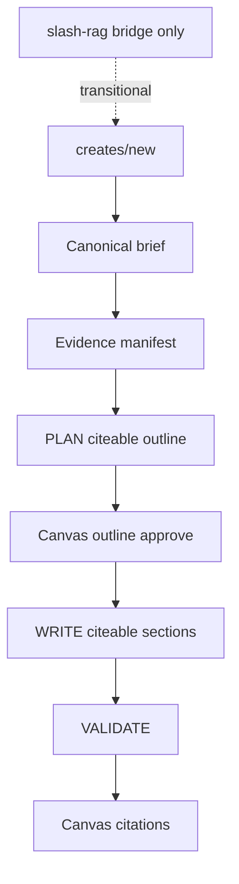

# Citeable Create pipeline (M1–M2)

**Status:** Proposed — for review before implementation  
**Authority:** [master-plan.md](master-plan.md) §4  
**Depends on:** [security-queue.md](security-queue.md) — **S0–S2 production verification** complete. Security incidents **S1 / S5 / S6** begin immediately (in parallel with S0); they do not block starting S0, but product M1 waits on S0–S2 verify. S6 key rotation must not wait on crawl work.  
**Absorbs:** archive dump Part 16 (Creates-canonical), not Part 4 `/rag`-first  

---

## Naming (non-negotiable)

| Role | Use | Do not use |
|------|-----|------------|
| Tool vendors / products to advertise | **Partner**, `crawlType: "partner"`, brief `operatorTools` | competitor, vendor crawl, `ai-tools` |
| Rival research for differentiation | **Competitor**, `crawlType: "competitors"`, brief `competitorUrls` | Treating tools as competitors |
| Create-bound site | **Project site** (gcc-v2 owned) | Geek-Crawler type; “always client site” |

Tool ads retrieve **partner** corpus. Competitor excerpts are optional differentiation only (notify-and-skip if missing).

---

## Goal

One authoring path with verifiable evidence:

```text
/creates/new → brief → evidence manifest → PLAN → outline approve
  → WRITE (citeable sections) → VALIDATE → Canvas (citations) → export
```

RAG is the evidence engine inside gcc-v2 jobs. Standalone `/rag` stays reachable as a **bridge**, not the product home.



---

## M1 — Contracts (no UI chrome)

Ship typed contracts and fixtures before changing PLAN/WRITE behavior.

### Deliverables

1. **`GccV2GenerationBrief`** (versioned)  
   Assembled once from persisted create/brief + brand kit + hierarchy + project-site run IDs + **partner** run IDs / tool URLs + competitor run IDs / URLs (role-separated).

2. **Research / evidence manifest** (inspectable before PLAN)  
   Resolved sources, index readiness, candidate quotes, gaps/conflicts, internal-link opportunities. Missing required **project-site** evidence is a visible gate. Missing partner/competitor index → warnings, not hard block (per master policy).

3. **`GccV2ContentTypeRagMapper`**  
   Maps gcc-v2 content types → RAG family (LongForm / ShortForm / Battlecard / slides). Intents are internal strategies, not a second UI taxonomy.

4. **Citation DTO**  
   Quote-level citations on WRITE stage `OutputJson` and job `ResultJson` (pageId, runId, URL, quote, section key). Canvas-ready shape even if UI lands in M2.

5. **`ResearchEntity`**  
   Shared partner/competitor identity: stable key (URL and/or corpus page/entity id), display name, **role per request** (`partner` | `competitor`). One company with many pages → one entity. No crawl yet → optional paste fallback, never primary path for partners.

### Files (expected)

- GeekBackend: `ContentCreatorV2` DTOs/services near plan/write/research resolver; `RagGenerateModels` / writing intents
- Geek-Crawler-Rag: only if request contract gaps block citeable outline/section (prefer consume existing `/v1/generate` stages)
- Phi: types only if needed for Canvas later — no `/rag` nav promotion

### Verification

- Golden fixtures: brief assembly; entity role separation (partner tool ≠ competitor)
- Mapper table covered for primary long-form types
- Citation JSON round-trip tests (cross-language if already patterned)

**Done when:** Contracts compile, fixtures green, no production PLAN/WRITE behavior change required yet (or feature-flagged).

---

## M2 — Vertical slice on Create

Prove one long-form type end-to-end signed-in against deployed stack.

### Choose one

Prefer **`pillar`** or **`blog`** (stable outline gate, existing Canvas). Do not pick `pdf` or LinkedIn carousel transforms for the first slice.

### Work

1. PLAN uses citeable/RAG outline path (or equivalent evidence-backed outline) mapped into existing `GccV2PlanOutlineSection` — not a parallel outline product.
2. WRITE uses citeable section generation; attach `citations[]` per section; parse into existing section document model.
3. Canvas shows quote-level citations (lift patterns from `/rag` citation UI as needed).
4. Brief fields: `operatorTools` / partner runs feed **partner** retrieval; `competitorUrls` / competitor runs feed differentiation only.
5. Fail closed on missing project-site grounding; `partnerResearchWarnings` on missing partner/competitor index.
6. Ops gate: target partner run(s) for the smoke entity must be **indexed** (not quarantined/skipped). Scheduler-off / quarantine is an explicit checklist item, not “Research ready” UI copy.

### Bridge rules during M2

- Do **not** add `/rag` to primary nav as “Write”
- Optional: “Open legacy RAG writer” link labeled transitional
- Task-agent “Write from finding” may deep-link Create with prefilled brief; `/rag` deep-link only if labeled transitional

### Verification

**Deterministic**

- Partner entity never serialized as competitor role
- Citation verify rejects altered quotes / wrong run
- Manifest warnings present when partner index missing

**Signed-in prod smoke (fixed seeded partner + optional competitor)**

1. Create pillar/blog → evidence manifest visible  
2. Approve outline → WRITE → ready  
3. Canvas shows ≥1 verified citation from **partner** corpus  
4. Competitor-only absence does not block; partner-required absence warns per policy  

**Done when:** Smoke checklist passes; fixtures green; no second writer declared the product home.

---

## Later (not this plan)

| Item | When |
|------|------|
| M3 generalize types + redirect `/rag` | After M2 |
| M4 model policy (no silent downgrade) | After M2 |
| LlamaIndex stage agents (archive Part 18) | After M2 goldens |
| PDF `pdf` content type | After citations stable; fix linkedin naming drift first |
| Migrate all task agents onto `RagGenerateService` as writer | Rejected as north star; agents consume evidence → Create |

---

## Out of scope

- Hiding/disabling Pipelines as a product decision
- Ad-template `localStorage` → DB (separate small plan if needed)
- Rebuilding from superseded v2-master
- LlamaParse

---

## Review checklist

- [ ] Owner confirms Creates-canonical (not `/rag`-first)
- [ ] Owner confirms first vertical type: `pillar` or `blog`
- [ ] Owner confirms partner run IDs / hosts for M2 smoke (indexed)
- [ ] Owner accepts bridge rules (no primary-nav `/rag`)
- [ ] Security S0–S2 prod verification acknowledged; S1/S5/S6 already in flight as incidents
- [ ] Owners named on security-queue ops contracts before M1 starts
