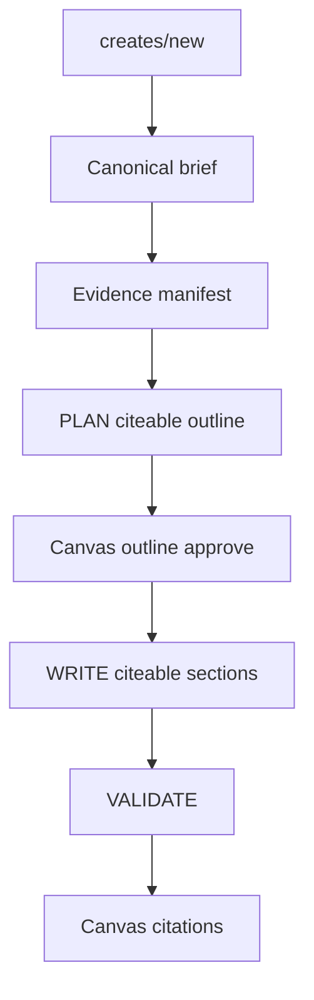

# Citeable Create pipeline (M1–M2)

**Status:** M2 **not done** — citeable VALIDATE gate + kill switch wired (`GccV2UnifiedRagTests` green); signed-in smokes still open. **Do not start M3** until §M2 done when passes.  
**Authority:** [master-plan.md](master-plan.md) §4  
**Depends on:** [security-queue.md](security-queue.md) — per-item evidenced states (S0–S2 production-verified). S1/S5/S6 constraints apply (see §Security).  
**Absorbs:** archive dump Part 16 (Creates-canonical), not Part 4 `/rag`-first  

**Critique map:** partner runtime vs release → §1 · verified citation → §2 · coverage → §3 · snapshot → §4 · authz/tenancy → §Security · negative smokes → §M2 · metrics → master §Launch metrics  

### Runtime vs release-readiness (partner index)

| Layer | Rule |
|-------|------|
| **Runtime** (`blog` / `pillar`) | Missing/unindexed partner → **notify-and-skip** + warnings + **no uncited partner claims**. Do not fail-closed all generate. |
| **Release-readiness** (declare M2 done) | Representative partner corpus must be **indexed and usable** (ApprovalMax/Plooto below). Quarantined/skipped large partner runs **block “M2 complete”**, not the runtime skip policy. |

These coexist. Do not “fix” runtime by making partner indexing a universal generate blocker.

---

## Naming (non-negotiable)

| Role | Use | Do not use |
|------|-----|------------|
| Tool vendors / products to advertise | **Partner**, `crawlType: "partner"`, brief `operatorTools` | competitor, vendor crawl, `ai-tools` |
| Rival research for differentiation | **Competitor**, `crawlType: "competitors"`, brief `competitorUrls` | Treating tools as competitors |
| Create-bound site | **Project site** (gcc-v2 owned) | Geek-Crawler type; “always client site” |

---

## Goal

One authoring path with **machine-checkable** evidence:

```text
/creates/new → versioned brief → evidence manifest → PLAN → outline approve
  → WRITE (citeable sections) → VALIDATE → Canvas (citations) → export
```

RAG is the evidence engine inside gcc-v2 jobs (GeekAPI `/api/rag/*` + Geek-Crawler-Rag). There is **no** product `/rag` writer UI.



---

## Citeable policy (explicit)

These rules supersede earlier “warn vs fail” ambiguity. A `sectionKey`/`runId` stamp alone does **not** prove citeable writing.

### 1. Evidence role by content type

| Content type | Project-site | Partner corpus | Competitor corpus |
|--------------|--------------|----------------|-------------------|
| **`blog` / `pillar`** (M2 vertical) | **Required** — fail closed | **Optional enrichment** — generate continues with warning if missing/unindexed; **prohibit uncited partner-specific claims** (remove, soften, or flag in VALIDATE) | Optional — notify-and-skip; never as partner citations |
| **`tool`** and partner tool-ad surfaces (`ads` when `operatorTools` drive the creative) | Required | **Required** — fail closed before WRITE/ship if partner run missing or index not usable | Optional differentiation only |
| **`comparison` / `alternatives`** | Required | Required per named partner that appears as a section subject | Required per named competitor that appears as a section subject; missing → warn + omit that option, do not invent |

**M2 implements the `blog` row only.** Tool fail-closed is specified now so M3 does not re-litigate it.

### 2. Verified citation (machine-checkable)

A citation is **verified** only if all hold:

1. Canonical source URL (or asset locator) matches the source record.
2. `pageId` / chunk or document id present.
3. `quote` is an **exact contiguous span** of the persisted source text for (`runId`, `pageId`) (and/or character offsets).
4. `sourceDigest` or content revision present when RAG provides it; verify fails if quote missing after reprocess.
5. `runId` present and **authorized** for the job owner / create tenancy.
6. `sectionKey` binds the citation to a section in the current outline/document (claim/paragraph anchor = later).
7. Retrieval/generation timestamp + model + prompt/policy version on section/job provenance.
8. `crawlType` matches the sourcing role (`partner` | `competitors` | project-site equivalent) — **no competitor span labeled partner**.

Chain to prove on smoke and in fixtures:

```text
citation → runId (authorized) → URL/pageId/chunk → exact quote (+ digest) → sectionKey
(+ provenance: time, model, prompt/policy version)
```

**Canvas:** rendered citation must resolve to that URL (or durable asset coordinates) and show the same quote string.  
**Claim support (M2):** VALIDATE (or repair) rejects ship-ready when an evidence-backed section asserts partner/product facts without a verified citation on that section. Full claim↔span NLP linking is **out of M2**; exact quote verify + section binding **is in**.

**Rejected bar:** “≥1 citation somewhere in the blog.”

### 3. Citation coverage

**Unit for M2:** **section** (not paragraph/claim). Claim-level linking is later.

For `blog` evidence-backed body sections (every outline section not explicitly decorative/meta):

- Externally verifiable factual claims → **≥1 verified citation** on that `sectionKey`, **or** visible `evidenceGap` and **ship-ready = false**.
- Unsupported claims → **removed, softened, or visibly flagged** — never silently approved.

Lede may share citations with the first body section or carry its own; empty lede citations alone do not satisfy body coverage.

### 4. Evidence snapshot / reproducibility

Persist on each WRITE section stage result **and** job `ResultJson` (do not rely on live re-query alone):

| Field | Purpose |
|-------|---------|
| `citations[]` with `runId`, `pageId`, `url`, `quote`, `sectionKey`, `crawlType`, `verified` | Audit + Canvas |
| `evidenceIds[]` / provenance evidence ids | Selected retrieval set |
| `retrievalMode`, `promptVersion`, `model` / policy, `attemptId` | Config fingerprint |
| `sourceDigest` and/or quote offsets when RAG provides them | Survive re-rank / reprocess |

**Regenerate section:** replace that section’s citation set and `sectionCitations[sectionKey]`; no orphaned Canvas keys.  
**Outline regenerate** that mints new keys: drop citations for obsolete keys (documented; not silent merge).  
If quote no longer matches stored markdown for (`runId`, `pageId`), verification **fails**.

### 5. Project-site “usable” vs merely indexed

**Fail-closed for PLAN** when any of:

- No `projectSiteCrawlRunId` bound to the create/job, or
- `siteSection.relatedPages` empty, or
- Pre-PLAN assembler `Ready == false`.

**Actionable recovery copy:** “Complete a project-site crawl and regenerate” / “Wait for RAG index complete, then regenerate.”

**M2 smoke also requires** PLAN retrieval to return **≥1 usable source** (project-site and/or partner). Empty sources → outline evidence gap; operator must fix crawl/index.  
**Indexed ≠ usable** — thin chunk counts are a known failure mode (e.g. Rytr complete with ~32 chunks).

### 6. `sectionKey` stability

- `sectionKey` is the **stable identity**; heading text may change without changing the key.
- Reorder preserves keys.
- Outline regenerate may assign new keys; obsolete-key citations are discarded; Canvas rehydrates from new plan/WRITE payloads only.
- WRITE stamps `SectionKey` on every persisted citation (already wired).

### 7. Brief / manifest versioning

- `GccV2GenerationBrief.CurrentVersion` = `gcc-v2-generation-brief.v1`.
- `GccV2ResearchEvidenceManifest.CurrentVersion` = `gcc-v2-research-evidence-manifest.v1`.
- Unknown / newer version on read → **fail closed** with explicit error (no silent coerce).
- Older known versions: explicit migration helper owned by GeekAPI `ContentCreatorV2.Generation` (add when v2 exists).

### 8. Manifest timing and UI

| Stage | Where operator sees it | Can revise sources? | Approve meaning |
|-------|------------------------|---------------------|-----------------|
| Pre-PLAN | Server gate; hard gaps fail the job | Fix create/crawl, then regenerate | N/A |
| OutlineReady | Canvas evidence strip (`evidenceManifest`) **before** outline approve | No mid-flight source editor in M2 — edit brief/tools/runs and re-PLAN | Accepts **soft** partner/competitor warnings; hard project-site gaps never reach OutlineReady |
| After WRITE | Same strip + per-section citations | Regenerate section | Ship-ready requires §3 coverage |

### 9. Product `/rag` UI

**Removed.** Route 404s; no redirect. Create clients live under `src/app/creates/rag-client/`. Internal BFF `/api/rag/*` remains for status/generate used by Create.

---

## Security constraints on this path (S1 / S5 / S6)

| Constraint | Requirement |
|------------|-------------|
| Source URL validation (S1) | No SSRF to private nets when resolving citation or crawl URLs |
| runId authz (S5 + product) | Query/retrieve/verify/render only runs the caller may access; trusted-asset paths require HMAC |
| Transport (S6) | RAG over HTTPS only; no new plaintext RAG clients |
| Citation render | Quotes/titles as text — no unsanitized HTML from sources |
| Tenant isolation | Foreign/stale `runId` → safe failure or notify-and-skip; never cross-tenant bleed |
| Source rights / freshness | Partner role ≠ unlimited quote license; verification fails if quote absent from stored page |

**Security program status:** per-item matrix in [security-queue.md](security-queue.md) / master §3 — not a single “S0–S6 done” checkbox.

---

## Implementation debt (wired vs acceptance)

| Requirement | Status |
|-------------|--------|
| Pre-PLAN project-site fail-closed | Wired |
| WRITE `sectionKey` stamp | Wired |
| Canvas citation / evidence strip UI | Wired |
| Partner ≠ competitor naming in brief/tools | Wired |
| Exact quote verify on VALIDATE/WRITE | **Wired** (`GccV2CitationEvidenceGuard` in VALIDATE) |
| Section coverage → ship-ready | **Wired** (long-form; gaps block `ShipReady`) |
| Full evidence snapshot on ResultJson | **Wired** for M2 fields (`verified`, `sourceDigest`, provenance retrieval/prompt/model/attemptId, `citationEvidenceGaps`, verified-only `VerifiedCitations` + `CandidateQuotes`); quote offsets still optional when RAG omits them |
| Blog: no uncited partner claims | **Partial** (coverage + role leak blocked; claim NLP later) |
| Feature flag / kill switch | **Wired** — `GccV2CiteableCreateV1` via env `GCC_V2_CITEABLE_CREATE_V1` (default ON; `false`/`0`/`off` = prior VALIDATE, no quote/coverage gate) |
| Negative-path smokes recorded | **Gap** |
| Product `/rag` UI | **Removed** (404; Create `rag-client` + `/api/rag` BFF) |

---

## M1 — Contracts (no UI chrome)

### Deliverables (shipped)

1. Versioned `GccV2GenerationBrief`  
2. `GccV2ResearchEvidenceManifest` + `GccV2PrePlanEvidenceManifestAssembler`  
3. `GccV2ContentTypeRagMapper`  
4. Citation DTO with `runId` + `sectionKey`  
5. `GccV2ResearchEntityRef` (role per request)  

### Verification (reproducible CI)

```bash
# From GeekBackend repo root — required green for M1/M2 claims
dotnet test GeekBackend.Tests/GeekBackend.Tests.csproj \
  --filter "FullyQualifiedName~GccV2UnifiedRagTests"
```

Stable fixture corpus: in-test GUID runs + JSON briefs in `GccV2UnifiedRagTests` (no live Qdrant required).  
**Honest status:** M1 contracts exist; they do **not** prove citeable writing. M2 acceptance is below.

---

## M2 — Vertical slice on Create (`blog`)

### Smoke corpus (indexed, verified 2026-09-13)

| Partner | Run ID | Notes |
|---------|--------|-------|
| **ApprovalMax** (preferred) | `04fbbd9c-6b11-478d-98bf-13f2377a0d7a` | 29 pages / 248 chunks |
| Plooto (heavier) | `cd2c4bac-268b-41fe-85ea-9930bceb40da` | 271 pages / 7781 chunks |
| Rytr | avoid | index complete but thin (~32 chunks) |

### Remaining work (before M3)

1. ~~Enforce **verified citation** chain~~ — wired (`GccV2CitationEvidenceGuard`).  
2. ~~Enforce **section coverage**~~ — wired (gaps block `ShipReady`).  
3. ~~Evidence snapshot~~ — wired for M2 fields; quote offsets optional when RAG omits them.  
4. Partner-missing on `blog`: warning + **block uncited partner claims** — **partial** (coverage/role; claim NLP later).  
5. ~~Kill switch `GccV2CiteableCreateV1`~~ — env `GCC_V2_CITEABLE_CREATE_V1` (default ON).  
6. Run and record happy + negative smokes in §Smoke log.  

### Happy-path smoke (signed-in prod)

| | |
|--|--|
| **Owner** | Product operator (Jeff); eng assists |
| **Record** | §Smoke log row (date, job id, pass/fail, notes) |
| **Rollback** | Set `GCC_V2_CITEABLE_CREATE_V1=false` (or redeploy prior GeekAPI) |
| **Seed** | Blog + project-site crawl; partner tools `ApprovalMax \| https://approvalmax.com` |

Checklist:

1. Versioned brief persisted  
2. Evidence manifest visible on Canvas **before** outline approve  
3. Approve → WRITE → VALIDATE → ready only if coverage met  
4. ≥1 **verified** partner citation (full chain) on a **body** `sectionKey`; Canvas URL + quote resolve  
5. No competitor content with `crawlType: partner`  

### Negative-path smokes

| Case | Expected |
|------|----------|
| Project-site missing / empty `relatedPages` | PLAN blocked; actionable recovery |
| Partner missing or unindexed on `blog` | Continues with warning; ship-ready blocked if partner claims lack citations |
| Partner + competitor both present | Competitor quotes never `crawlType: partner` |
| Stale/invalid / foreign `runId` | Safe failure or notify-and-skip; no cross-tenant data |
| Failed WRITE retry / terminal WRITE fail | Job failed or recoverable; partial sections readable; no silent empty “ready” |
| Regenerate one section | New citations for that `sectionKey` only; no Canvas orphans |

### M2 done when

Signed-in smoke creates a **blog** from a persisted **versioned** brief; **blocks** on missing required project-site evidence with actionable recovery; produces **verified citations** (exact quote chain) from the **partner** run on **covered sections**; renders them on Canvas **without cross-role leakage**; **survives section regeneration**; negative paths pass; §Smoke log updated; `GccV2UnifiedRagTests` green; kill switch documented.

**Not done when:** only `sectionKey` / `runId` fields are stamped without quote verification and coverage enforcement.

---

## Smoke log

| Date (UTC) | Job id | Happy | Negatives | Result | Notes |
|------------|--------|-------|-----------|--------|-------|
| — | — | — | — | — | None yet |

---

## Later (not this plan)

| Item | When |
|------|------|
| M3 generalize types + Canvas citeable UX | After M2 done when |
| M4 model policy (no silent downgrade) | After M2 |
| LlamaIndex stage agents (archive Part 18) | After M2 goldens |
| Claim-level citation linking | After section coverage is green |
| PDF `pdf` content type | After citations stable |

---

## Out of scope

- Hiding/disabling Pipelines as a product decision  
- Ad-template `localStorage` → DB  
- Rebuilding from superseded v2-master  
- LlamaParse  

---

## Review checklist

- [x] Creates-canonical (not `/rag`-first)  
- [x] Product `/rag` UI deleted (404, no redirect); Create uses `rag-client` + `/api/rag` BFF  
- [x] First vertical: **`blog`**  
- [x] Indexed partner smoke hosts documented  
- [x] Partner policy **per content type** + **runtime vs release-readiness**  
- [x] Verified citation fields (URL, pageId, quote/digest, authz, provenance)  
- [x] Negative-path smoke matrix (incl. WRITE retry fail)  
- [x] Security constraints mapped; program status = per-item matrix  
- [x] Reproducible fixture command  
- [x] VALIDATE / coverage / kill switch match this doc (fixture tests green; snapshot digests partial)  
- [x] Kill switch named and wired (`GCC_V2_CITEABLE_CREATE_V1`)  
- [ ] Happy + negative smokes in §Smoke log  
- [ ] M2 done when satisfied → only then M3  
