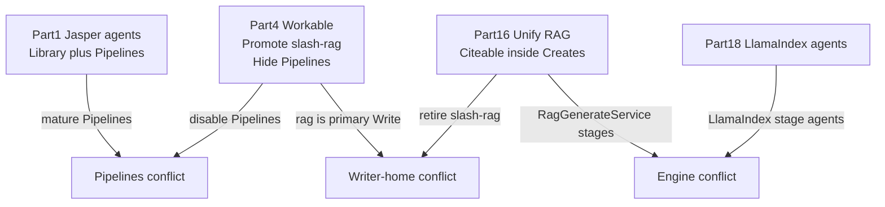

# Critique — master-plan consolidation (2026-09-13)

**Status:** Applied — living plan rewritten; dump archived.  
**Authority after this critique:** [master-plan.md](master-plan.md)  
**Archived dump:** [archive/master-plan-consolidated-dump-2026-09-13.md](archive/master-plan-consolidated-dump-2026-09-13.md)

---

## Verdict

The ~368KB / ~6k-line consolidation succeeded as **storage** and failed as a **program of record**. Useful rules and findings were buried under four incompatible product architectures, all marked active/proposed.

## What was worth keeping

- Standing isolation / no-silent-fallback / SignalR / three-crawl-domain rules
- Vertical-slice sequencing discipline (contracts → one path → generalize)
- Security findings with file:line (SSRF, seed caps, OAuth, trusted RAG routes, ingestion stuck)

## Fatal conflict map

| Topic | Competing claims |
|-------|------------------|
| Product surface | Agent Library + Pipelines vs `/rag` writer vs Create-only |
| Writer home | Promote `/rag` vs redirect `/rag` away |
| Generation engine | `RagGenerateService` in gcc-v2 jobs vs LlamaIndex agents in RAG service |
| Pipelines | Mature async DAG vs hide/disable as dead |

## Form-factor failure

- Too large for any agent or human to obey end-to-end
- Historical incident notes, Jasper research, and superseded v2-master pasted in-line
- Status badges contradicted section bodies (“not started” vs “audit complete”)
- Part 0 still said “preserve `plan/` / `plans/`” after those dirs were deleted into the dump

## Decisions applied

1. **Creates-canonical** is the north star (citeable RAG inside `/creates` → Canvas).
2. `/rag` is a **bridge**, not primary nav.
3. LlamaIndex agentization **parked** until citeable Create goldens exist.
4. Security queue **S0–S6** ahead of net-new product milestones.
5. Dump moved to `plans/archive/`; living master kept short.
6. **Tools = partners**, never competitors — explicit naming table in master plan.

## Follow-on review plans

- [security-queue.md](security-queue.md)
- [citeable-create-pipeline.md](citeable-create-pipeline.md)
