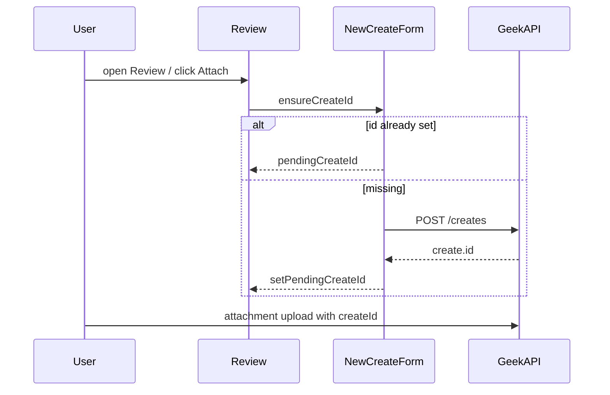

<!-- e6b2fc28-c800-43bc-84fe-4ec0d8c7f052 -->
---
todos:
  - id: "ensure-create"
    content: "ensureCreateId helper + Review mount/pass-through create id"
    status: completed
  - id: "selector-ux"
    content: "ContextSelector: ensure-on-attach; remove Save amber dead-end"
    status: completed
  - id: "back-and-tests"
    content: "Keep pendingCreateId on Back; add smoke/unit coverage"
    status: completed
isProject: false
---
# Fix “Save before run attachment” on Review — Complete

## Problem

[`context-selector.tsx`](file:///Users/jeffmartin/development/content-creator-v2/src/app/creates/new/context-selector.tsx) only enables file/URL run attachments when `createId` is set. Otherwise it shows:

> Save the create from this review step before adding a run attachment.

That copy is a dead end: Review has **no Save** control—only **Confirm partners & create** (which starts generate). Attachment APIs are create-scoped (`POST .../creates/{createId}/attachments/...`), so an id is required, but the UI should **ensure** that id exists instead of blaming the operator.

Happy path already creates before Review in [`new-create-form.tsx`](file:///Users/jeffmartin/development/content-creator-v2/src/app/creates/new/new-create-form.tsx) (`resolveToolsAndContinue` → `POST /creates` → `setPendingCreateId` → `setStep("review")`). The stupid state is when Review is shown without a usable id (cleared on Back, race, or `pendingCreateId` not passed while `toolsPreflight.createId` exists).

## Locked approach

Never show the “Save the create…” amber message. On Review, **ensure a create id** before attachment UI is interactive; if missing, silently create (same fields as today’s preflight create) and then enable attach.

## Implementation (content-creator-v2)

### 1. `ensureCreateId` in the wizard

In [`new-create-form.tsx`](file:///Users/jeffmartin/development/content-creator-v2/src/app/creates/new/new-create-form.tsx):

- Extract the existing `POST /api/gcc-v2/creates` body (title, contentType, siteUrl, siteSection, selectedAgentIds, contextSelection) into `ensureCreateId(): Promise<string>`.
- Reuse it from `resolveToolsAndContinue` and from Review.
- On Review mount (and/or when ContextSelector requests it): if `!pendingCreateId`, call `ensureCreateId`, set `pendingCreateId`, keep `toolsPreflight.createId` in sync.
- Pass `createId={pendingCreateId ?? toolsPreflight?.createId ?? null}` so preflight’s id is never ignored.

### 2. ContextSelector: no dead-end copy

In [`context-selector.tsx`](file:///Users/jeffmartin/development/content-creator-v2/src/app/creates/new/context-selector.tsx):

- Add optional `ensureCreateId?: () => Promise<string>` (or `onNeedCreateId`).
- When user chooses a file / Add URL and `!createId`, await ensure, then proceed with upload.
- While ensuring: show “Preparing this create…” (disabled controls), not the amber Save message.
- Delete the amber “Save the create from this review step…” branch entirely.

### 3. Back navigation

When leaving Review with Back, either:

- **Keep** `pendingCreateId` (preferred—reuse same create on return), or
- Clear it but rely on `ensureCreateId` when re-entering Review.

Prefer **keep id** so Back → Outputs → continue does not orphan a second create every time. Still call ensure if null.

### 4. Tests

- Review with null `pendingCreateId`: choosing attach triggers ensure then upload endpoints receive a real create id.
- Review with id already set: no extra create.
- Amber Save message never rendered.

## Out of scope

- Detaching attachments from create (backend still create-scoped).
- Attachment `not_ready` reclaim/poll work ([fix-attachment-not-ready.md](file:///Users/jeffmartin/development/content-creator-v2/plans/fix-attachment-not-ready.md))—separate plan; this only removes the Save gate.
- Geek IQ empty-state plan.

## Verify

- Land on Review with partners found → Attach file immediately (no Save copy).
- Back from Review, return → Attach still works (same or ensured create).
- Confirm partners still generates with the same create id and any `runAttachmentIds`.

## Docs

Save plan as [`plans/fix-attach-before-save.md`](file:///Users/jeffmartin/development/content-creator-v2/plans/fix-attach-before-save.md) and index in [`plans/README.md`](file:///Users/jeffmartin/development/content-creator-v2/plans/README.md) when implementing (or immediately if you want it on disk before code).
