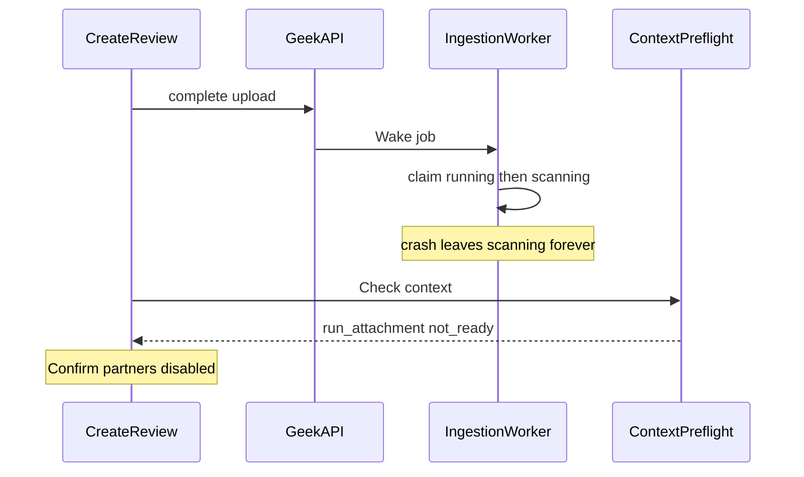

<!-- e6b2fc28-c800-43bc-84fe-4ec0d8c7f052 -->
---
todos:
  - id: "claim-reclaim"
    content: "GeekBackend: reclaim non-terminal lease-expired ingestion jobs (incl. scanning+)"
    status: completed
  - id: "wake-by-job-id"
    content: "GeekBackend: finalize returns job id; Complete wakes by id (no capped queue scan)"
    status: completed
  - id: "periodic-recover"
    content: "GeekBackend: periodic Recover wake loop + force-fail attachment state"
    status: completed
  - id: "preflight-codes"
    content: "GeekBackend: distinct processing/failed/not_finalized block codes + tests"
    status: completed
  - id: "fe-pending-gate"
    content: "phi: keep Confirm blocked while attachments pending; never clear preflight to empty after upload"
    status: completed
  - id: "fe-status-remove"
    content: "phi: poll/SignalR status, auto re-resolve, remove attachment, humanize blocks"
    status: completed
isProject: false
---
# Fix run_attachment not_ready blocking Confirm — Complete

## Problem

Context preflight fail-closes Generate when any selected run attachment is not `IngestionState == "ready"` in [GccV2ContextManifestService.cs](file:///Users/jeffmartin/development/GeekBackend/GeekAPI/Services/ContentCreatorV2/Context/GccV2ContextManifestService.cs). Review disables **Confirm partners & create** when `blockingFindings.length > 0` in [new-create-form.tsx](file:///Users/jeffmartin/development/content-creator-v2/src/app/creates/new/new-create-form.tsx).

That gate stays. Investigation ([attachment ingest path](0ef27c21-0b5a-4e37-bd23-4fcf86429e27), [GeekBackend worker/wake](6c3e6288-ceaa-49cd-a9b4-f1c1bae85594), [Create UI gaps](93cf57a1-a1bd-4780-b8b0-22dfa64e421e)) ranked:

1. **Stuck jobs:** claim only reclaims `queued` or lease-expired `running`. Worker immediately moves to `scanning`; after a crash those jobs are never reclaimable. `RecoverOnce` is startup-only. Prod GeekAPI has no `GCC_V2_LISTEN_DATABASE_URL` / `DATABASE_URL` for NOTIFY catch-up.
2. **Fragile Wake:** `CompleteAttachmentUpload` finds the job by scanning the oldest 200 `queued` jobs; under backlog lookup fails after finalize → **no Wake**, attachment left `queued`. Finalize does not return `ingestionJobId`.
3. **Frontend false-clear:** after upload, UI sets `preview` to `null` and only gates on `uploadBusy`, so Confirm can look unblocked until a manual Check returns `run_attachment:{id}:not_ready`. No poll/SignalR, no remove UI, GUID-only list.
4. **One block code:** `failed`, `queued`, `scanning`, and unfinalized all become `run_attachment:{id}:not_ready`.

## Locked approach

Keep fail-closed. Fix reclaim + wake-by-id so jobs finish or fail terminal. Keep Confirm blocked while any attachment is pending readiness (even with cleared preview). Add live status, remove, and auto-recheck. Never soft-allow Generate with non-ready attachments.

## GeekBackend

### 1. Reclaim any non-terminal job with expired lease

Update claim SQL in GeekRepository `GccV2ContextController` claim endpoint:

- Allow reclaim when status is not terminal (`ready` / `failed` / `cancelled`) and either status is `queued` or lease is expired.
- Reclaim resets to `running` so `ProcessAsync` can run again from mid-state.
- Extend lease / heartbeat on intermediate transitions so healthy jobs are not falsely reclaimed.

### 2. Wake by job id (no capped queue scan)

- Finalize returns `ingestionJobId` (or Complete loads job by target id).
- `CompleteAttachmentUpload` / URL attach always `Wake(jobId)` — never `List(...queued, limit:200)` + `SingleOrDefault`.
- Document / set `GCC_V2_LISTEN_DATABASE_URL` on Railway for multi-instance NOTIFY (ops).

### 3. Periodic recovery

In `GccV2ContextIngestionWorker`:

- Keep startup `RecoverOnce`.
- Add a 30–60s loop that wakes queued jobs and lease-expired non-terminal jobs.
- Verify force-terminal failure also sets attachment `IngestionState = failed`.

### 4. Distinct preflight block codes

In `GccV2ContextManifestService`:

- `not_finalized` when `FinalizedAtUtc` is null
- `failed` when `IngestionState == failed`
- `processing` for queued/scanning/extracting/indexing
- keep `not_owned` / `expired`

Add unit tests for reclaim-after-scanning, wake-by-id, failed vs processing blocks.

## content-creator-v2

### 5. Pending-readiness gate (bugfix)

In [context-selector.tsx](file:///Users/jeffmartin/development/content-creator-v2/src/app/creates/new/context-selector.tsx) + [new-create-form.tsx](file:///Users/jeffmartin/development/content-creator-v2/src/app/creates/new/new-create-form.tsx):

- Treat any `runAttachmentIds` without a successful ready preflight (or known `ready` status) as blocking Confirm — do not rely only on `uploadBusy` / empty `blockingFindings` after clearing preview.
- After upload, either keep a synthetic pending blocker or set `onProcessingChange(true)` until attachment is `ready`/`failed` and preflight re-runs.

### 6. Live status + auto re-resolve

- Poll attachment GET (prefer [context-ingestion-hub.ts](file:///Users/jeffmartin/development/content-creator-v2/src/app/auth/context-ingestion-hub.ts) SignalR) until `ready` or `failed`.
- Show filename + state badge instead of bare GUID only.
- On `ready`, auto-call `resolveContext()`.
- On `failed`, show terminal error; Confirm stays blocked until remove.

### 7. Remove attachment + humanize blockers

- Wire DELETE `creates/{createId}/attachments/{attachmentId}`, drop id from `runAttachmentIds`, re-resolve.
- Map `processing` / `failed` / `not_finalized` / legacy `not_ready` to short operator copy.

## Verify

- Small `.txt` upload: Confirm stays disabled through ingest; queued → ready → auto preflight clear → Confirm enables (other gates OK).
- Clearing preview after upload never enables Confirm while ids are pending.
- Stuck mid-ingest recovers within the recovery interval or fails closed.
- Failed ingest shows `:failed` + Remove clears the block.
- Complete under a large queued backlog still wakes the new job (wake-by-id).

## Deploy

GeekBackend (Railway) first, then phi. Confirm prod has RAG URL, malware scanner, and LISTEN DB URL so ingest can succeed across instances; without deps UI must show `failed`, not forever-processing.
