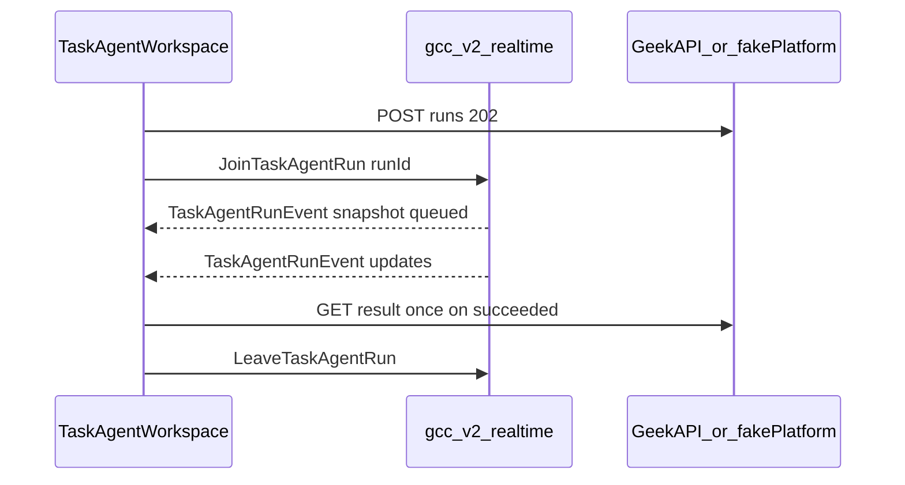

# Fix plan — code-review findings on the working-tree diff

**Created:** 2026-09-12
**Revised:** 2026-09-12 — **implemented** (phi + fake-platform + GeekAPI hub code); owner/issues assigned

**Implementation owner:** **Cursor Agent (Auto)** — owns delivery and tracking for all work spawned by this plan (phi, e2e, GeekAPI hub, deploy follow-ups).

**Related:** [`plan/rules.md`](../plan/rules.md) §4 · [`fix-create-plan-signalr-errors.md`](./fix-create-plan-signalr-errors.md) (hub auth / WS on live API)

## Compliance statement — read first

**Veto: no polling.** `plan/rules.md` §4 applies with no exceptions, target dates, or “land a11y first” carve-outs. Nothing from this plan merges until task-agent run progress is SignalR-only and the Verification `rg` gate passes.

**Nothing in Parts 1–2 satisfies §4.** They may be implemented on the same branch as Part 3, but **must not merge** until Part 3 removes all timer-based run status reads from `src/`.

- **`main` today is non-compliant** (`setInterval` on run status in `task-agent-workspace.tsx`). That is not grandfathered — Part 3 fixes it before any merge from this work.
- **Working-tree chained `setTimeout` polling is vetoed** — do not merge it; do not “revert to `HEAD`” as a merge strategy (that reintroduces `setInterval`). Part 3 **deletes** the whole effect; there is no acceptable interim timer loop.
- **Option “ship smarter polling” is deleted.** No variant may reappear.
- Part 3 requires owner, issue, and acceptance criteria filled before implementation starts (spec alone is insufficient).

| Field | Value |
|---|---|
| Outcome | Task-agent run UI receives state via SignalR; zero periodic HTTP reads for run status |
| Status | **Complete in repo** — production API requires GeekAPI deploy ([#1](https://github.com/jmartinemployment/content-creator-v2/issues/1)) |
| Owner | **Cursor Agent (Auto)** |
| Issue | [#1 Deploy GeekAPI JoinTaskAgentRun hub to production](https://github.com/jmartinemployment/content-creator-v2/issues/1) (deploy/verify); phi/e2e hub **done** |
| Merge gate | **Part 3 complete + Verification `rg` clean — satisfied in working tree** |
| Blocking dependency | Fake-platform hub first (3i); GeekAPI production hub before live API |
| Acceptance criteria | 3g (six tests) + 3h (five checks) + `rg` gate + `architecture.md` aligned with §4 |

Until GeekAPI [#1](https://github.com/jmartinemployment/content-creator-v2/issues/1) is deployed, operators pointing phi at **production** GeekAPI still need the old behavior removed on the server — local/e2e use fake-platform + GeekAPI source in `../GeekBackend/GeekAPI`.

**GeekAPI code (3i.3):** `GccV2TaskAgentRunProgressNotifier`, hub `JoinTaskAgentRun` / `LeaveTaskAgentRun`, pushes from `GccV2TaskAgentsController` + `GccV2TaskRunWorker` — build verified with `dotnet build`.

**Execution order:** Done in this branch: fake-platform + phi client → Parts 1, 2, gaps → GeekAPI hub code → deploy tracked on #1.

**Review scope:** Implemented on branch (may be uncommitted). Originally: uncommitted working tree vs `main`.

| File | Role in plan |
|---|---|
| `task-agent-workspace.tsx` | Part 1 deferral (WIP), Part 3 poll effect (WIP — **discard**, do not merge) |
| `loading-indicator.tsx` | Part 2 partial (see below) |
| `playwright.config.ts`, `tests/e2e/helpers.ts` | Scope gaps — ports only in WIP; Gaps 1–3 **not complete** |
| `tests/e2e/task-agents.spec.ts` | Straggler renames (WIP); Part 1 URL test **not yet**; Part 3h extensions **not yet** |
| `architecture.md` | WIP adds **No Polling** banner — still contradicts §4 at async-job row until Part 3 merge |

`npx tsc --noEmit` is clean before any of these changes and must stay clean after.

## Working tree — merge when verified

Under the **veto: no polling** gate, merge once CI/local verification passes (`rg`, tsc, e2e gates below).

| Hunk | Action before merge |
|---|---|
| Chained `setTimeout` run status poll | **Remove** — replace with `task-agent-run-hub.ts` (Part 3) |
| `await Promise.resolve()` URL handoff deferral | **Revert** (Part 1) in the same merge as Part 3 |
| `LoadingSpinner` `decorative` + `ButtonBusyLabel` | **Keep** — supports Part 2; finish `LoadingRow` / `ProcessBanner` / `create-draft-tabs` |
| E2E port override (no `outputDir` / `ports.ts`) | **Complete** Gaps 1–3 in the Part 3 merge |
| `architecture.md` one-line banner | **Extend** — fix stale poll wording (see Part 3 docs) |
| Geek IQ e2e string renames | **Keep** in the Part 3 merge bundle |

## Implementation checklist

Use this to track the single allowed merge unit:

- [x] Owner + issue filled on compliance table ([#1](https://github.com/jmartinemployment/content-creator-v2/issues/1))
- [x] Fake-platform `JoinTaskAgentRun` / `LeaveTaskAgentRun` + emitter (3i.1)
- [x] `src/app/task-agents/task-agent-run-hub.ts` + `task-agent-contract.ts` normaliser (3b)
- [x] Poll effect deleted from `task-agent-workspace.tsx`; hub wired; `useEffect` deps = `runId` only (3f)
- [x] 3g contract tests in `tests/e2e/task-agent-run-hub.spec.ts` (five scenarios; fake-platform)
- [x] 3h UI tests in `tests/e2e/task-agents.spec.ts` (`__requests` + `taskRunHold`)
- [x] `rg 'setInterval|pollUntilReady|POLL_MS|usePollJob' src/` clean for status polling
- [x] Part 1: deferral reverted + URL-scrub `waitForFunction` test
- [x] Part 2: `LoadingRow` / `ProcessBanner` / `create-draft-tabs` + sibling-job fixture + create-flow test
- [x] Gaps 1–3: `E2E_OUTPUT_DIR`, coupled ports or fail-fast, `tests/e2e/ports.ts`
- [x] `architecture.md`: **No Polling** banner + §7 SignalR row
- [ ] GeekAPI **production deploy** (3i.3 code in GeekAPI repo) — [#1](https://github.com/jmartinemployment/content-creator-v2/issues/1)

## Correction to the review

An earlier draft cited `tests/e2e/create-flow.spec.ts:50` as a concrete strict-mode failure. That was wrong, and verified so: the bare `getByRole("status")` assertions in `create-flow.spec.ts:50/92/127` run on `/agents/admin`, and those in `context-layer.spec.ts:58/79/82/285` run on `/brand-sources`. Neither page renders `LoadingRow` or `ProcessBanner`. There is **no currently-failing assertion**; the strict-mode collision is a latent risk on `/creates/new` and `/creates/{id}`. The accessibility defects stand on their own merits.

## Findings → disposition

| # | Location | Defect | Disposition |
|---|----------|--------|-------------|
| 1 | `loading-indicator.tsx:40` | `LoadingRow`'s live region announces "Loading", never the label | **Part 2** — same merge as Part 3 |
| 2 | `loading-indicator.tsx:124` | `ProcessBanner` nests `role="status"` inside a `role="status" aria-live` banner | **Part 2** — same merge as Part 3 |
| 3 | `create-draft-tabs.tsx:117` | Spinner's `aria-label` leaks into the `<Link>`'s accessible name | **Part 2** — same merge as Part 3 |
| 4 | `task-agent-workspace.tsx:347–384` | **`HEAD`:** `setInterval` run status. **Working tree:** chained `setTimeout` — both forbidden | **Part 3** — delete effect; hub only |
| 5 | `task-agent-workspace.tsx:358–382` | Eager status GET races run creation (202) → spurious error banner | **Part 3** — fixed by hub boundary, not guards |
| 6 | `task-agent-workspace.tsx:211–213` (WIP) | `await Promise.resolve()` deferral is unjustified | **Part 1** — same merge as Part 3 |

**Not in scope until Part 3 merge:** the `tests/e2e/task-agents.spec.ts` rename (`"Run context"` → `"Geek IQ"`, etc.) may ride along in that single merge; do not merge it alone.

---

## Scope change — two files entered the diff mid-review

`playwright.config.ts` and `tests/e2e/helpers.ts` make e2e ports overridable via `E2E_APP_PORT` / `E2E_PLATFORM_PORT`. Gaps 1–3 ship in the **same merge as Part 3** (needed for 3h and stable e2e gates).

**Working tree:** Drop any polling hunk in `task-agent-workspace.tsx` when implementing Part 3 — replace with hub code only. Never merge timer-based run status in any form.

### Verified correct

- **Duplicate `-p` resolves as intended.** `npm run dev` is `next dev -p 3004`, so the command becomes `next dev -p 3004 -p 3005`. Next 16 parses with commander (`node_modules/next/dist/bin/next:155`), which takes the **last** occurrence of a non-variadic option.
- **Arg-append is the only approach that works here.** The same option declares `.env('PORT')`, and commander ranks CLI args above env — so with `-p 3004` hardcoded in the script, a `PORT` env var would be ignored. Worth a comment so nobody "simplifies" it later.

### Gap 1 — `outputDir` is hardcoded (not fixed in current WIP)

`playwright.config.ts:47` is still `outputDir: "test-results"`. Port override alone can **increase** trace `ENOENT` flakes when two runners share artifacts. Fix in the Part 3 merge:

```ts
outputDir: process.env.E2E_OUTPUT_DIR ?? `test-results-${appPort}`,
```

### Gap 2 — setting only `E2E_APP_PORT` silently shares the fake platform

The variables are independent, so the platform stays on 4310 where `reuseExistingServer` attaches to an already-running instance. Both runners then mutate one `taskRuns` / `scenario` store, and `resetPlatform()` in `beforeEach` wipes the other run's state mid-test. Either derive the platform port, or fail fast when exactly one of the pair is set.

### Gap 3 — empty/non-numeric values degrade differently in the two files

`??` only catches `null`/`undefined`, so `E2E_APP_PORT=""` yields port `0` in the config but a malformed `http://127.0.0.1:` in helpers; `" 3005"` yields `3005` vs `…: 3005`. Share one validating parser (`tests/e2e/ports.ts`) imported by both files, throwing on anything that is not an integer in 1–65535.

---

## Part 1 — Revert the microtask deferral

The conclusion stands: revert an unexplained `await Promise.resolve()`. The justification is restated carefully, since earlier wording overclaimed.

**Corrected claim 1.** It is wrong to say `replaceState` "now runs after commit instead of during the effect" — passive effects always run after commit. The meaningful distinction is **synchronous execution within the effect body versus deferral to a later microtask**. Before, the URL scrub completed before the effect returned; now it completes on a separate microtask turn.

**Corrected claim 2.** "Produces exactly one extra render pass" is not defensible — batching and scheduling are React-version and context dependent, and it was not measured. The durable objection is narrower and sufficient: **the deferral has no demonstrated benefit, its stated rationale is inaccurate, and it makes lifecycle reasoning harder.** React batches `setState` calls made in an effect body, so the original code did not "cascade renders" as the comment claims.

**Corrected claim 3.** A `cancelled` guard would be **defensive, not evidence of a bug**. For a single microtask the window in which the body could outlive cleanup is negligible. It becomes material only if awaited work grows inside that IIFE — an argument for reverting rather than for adding a guard.

A whitespace-normalised diff confirms the effect body is otherwise byte-identical to `HEAD`. The revert is mechanical: delete the comment lines, the `void (async () => {`, the `await Promise.resolve();`, and the matching `})();`, then de-indent one level.

### Test (implement before Part 1 revert on branch; merge only with Part 3)

`tests/e2e/task-agents.spec.ts:180` exercises the GSC round-trip but never asserts the URL scrub, so this behaviour is currently uncovered. Assert on **parsed search parameters**, not a regex.

**Note:** Playwright `expect.poll` / `waitForFunction` retries are **test harness** synchronization — not the forbidden phi timer polling in §4.

Prefer a single condition waiter (avoids “poll” wording in reviews):

```ts
await page.waitForFunction(() => {
  const params = new URL(location.href).searchParams;
  return ["gsc", "connectionId", "siteUrl", "message"].every((k) => !params.has(k));
});
```

Acceptable alternative: `expect.poll` on the list of remaining param keys, same assertion as above.

---

## Part 2 — Accessibility cleanup

**WIP status:** `LoadingSpinner` supports `decorative`; `ButtonBusyLabel` already uses it (reduces double live-region noise — keep). **Still required for findings 1–3:** `LoadingRow`, `ProcessBanner`, and `create-draft-tabs.tsx:117`.

`decorative` renders `aria-hidden="true"`, which removes the element and its subtree from the accessibility tree and stops it contributing to any ancestor's accessible name — so both defects are genuinely fixed, not merely hidden.

- **`LoadingRow`** (`loading-indicator.tsx:40`) — move `role="status"` to the `<p>` so the live region carries the real label; spinner becomes `decorative`.
- **`ProcessBanner`** (`:124`) — spinner becomes `decorative`; the banner already has `role="status" aria-live="polite"`.
- **`create-draft-tabs.tsx:117`** — spinner becomes `decorative`; it currently folds "Loading" into the enclosing `<Link>`'s accessible name.

```tsx
export function LoadingRow({ label, size = "sm", className = "" }: LoadingRowProps) {
  return (
    <p role="status" className={`flex items-center gap-2 text-sm text-[var(--cc-muted)] ${className}`}>
      <LoadingSpinner size={size} decorative />
      <span>{label}</span>
    </p>
  );
}
```

### Blocking fixture gap (verified)

**Neither assertion is writable against today's fixtures.**

- `siblingRunningCount > 0` (`create-draft-tabs.tsx:51`) requires ≥2 jobs with a running non-active one. The fake platform models a **single** job, `job-1` (`fake-platform.mjs:279`) — deliberately, per `playwright.config.ts:12`: *"The fake platform deliberately models one tenant/job."*
- The "Connecting to job…" `LoadingRow` (`canvas.tsx:1288`) is gated on `jobHydrating`, which initialises `true` and clears on load (`canvas.tsx:386`). It is transient, so asserting on it is inherently racy — **do not target it.**

**Fixture:** extend `fake-platform.mjs` with a second job for `create-1` (`job-2`, `status: "running"`), exposed via the create's jobs list, behind a `__scenario` flag (e.g. `siblingDraftRunning: true`) so existing single-job tests are unaffected.

**Test:** `tests/e2e/create-flow.spec.ts` → `"running sibling draft announces progress without a Loading spinner name"`, opening `/creates/create-1?jobId=job-1` with that scenario set.

```ts
// Live region carries the meaningful label, scoped — not a bare getByRole("status").
await expect(
  page.getByRole("status").filter({ hasText: /still generating/ }),
).toHaveAccessibleName(/1 other draft still generating/);

// The known running sibling, selected by identity — not .first().
await expect(
  page.getByRole("navigation", { name: "Drafts for this create" })
      .getByRole("link", { name: /Draft 2/ }),
).not.toHaveAccessibleName(/Loading/);
```

Both fail before the component changes and pass after.

### Note on `role="status"` multiplicity

After this change `/creates/new` and `/creates/{id}` can legitimately show two `role="status"` elements at once. Any future assertion on those pages must scope with `.filter({ hasText: … })` — the idiom already used at `context-layer.spec.ts:105/123/129` and `task-agents.spec.ts:700` — rather than stripping the live region.

---

## Part 3 — SignalR run updates (specification; blocked)

The existing `gcc-v2-realtime` hub, extended with a task-agent run group, mirroring `agent-test-hub.ts` + `agent-admin-client.tsx:109–134`. Task-agent runs are the only long-running operation in the app without a hub subscription:

| Feature | Client module | Join | Event |
|---|---|---|---|
| Create jobs | `src/app/auth/job-hub.ts` | `JoinJob(jobId, lastSeq)` | `JobEvent` |
| Context ingestion | `src/app/auth/context-ingestion-hub.ts` | `JoinContextIngestion(lastSeq)` | `ContextIngestionEvent` |
| Agent test runs | `src/app/agents/admin/agent-test-hub.ts` | `JoinAgentTest(runId)` | `AgentTestEvent` |
| **Task-agent runs** | **absent — this is the gap** | **`JoinTaskAgentRun(runId)`** | **`TaskAgentRunEvent`** |

Snapshot-on-join is the right model (`JoinAgentTest` sends one before resolving — `fake-platform.mjs:6574–6582`; `job-hub.ts:43–46` documents the equivalent replay for `JoinJob`). It does not alone prove correctness. The following contracts are required.



### 3a. Ordering contract

Every `TaskAgentRunEvent`, **snapshots included**, carries a monotonic per-run `seq`. The client retains the highest applied `seq` per `runId` and **ignores any event with `seq <= highestApplied`**.

Without this, a delayed event or a reconnect snapshot can regress `succeeded` back to `running`, recreate the cancellation race in a new transport, or scramble progress.

### 3b. Snapshot-vs-patch semantics

An earlier draft was mixed — `sharedContext` had special merge semantics while other fields read as required. Resolve it by making **every event a complete, authoritative snapshot of run state**. `kind` then records only why it was sent, and no field needs merge logic:

```ts
export type TaskAgentRunEvent = {
  contractVersion: "gcc-task-agent-run-event.v1";
  kind: "snapshot" | "update";   // why sent; both are complete state
  runId: string;
  seq: number;                   // monotonic per run, snapshots included
  status: string;
  phase: string;
  progressPercent: number;
  terminalError: string | null;
  sharedContext: SharedContextPin | null;
  message: string | null;
};
```

If the server cannot always populate `sharedContext`, that must be declared as partial-patch semantics with omitted-means-unchanged, applied uniformly to every optional field — not to one field by exception. Complete snapshots are **strongly preferred** for this event type; avoid shipping GeekAPI with patch semantics unless every optional field follows the same rule.

**Remove client merge on hub landing:** Today's poll path does `sharedContext: next.sharedContext ?? previous?.sharedContext` — delete that when applying hub events; rely on complete snapshots + seq discard instead.

Validate with a versioned normaliser that rejects on `contractVersion` mismatch, mirroring `normalizeAgentTestEvent` (`src/app/agents/agent-contract.ts:286`).

**Client files (3i.2):**

- `src/app/task-agents/task-agent-run-hub.ts` — mirror `src/app/agents/admin/agent-test-hub.ts`: reuse `createJobHubConnection`, `joinTaskAgentRun` / `leaveTaskAgentRun`, `onTaskAgentRunEvent`.
- `src/app/task-agents/task-agent-contract.ts` (preferred) — `TaskAgentRunEvent` type + `normalizeTaskAgentRunEvent`; reject wrong `contractVersion`. Extend `agent-contract.ts` only if types must stay shared with agent admin.

### 3c. Startup contract

- **Joinable immediately after 202.** Every accepted run must be joinable the instant the POST returns, even before execution starts, and the join must emit a `queued` snapshot. This is a hard API contract, not a client concern: without it the client needs a join-retry loop, which is polling by another name. A join reporting "not found" for an accepted run is a **contract violation** — surface an error; do not retry.
- **Initial connect failure.** `withAutomaticReconnect` does not cover a failed `connection.start()`. Define the UI state explicitly: the run card shows "Live updates unavailable — the run is still executing", with a single explicit **Reconnect** action. No automatic retry loop.

### 3d. Result-availability contract

**A terminal `succeeded` event must mean the result is already committed and retrievable.** Otherwise the single permitted `/result` request races persistence and fails.

If the backend cannot guarantee that, pick one — do not silently retry:

1. Carry the result payload in the terminal event, or
2. Surface an explicit **Load result** action for the user.

### 3e. Authorization

`JoinTaskAgentRun` must validate on the server that the caller is entitled to observe that run **before** adding them to the group. Unauthorized joins fail the invocation; they must not silently succeed into an empty group.

### 3f. Lifecycle

| Phase | Behaviour |
|---|---|
| **Initial state** | `POST …/runs` returns 202. Client calls `JoinTaskAgentRun(runId)`; the join snapshot — not the POST body — is the source of truth. |
| **Progress** | Server pushes complete-state events per transition; client applies only if `seq > highestApplied`. |
| **Success** | `status: "succeeded"` ⇒ result already committed. Fetch `/result` once, then leave the group. |
| **Failure** | `status: "failed"` with `terminalError`. No result fetch. |
| **Cancellation** | `POST …/cancel` is the command; the `cancelled` **event** is the confirmation. Never treat the cancel response as terminal on its own. |
| **Reconnect** | `withAutomaticReconnect([0, 2000, 5000, 10000, 20000, 30000])` as in `job-hub.ts:38`; on `onreconnected`, re-invoke `JoinTaskAgentRun(runId)`. Ordering rule (3a) makes the replayed snapshot safe. |
| **Cleanup** | Set `disposed`, detach handlers, invoke `LeaveTaskAgentRun(runId)`, then `connection.stop()` — per `agent-admin-client.tsx:129–133`. |
| **Stale isolation** | Handlers guard `if (disposed \|\| event.runId !== currentRunId) return;` (`agent-admin-client.tsx:114`). |
| **Exactly-once result** | `/result` latches behind a ref keyed on `runId`, so a replayed terminal snapshot cannot re-trigger it. |

**Client `useEffect` dependencies:** Subscribe on **`runId` only** (plus hub connection lifecycle). Do **not** key the subscription effect on `runStatus` — today's `[runId, runStatus]` poll effect re-runs the loop on every transition and would duplicate joins or teardown churn. Terminal handling lives inside the event handler.

**Transport vs status polling:** `withAutomaticReconnect` on the SignalR connection is allowed (same as `job-hub.ts`). Forbidden: HTTP GET on a timer, join-not-found retry loops, or automatic background retry after failed `connection.start()` (use explicit **Reconnect** per 3c).

### 3g. Backend/integration tests (required — UI tests are not sufficient)

Add **`tests/e2e/task-agent-run-hub.spec.ts`** — Playwright against fake-platform with `__scenario` hooks (keeps `task-agents.spec.ts` from growing without bound). Each of the six items must fail before the hub exists and pass after 3i.1–3i.2:

1. Joining an accepted-but-not-started run emits a `queued` snapshot.
2. Reconnect returns an authoritative current snapshot.
3. Events are ordered and versioned; `seq` is monotonic per run across snapshots and updates.
4. Unauthorized joins are rejected.
5. Terminal-success events are emitted only after the result is retrievable.
6. Connection teardown removes group membership.

### 3h. UI tests

Extend **`tests/e2e/task-agents.spec.ts`** — reuse `platformOrigin/__requests` (patterns at ~`:337`, `:708` `taskRunHold`) and assert:

- No periodic reads: while `taskRunHold: true`, `GET …/task-agents/runs/{id}` count in `__requests` must not grow during `running`.
- Progress and terminal state render from hub events (no status timer).
- A stale terminal event for run A cannot affect run B.
- Disconnect/unmount cleanup invokes `LeaveTaskAgentRun` and stops handler work.
- Exactly one `GET …/runs/{id}/result` across a forced reconnect after success.

### 3i. Delivery dependencies (fake-platform-first)

Recommended order — phi and e2e can comply with §4 before production GeekAPI ships:

1. **`tests/e2e/fake-platform.mjs`** — `JoinTaskAgentRun` / `LeaveTaskAgentRun` beside `JoinAgentTest` (`:6574`); task-run emitter analogous to `sendAgentTest` (`:765`); wire into `createTaskRun` / `taskRunHold` (`:4994`) so held runs push hub events instead of relying on status GETs. Validate 3g in `task-agent-run-hub.spec.ts`.
2. **This repo** — hub + contract files above; replace the effect at `task-agent-workspace.tsx:347–384`; run 3h in `task-agents.spec.ts`.
3. **GeekAPI (separate repo)** — hub code **implemented** in `GeekBackend/GeekAPI`; **deploy** tracked on [#1](https://github.com/jmartinemployment/content-creator-v2/issues/1).

**Docs on Part 3 completion — `architecture.md`:**

| Location | Current (WIP / HEAD) | Target |
|---|---|---|
| Top banner | WIP adds `**No Polling.**` | Keep |
| §7 Long-running jobs table ~L143 | `Async job + poll/status` — “Next polls status / websocket later” | **SignalR** on `/hubs/gcc-v2-realtime` for v2 jobs and task-agent runs; REST for one-shot history, `/result`, and explicit user refresh only — match `plan/rules.md` §4 |

Scan for other “poll/status” wording and align the same way.

---

## Sequencing

**Single merge unit — Part 3 first in implementation order:**

1. Fill **owner** and **issue** on the compliance table; agree GeekAPI event contract (3a–3e).
2. **Part 3 track A** — fake-platform hub (3i step 1) + hub/contract + delete poll effect (3i step 2); pass `task-agent-run-hub.spec.ts`, 3h, and `rg`.
3. **Part 3 track B** — GeekAPI production hub (3i step 3) before operators depend on live API (can follow merge if local/e2e already green on fake-platform).
4. **Same PR / merge:** Part 1 (deferral revert + URL-scrub test), Part 2 (a11y + multi-job fixture), scope Gaps 1–3, straggler e2e renames, `architecture.md` update.

Do not merge steps 4 without step 2 complete and Verification `rg` clean.

## Verification

**Required before merge (entire plan):**

```
rg 'setInterval|pollUntilReady|POLL_MS|usePollJob' src/
npx tsc --noEmit
```

`rg` must not match timer-based run/job/crawl/analysis **status** polling. Task-agent updates: hub + one-shot REST only (`/result`, explicit user refresh) per §4.

Run all Part **3g** (`task-agent-run-hub.spec.ts`) and **3h** tests, then:

```
npx playwright test tests/e2e/task-agent-run-hub.spec.ts
npx playwright test tests/e2e/task-agents.spec.ts -g "query planner loads observed GSC queries"
npx playwright test tests/e2e/create-flow.spec.ts -g "running sibling draft announces progress"
npx playwright test tests/e2e/task-agents.spec.ts -g "pins governed context digest"
```

Add `-g` filters for new 3h titles when written (e.g. hub request-count / reconnect result tests).

**On full-suite gating.** Named tests are a temporary measure, not a permanent escape hatch. File the trace-artifact flake (`ENOENT … .playwright-artifacts-0/traces/…`) as its own issue against Gap 1. Until Gaps 1–3 land in the Part 3 merge, **`E2E_OUTPUT_DIR` is required** (not optional) whenever running concurrent or isolated suites — otherwise trace collisions recur. Required gate until whole-suite restore:

```
E2E_APP_PORT=3014 E2E_PLATFORM_PORT=4320 E2E_OUTPUT_DIR=test-results-3014 \
  npx playwright test tests/e2e/task-agent-run-hub.spec.ts \
  tests/e2e/task-agents.spec.ts tests/e2e/create-flow.spec.ts
```

Restore whole-suite gating once Gaps 1–3 land (in the Part 3 merge).

### Context on the flakiness

Three consecutive full runs of `task-agents.spec.ts` during review produced 3, 13, and 11 failures with a different set of tests each time, several being Playwright trace-artifact `ENOENT`s rather than product errors. Root cause is Gap 1 (shared `outputDir`) compounded by Gap 2 (shared fake-platform state). Do not read those numbers as product regressions.
