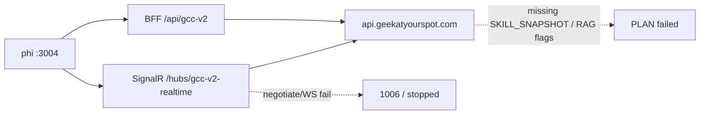

# Fix create PLAN + SignalR errors

**Created:** 2026-09-12  
**Incident create:** `http://localhost:3004/creates/21767258-0fd8-4f3d-bea5-4f19ba393697`  
**Site:** `https://geekatyourspot.com`

## Status (2026-09-12 implementation)

- Confirmed phi `:3004` defaults to **production** GeekAPI (no `NEXT_PUBLIC_GEEK_API_URL` in `.env.local`).
- Railway GeekAPI already had signing + RAG URL/API key + `GEEK_OAUTH_AUTHORITY` (sufficient lengths).
- Hostinger RAG compose has matching `SKILL_SNAPSHOT_SIGNING_KEY_ID=gcc-skills-2026-09-09`.
- Incident timestamps overlapped GeekAPI redeploy → likely mid-deploy PLAN/SignalR failures.
- Set explicit `GEEK_RAG_GENERATE_ENABLED=true` and `GEEK_RAG_CITEABLE_GENERATE_ENABLED=true`; redeployed GeekAPI.
- Hardened GeekAPI signers so empty appsettings do not mask env (pushed separately).

**Operator next step:** retry the failed create (or start a new one) on localhost:3004 after the latest GeekAPI deploy is SUCCESS. Hub negotiate without token correctly returns 401; authenticated SignalR should work when session/hub-token is valid.

## What’s broken

| Symptom | Cause |
|---------|--------|
| Most tabs: `PLAN failed: SKILL_SNAPSHOT_SIGNING_KEY is not configured` | GeekAPI process that ran PLAN has no skill-snapshot HMAC secret |
| Pillar: `Citeable RAG researchPlanning generation is unavailable` | Citeable generate path off — missing/unreachable `GEEK_CRAWLER_RAG_URL` and/or `GEEK_RAG_GENERATE_ENABLED` / `GEEK_RAG_CITEABLE_GENERATE_ENABLED` |
| SignalR: negotiate stopped / WebSocket `1006` | Hub at `${NEXT_PUBLIC_GEEK_API_URL}/hubs/gcc-v2-realtime` cannot complete auth/upgrade (wrong API host, bad JWT, or hub rejected) |

## Root topology (local phi)

[`.env.local`](../.env.local) only has Vercel OIDC — **no** `NEXT_PUBLIC_GEEK_API_URL`. [`src/app/auth/config.ts`](../src/app/auth/config.ts) therefore defaults to **`https://api.geekatyourspot.com`**.

This create is almost certainly hitting **production GeekAPI**, not local `:8080` (even though a local GeekAPI may be up with signing + RAG keys in `GeekBackend/.env`).

## Fix path (production-first)

### 1. Confirm which API phi is using

- Browser Network: BFF calls under `/api/gcc-v2/...` proxy to production unless overridden.
- Local override only if you want local GeekAPI:
  - `NEXT_PUBLIC_GEEK_API_URL=http://127.0.0.1:8080` in `.env.local`
  - restart `npm run dev`

Default for this incident: **fix Railway GeekAPI** so localhost:3004 → prod works.

### 2. Railway GeekAPI — required env

On **GeekAPI** production, set/verify (secret values from secret manager / local `.env` — **key names only** in this doc):

- `SKILL_SNAPSHOT_SIGNING_KEY` (≥32 UTF-8 bytes)
- `SKILL_SNAPSHOT_SIGNING_KEY_ID` (must match RAG)
- `AGENT_TEAM_SNAPSHOT_SIGNING_KEY` + `AGENT_TEAM_SNAPSHOT_SIGNING_KEY_ID` (PLAN uses agent teams)
- `GEEK_CRAWLER_RAG_URL` (reachable from Railway → Hostinger RAG)
- `GEEK_CRAWLER_RAG_API_KEY`
- `GEEK_RAG_GENERATE_ENABLED=true` (or confirm code default ON)
- `GEEK_RAG_CITEABLE_GENERATE_ENABLED=true`

On **Geek-Crawler-Rag**, matching verification map:

- `SKILL_SNAPSHOT_SIGNING_KEYS` JSON must include the same key ID → secret as GeekAPI

Redeploy GeekAPI after variable changes.

### 3. SignalR on the same API

- Hub: GeekAPI `/hubs/gcc-v2-realtime` (`GccV2RealtimeHub`)
- Client: [`src/app/auth/job-hub.ts`](../src/app/auth/job-hub.ts) → [`/api/auth/hub-token`](../src/app/api/auth/hub-token/route.ts)

Checklist:

1. `GET http://localhost:3004/api/auth/hub-token` → `200` + `accessToken` (401 = session problem; hub will never start).
2. GeekAPI has `GEEK_OAUTH_AUTHORITY` / `AUTH_SERVER_URL` = `https://auth.geekatyourspot.com` (without this, hub rejects all connections).
3. Browser WS to `wss://api.geekatyourspot.com/hubs/gcc-v2-realtime?access_token=…` succeeds (negotiate not 401/500).
4. CORS unions defaults including `http://localhost:3004` (`CorsOriginParser`) — unlikely primary if BFF calls already work.

If hub-token is fine but WS `1006` persists after env fix: check Railway proxy / WebSocket upgrade. **Do not** add HTTP polling as a fallback.

### 4. Verify end-to-end

1. New create (or retry jobs) on localhost:3004 against the fixed API.
2. No signing-key or citeable-RAG unavailable errors on PLAN.
3. Canvas receives SignalR job events (no negotiate-stop / `1006` loops).
4. At least one long-form tab leaves failed PLAN state.

### 5. Optional local-only stack

- Point phi at `http://127.0.0.1:8080`
- Load `GeekBackend/.env` (signing + RAG already present there for local)
- Confirm Hostinger RAG is reachable from the Mac

## Out of scope

- Consolidating or deleting other `plan/*` docs
- Changing citeable RAG algorithm or removing skill snapshots
- Adding timer polling instead of SignalR

## Success criteria

- No `SKILL_SNAPSHOT_SIGNING_KEY is not configured` on new PLAN
- No `Citeable RAG … generation is unavailable` when RAG is intentionally enabled
- SignalR connects and streams job progress without negotiate-stop / `1006` loops

## Todos

1. Confirm phi `:3004` → production GeekAPI vs local `:8080`
2. Set/verify GeekAPI + RAG signing keys and RAG generate flags on Railway; redeploy
3. Verify hub-token, OAuth authority, and WS negotiate to `/hubs/gcc-v2-realtime`
4. Re-run or retry create; PLAN + Canvas SignalR progress succeed
